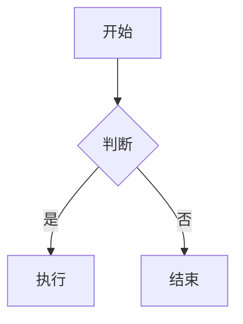

# pi-mono 文档站点

本目录包含 pi-mono 的文档和教程，使用 Docsify 构建。

## 📖 在线预览

### 方式一：使用 docsify-cli（推荐）

```bash
# 安装 docsify-cli
npm i docsify-cli -g

# 进入 docs 目录
cd docs

# 启动本地服务器
docsify serve

# 访问 http://localhost:3000
```

### 方式二：使用 Python 简单服务器

```bash
# 进入 docs 目录
cd docs

# Python 3
python -m http.server 3000

# Python 2
python -m SimpleHTTPServer 3000

# 访问 http://localhost:3000
```

### 方式三：使用 Node.js http-server

```bash
# 安装 http-server
npm i -g http-server

# 进入 docs 目录
cd docs

# 启动服务器
http-server -p 3000

# 访问 http://localhost:3000
```

### 方式四：使用 VS Code Live Server 插件

1. 安装 VS Code 的 "Live Server" 插件
2. 右键点击 `docs/index.html`
3. 选择 "Open with Live Server"

## 📚 文档结构

```
docs/
├── index.html              # Docsify 入口文件
├── _coverpage.md           # 封面配置
├── _sidebar.md             # 侧边栏配置
├── _navbar.md              # 导航栏配置
├── README.md               # 本文档
└── pi-mono-tutorial/       # 教程文档
    ├── README.md           # 教程首页
    ├── 1_overview/         # 篇章一：项目概览
    ├── 2_pi_ai/            # 篇章二：pi-ai
    ├── 3_pi_agent/         # 篇章三：pi-agent
    ├── 4_pi_tui/           # 篇章四：pi-tui
    ├── 5_pi_coding_agent/  # 篇章五：pi-coding-agent
    ├── 6_pi_web_ui/        # 篇章六：pi-web-ui
    ├── 7_extension/        # 篇章七：扩展与技能
    └── 8_learn/            # 篇章八：学习心得
```

## ✨ 功能特性

- 📱 **响应式设计** - 支持桌面和移动设备
- 🔍 **全文搜索** - 快速查找文档内容
- 📑 **侧边栏导航** - 清晰的文档结构
- 🎨 **代码高亮** - 支持 TypeScript、Bash、JSON 等
- 🖼️ **Mermaid 图表** - 支持流程图、时序图等
- 📋 **代码复制** - 一键复制代码块
- 🔗 **外链处理** - 外部链接在新标签打开

## 📝 编写文档

文档使用 Markdown 格式，支持以下扩展语法：

### 提示框

```markdown
> [!TIP]
> 这是一个提示

> [!WARNING]
> 这是一个警告

> [!DANGER]
> 这是一个危险提示
```

### Mermaid 图表

```markdown

```

### 代码块

```markdown
```typescript
const greeting = "Hello, pi-mono!";
```
```

## 🔧 自定义配置

文档配置在 `index.html` 中，可以修改：

- 主题颜色
- 页面标题
- 插件配置
- 搜索配置

## 📦 部署

### 部署到 GitHub Pages

```bash
# 在仓库设置中启用 GitHub Pages
# 选择 docs 目录作为源
```

### 部署到 Vercel

```bash
# 安装 Vercel CLI
npm i -g vercel

# 部署
cd docs
vercel --prod
```

### 部署到 Netlify

```bash
# 将 docs 目录拖到 Netlify 部署页面
# 或使用 Netlify CLI
netlify deploy --prod --dir=docs
```

## 🤝 贡献

欢迎提交 PR 改进文档！

1. Fork 本仓库
2. 创建你的分支 (`git checkout -b improve-docs`)
3. 提交更改 (`git commit -am '改进文档'`)
4. 推送到分支 (`git push origin improve-docs`)
5. 创建 Pull Request

## 📄 许可证

MIT License - 详见 [LICENSE](../LICENSE)
