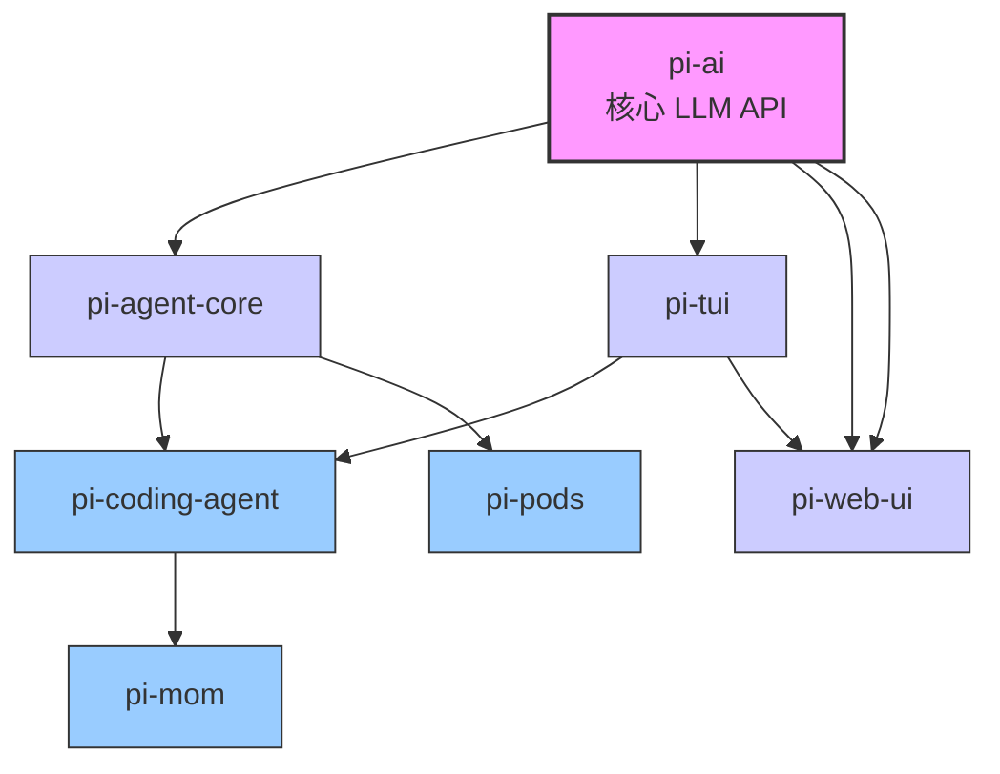
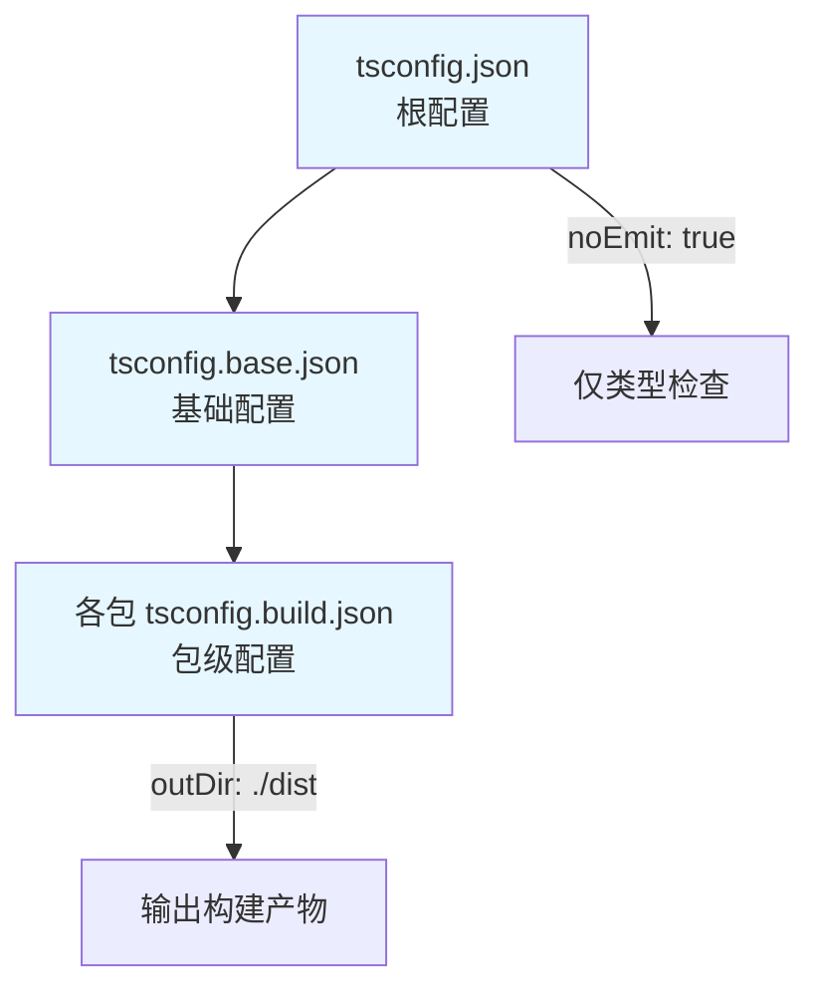
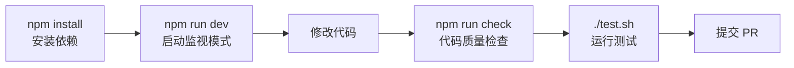
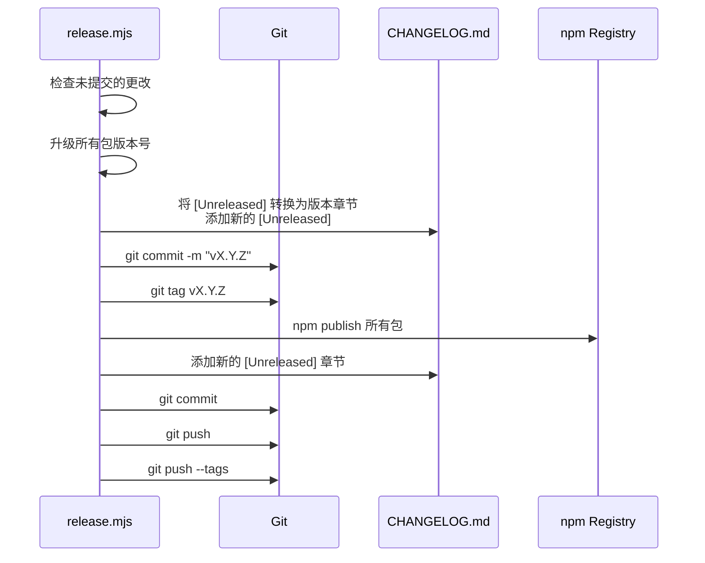

# 23. 项目构建流程：从源码到发布的完整流转

在前面的章节中，我们深入了解了 pi-mono 的各个核心模块。本章我们来看看整个项目是如何构建和发布的，帮助你理解从源码到最终产物的完整流转。

## 项目整体结构

pi-mono 采用 **npm workspaces** 管理的 Monorepo 结构：

```
pi-mono/
├── packages/                    # 主要包目录
│   ├── ai/                      # @mariozechner/pi-ai - 统一 LLM API
│   ├── agent/                   # @mariozechner/pi-agent-core - Agent 运行时
│   ├── coding-agent/            # @mariozechner/pi-coding-agent - 编程代理 CLI
│   ├── tui/                     # @mariozechner/pi-tui - 终端 UI 组件库
│   ├── mom/                     # @mariozechner/pi-mom - Slack 机器人
│   ├── web-ui/                  # @mariozechner/pi-web-ui - Web UI 组件
│   └── pods/                    # @mariozechner/pi - GPU Pod 管理工具
├── packages/web-ui/example/     # Web UI 示例应用
├── packages/coding-agent/examples/extensions/  # 扩展示例
├── scripts/                     # 构建和发布脚本
├── tsconfig.json               # 根 TypeScript 配置（仅类型检查）
├── tsconfig.base.json          # 基础 TypeScript 配置（用于构建）
└── package.json                # Monorepo 根配置
```

### Workspace 配置

根 `package.json` 中定义了所有 workspaces：

```json
{
  "workspaces": [
    "packages/*",
    "packages/web-ui/example",
    "packages/coding-agent/examples/extensions/with-deps",
    "packages/coding-agent/examples/extensions/custom-provider-anthropic",
    "packages/coding-agent/examples/extensions/custom-provider-gitlab-duo",
    "packages/coding-agent/examples/extensions/custom-provider-qwen-cli"
  ]
}
```

这样 npm 会自动处理包之间的依赖链接，不需要手动 `npm link`。

## 包依赖关系

让我们看看各个包之间的依赖关系，这决定了构建顺序：



### 各包依赖详情

| 包名            | 内部依赖                              | 外部主要依赖                                                   |
| --------------- | ------------------------------------- | -------------------------------------------------------------- |
| `pi-ai`           | 无                                    | @anthropic-ai/sdk, openai, @google/genai, @mistralai/mistralai |
| `pi-agent-core`   | pi-ai                                 | @sinclair/typebox                                              |
| `pi-tui`          | 无                                    | chalk, marked, get-east-asian-width                            |
| `pi-coding-agent` | pi-ai, pi-agent-core, pi-tui          | chalk, diff, glob, ignore, marked                              |
| `pi-mom`          | pi-ai, pi-agent-core, pi-coding-agent | @slack/web-api, @slack/socket-mode, croner                     |
| `pi-web-ui`       | pi-ai, pi-tui                         | lit, lucide, pdfjs-dist, xlsx                                  |
| `pi-pods`         | pi-agent-core                         | chalk                                                          |

## 构建工具链

pi-mono 使用了现代化的构建工具组合：

| 工具        | 用途                           | 使用包                                  |
| ----------- | ------------------------------ | --------------------------------------- |
| `tsgo`        | TypeScript Go 编译器（高性能） | ai, agent, coding-agent, tui, mom, pods |
| `tsc`         | TypeScript 官方编译器          | web-ui（需要 DOM 类型）                 |
| `tailwindcss` | CSS 框架                       | web-ui                                  |
| `biome`       | Lint + 格式化                  | 所有包                                  |
| `vitest`      | 单元测试                       | ai, agent, coding-agent, tui            |

> [!TIP]
> 为什么混合使用 tsgo 和 tsc？
> - **tsgo** 是一个高性能的 TypeScript 编译器，比 tsc 快很多，适合 Node.js 包
> - **web-ui** 需要浏览器环境的 DOM 类型和 ES 模块输出，tsc 更灵活
> - 这种混合搭配兼顾了构建速度和灵活性

### TypeScript 配置层次

项目采用了分层的 TypeScript 配置：



**根配置 tsconfig.json：**
- 继承 `tsconfig.base.json`
- `noEmit: true` - 只做类型检查，不输出产物
- 通过 `paths` 映射所有包的源码路径
- 包含所有包的源码用于全局类型检查

**基础配置 tsconfig.base.json：**
```json
{
  "target": "ES2022",
  "module": "Node16",
  "moduleResolution": "Node16",
  "declaration": true,
  "sourceMap": true
}
```

**各包构建配置：**
- 继承基础配置
- 指定 `outDir: ./dist` 和 `rootDir: ./src`

**web-ui 特殊配置：**
因为需要浏览器环境，所以有特殊配置：
```json
{
  "compilerOptions": {
    "target": "ES2022",
    "module": "ES2022",
    "lib": ["ES2022", "DOM", "DOM.Iterable"],
    "moduleResolution": "bundler"
  }
}
```

## 构建流程详解

### 1. 环境准备

```bash
# 要求 Node.js >= 20.0.0
node --version

# 安装所有依赖（npm workspaces 会自动处理链接）
npm install
```

### 2. 完整构建

```bash
# 按依赖顺序构建所有包
npm run build
```

**构建顺序**（由根 `package.json` 定义）：

```
tui → ai → agent → coding-agent → mom → web-ui → pods
```

> [!WARNING]
> 构建顺序很重要！`web-ui` 必须在 `ai` 之后构建，因为它需要 `ai` 编译生成的 `.d.ts` 类型文件。

### 3. 各包构建脚本详解

每个包的构建脚本都有细微差别，我们来看一下：

| 包           | 构建命令                                                                 | 特殊处理说明                     |
| ------------ | ------------------------------------------------------------------------ | -------------------------------- |
| `ai`         | `npm run generate-models && tsgo -p tsconfig.build.json`                  | 先从各提供商 API 获取模型列表，再编译 |
| `agent`      | `tsgo -p tsconfig.build.json`                                             | 直接编译                         |
| `tui`        | `tsgo -p tsconfig.build.json`                                             | 直接编译                         |
| `coding-agent` | `tsgo -p tsconfig.build.json && shx chmod +x dist/cli.js && npm run copy-assets` | 添加可执行权限 + 复制静态资源  |
| `mom`        | `tsgo -p tsconfig.build.json && shx chmod +x dist/main.js`                | 添加可执行权限                   |
| `web-ui`     | `tsc -p tsconfig.build.json && tailwindcss -i ./src/app.css -o ./dist/app.css --minify` | 编译 TypeScript + 压缩 Tailwind CSS |
| `pods`       | `tsgo -p tsconfig.build.json && shx chmod +x dist/cli.js && shx cp src/models.json dist/` | 添加可执行权限 + 复制模型配置   |

### 4. 开发模式

开发时不需要每次手动重新构建，可以使用监视模式：

```bash
# 监视所有包，文件变更自动重新构建
npm run dev

# 只运行 TypeScript 类型检查监视（更快）
npm run dev:tsc
```

这样你修改源码后，构建产物会自动更新，非常方便。

### 5. 代码质量检查

开发完成后，运行完整的代码质量检查：

```bash
npm run check
```

这个命令实际上做了这些事情：

```bash
biome check --write --error-on-warnings .  # Lint + 自动格式化 + 错误检查
tsgo --noEmit                              # 全局 TypeScript 类型检查
npm run check:browser-smoke                # 检查浏览器环境兼容性
cd packages/web-ui && npm run check       # web-ui 单独类型检查
```

> [!TIP]
> **注意：** `npm run check` 需要先运行 `npm run build`，因为 `web-ui` 需要依赖包编译好的 `.d.ts` 文件。

### 6. 清理构建产物

```bash
# 清理所有包的 dist 目录
npm run clean
```

## 开发工作流

让我们总结一下日常开发的完整工作流：



### 调试特定包

如果你只修改了一个包，可以这样调试：

```bash
# Terminal 1: 启动全局监视模式
npm run dev

# Terminal 2: 进入包目录运行测试
cd packages/ai
npm run test
```

### 测试交互式 TUI

如果要测试 pi 的交互式 TUI，可以使用 tmux：

```bash
# 创建 tmux 会话，设置合适的尺寸
tmux new-session -d -s pi-test -x 80 -y 24

# 启动 pi
tmux send-keys -t pi-test "./pi-test.sh" Enter

# 等待启动完成，捕获输出
sleep 3 && tmux capture-pane -t pi-test -p

# 发送输入
tmux send-keys -t pi-test "你的问题" Enter

# 测试完清理
tmux kill-session -t pi-test
```

## 版本发布流程

pi-mono 使用 **Lockstep Versioning** 策略：

> 所有包共享同一个版本号，每次发布所有包版本一起升级。

这样做的好处是：
- 避免版本碎片化，用户不会遇到版本不兼容问题
- 简化版本管理，不需要记住哪个包是什么版本
- 符合 Monorepo 中包高度耦合的实际情况

### 版本语义

| 版本类型 | 适用场景                     |
| -------- | ---------------------------- |
| `patch`  | Bug 修复和新功能（无 API 破环） |
| `minor`  | API 破坏性变更               |
| `major`  | 不使用（项目目前阶段）       |

### 发布命令

```bash
# 发布 Patch 版本
npm run release:patch

# 发布 Minor 版本
npm run release:minor

# 发布 Major 版本（很少用）
npm run release:major
```

### 发布脚本自动化流程

`scripts/release.mjs` 会自动完成所有步骤：



### CHANGELOG 维护规范

每个包都有自己的 `CHANGELOG.md`，遵循以下格式：

```markdown
## [Unreleased]

### Added
- 新增功能...

### Changed
- 变更...

### Fixed
- 修复...

### Breaking Changes
- 不兼容变更...

## [0.60.0] - 2026-03-18
...
```

**规则：**
- 所有新变更都放在 `## [Unreleased]` 下
- 发布时脚本自动将 `Unreleased` 转换为版本章节
- 始终在顶部添加新的 `Unreleased` 章节
- 已发布的版本章节永远不要修改

## 可用命令速查

### 根目录常用命令

| 命令            | 作用                                |
| --------------- | ----------------------------------- |
| `npm install`     | 安装所有依赖                        |
| `npm run build`   | 按依赖顺序构建所有包                |
| `npm run dev`     | 开发模式，监视所有包自动重建        |
| `npm run dev:tsc` | 仅 TypeScript 类型检查监视         |
| `npm run check`   | Lint + 格式化 + 类型检查           |
| `npm run test`    | 运行所有测试                        |
| `npm run clean`   | 清理所有包的构建产物                |
| `./pi-test.sh`    | 从源码直接运行 pi                   |
| `./test.sh`       | 运行测试（跳过需要 API Key 的测试） |

### 各包常用命令

| 命令          | 作用             |
| ------------- | ---------------- |
| `npm run build` | 构建当前包       |
| `npm run dev`   | 监视模式构建     |
| `npm run test`  | 运行测试（如有） |
| `npm run clean` | 清理 dist 目录   |

## CI/CD 流程

项目使用 GitHub Actions 进行持续集成：

### `.github/workflows/ci.yml`

- **触发条件**：push 到 main 分支、创建 Pull Request
- **执行步骤**：
  1. 安装 Node.js 依赖
  2. 构建所有包
  3. 运行 `npm run check`（lint + 类型检查）
  4. 运行测试

### OSS Weekend 模式

项目有一个有趣的「周末模式」：

- `.github/workflows/oss-weekend-issues.yml` - 周末自动关闭非维护者新建的 Issue
- `.github/workflows/pr-gate.yml` - 周末自动关闭非维护者提交的 PR
- 通过 `scripts/oss-weekend.mjs` 脚本控制启用/禁用

这是维护者保护自己周末休息时间的一种方式，挺有意思的设计 😄

## 贡献者构建 FAQ

### Q: 我只想修改一个包，需要重新构建所有包吗？

A: 不需要。进入你修改的包目录，运行 `npm run build` 即可。但要确保该包的所有依赖已经构建过。

### Q: 为什么 `npm run check` 报错说找不到模块？

A: 这通常是因为你还没有构建依赖包。先运行 `npm run build`，然后再运行 `npm run check`。

### Q: 如何添加新的 LLM Provider？

A: 详细步骤在项目根 `AGENTS.md` 中有说明，主要步骤：

1. `packages/ai/src/types.ts` - 添加 API 标识符和选项类型
2. `packages/ai/src/providers/` - 创建 Provider 实现文件
3. `packages/ai/src/providers/register-builtins.ts` - 注册 Provider
4. `packages/ai/src/env-api-keys.ts` - 添加凭证检测
5. `packages/ai/scripts/generate-models.ts` - 添加模型获取逻辑
6. `packages/ai/test/` - 添加测试用例
7. `packages/coding-agent/` - 更新默认模型和文档
8. `packages/ai/README.md` - 更新 Provider 表格

### Q: 发布失败怎么办？

检查以下几点：
1. 确认你已登录 npm：`npm whoami`
2. 确认你拥有包的发布权限
3. 确认 `NPM_TOKEN` 环境变量已正确设置（CI 环境）
4. 检查网络连接能否访问 npm registry

### Q: 为什么有的包用 tsgo，有的用 tsc？

A:
- `tsgo` 是高性能 TypeScript 编译器，用于 Node.js 包（非浏览器）
- `web-ui` 需要 DOM 类型且输出 ES 模块，使用 `tsc` 更灵活
- `tsgo` 不支持某些浏览器特定的配置，故分开处理
