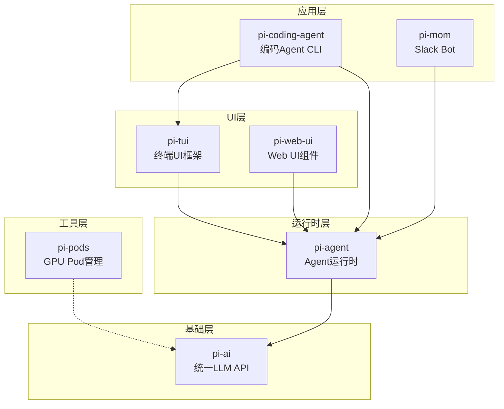

# 1. pi-mono 是什么？项目整体架构解析

问下大家，如果你想开发一个 AI Agent，你会怎么做？

OpenClaw 刚开始接触 AI Agent 开发的时候，也是一脸懵逼。市面上那么多 LLM 提供商（OpenAI、Anthropic、Google...），每个都有自己的 SDK 和 API 格式。要是想支持多个提供商，代码里就得写一堆 if-else，维护起来简直噩梦。

直到后来发现了 pi-mono，才发现卧槽，原来可以这么优雅！

## pi-mono 是什么？

简单来说，pi-mono 是一个**AI Agent 开发框架**，用 TypeScript 编写，采用 Monorepo 架构。它的核心目标是让你能够：

1. **统一接入 20+ LLM 提供商** - 一套代码，支持 OpenAI、Anthropic、Google、Mistral、Groq 等
2. **构建有状态的 Agent** - 支持工具调用、消息流、事件驱动
3. **开发终端或 Web 应用** - 提供 TUI 和 Web UI 组件库
4. **高度可扩展** - 通过扩展系统和技能机制定制功能

## 整体架构一览

pi-mono 采用 Monorepo 架构，包含 7 个核心包：

```
pi-mono/
├── packages/
│   ├── ai/              # 统一 LLM API (@mariozechner/pi-ai)
│   ├── agent/           # Agent 运行时 (@mariozechner/pi-agent-core)
│   ├── tui/             # 终端 UI 框架 (@mariozechner/pi-tui)
│   ├── coding-agent/    # 编码 Agent CLI (@mariozechner/pi-coding-agent)
│   ├── web-ui/          # Web UI 组件 (@mariozechner/pi-web-ui)
│   ├── mom/             # Slack Bot (@mariozechner/pi-mom)
│   └── pods/            # GPU Pod 管理 (@mariozechner/pi-pods)
```



## 各包职责详解

### 1. pi-ai - 统一 LLM API

这是整个框架的**基石**。它提供了一套统一的接口，让你可以用同样的方式调用不同提供商的 LLM。

**核心能力：**
- 支持 11 种 API 类型（openai-completions、anthropic-messages、bedrock-converse-stream 等）
- 支持 20+ 提供商（OpenAI、Anthropic、Google、Mistral、Groq、xAI、Azure、AWS Bedrock 等）
- 统一的 Message、Content、Event 协议
- 工具调用（Tool Calling）支持
- 流式响应（Streaming）支持
- 图像输入支持
- 跨提供商切换（Cross-provider handoff）

**代码示例：**
```typescript
import { stream } from "@mariozechner/pi-ai";

// 调用 OpenAI
const stream1 = stream("openai/gpt-4o", {
  messages: [{ role: "user", content: "Hello!" }],
});

// 调用 Anthropic，代码完全一样！
const stream2 = stream("anthropic/claude-3-5-sonnet-20241022", {
  messages: [{ role: "user", content: "Hello!" }],
});

// 遍历事件流
for await (const event of stream1) {
  if (event.type === "text_delta") {
    process.stdout.write(event.data);
  }
}
```

### 2. pi-agent - Agent 运行时

这是框架的**核心引擎**。它负责管理 Agent 的状态、消息流、工具执行等。

**核心概念：**
- **AgentState** - Agent 的状态（空闲、运行中、等待用户输入等）
- **AgentMessage** - Agent 层面的消息（区别于 LLM Message）
- **AgentMessageEvent** - 事件流（text_start/text_delta/toolcall_start 等）
- **Tool** - 工具定义和执行

**执行流程：**
```
用户输入 -> AgentLoop -> 消息转换 -> LLM API -> 事件流 -> 工具执行 -> 循环
```

### 3. pi-tui - 终端 UI 框架

如果你要开发终端应用，这个包提供了完整的 UI 框架。

**核心特性：**
- **差分渲染** - 只更新变化的部分，性能优秀
- **同步输出** - 支持终端和流式输出同步显示
- **组件化** - Container、Box、Text、Input、Editor、Markdown 等组件

### 4. pi-coding-agent - 编码 Agent CLI

这是基于 pi-agent 和 pi-tui 构建的**实际应用** - 一个终端编码助手。

**功能特性：**
- 交互式终端界面
- 会话管理（创建、切换、压缩）
- 分支机制（类似 Git 分支）
- 扩展系统（Hooks、Skills）
- 提示模板定制
- 主题系统

### 5. pi-web-ui - Web UI 组件

如果你要开发 Web 应用，这个包提供了可复用的组件。

**核心组件：**
- Chat UI - 聊天界面
- Artifacts - 代码/内容展示
- 附件处理
- IndexedDB 存储

### 6. pi-mom - Slack Bot

一个 Slack 机器人，展示了如何在服务器端使用 pi-agent。

**特性：**
- Docker 沙箱执行
- 自管理环境
- 技能系统
- 事件调度
- 记忆系统

### 7. pi-pods - GPU Pod 管理

用于在 GPU Pod 上部署和管理 LLM（通过 vLLM）。

**支持的提供商：**
- DataCrunch
- RunPod
- Vast.ai

## 设计哲学

pi-mono 的设计有几个核心原则：

### 1. 统一抽象

不同 LLM 提供商的 API 千差万别，但 pi-ai 通过统一的类型系统和协议，让你无需关心底层差异。

### 2. 事件驱动

整个框架采用事件驱动架构，从 LLM 响应到 Agent 执行，都是基于事件流。这让代码更加清晰，也便于扩展。

### 3. 高度可扩展

pi-coding-agent 的设计哲学是**不内置太多功能**，而是通过扩展系统让你自己添加。没有内置的 MCP、子 Agent、权限弹窗、计划模式，但你可以通过扩展实现这些。

### 4. 类型安全

整个框架使用 TypeScript 编写，类型定义非常严格。这在你开发时能提供很好的 IDE 支持，也能在编译时捕获很多错误。

## 包依赖关系

```
pi-ai (基础层)
  ↑
pi-agent (运行时层)
  ↑
pi-tui / pi-web-ui (UI 层)
  ↑
pi-coding-agent / pi-mom (应用层)
```

pi-pods 是独立的工具包，不依赖其他包。

## 总结

综上所述，pi-mono 是一个：

1. **Monorepo 架构**的 AI Agent 开发框架
2. 提供**统一 LLM API**支持 20+ 提供商
3. 提供**Agent 运行时**管理状态和工具执行
4. 提供**TUI 和 Web UI**组件库
5. **高度可扩展**，通过扩展系统定制功能

在后续文章中，我们会深入每个包的实现细节，带你从源码层面理解这个框架。

---

**下篇预告：**《Monorepo 设计与包依赖关系》 - 深入理解 pi-mono 的代码组织和构建系统。
