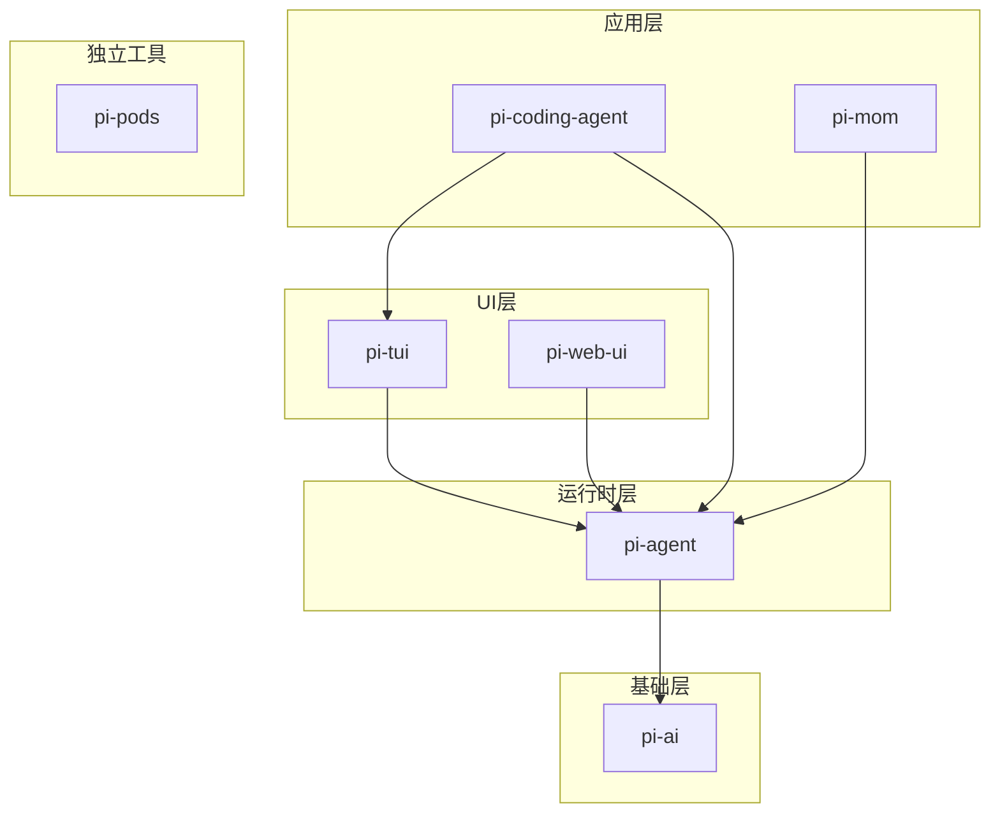

# 2. Monorepo 设计与包依赖关系

问下大家，你在开发多个相关的 npm 包时，是怎么管理代码的？

OpenClaw 之前试过把每个包放在独立的仓库里，结果改一个功能要跨好几个仓库提交，版本同步也麻烦得要死。后来了解到 Monorepo，才发现这才是管理相关包的正确姿势。

pi-mono 就是典型的 Monorepo 架构，今天我们来聊聊它的设计。

## 什么是 Monorepo？

Monorepo（单一代码库）是指将多个相关项目放在同一个 Git 仓库中管理。与之相对的是 Polyrepo（多仓库），每个项目一个仓库。

**Monorepo 的优势：**
- 代码共享方便 - 包之间可以直接引用源码
- 原子提交 - 一次提交可以修改多个包
- 版本同步 - 所有包使用统一的版本号
- 依赖管理清晰 - 内部依赖关系一目了然

## pi-mono 的 Monorepo 结构

```
pi-mono/
├── package.json              # 根 package.json，定义 workspaces
├── package-lock.json         # 统一锁定依赖版本
├── tsconfig.json             # 根 TypeScript 配置
├── AGENTS.md                 # AI Agent 开发规范
├── README.md                 # 项目说明
├── scripts/                  # 构建脚本
│   └── oss-weekend.mjs       # OSS 周末模式脚本
├── packages/                 # 核心包目录
│   ├── ai/                   # pi-ai
│   ├── agent/                # pi-agent
│   ├── tui/                  # pi-tui
│   ├── coding-agent/         # pi-coding-agent
│   ├── web-ui/               # pi-web-ui
│   ├── mom/                  # pi-mom
│   └── pods/                 # pi-pods
└── docs/                     # 文档目录
    └── pi-mono-tutorial/     # 本教程
```

## Workspaces 配置

pi-mono 使用 npm workspaces 管理 Monorepo：

```json
// package.json
{
  "name": "pi-monorepo",
  "workspaces": [
    "packages/*"
  ],
  "scripts": {
    "build": "npm run build --workspaces",
    "check": "npm run check --workspaces",
    "release:patch": "node scripts/release.mjs patch",
    "release:minor": "node scripts/release.mjs minor"
  }
}
```

**关键配置：**
- `workspaces: ["packages/*"]` - 定义所有子包的位置
- `npm run build --workspaces` - 构建所有包
- `npm run check --workspaces` - 检查所有包

## 包的统一结构

每个包都有统一的目录结构：

```
packages/{name}/
├── package.json          # 包配置
├── tsconfig.json         # TypeScript 配置
├── README.md             # 包说明
├── CHANGELOG.md          # 变更日志
├── src/                  # 源码目录
│   ├── index.ts          # 入口文件
│   └── ...
├── test/                 # 测试目录
│   └── *.test.ts
└── dist/                 # 编译输出（gitignore）
```

## 包之间的依赖关系



### 具体依赖关系

**pi-ai** - 无内部依赖，纯基础层

**pi-agent** - 依赖 pi-ai
```json
{
  "dependencies": {
    "@mariozechner/pi-ai": "^0.15.0"
  }
}
```

**pi-tui** - 依赖 pi-agent 和 pi-ai
```json
{
  "dependencies": {
    "@mariozechner/pi-ai": "^0.15.0",
    "@mariozechner/pi-agent-core": "^0.15.0"
  }
}
```

**pi-coding-agent** - 依赖 pi-tui、pi-agent、pi-ai
```json
{
  "dependencies": {
    "@mariozechner/pi-ai": "^0.15.0",
    "@mariozechner/pi-agent-core": "^0.15.0",
    "@mariozechner/pi-tui": "^0.15.0"
  }
}
```

**pi-web-ui** - 依赖 pi-agent 和 pi-ai
```json
{
  "dependencies": {
    "@mariozechner/pi-ai": "^0.15.0",
    "@mariozechner/pi-agent-core": "^0.15.0"
  }
}
```

**pi-mom** - 依赖 pi-agent 和 pi-ai
```json
{
  "dependencies": {
    "@mariozechner/pi-ai": "^0.15.0",
    "@mariozechner/pi-agent-core": "^0.15.0"
  }
}
```

**pi-pods** - 无内部依赖，独立工具

## 版本管理策略

pi-mono 采用**锁步版本（Lockstep Versioning）**策略：

> 所有包共享同一个版本号，每次发布所有包一起更新。

**版本规则：**
- `patch` - Bug 修复和新功能
- `minor` - API 破坏性变更
- 不使用 `major`（遵循 0.x 版本语义）

**发布流程：**
```bash
# 发布 patch 版本
npm run release:patch

# 发布 minor 版本
npm run release:minor
```

发布脚本会自动：
1. 更新所有包的版本号
2. 更新 CHANGELOG.md
3. 创建 Git 提交和标签
4. 发布到 npm
5. 添加新的 `[Unreleased]` 章节

## 构建系统

每个包都有自己的构建配置：

```json
// packages/ai/package.json
{
  "scripts": {
    "build": "tsc",
    "check": "tsc --noEmit"
  }
}
```

**根目录统一构建：**
```bash
# 构建所有包
npm run build

# 类型检查所有包（不生成输出）
npm run check
```

## 开发工作流

### 1. 安装依赖

```bash
# 在根目录安装，所有包的依赖统一管理
npm install
```

### 2. 本地开发

修改源码后，运行检查：
```bash
npm run check
```

### 3. 添加新包

如果要添加新包：

1. 在 `packages/` 下创建新目录
2. 创建 `package.json`，注意：
   - `name` 使用 `@mariozechner/pi-xxx` 命名空间
   - `version` 与其他包保持一致
   - 添加必要的依赖
3. 创建 `tsconfig.json`
4. 创建 `src/index.ts` 入口
5. 创建 `README.md` 和 `CHANGELOG.md`

### 4. 包间引用

在包 A 中引用包 B：

```json
// packages/A/package.json
{
  "dependencies": {
    "@mariozechner/pi-B": "^0.15.0"
  }
}
```

```typescript
// packages/A/src/index.ts
import { something } from "@mariozechner/pi-B";
```

## 代码共享策略

pi-mono 中代码共享有两种方式：

### 1. 包间依赖（推荐）

通过 npm workspaces 管理依赖，适合稳定的公共代码。

**优点：**
- 版本管理清晰
- 接口稳定
- 可独立发布

### 2. 相对路径导入（谨慎使用）

在特殊情况下，可以通过相对路径引用其他包的源码：

```typescript
import { something } from "../ai/src/index";
```

**注意：** 这种方式只在开发时有效，发布后路径会失效。一般不推荐使用。

## 总结

综上所述，pi-mono 的 Monorepo 设计有以下几个关键点：

1. **使用 npm workspaces** 管理多包依赖
2. **统一的包结构** - 每个包都有 package.json、tsconfig.json、README.md、CHANGELOG.md
3. **清晰的分层架构** - 基础层(pi-ai) -> 运行时层(pi-agent) -> UI层(pi-tui/pi-web-ui) -> 应用层(pi-coding-agent/pi-mom)
4. **锁步版本管理** - 所有包共享版本号，一起发布
5. **统一的构建命令** - `npm run build` 和 `npm run check` 操作所有包

这种设计让代码共享变得简单，版本同步也不再是问题。如果你要开发多个相关的 npm 包，强烈推荐参考 pi-mono 的 Monorepo 架构。

---

**下篇预告：**《pi-ai 架构设计：如何统一 20+ LLM 提供商？》 - 深入理解 pi-mono 最核心的基础层设计。
