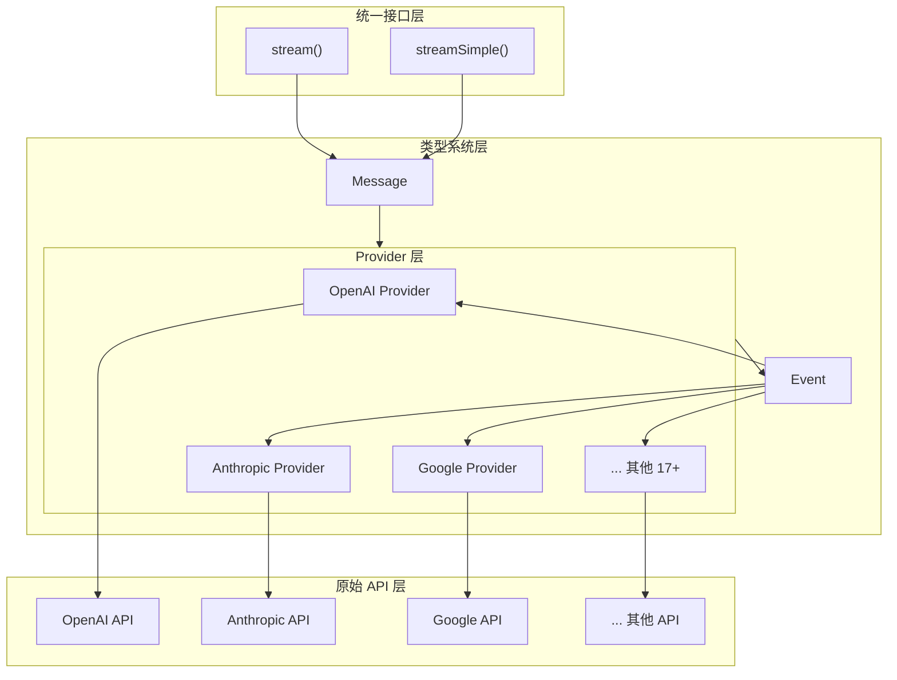

# pi-ai 架构设计：如何统一 20+ LLM 提供商？

> **难度：入门** | **预计阅读时间：15 分钟**

如果你要同时支持 OpenAI、Anthropic、Google 等多个 LLM 提供商，你会怎么设计代码？

最直观的想法可能是写一堆 if-else：

```typescript
if (provider === "openai") {
  // 调用 OpenAI API
} else if (provider === "anthropic") {
  // 调用 Anthropic API
} else if (provider === "google") {
  // 调用 Google API
}
// ... 还有 17 个 else if
```

这种代码维护起来简直是灾难！pi-ai 是怎么优雅地解决这个问题的？

## 核心挑战

不同 LLM 提供商的 API 差异巨大：

| 维度 | OpenAI | Anthropic | Google |
|------|--------|-----------|--------|
| **端点** | `/v1/chat/completions` | `/v1/messages` | `/v1beta/models/...:generateContent` |
| **认证** | `Authorization: Bearer` | `x-api-key` | API Key 或 OAuth |
| **消息格式** | `messages: [{role, content}]` | 类似但结构不同 | `contents: [{role, parts}]` |
| **流式格式** | SSE `data: {...}` | SSE `event: ...` | 不同的事件类型 |
| **工具调用** | `tool_calls` | `tool_use` | `functionCalls` |
| **思考/推理** | `reasoning_effort` | `thinking` | `thinkingConfig` |

pi-ai 的解决方案：**注册表模式 + 延迟加载 + 统一事件流协议**

## 架构全景

```
┌─────────────────────────────────────────────────────────────────┐
│                        应用层                                    │
│  ┌─────────────┐  ┌─────────────┐  ┌─────────────┐  ┌──────────┐ │
│  │   stream()  │  │ streamSimple│  │  complete() │  │completeSi│ │
│  │             │  │    ()       │  │             │  │ mple()   │ │
│  └──────┬──────┘  └──────┬──────┘  └──────┬──────┘  └────┬─────┘ │
└─────────┼────────────────┼────────────────┼──────────────┼───────┘
          │                │                │              │
          └────────────────┴────────────────┘              │
                           │                               │
                           ▼                               ▼
          ┌─────────────────────────────────┐  ┌─────────────────────┐
          │      API Registry (注册表)       │  │   EventStream       │
          │  ┌───────────────────────────┐   │  │   (统一事件流)       │
          │  │ Map<api, ApiProvider>     │   │  │                     │
          │  │ - openai-completions      │   │  │  push(event)        │
          │  │ - anthropic-messages      │   │  │  end(result)        │
          │  │ - google-generative-ai    │   │  │  result()           │
          │  │ - ...                     │   │  │  [Symbol.asyncItera │
          │  └───────────────────────────┘   │  │    tor]()           │
          │                                  │  └─────────────────────┘
          │  registerApiProvider()           │
          │  getApiProvider(api)             │
          └─────────────────────────────────┘
                           │
                           ▼
          ┌──────────────────────────────────────────────────────────┐
          │              Provider 层 (延迟加载)                       │
          │  ┌──────────────┐  ┌──────────────┐  ┌──────────────┐    │
          │  │   OpenAI     │  │  Anthropic   │  │    Google    │    │
          │  │  Completions │  │   Messages   │  │ GenerativeAI │    │
          │  │  (按需加载)   │  │   (按需加载)  │  │  (按需加载)   │    │
          │  └──────────────┘  └──────────────┘  └──────────────┘    │
          └──────────────────────────────────────────────────────────┘
                           │
                           ▼
          ┌──────────────────────────────────────────────────────────┐
          │                  原始 API 层                              │
          │         OpenAI API    Anthropic API    Google API        │
          └──────────────────────────────────────────────────────────┘
```

## 四层架构详解

### 第 1 层：统一入口层

pi-ai 提供四个入口函数，满足不同场景：

```typescript
// packages/ai/src/stream.ts

// 完整控制：使用 provider 特定选项
export function stream<TApi extends Api>(
  model: Model<TApi>,
  context: Context,
  options?: ProviderStreamOptions,
): AssistantMessageEventStream;

// 简化接口：统一选项自动映射
export function streamSimple<TApi extends Api>(
  model: Model<TApi>,
  context: Context,
  options?: SimpleStreamOptions,
): AssistantMessageEventStream;

// 非流式：等待完整响应
export async function complete<TApi extends Api>(
  model: Model<TApi>,
  context: Context,
  options?: ProviderStreamOptions,
): Promise<AssistantMessage>;

// 简化非流式
export async function completeSimple<TApi extends Api>(
  model: Model<TApi>,
  context: Context,
  options?: SimpleStreamOptions,
): Promise<AssistantMessage>;
```

**为什么需要两个版本？**

```typescript
// stream(): 完全控制，使用 provider 特定选项
import { streamOpenAICompletions } from "@mariozechner/pi-ai";
const s = streamOpenAICompletions(model, context, {
  reasoningEffort: "high",  // OpenAI 特定选项
  store: true,              // OpenAI 特定选项
});

// streamSimple(): 统一接口，自动映射通用概念
import { streamSimple } from "@mariozechner/pi-ai";
const s = streamSimple(model, context, {
  reasoning: "high",  // 自动映射到各 provider 的推理选项
});
```

### 第 2 层：注册表层

```typescript
// packages/ai/src/api-registry.ts

export interface ApiProvider<TApi extends Api = Api, TOptions extends StreamOptions = StreamOptions> {
  api: TApi;
  stream: StreamFunction<TApi, TOptions>;
  streamSimple: StreamFunction<TApi, SimpleStreamOptions>;
}

// 内部使用 Map 存储
const apiProviderRegistry = new Map<string, RegisteredApiProvider>();

export function registerApiProvider<TApi extends Api, TOptions extends StreamOptions>(
  provider: ApiProvider<TApi, TOptions>,
  sourceId?: string,
): void {
  apiProviderRegistry.set(provider.api, {
    provider: {
      api: provider.api,
      stream: wrapStream(provider.api, provider.stream),
      streamSimple: wrapStreamSimple(provider.api, provider.streamSimple),
    },
    sourceId,
  });
}

export function getApiProvider(api: Api): ApiProviderInternal | undefined {
  return apiProviderRegistry.get(api)?.provider;
}
```

**关键设计：运行时类型检查**

```typescript
function wrapStream<TApi extends Api, TOptions extends StreamOptions>(
  api: TApi,
  stream: StreamFunction<TApi, TOptions>,
): ApiStreamFunction {
  return (model, context, options) => {
    // 运行时检查：确保 model.api 与 provider.api 匹配
    if (model.api !== api) {
      throw new Error(`Mismatched api: ${model.api} expected ${api}`);
    }
    return stream(model as Model<TApi>, context, options as TOptions);
  };
}
```

### 第 3 层：Provider 实现层（延迟加载）

这是 pi-ai 最精妙的设计之一。不是静态导入所有 Provider，而是**按需加载**：

```typescript
// packages/ai/src/providers/register-builtins.ts

// 延迟加载包装器
function createLazyStream<TApi extends Api, TOptions extends StreamOptions>(
  loadModule: () => Promise<LazyProviderModule<TApi, TOptions, SimpleStreamOptions>>,
): StreamFunction<TApi, TOptions> {
  return (model, context, options) => {
    // 立即返回一个 EventStream，但内部异步加载实际 Provider
    const outer = new AssistantMessageEventStream();

    loadModule()
      .then((module) => {
        const inner = module.stream(model, context, options);
        forwardStream(outer, inner);  // 将内部流转发到外部流
      })
      .catch((error) => {
        // 加载失败时发送 error 事件，而不是抛出异常
        const message = createLazyLoadErrorMessage(model, error);
        outer.push({ type: "error", reason: "error", error: message });
        outer.end(message);
      });

    return outer;
  };
}

// OpenAI Completions 的延迟加载
function loadOpenAICompletionsProviderModule() {
  openAICompletionsProviderModulePromise ||= import("./openai-completions.js").then((module) => {
    const provider = module as OpenAICompletionsProviderModule;
    return {
      stream: provider.streamOpenAICompletions,
      streamSimple: provider.streamSimpleOpenAICompletions,
    };
  });
  return openAICompletionsProviderModulePromise;
}

export const streamOpenAICompletions = createLazyStream(loadOpenAICompletionsProviderModule);
```

**延迟加载的好处：**
1. **减小包体积**：只加载实际使用的 Provider
2. **加快启动速度**：避免初始化时加载所有依赖
3. **环境隔离**：Bedrock（Node-only）不会污染浏览器构建
4. **错误隔离**：某个 Provider 加载失败不影响其他 Provider

### 第 4 层：统一事件流协议

pi-ai 将所有 Provider 的响应转换为统一的事件流：

```typescript
// packages/ai/src/types.ts

export type AssistantMessageEvent =
  | { type: "start"; partial: AssistantMessage }
  | { type: "text_start"; contentIndex: number; partial: AssistantMessage }
  | { type: "text_delta"; contentIndex: number; delta: string; partial: AssistantMessage }
  | { type: "text_end"; contentIndex: number; content: string; partial: AssistantMessage }
  | { type: "thinking_start"; contentIndex: number; partial: AssistantMessage }
  | { type: "thinking_delta"; contentIndex: number; delta: string; partial: AssistantMessage }
  | { type: "thinking_end"; contentIndex: number; content: string; partial: AssistantMessage }
  | { type: "toolcall_start"; contentIndex: number; partial: AssistantMessage }
  | { type: "toolcall_delta"; contentIndex: number; delta: string; partial: AssistantMessage }
  | { type: "toolcall_end"; contentIndex: number; toolCall: ToolCall; partial: AssistantMessage }
  | { type: "done"; reason: StopReason; message: AssistantMessage }
  | { type: "error"; reason: "error" | "aborted"; error: AssistantMessage };
```

**EventStream 类：双向流控制**

```typescript
// packages/ai/src/utils/event-stream.ts

export class EventStream<T, R = T> implements AsyncIterable<T> {
  private queue: T[] = [];
  private waiting: ((value: IteratorResult<T>) => void)[] = [];
  private done = false;
  private finalResultPromise: Promise<R>;
  private resolveFinalResult!: (result: R) => void;

  // 生产者：推送事件
  push(event: T): void {
    if (this.done) return;
    // ... 处理完成事件，通知等待者
  }

  // 生产者：结束流
  end(result?: R): void {
    this.done = true;
    // ... 通知所有等待者
  }

  // 消费者：异步迭代
  async *[Symbol.asyncIterator](): AsyncIterator<T> {
    while (true) {
      if (this.queue.length > 0) {
        yield this.queue.shift()!;
      } else if (this.done) {
        return;
      } else {
        // 等待新事件
        const result = await new Promise<IteratorResult<T>>(
          (resolve) => this.waiting.push(resolve)
        );
        if (result.done) return;
        yield result.value;
      }
    }
  }

  // 消费者：获取最终结果
  result(): Promise<R> {
    return this.finalResultPromise;
  }
}
```

**为什么需要 `result()`？**

```typescript
const s = stream(model, context);

// 方式 1：实时处理事件
for await (const event of s) {
  if (event.type === "text_delta") {
    process.stdout.write(event.delta);
  }
}

// 方式 2：直接获取最终结果（内部仍然流式处理）
const message = await s.result();
console.log(message.content);
```

## 支持的 Provider 列表

pi-ai 目前支持 20+ Provider，按 API 类型分组：

| API 类型 | Provider | 特点 |
|---------|----------|------|
| `openai-completions` | OpenAI, xAI, Groq, Cerebras, OpenRouter, ... | OpenAI 兼容 API |
| `openai-responses` | OpenAI | OpenAI Responses API |
| `openai-codex-responses` | OpenAI Codex | ChatGPT Plus/Pro |
| `azure-openai-responses` | Azure OpenAI | 企业级 OpenAI |
| `anthropic-messages` | Anthropic | Claude 系列 |
| `google-generative-ai` | Google | Gemini API |
| `google-vertex` | Vertex AI | Google Cloud |
| `google-gemini-cli` | Gemini CLI | Cloud Code Assist |
| `mistral-conversations` | Mistral | 开源模型 |
| `bedrock-converse-stream` | Amazon Bedrock | AWS 企业级 |

## 使用示例

### 基础使用

```typescript
import { getModel, streamSimple, completeSimple } from "@mariozechner/pi-ai";

// 获取模型（带类型推断）
const model = getModel("openai", "gpt-4o-mini");

// 流式调用
const stream = streamSimple(model, {
  messages: [{ role: "user", content: "Hello!" }],
});

for await (const event of stream) {
  if (event.type === "text_delta") {
    process.stdout.write(event.delta);
  }
}

// 获取完整响应
const message = await stream.result();
```

### 跨 Provider 切换

```typescript
import { getModel, completeSimple, Context } from "@mariozechner/pi-ai";

const context: Context = {
  messages: [{ role: "user", content: "What is TypeScript?" }],
};

// 先用 Claude
const claude = getModel("anthropic", "claude-sonnet-4-20250514");
const claudeResponse = await completeSimple(claude, context);
context.messages.push(claudeResponse);

// 再切换到 GPT（上下文自动转换）
const gpt = getModel("openai", "gpt-4o");
context.messages.push({ role: "user", content: "Give me an example" });
const gptResponse = await completeSimple(gpt, context);
```

## 架构优势总结

1. **统一接口**：四个入口函数覆盖所有使用场景
2. **延迟加载**：按需加载 Provider，减小包体积
3. **类型安全**：TypeScript 泛型确保编译时类型正确
4. **运行时检查**：双重保护防止 API 不匹配
5. **错误隔离**：Provider 加载失败不影响整体应用
6. **事件驱动**：统一的事件协议支持复杂交互模式
7. **跨 Provider**：Context 可序列化，支持无缝切换

## 下篇预告

《类型系统深度解析：Message、Content、Event 协议》 - 深入理解 pi-ai 的核心类型设计。



## 核心架构组件

### 1. 统一入口 - stream() 函数

```typescript
// packages/ai/src/stream.ts
export async function* stream(
  api: Api,                    // API 标识，如 "openai/gpt-4o"
  options: StreamOptions        // 统一选项
): AsyncGenerator<AgentMessageEvent> {
  // 1. 解析 API 标识
  const [providerName, modelId] = api.split("/");

  // 2. 获取 Provider
  const provider = getApiProvider(providerName);

  // 3. 调用 Provider 的 stream 方法
  const stream = await provider.stream(modelId, options);

  // 4. 标准化事件流
  for await (const event of stream) {
    yield normalizeEvent(event);
  }
}
```

**关键设计：**
- `Api` 类型使用 `provider/model` 格式，如 `"openai/gpt-4o"`
- 统一的 `StreamOptions` 接口，屏蔽底层差异
- 返回统一的 `AgentMessageEvent` 事件流

### 2. 类型系统 - 统一协议

pi-ai 定义了一套统一的类型系统，所有 Provider 都要遵循：

```typescript
// packages/ai/src/types.ts

// 消息类型
export type Message = UserMessage | AssistantMessage | ToolResultMessage;

export interface UserMessage {
  role: "user";
  content: Content[];
}

export interface AssistantMessage {
  role: "assistant";
  content: Content[];
}

// 内容类型
export type Content = TextContent | ImageContent | ToolCall | ToolResult;

export interface TextContent {
  type: "text";
  text: string;
}

export interface ImageContent {
  type: "image";
  source: "base64" | "url";
  data: string;
}

export interface ToolCall {
  type: "tool_call";
  id: string;
  name: string;
  arguments: Record<string, unknown>;
}
```

**设计要点：**
- 使用 TypeScript 联合类型（Union Types）表达多态
- 每个类型都有 `type` 字段用于类型收窄
- 统一的命名规范（camelCase）

### 3. Provider 接口

每个 Provider 都要实现统一的接口：

```typescript
// packages/ai/src/api-registry.ts
export interface ApiProvider {
  name: string;
  stream: (
    model: string,
    options: StreamOptions
  ) => Promise<AsyncGenerator<AgentMessageEvent>>;
  getModels: () => Promise<Model[]>;
}

// Provider 注册
const providers = new Map<string, ApiProvider>();

export function registerApiProvider(provider: ApiProvider): void {
  providers.set(provider.name, provider);
}

export function getApiProvider(name: string): ApiProvider {
  const provider = providers.get(name);
  if (!provider) {
    throw new Error(`Unknown provider: ${name}`);
  }
  return provider;
}
```

### 4. Provider 实现示例

以 OpenAI Provider 为例：

```typescript
// packages/ai/src/providers/openai.ts
export const openaiProvider: ApiProvider = {
  name: "openai",

  async stream(model: string, options: StreamOptions) {
    // 1. 转换消息格式
    const openaiMessages = options.messages.map(convertToOpenAIFormat);

    // 2. 调用 OpenAI API
    const response = await fetch("https://api.openai.com/v1/chat/completions", {
      method: "POST",
      headers: {
        "Authorization": `Bearer ${options.apiKey}`,
        "Content-Type": "application/json",
      },
      body: JSON.stringify({
        model,
        messages: openaiMessages,
        stream: true,
        tools: options.tools?.map(convertToolToOpenAIFormat),
      }),
    });

    // 3. 解析流式响应并转换为统一事件
    return parseOpenAIStream(response);
  },

  async getModels() {
    // 获取可用模型列表
    return [...];
  }
};

// 注册 Provider
registerApiProvider(openaiProvider);
```

## 消息格式转换

不同 Provider 的消息格式差异很大，pi-ai 通过转换函数解决：

### OpenAI 格式转换

```typescript
// OpenAI -> 统一格式
function convertFromOpenAI(message: OpenAI.Message): Message {
  return {
    role: message.role === "assistant" ? "assistant" : "user",
    content: message.content.map(c => {
      if (c.type === "text") {
        return { type: "text", text: c.text };
      }
      if (c.type === "image_url") {
        return { type: "image", source: "url", data: c.image_url.url };
      }
      // ...
    }),
  };
}

// 统一格式 -> OpenAI
function convertToOpenAI(message: Message): OpenAI.Message {
  return {
    role: message.role,
    content: message.content.map(c => {
      if (c.type === "text") {
        return { type: "text", text: c.text };
      }
      // ...
    }),
  };
}
```

### Anthropic 格式转换

```typescript
// Anthropic 的消息格式完全不同
function convertToAnthropic(messages: Message[]): Anthropic.Message[] {
  return messages.map(m => ({
    role: m.role,
    content: m.content.map(c => {
      if (c.type === "text") {
        return { type: "text", text: c.text };
      }
      if (c.type === "image") {
        return {
          type: "image",
          source: {
            type: "base64",
            media_type: "image/png",
            data: c.data,
          },
        };
      }
      // ...
    }),
  }));
}
```

## 事件流标准化

流式响应的事件格式也各不相同，pi-ai 统一为 `AgentMessageEvent`：

```typescript
// 统一事件类型
export type AgentMessageEvent =
  | { type: "start" }
  | { type: "text_start" }
  | { type: "text_delta"; data: string }
  | { type: "text_end" }
  | { type: "thinking_start" }
  | { type: "thinking_delta"; data: string }
  | { type: "thinking_end" }
  | { type: "toolcall_start"; id: string; name: string }
  | { type: "toolcall_delta"; id: string; arguments: string }
  | { type: "toolcall_end"; id: string }
  | { type: "done"; usage?: Usage }
  | { type: "error"; error: Error };
```

**OpenAI 流解析：**

```typescript
async function* parseOpenAIStream(response: Response) {
  const reader = response.body?.getReader();

  yield { type: "start" };
  yield { type: "text_start" };

  while (true) {
    const { done, value } = await reader.read();
    if (done) break;

    // OpenAI 的流格式：data: {...}\n\ndata: {...}
    const lines = new TextDecoder().decode(value).split("\n");
    for (const line of lines) {
      if (line.startsWith("data: ")) {
        const data = JSON.parse(line.slice(6));
        const delta = data.choices[0]?.delta;

        if (delta.content) {
          yield { type: "text_delta", data: delta.content };
        }

        if (delta.tool_calls) {
          // 处理工具调用
          yield { type: "toolcall_start", ... };
        }
      }
    }
  }

  yield { type: "text_end" };
  yield { type: "done" };
}
```

## 支持的 Provider 列表

pi-ai 目前支持 20+ Provider：

| Provider | API 前缀 | 特点 |
|---------|---------|------|
| OpenAI | `openai/` | 工具调用、图像、流式 |
| Anthropic | `anthropic/` | 思考/推理、工具调用 |
| Google | `google/` | Gemini 系列 |
| Mistral | `mistral/` | 开源模型 |
| Groq | `groq/` | 高速推理 |
| xAI | `xai/` | Grok 模型 |
| Azure | `azure/` | OpenAI 企业版 |
| AWS Bedrock | `bedrock/` | 企业级部署 |
| OpenRouter | `openrouter/` | 统一接入多提供商 |
| ... | ... | 还有更多 |

## 使用示例

```typescript
import { stream } from "@mariozechner/pi-ai";

// 使用 OpenAI
const openaiStream = stream("openai/gpt-4o", {
  messages: [{ role: "user", content: [{ type: "text", text: "Hello!" }] }],
  apiKey: process.env.OPENAI_API_KEY,
});

// 使用 Anthropic，代码完全一样！
const anthropicStream = stream("anthropic/claude-3-5-sonnet-20241022", {
  messages: [{ role: "user", content: [{ type: "text", text: "Hello!" }] }],
  apiKey: process.env.ANTHROPIC_API_KEY,
});

// 遍历事件流
for await (const event of openaiStream) {
  switch (event.type) {
    case "text_delta":
      process.stdout.write(event.data);
      break;
    case "toolcall_start":
      console.log(`Tool call: ${event.name}`);
      break;
    case "done":
      console.log("\nDone!");
      break;
  }
}
```

## 架构优势

1. **统一接口** - 无论底层是哪个 Provider，调用方式都一样
2. **易于扩展** - 添加新 Provider 只需实现 ApiProvider 接口
3. **类型安全** - TypeScript 类型系统保证代码正确性
4. **事件驱动** - 统一的 AgentMessageEvent 协议便于处理流式响应
5. **跨 Provider 切换** - 可以在对话中无缝切换不同 Provider

## 总结

pi-ai 通过**适配器模式** + **注册表模式**，优雅地解决了多 Provider 统一接入的问题：

1. **统一类型系统** - Message、Content、Event 协议
2. **Provider 接口** - 每个 Provider 实现统一的 ApiProvider
3. **消息转换** - 在统一格式和 Provider 格式之间转换
4. **事件标准化** - 将所有 Provider 的流式响应转为统一事件

这种设计让开发者无需关心底层差异，一套代码支持 20+ LLM 提供商。

---

**下篇预告：**《类型系统深度解析：Message、Content、Event 协议》 - 深入理解 pi-ai 的核心类型设计。
