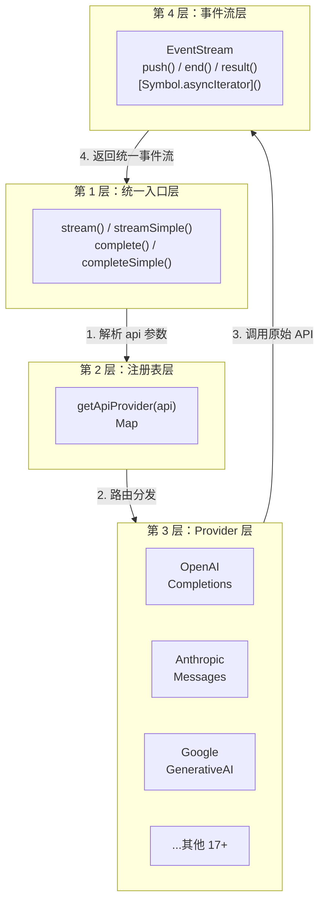

# pi-ai 架构设计：如何统一 20+ LLM 提供商？

> **难度：入门** | **预计阅读时间：15 分钟**

如果你要同时支持 OpenAI、Anthropic、Google 等多个 LLM 提供商，你会怎么设计代码？

最直观的想法可能是写一堆 if-else：

```typescript
if (provider === "openai") {
  // 调用 OpenAI API
} else if (provider === "anthropic") {
  // 调用 Anthropic API
} else if (provider === "google") {
  // 调用 Google API
}
// ... 还有 17 个 else if
```

这种代码维护起来简直是灾难！pi-ai 是怎么优雅地解决这个问题的？

## 核心挑战

不同 LLM 提供商的 API 差异巨大：

| 维度 | OpenAI | Anthropic | Google |
|------|--------|-----------|--------|
| **端点** | `/v1/chat/completions` | `/v1/messages` | `/v1beta/models/...:generateContent` |
| **认证** | `Authorization: Bearer` | `x-api-key` | API Key 或 OAuth |
| **消息格式** | `messages: [{role, content}]` | 类似但结构不同 | `contents: [{role, parts}]` |
| **流式格式** | SSE `data: {...}` | SSE `event: ...` | 不同的事件类型 |
| **工具调用** | `tool_calls` | `tool_use` | `functionCalls` |
| **思考/推理** | `reasoning_effort` | `thinking` | `thinkingConfig` |

pi-ai 的解决方案：**注册表模式 + 延迟加载 + 统一事件流协议**

## LLM 提供商 API 差异详解

要理解 pi-ai 的架构设计，首先需要了解它要统一的 API 到底有多大的差异。

详见 [支持的 Provider 列表](#支持的-provider-列表详细版)。


### 核心 API 差异对比

下表展示了三大主流 Provider 的关键差异：

| 维度 | OpenAI Completions | Anthropic Messages | Google Generative AI |
|------|-------------------|-------------------|---------------------|
| **端点** | `/v1/chat/completions` | `/v1/messages` | `/v1beta/models/{model}:streamGenerateContent` |
| **认证方式** | `Authorization: Bearer {key}` | `x-api-key: {key}` 或 Bearer | `Authorization: Bearer {key}` |
| **请求体结构** | `messages`, `model`, `stream` | `messages`, `model`, `stream` | `contents`, `model`, `generationConfig` |
| **流式响应格式** | SSE `data: {...}` | SSE `event: content_block_start` 等 | 自定义分块流 (非标准 SSE) |
| **消息角色** | `user`, `assistant`, `system/developer`, `tool` | `user`, `assistant` | `user`, `model` (内容含 parts) |
| **工具调用字段** | `tool_calls[].function.{name,arguments}` | `tool_use.{id,name,input}` | `functionCall.{name,args,id}` |
| **工具结果字段** | `tool` 角色 + `tool_call_id` | `tool_result.{tool_use_id,content}` | `functionResponse.{name,response}` |
| **思考/推理** | `reasoning_content` / `reasoning` 字段 | `thinking` 块 (含 `signature`) | `thoughtSignature` 标记思考内容 |
| **缓存控制** | `cache_control: {type:"ephemeral"}` | `cache_control: {type:"ephemeral",ttl:"1h"}` | 通过 `cachedContentTokenCount` 统计 |

### 消息格式差异示例

**OpenAI 格式：**
```typescript
{
  role: "user" | "assistant" | "system" | "developer" | "tool",
  content: string | {type:"text",text} | {type:"image_url",image_url:{url}}[],
  tool_call_id?: string,  // tool 角色专用
  tool_calls?: {id, type:"function", function:{name, arguments}}[]  // assistant 专用
}
```

**Anthropic 格式：**
```typescript
{
  role: "user" | "assistant",
  content: string | {
    type: "text" | "image" | "tool_use" | "tool_result" | "thinking" | "redacted_thinking",
    text?: string,
    source?: {type:"base64",media_type,data},
    id?: string, name?: string, input?: object,  // tool_use
    tool_use_id?: string, content?: ..., is_error?: boolean  // tool_result
    signature?: string  // thinking
  }[]
}
```

**Google 格式：**
```typescript
{
  role: "user" | "model",
  parts: {
    text?: string,
    inlineData?: {mimeType, data},  // 图片
    functionCall?: {name, args, id},
    functionResponse?: {name, response}
  }[]
}
```

### 流式事件差异

| Provider | 传输协议 | 关键事件 |
|---------|---------|---------|
| **OpenAI** | SSE | `data: {"choices":[{"delta":{content/tool_calls}}]}` |
| **Anthropic** | SSE | `content_block_start`, `content_block_delta`, `message_delta` |
| **Google** | 自定义流 | `GenerateContentResponse` 含 `candidates[].content.parts[]` |

### 统一接口设计的核心挑战

1. **消息角色映射** - 不同 Provider 的角色系统不同（如 Anthropic 没有 system 角色）
2. **内容块结构** - 文本/图片/工具/思考的组织方式差异巨大
3. **流式协议** - SSE vs 自定义流，事件命名和结构不同
4. **工具调用** - ID 生成、参数字段命名、结果回传格式不同
5. **推理/思考** - 有些在单独字段，有些在内容块中
6. **缓存机制** - 各家的缓存控制方式不同（ephemeral、token 计数等）
7. **错误处理** - 错误码和错误信息格式不同

正是这些巨大的差异，使得 pi-ai 的架构设计显得尤为精妙。

> **深入阅读**：
> - [第 5 章：消息格式转换](./05-message-transform.md) - 消息格式统一与 Provider 适配
> - [第 6 章：错误处理](./06-error-handling.md) - 错误码和错误信息格式统一

## 架构全景

```
┌─────────────────────────────────────────────────────────────────┐
│                        应用层                                    │
│  ┌─────────────┐  ┌─────────────┐  ┌─────────────┐  ┌──────────┐ │
│  │   stream()  │  │ streamSimple│  │  complete() │  │completeSi│ │
│  │             │  │    ()       │  │             │  │ mple()   │ │
│  └──────┬──────┘  └──────┬──────┘  └──────┬──────┘  └────┬─────┘ │
└─────────┼────────────────┼────────────────┼──────────────┼───────┘
          │                │                │              │
          └────────────────┴────────────────┘              │
                           │                               │
                           ▼                               ▼
          ┌─────────────────────────────────┐  ┌─────────────────────┐
          │      API Registry (注册表)       │  │   EventStream       │
          │  ┌───────────────────────────┐   │  │   (统一事件流)       │
          │  │ Map<api, ApiProvider>     │   │  │                     │
          │  │ - openai-completions      │   │  │  push(event)        │
          │  │ - anthropic-messages      │   │  │  end(result)        │
          │  │ - google-generative-ai    │   │  │  result()           │
          │  │ - ...                     │   │  │  [Symbol.asyncItera │
          │  └───────────────────────────┘   │  │    tor]()           │
          │                                  │  └─────────────────────┘
          │  registerApiProvider()           │
          │  getApiProvider(api)             │
          └─────────────────────────────────┘
                           │
                           ▼
          ┌──────────────────────────────────────────────────────────┐
          │              Provider 层 (延迟加载)                       │
          │  ┌──────────────┐  ┌──────────────┐  ┌──────────────┐    │
          │  │   OpenAI     │  │  Anthropic   │  │    Google    │    │
          │  │  Completions │  │   Messages   │  │ GenerativeAI │    │
          │  │  (按需加载)   │  │   (按需加载)  │  │  (按需加载)   │    │
          │  └──────────────┘  └──────────────┘  └──────────────┘    │
          └──────────────────────────────────────────────────────────┘
                           │
                           ▼
          ┌──────────────────────────────────────────────────────────┐
          │                  原始 API 层                              │
          │         OpenAI API    Anthropic API    Google API        │
          └──────────────────────────────────────────────────────────┘
```

## 四层架构详解

### 架构分层对比表

| 层级 | 名称 | 职责 | 关键组件 | 深入阅读 |
|------|------|------|----------|---------|
| 第 1 层 | 统一入口层 | 提供流式/非流式、完整/简化四种调用方式 | `stream()`, `streamSimple()`, `complete()`, `completeSimple()` | 本章 |
| 第 2 层 | 注册表层 | 运行时分发请求到对应 Provider，带类型检查 | `registerApiProvider()`, `getApiProvider()` | [第 3 章](./03-provider-registry.md) |
| 第 3 层 | Provider 层 | 实现各 LLM 提供商的 API 调用逻辑（延迟加载） | OpenAI Completions, Anthropic Messages, Google GenerativeAI | [第 3 章](./03-provider-registry.md) |
| 第 4 层 | 事件流层 | 统一事件协议，支持双向流控制 | `EventStream`, `AssistantMessageEvent` | [第 4 章](./04-streaming-events.md) |

### 架构数据流图



### 完整调用流程示例

```typescript
// 用户代码
const model = getModel("anthropic", "claude-sonnet-4-20250514");
const stream = streamSimple(model, context, { temperature: 0.7 });

// 内部流程：
// 1. streamSimple -> 查注册表获取 anthropic-messages Provider
// 2. 延迟加载 @mariozechner/pi-ai/anthropic-messages（如果尚未加载）
// 3. 调用 Anthropic Messages API
// 4. Anthropic 流式响应 -> 转换为统一 AssistantMessageEvent
// 5. 通过 EventStream 返回给调用者
```

---

### 第 1 层：统一入口层

pi-ai 提供**四个入口函数**，通过两个维度满足不同场景需求：

| 维度 | 选项 A | 选项 B |
|------|--------|--------|
| **响应方式** | `stream*()` - 流式处理，实时响应 | `complete*()` - 非流式，等待完整响应 |
| **接口类型** | `*Simple` - 统一接口，跨 Provider 兼容 | 无后缀 - 完整控制，支持 Provider 特定功能 |

#### 四个函数快速参考

| 函数 | 返回类型 | 使用场景 |
|------|---------|---------|
| `stream()` | `AssistantMessageEventStream` | 流式 + 需要 Provider 特定功能（如 `reasoningEffort`） |
| `streamSimple()` | `AssistantMessageEventStream` | 流式 + 跨 Provider 兼容（推荐） |
| `complete()` | `Promise<AssistantMessage>` | 非流式 + 需要 Provider 特定功能 |
| `completeSimple()` | `Promise<AssistantMessage>` | 非流式 + 跨 Provider 兼容（推荐） |


#### 核心区别 1：流式 vs 非流式

```typescript
// stream - 流式处理，实时响应
const s = stream(model, context);
for await (const event of s) {
  if (event.type === "text_delta") {
    process.stdout.write(event.delta); // 边生成边显示
  }
}
await s.result(); // 可选：获取最终结果

// complete - 非流式，一次性获取完整响应
const message = await complete(model, context);
console.log(message.content); // 等待完成后一次性输出
```

#### 核心区别 2：完整版 vs 简化版

```typescript
// 无后缀版本：完全控制，使用 Provider 特定选项
import { stream } from "@mariozechner/pi-ai";
const s = stream(model, context, {
  temperature: 0.7,
  reasoningEffort: "high",  // OpenAI 特有参数
  store: true,              // OpenAI 特有参数
});

// Simple 版本：统一接口，自动映射通用概念
import { streamSimple } from "@mariozechner/pi-ai";
const s = streamSimple(model, context, {
  temperature: 0.7,
  reasoning: "high",  // 自动映射到各 Provider 的推理参数
});
```

#### 选型建议

| 需求 | 推荐函数 |
|------|---------|
| 实时显示文本 / 跨 Provider 兼容 | `streamSimple()` |
| 实时显示文本 / 需要特定功能 | `stream()` |
| 一次性获取 / 跨 Provider 兼容 | `completeSimple()` |
| 一次性获取 / 需要特定功能 | `complete()` |

```typescript
// packages/ai/src/stream.ts

// 完整控制：使用 provider 特定选项
export function stream<TApi extends Api>(
  model: Model<TApi>,
  context: Context,
  options?: ProviderStreamOptions,
): AssistantMessageEventStream;

// 简化接口：统一选项自动映射
export function streamSimple<TApi extends Api>(
  model: Model<TApi>,
  context: Context,
  options?: SimpleStreamOptions,
): AssistantMessageEventStream;

// 非流式：等待完整响应
export async function complete<TApi extends Api>(
  model: Model<TApi>,
  context: Context,
  options?: ProviderStreamOptions,
): Promise<AssistantMessage>;

// 简化非流式
export async function completeSimple<TApi extends Api>(
  model: Model<TApi>,
  context: Context,
  options?: SimpleStreamOptions,
): Promise<AssistantMessage>;
```

#### 核心组件：底层 stream() 函数

在四个入口函数之下，还有一个底层的 `stream()` 函数，它是整个架构的核心：

```typescript
// packages/ai/src/stream.ts
export async function* stream(
  api: Api,                     // API 标识，如 "openai/gpt-4o"
  options: StreamOptions        // 统一选项
): AsyncGenerator<AgentMessageEvent> {
  // 1. 解析 API 标识
  const [providerName, modelId] = api.split("/");

  // 2. 获取 Provider
  const provider = getApiProvider(providerName);

  // 3. 调用 Provider 的 stream 方法
  const stream = await provider.stream(modelId, options);
  // 如 packages/ai/src/providers/openai-completions.ts
  // 详见 streamOpenAICompletions

  // 4. 标准化事件流 AgentMessageEvent
  for await (const event of stream) {
    yield normalizeEvent(event);
  }
}
```

**关键设计：**
- `Api` 类型使用 `provider/model` 格式，如 `"openai/gpt-4o"`
- 统一的 `StreamOptions` 接口，屏蔽底层差异
- 返回统一的 `AgentMessageEvent` 事件流，统一事件协议，如 将 OpenAI 的 `ChatCompletionChunk` 转换为 `AssistantMessageEvent`

### 第 2 层：注册表层——架构的"调度中枢"

注册表层是 pi-ai 架构的**核心调度中枢**，负责将上层请求路由到下层对应的 Provider 实现。

#### 核心职责

注册表层解决的核心问题：**如何根据 `model.api` 找到对应的 Provider 实现？**

```typescript
// packages/ai/src/api-registry.ts
// 简化的注册表逻辑
const apiProviderRegistry = new Map<string, ApiProvider>();

// 运行时查找 Provider
function getApiProvider(api: Api): ApiProvider | undefined {
  return apiProviderRegistry.get(api);
}
```

**为什么用 Map 而不是 if-else？**

| 设计方案 | 扩展性 | 代码复杂度 | 可测试性 |
|---------|--------|-----------|---------|
| if-else | 每新增 Provider 需修改逻辑 | O(n) 分支判断 | 难以单独测试 |
| Map 注册表 | 只需注册，调用逻辑不变 | O(1) 查找 | 每个 Provider 可独立测试 |

#### 架构设计思想

注册表层体现了**开闭原则**（Open-Closed Principle）：
- **对扩展开放**：新增 Provider 只需调用 `registerApiProvider()`，无需修改现有代码
- **对修改关闭**：调用逻辑 `stream()` / `streamSimple()` 保持不变

```typescript
// 用户视角：完全感知不到注册表的存在
const model = getModel("anthropic", "claude-sonnet-4-20250514");
const stream = streamSimple(model, context);
// 内部自动完成：model.api -> 查找注册表 -> 调用对应 Provider
```

#### 与上下层的关系

```
第 1 层 (统一入口)         第 2 层 (注册表)          第 3 层 (Provider)
     stream()       ->   getApiProvider()   ->   streamOpenAICompletions()
     streamSimple() ->   getApiProvider()   ->   streamSimpleAnthropic()
```

> **深入阅读**：详见 [第 3 章：Provider 注册与延迟加载](./03-provider-registry.md)，了解注册表的完整实现、延迟加载机制和运行时类型检查。

---

#### 关键设计：运行时类型检查

注册表在返回 Provider 时，会用 `wrapStream` 包装一层，进行运行时类型检查：

```typescript
function wrapStream<TApi extends Api>(
  api: TApi,
  stream: StreamFunction<TApi>,
): ApiStreamFunction {
  return (model, context, options) => {
    if (model.api !== api) {
      throw new Error(`Mismatched api: ${model.api} expected ${api}`);
    }
    return stream(model, context, options);
  };
}
```

**双重类型保护**：
1. **编译时**：TypeScript 泛型约束确保类型正确
2. **运行时**：`wrapStream` 进行二次校验，防止类型擦除导致的问题

这确保了即使用户错误地混用 `api` 类型，也能在运行时及时报错，而不是静默失败。

### 第 3 层：Provider 实现层（延迟加载）

pi-ai 支持 20+ Provider，但如果一次性导入所有 Provider 的代码，会导致：
- **包体积过大**：未使用的 Provider 代码也被打包
- **启动速度慢**：浏览器需要解析大量无用代码
- **环境污染**：Node-only 的 Provider（如 Bedrock）可能污染浏览器环境

**解决方案：延迟加载**

这是 pi-ai 最精妙的设计之一。不是静态导入所有 Provider，而是**按需加载**：

```typescript
// packages/ai/src/providers/register-builtins.ts

// 延迟加载包装器的简化逻辑
function createLazyStream(loadModule: () => Promise<ProviderModule>) {
  return (model, context, options) => {
    // 立即返回一个 EventStream，但内部异步加载实际 Provider
    const outer = new AssistantMessageEventStream();

    // 异步加载实际 Provider 模块
    loadModule()
      .then((module) => {
        const inner = module.stream(model, context, options);
        forwardStream(outer, inner);  // 将内部流转发到外部流
      })
      .catch((error) => {
        // 加载失败时发送 error 事件，而不是抛出异常
        outer.push({ type: "error", error });
        outer.end();
      });

    return outer;  // 立即返回 EventStream
  };
}

// OpenAI Completions 的延迟加载
function loadOpenAICompletionsProviderModule() {
  openAICompletionsProviderModulePromise ||= import("./openai-completions.js").then((module) => {
    const provider = module as OpenAICompletionsProviderModule;
    return {
      stream: provider.streamOpenAICompletions,
      streamSimple: provider.streamSimpleOpenAICompletions,
    };
  });
  return openAICompletionsProviderModulePromise;
}

export const streamOpenAICompletions = createLazyStream(loadOpenAICompletionsProviderModule);
```

**延迟加载的核心设计**：
1. **Promise 缓存**：`import()` 只执行一次，后续调用复用已加载的模块
2. **事件流转发**：`forwardStream(outer, inner)` 将内部流事件转发到外部流
3. **错误隔离**：Provider 加载失败不影响其他 Provider

```
延迟加载流程：
1. streamSimple() -> createLazyStream() -> 立即返回 outer EventStream
2. outer 内部异步调用 import("./openai-completions.js")
3. 模块加载完成 -> 调用 streamOpenAICompletions() -> 返回 inner EventStream
4. forwardStream(outer, inner) -> inner 的事件转发到 outer
5. 用户通过 outer 接收事件
```

> **深入阅读**：详见 [第 3 章：Provider 注册与延迟加载](./03-provider-registry.md)，了解 outer/inner 流的关系、Promise 缓存实现和完整时序图。

---

### 第 4 层：统一事件流协议

pi-ai 将所有 Provider 的响应转换为统一的事件流协议，核心是 `EventStream` 类。

#### EventStream 类：双向流控制

传统的 `AsyncGenerator` 只能消费，不能控制。`EventStream` 提供**双向控制**：

```typescript
// packages/ai/src/utils/event-stream.ts
// EventStream 简化版
class EventStream<T, R = T> {
  private queue: T[] = [];
  private waiting: ((value: IteratorResult<T>) => void)[] = [];
  private done = false;
  private finalResultPromise: Promise<R>;

  // 生产者：推送事件
  push(event: T): void {
    if (this.done) return;

    const waiter = this.waiting.shift();
    if (waiter) {
      waiter({ value: event, done: false });  // 零拷贝传递
    } else {
      this.queue.push(event);  // 入队等待消费
    }
  }

  // 生产者：结束流
  end(result?: R): void {
    this.done = true;
    // ... 通知所有等待者
  }

  // 消费者：异步迭代
  async *[Symbol.asyncIterator](): AsyncIterator<T> {
    while (true) {
      if (this.queue.length > 0) {
        yield this.queue.shift()!;
      } else if (this.done) {
        return;
      } else {
        // 等待新事件
        const result = await new Promise((resolve) => this.waiting.push(resolve));
        if (result.done) return;
        yield result.value;
      }
    }
  }

  // 消费者：获取最终结果
  result(): Promise<R> {
    return this.finalResultPromise;
  }
}
```

**核心设计**：
- **队列 + 等待列表**：消费者快时队列为空，生产者快时队列缓冲
- **零拷贝传递**：消费者等待时，事件直接传递，不经过队列
- **背压处理**：队列自然缓冲，避免内存无限增长

#### 两种消费方式

```typescript
const stream = streamSimple(model, context);

// 方式 1：实时处理事件（打字机效果）
for await (const event of stream) {
  if (event.type === "text_delta") {
    process.stdout.write(event.delta);
  }
}

// 方式 2：直接获取最终结果（内部仍然流式处理）
const message = await stream.result();
console.log(message.content);
```

#### 统一事件类型

事件流标准化

```typescript
// packages/ai/src/types.ts

export type AssistantMessageEvent =
  | { type: "start"; partial: AssistantMessage }
  | { type: "text_start"; contentIndex: number; partial: AssistantMessage }
  | { type: "text_delta"; contentIndex: number; delta: string; partial: AssistantMessage }
  | { type: "text_end"; contentIndex: number; content: string; partial: AssistantMessage }
  | { type: "thinking_start"; contentIndex: number; partial: AssistantMessage }
  | { type: "thinking_delta"; contentIndex: number; delta: string; partial: AssistantMessage }
  | { type: "thinking_end"; contentIndex: number; content: string; partial: AssistantMessage }
  | { type: "toolcall_start"; contentIndex: number; partial: AssistantMessage }
  | { type: "toolcall_delta"; contentIndex: number; delta: string; partial: AssistantMessage }
  | { type: "toolcall_end"; contentIndex: number; toolCall: ToolCall; partial: AssistantMessage }
  | { type: "done"; reason: StopReason; message: AssistantMessage }
  | { type: "error"; reason: "error" | "aborted"; error: AssistantMessage };
```

不管底层是 OpenAI 的 `data: {"choices":[{"delta":{content}}]}` 还是 Anthropic 的 `content_block_delta`，最终都被转换为统一的 `AssistantMessageEvent`。

> **深入阅读**：详见 [第 4 章：流式事件处理](./04-streaming-events.md)，了解 EventStream 的内部机制、5 种使用模式、背压控制和性能优化。
### 消息格式转换

不同 Provider 的消息格式差异很大，pi-ai 通过转换函数实现统一：

- OpenAI 格式转换
  - `convertFromOpenAI` OpenAI -> 统一格式
  - `convertToOpenAI` 统一格式 -> OpenAI
- Anthropic 格式转换
  - `convertToAnthropic`

详见 [第 5 章](./05-message-transform.md) | 消息格式转换


## 支持的 Provider 列表（详细版）

pi-ai 目前支持 20+ Provider，按 API 类型分组的完整列表：

| API 类型 | Provider | 代表模型/特点 |
|---------|----------|---------|
| `openai-completions` | OpenAI, xAI, Groq, Cerebras, OpenRouter, Z.ai, Minimax, HuggingFace | GPT-4o/4.1, Grok-3/4, Llama 系列，Qwen 系列 |
| `openai-responses` | OpenAI | o1, o3, o4-mini (推理系列，使用 Responses API) |
| `openai-codex-responses` | OpenAI Codex | ChatGPT Plus/Pro 内置的 Claude Code |
| `azure-openai-responses` | Azure OpenAI | 企业级 OpenAI 服务，Azure 部署 |
| `anthropic-messages` | Anthropic, GitHub Copilot | Claude 3/4 系列，支持 thinking/reasoning |
| `google-generative-ai` | Google | Gemini 2.0/2.5/3.0 系列 |
| `google-vertex` | Vertex AI | 企业版 Gemini，Google Cloud 部署 |
| `google-gemini-cli` | Gemini CLI | Cloud Code Assist，VS Code 集成 |
| `mistral-conversations` | Mistral | Mistral Large/Nemo，开源模型 |
| `bedrock-converse-stream` | Amazon Bedrock | AWS 企业级，多模型统一接入 |

> **注意**：pi-ai 将 Provider 按 API 兼容性分组，相同 API 类型的 Provider 可以无缝切换。例如 `openai-completions` 类型包括 OpenAI、xAI、Groq、Cerebras 等，它们的调用方式完全相同。

以下为最常见的两个

- OpenAI 兼容接口:
  - 对应 `openai-completions`
  - 使用 OpenAI 风格的 `/v1/chat/completions` 端点
- Anthropic 兼容接口:
  - 对应 `anthropic-messages`
  - 使用 Anthropic 风格的 `/v1/messages`
  端点。

## 使用示例

### 基础使用

```typescript
import { getModel, streamSimple } from "@mariozechner/pi-ai";

// 获取模型（带类型推断）
const model = getModel("openai", "gpt-4o-mini");

// 流式调用
const stream = streamSimple(model, {
  messages: [{ role: "user", content: "Hello!" }],
});

for await (const event of stream) {
  if (event.type === "text_delta") {
    process.stdout.write(event.delta);
  }
}
```

### 跨 Provider 切换

```typescript
import { getModel, completeSimple, Context } from "@mariozechner/pi-ai";

const context: Context = {
  messages: [{ role: "user", content: "What is TypeScript?" }],
};

// 先用 Claude
const claude = getModel("anthropic", "claude-sonnet-4-20250514");
const claudeResponse = await completeSimple(claude, context);
context.messages.push(claudeResponse);

// 再切换到 GPT（上下文自动转换）
context.messages.push({ role: "user", content: "Give me an example" });
const gpt = getModel("openai", "gpt-4o");
const gptResponse = await completeSimple(gpt, context);
```

> **更多示例**：详见 [00-README-zh.md](./00-README-zh.md) 的完整 API 文档和 [第 4 章：流式事件处理](./04-streaming-events.md) 的 5 种使用模式。

## 架构优势总结

面对上述 API 差异，pi-ai 的架构设计提供了以下优势：

1. **统一接口** - 无论底层是哪个 Provider，调用方式都一样
2. **延迟加载** - 按需加载 Provider，减小包体积，加快启动速度
3. **类型安全** - TypeScript 泛型确保编译时类型正确，运行时还有双重检查
4. **错误隔离** - 某个 Provider 加载失败不影响其他 Provider 的正常使用
5. **事件驱动** - 统一的 `AssistantMessageEvent` 协议支持复杂交互模式
6. **跨 Provider 切换** - Context 可序列化，支持在对话中无缝切换不同 Provider
7. **易于扩展** - 添加新 Provider 只需实现统一的 `ApiProvider` 接口并注册
8. **环境隔离** - Node-only 的 Provider（如 Bedrock）不会污染浏览器构建

## 总结

pi-ai 通过**适配器模式** + **注册表模式** + **延迟加载**，优雅地解决了多 Provider 统一接入的问题：

| 挑战 | pi-ai 解决方案 |
|------|--------------|
| 消息格式差异 | 统一 `Message` 类型 + 各 Provider 的 `convertMessages()` 转换函数 |
| 流式协议差异 | 统一 `AssistantMessageEvent` + 各 Provider 的流解析逻辑 |
| 工具调用差异 | 统一 `ToolCall` 类型 + ID 规范化处理 |
| 认证方式差异 | 统一的 `apiKey` 参数 + Provider 内部处理 |
| 包体积问题 | 延迟加载 (`import()`) + 按需初始化 |

这种设计让开发者无需关心底层差异，一套代码支持 20+ LLM 提供商，同时保持了优秀的开发体验和运行时性能。

## 本文深入阅读

本文是架构全景概览，详细的实现细节请参阅以下章节：

| 章节 | 主题 | 内容 |
|------|------|------|
| [第 3 章](./03-provider-registry.md) | Provider 注册与延迟加载 | 注册表实现、Promise 缓存、outer/inner 流转发 |
| [第 4 章](./04-streaming-events.md) | 流式事件处理 | EventStream 双向流控制、5 种使用模式、背压优化 |
| [第 5 章](./05-message-transform.md) | 消息格式转换 | 统一协议与 Provider 适配 |
| [第 6 章](./06-error-handling.md) | 错误处理 | 错误码和错误信息格式统一 |
| [00-README-zh.md](./00-README-zh.md) | 完整 API 参考 | 所有 Provider 列表、API 文档 |

## 下篇预告

《类型系统深度解析：Message、Content、Event 协议》 - 深入理解 pi-ai 的核心类型设计。
