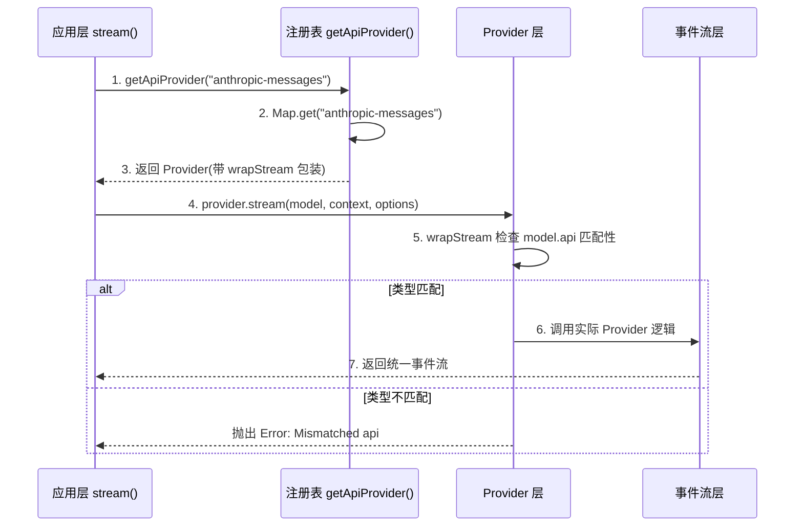
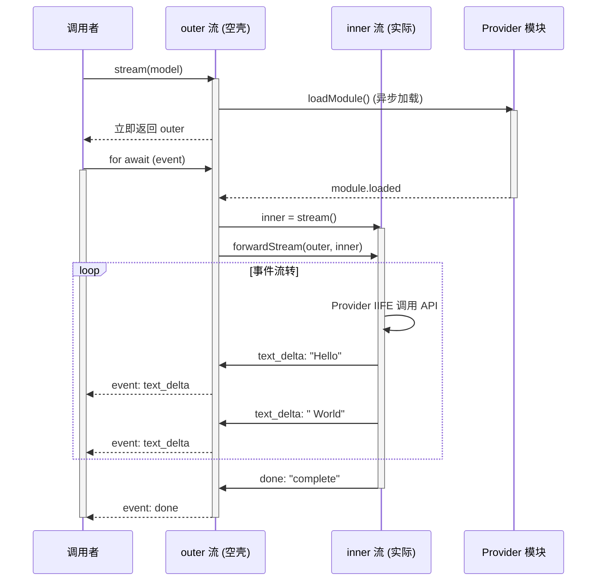

# Provider 注册机制与延迟加载实现

> **难度：进阶** | **预计阅读时间：25 分钟**

pi-ai 支持 20+ LLM Provider，但它是如何管理这些 Provider 的？为什么启动时不会一次性加载所有 Provider？

今天我们就来深入剖析 pi-ai 的 Provider 注册机制和延迟加载实现。

## 为什么需要延迟加载？

想象一个场景：你的应用只需要调用 OpenAI，但 pi-ai 却加载了所有 Provider 的依赖...

```
问题：
├── 包体积爆炸
│   ├── AWS SDK (Bedrock): ~5MB
│   ├── Google SDK: ~3MB
│   ├── Anthropic SDK: ~1MB
│   └── ... 其他 17 个 Provider
│
├── 启动时间变慢
│   └── 初始化 20+ 个 Provider
│
├── 浏览器兼容性问题
│   └── Bedrock 需要 Node.js 环境
│
└── 错误传播
    └── 某个 Provider 加载失败导致整个应用崩溃
```

**pi-ai 的解决方案：延迟加载（Lazy Loading）**

```
解决方案：
├── 按需加载：只加载实际使用的 Provider
├── 动态导入：使用 ES Module 动态导入
├── 错误隔离：单个 Provider 失败不影响其他
└── 类型安全：编译时检查，运行时加载
```

## 架构概览

```
┌─────────────────────────────────────────────────────────────────┐
│                        应用层                                    │
│  ┌─────────────┐  ┌─────────────┐  ┌─────────────────────────┐ │
│  │   stream()  │  │ streamSimple│  │  Provider-specific      │ │
│  │             │  │    ()       │  │  stream functions       │ │
│  └──────┬──────┘  └──────┬──────┘  └──────────┬──────────────┘ │
└─────────┼────────────────┼────────────────────┼─────────────────┘
          │                │                    │
          └────────────────┴────────────────────┘
                           │
                           ▼
          ┌──────────────────────────────────────────────────────────┐
          │              API Registry (注册表)                      │
          │  ┌────────────────────────────────────────────────────┐ │
          │  │  Map<api, { provider, sourceId }>                  │ │
          │  │                                                    │ │
          │  │  - openai-completions → OpenAI Provider           │ │
          │  │  - anthropic-messages → Anthropic Provider        │ │
          │  │  - google-generative-ai → Google Provider         │ │
          │  │  - ...                                             │ │
          │  └────────────────────────────────────────────────────┘ │
          │                                                        │
          │  registerApiProvider()                                 │
          │  getApiProvider()                                      │
          │  clearApiProviders()                                   │
          └──────────────────────────────────────────────────────────┘
                           │
                           ▼
          ┌──────────────────────────────────────────────────────────┐
          │              Provider 层 (延迟加载)                       │
          │  ┌────────────────────────────────────────────────────┐ │
          │  │                                                    │ │
          │  │  延迟加载包装器 (createLazyStream)                  │ │
          │  │  ┌──────────────────────────────────────────────┐ │ │
          │  │  │ 1. 立即返回 EventStream                       │ │ │
          │  │  │ 2. 异步加载 Provider 模块                     │ │ │
          │  │  │ 3. 转发内部流到外部流                         │ │ │
          │  │  │ 4. 错误处理 (不抛出异常)                      │ │ │
          │  │  └──────────────────────────────────────────────┘ │ │
          │  │                                                    │ │
          │  │  实际 Provider 实现 (动态导入)                      │ │
          │  │  ┌──────────────────────────────────────────────┐ │ │
          │  │  │ import("./openai-completions.js")            │ │ │
          │  │  │ import("./anthropic.js")                     │ │ │
          │  │  │ import("./google.js")                        │ │ │
          │  │  │ ...                                          │ │ │
          │  │  └──────────────────────────────────────────────┘ │ │
          │  │                                                    │ │
          │  └────────────────────────────────────────────────────┘ │
          └──────────────────────────────────────────────────────────┘
```


#### 注册表工作流程图



---

#### 注册表数据结构

```typescript
// 注册表内部结构
interface RegisteredApiProvider {
  provider: ApiProviderInternal;  // 包装后的 Provider
  sourceId?: string;               // 来源标识（用于追踪）
}

// Map 存储示例
apiProviderRegistry = new Map([
  ["openai-completions", {
    provider: { stream: ..., streamSimple: ... },
    sourceId: "@mariozechner/pi-ai/openai-completions"
  }],
  ["anthropic-messages", {
    provider: { stream: ..., streamSimple: ... },
    sourceId: "@mariozechner/pi-ai/anthropic-messages"
  }],
  ["google-generative-ai", {
    provider: { stream: ..., streamSimple: ... },
    sourceId: "@mariozechner/pi-ai/google-generative-ai"
  }],
  // ... 其他 17+ Provider
]);
```

---

#### 为什么需要注册表？

| 设计方案 | 无注册表 (if-else) | 有注册表 (Map) |
|---------|------------------|--------------|
| **扩展性** | 每新增 Provider 需修改调用逻辑 | 只需注册新 Provider，调用逻辑不变 |
| **可测试性** | if-else 分支难以单独测试 | 每个 Provider 可独立注册/替换 |
| **运行时分发** | 硬编码，无法动态切换 | 可根据配置/环境动态加载 |
| **代码复杂度** | O(n) 分支判断 | O(1) Map 查找 |
| **类型安全** | 运行时才知道是否匹配 | 泛型 + 包装器双重保障 |

---

#### 完整调用示例

```typescript
import { getModel, streamSimple, registerApiProvider } from "@mariozechner/pi-ai";

// 1. 注册 Provider（框架内部自动完成）
registerApiProvider({
  api: "anthropic-messages",
  stream: streamAnthropicMessages,
  streamSimple: streamSimpleAnthropicMessages,
});

// 2. 用户使用
const model = getModel("anthropic", "claude-sonnet-4-20250514");
const stream = streamSimple(model, { messages: [...] });

// 3. 内部查找流程
// streamSimple -> 获取 model.api="anthropic-messages"
//            -> getApiProvider("anthropic-messages")
//            -> Map.get("anthropic-messages")
//            -> 返回 anthropic Messages Provider
//            -> 调用 streamAnthropicMessages()
//            -> 返回统一事件流
```

## 核心实现：延迟加载包装器

### createLazyStream - 延迟加载的核心

```typescript
// packages/ai/src/providers/register-builtins.ts

function createLazyStream<TApi extends Api, TOptions extends StreamOptions>(
  loadModule: () => Promise<LazyProviderModule<TApi, TOptions, SimpleStreamOptions>>,
): StreamFunction<TApi, TOptions> {
  return (model, context, options) => {
    // 1. 立即返回一个 EventStream
    // 调用者可以立即开始监听事件
    const outer = new AssistantMessageEventStream();

    // 2. 异步加载 Provider 模块
    loadModule()
      .then((module) => {
        // 3. 调用实际的 Provider 实现
        const inner = module.stream(model, context, options);
        // 4. 将内部流转发到外部流
        forwardStream(outer, inner);
      })
      .catch((error) => {
        // 5. 错误处理：发送 error 事件，而不是抛出异常
        const message = createLazyLoadErrorMessage(model, error);
        outer.push({ type: "error", reason: "error", error: message });
        outer.end(message);
      });

    // 立即返回，不等待加载完成
    return outer;
  };
}
```

**关键设计决策：**

1. **立即返回**：调用者可以立即获得 EventStream，开始监听事件
2. **异步加载**：Provider 模块在后台加载，不阻塞主线程
3. **流转发**：内部 Provider 的事件流被转发到外部流
4. **错误隔离**：加载失败时发送 error 事件，而不是抛出异常

### 核心概念：什么是"可迭代的流"？

**"可迭代的流"（AsyncIterable Stream）就是一种可以用 `for await...of` 消费的数据流。**

#### 对比：OpenAI SDK vs pi-ai

```typescript
// 1. OpenAI SDK 原生方式
const stream = await openai.chat.completions.create({
  model: "gpt-4",
  messages: [{ role: "user", content: "Hello" }],
  stream: true,
});

// 方式 1: async iterate (推荐)
for await (const chunk of stream) {
  console.log(chunk.choices[0]?.delta?.content);

  const delta = chunk.choices[0]?.delta?.content;
  if (delta) {
    fullText += delta;  // 需要自己拼接
  }
  // 需要自己计算 token、处理错误等
}

// 方式 2: stream 事件 (Node.js)
stream.on("data", (chunk) => {
  console.log(chunk.choices[0]?.delta?.content);
});

// 2. pi-ai 的 EventStream 是什么？
// 简单说：EventStream 就是一个包装器，它让任何数据源都能用 for await 消费。

// pi-ai 封装后
const stream = streamOpenAICompletions(model, context);

for await (const event of stream) {
  console.log(event);  // 统一的事件格式
  if (event.type === "text_delta") {
    console.log(event.delta);  // 文本片段
    // 自动拼接，event.partial 就是完整消息
    console.log(event.partial.content[0].text);
  }
  if (event.type === "done") {
    console.log("完成:", event.message);
    // 自动计算 token 和费用
    console.log("Token:", event.message.usage);
    console.log("Cost:", event.message.cost);
  }
}
```

**两者都返回"可迭代的流"，但 pi-ai 做了统一封装。**

两者的关系

```bash
┌─────────────────────────────────────────────────────────────┐
│                    OpenAI SDK                               │
│  create() → Stream<ChatCompletionChunk>                     │
│            - 直接返回 API 的原始响应 chunk                     │
│            - 需要自己解析 delta、usage 等                      │
└─────────────────────────────────────────────────────────────┘
                            ↓ 封装
┌─────────────────────────────────────────────────────────────┐
│                    pi-ai EventStream                        │
│  stream() → AssistantMessageEventStream                     │
│            - 统一的事件格式 (text_delta, tool_call, done)     │
│            - 自动计算 usage、cost                            │
│            - 支持所有 Provider 的统一接口                      │
└─────────────────────────────────────────────────────────────┘
```

### 核心区别对比

| 维度 | OpenAI SDK | pi-ai EventStream |
|------|-----------|------------------|
| **返回类型** | `Stream<ChatCompletionChunk>` | `EventStream<AssistantMessageEvent>` |
| **事件格式** | 原始 API chunk（各家格式不同） | 统一的事件类型（所有 Provider 一致） |
| **多 Provider 支持** | 仅 OpenAI | 20+ Provider 统一接口 |
| **错误处理** | `try-catch` 或 `.on("error")` | `event.type === "error"` 统一处理 |
| **Token 统计** | 需要自己解析 `usage` 字段 | 自动计算，`event.message.usage` |
| **费用计算** | 需要自己查价格表计算 | 自动计算，`event.message.cost` |
| **工具调用** | 各 Provider 格式不同 | 统一的 `tool_call` 事件 |
| **批量创建** | 需要分别调用不同 SDK | `models.map(m => stream(m))` |
| **延迟加载** | 不支持 | 内置，按需加载 Provider 模块 |


#### EventStream 的本质

```typescript
// EventStream 实现了 AsyncIterable 接口
export class EventStream<T> implements AsyncIterable<T> {
  private queue: T[] = [];
  private waiting: ((value: IteratorResult<T>) => void)[] = [];

  // 生产者调用 push() 放入事件
  push(event: T): void {
    const waiter = this.waiting.shift();
    if (waiter) {
      waiter({ value: event, done: false });  // 唤醒等待的消费者
    } else {
      this.queue.push(event);  // 存入队列
    }
  }

  // 消费者用 for await 消费
  async *[Symbol.asyncIterator](): AsyncIterator<T> {
    while (true) {
      if (this.queue.length > 0) {
        yield this.queue.shift()!;  // 从队列取
      } else {
        // 没事件时等待 push() 唤醒
        const result = await new Promise((resolve) =>
          this.waiting.push(resolve)
        );
        if (result.done) return;
        yield result.value;
      }
    }
  }
}
```

**通俗理解：**
- `EventStream` 就像一个**有缓冲的管道**
- 生产者调用 `push()` 往管道里放数据
- 消费者用 `for await` 从管道里取数据
- 如果管道空了，消费者会等待，直到有新数据

#### 三层流式结构

```
┌─────────────────────────────────────────────────────────────┐
│  调用层：for await (event of stream) { }                    │
│  - 消费者：用 for await 消费事件                             │
└─────────────────────────────────────────────────────────────┘
                            ↓ 消费的是 outer
┌─────────────────────────────────────────────────────────────┐
│  代理层：outer = new AssistantMessageEventStream()          │
│  - 空壳管道：内部有 queue 和 waiting                         │
│  - 不产生数据，只负责转发                                   │
└─────────────────────────────────────────────────────────────┘
                            ↓ forwardStream 转发
┌─────────────────────────────────────────────────────────────┐
│  实现层：inner = module.stream()                            │
│  - 实际生产者：调用 OpenAI / Anthropic / Google API          │
│  - 产生事件：text_delta, tool_call, done                    │
└─────────────────────────────────────────────────────────────┘
```

### 为什么需要 `outer` 这个空壳？

这是理解 pi-ai 流式架构的关键。我们用三个问题来拆解：

#### 问题 1：为什么需要 `outer` 这个空壳？

**答案：因为模块加载是异步的，但调用者需要立即获得可迭代的流。**

```typescript
// 如果没有 outer，代码会是这样（同步返回不可能）：
return (model, context, options) => {
  const module = await loadModule(); // ❌ 这里不能 await，调用者不想要 Promise
  return module.stream(model, context, options);
}

// 有了 outer，调用者拿到的是：
return (model, context, options) => {
  const outer = new AssistantMessageEventStream(); // 立即创建
  loadModule().then(...); // 后台加载
  return outer; // ✅ 立即返回一个可迭代的流
}
```

#### 问题 2：`outer` 和 `inner` 是怎么串起来的？

**答案：通过 `forwardStream` 函数，把 `inner` 的每个事件推送到 `outer`。**

```typescript
// packages/ai/src/providers/register-builtins.ts

function forwardStream(
  target: AssistantMessageEventStream,
  source: AsyncIterable<AssistantMessageEvent>,
): void {
  (async () => {
    for await (const event of source) {
      target.push(event);  // 🔑 关键：把 inner 的事件推送到 outer
    }
    target.end();  // inner 结束时，关闭 outer
  })();
}
```

#### 问题 3：调用者是怎么收到事件的？

**答案：`outer` 内部维护了一个队列和等待者列表，调用者迭代时自动消费事件。**

```typescript
// packages/ai/src/utils/event-stream.ts

export class EventStream<T, R = T> implements AsyncIterable<T> {
  private queue: T[] = [];
  private waiting: ((value: IteratorResult<T>) => void)[] = [];

  push(event: T): void {
    // 如果有等待的消费者，直接唤醒
    const waiter = this.waiting.shift();
    if (waiter) {
      waiter({ value: event, done: false });
    } else {
      // 否则存入队列
      this.queue.push(event);
    }
  }

  async *[Symbol.asyncIterator](): AsyncIterator<T> {
    while (true) {
      if (this.queue.length > 0) {
        yield this.queue.shift()!;  // 消费队列
      } else if (this.done) {
        return;
      } else {
        // 没有事件时，把自己加入等待列表
        const result = await new Promise<IteratorResult<T>>(
          (resolve) => this.waiting.push(resolve)
        );
        if (result.done) return;
        yield result.value;
      }
    }
  }
}
```

### 完整流程时序图



### 深入：inner 和 outer 的关系与流转

这是理解延迟加载的核心。我们用**水管 analogy**来解释：

```
┌─────────────────────────────────────────────────────────────────┐
│                        调用者                                    │
│  const stream = streamOpenAICompletions(model, context);        │
│  for await (const event of stream) { ... }                      │
└─────────────────────────────────────────────────────────────────┘
                              │
                              │ 拿到的是 outer
                              ▼
┌─────────────────────────────────────────────────────────────────┐
│  outer = new AssistantMessageEventStream()                      │
│  ┌───────────────────────────────────────────────────────────┐ │
│  │  "空管道" - 刚创建时里面没有数据                            │ │
│  │                                                           │ │
│  │  - queue: []        ← 事件队列（后备缓冲）                 │ │
│  │  - waiting: [...]   ← 等待的消费者（调用者在等）           │ │
│  │  - done: false      ← 还没结束                            │ │
│  │                                                           │ │
│  │  职责：只负责转发，不生产数据                             │ │
│  └───────────────────────────────────────────────────────────┘ │
└─────────────────────────────────────────────────────────────────┘
                              │
                              │ forwardStream 连接
                              │ for await (event of inner) { outer.push(event) }
                              ▼
┌─────────────────────────────────────────────────────────────────┐
│  inner = module.stream()                                        │
│  ┌───────────────────────────────────────────────────────────┐ │
│  │  事件载体 - AssistantMessageEventStream 实例               │ │
│  │                                                           │ │
│  │  Provider 函数内部（真正的生产者）：                       │ │
│  │  ┌─────────────────────────────────────────────────────┐ │ │
│  │  │ (async () => {                                      │ │ │
│  │  │   // 1. 调用真实 API                                  │ │ │
│  │  │   const response = await openai.chat...create()     │ │ │
│  │  │   // 2. 解析并推送事件到 inner                         │ │ │
│  │  │   for await (const chunk of response) {             │ │ │
│  │  │     inner.push({ type: "text_delta", ... })         │ │ │
│  │  │   }                                                 │ │ │
│  │  │   // 3. 结束 inner                                   │ │ │
│  │  │   inner.end()                                       │ │ │
│  │  │ })()                                                │ │ │
│  │  └─────────────────────────────────────────────────────┘ │ │
│  │                                                           │ │
│  │  inner 职责：作为事件载体，被 Provider 的 IIFE 填充事件      │ │
│  └───────────────────────────────────────────────────────────┘ │
└─────────────────────────────────────────────────────────────────┘
```

### inner 和 outer 的职责分工

| 角色 | 创建时机 | 职责 | 数据从哪来 |
|------|---------|------|-----------|
| **outer** | 立即创建 | 转发事件给调用者 | 从 inner 通过 `push()` 接收 |
| **inner** | 模块加载后创建 | 作为事件载体，被 Provider 的 IIFE 填充 | Provider 的 IIFE 调用 `inner.push()` 从 API 获取数据 |

**关键澄清**：
- `inner` 本身不是"生产者"，它是一个 `AssistantMessageEventStream` 实例
- 真正的"生产者"是 Provider 函数内部的 IIFE（立即执行函数）
- IIFE 调用真实 API，解析响应，然后调用 `inner.push(event)` 填充事件

### 数据流转细节：queue 和 waiting 是如何工作的？

`outer.push(event)` 并不是简单地"推到 queue 中"，而是有两种情况：

```typescript
// EventStream.push() 的完整逻辑
push(event: T): void {
  if (this.done) return;

  // 1. 先看看有没有等待的消费者
  const waiter = this.waiting.shift();

  if (waiter) {
    // 情况 A：有等待的消费者 → 直接唤醒，不经过 queue
    // 就像"快递直接送到门口"
    waiter({ value: event, done: false });
  } else {
    // 情况 B：消费者还没准备好 → 存入 queue
    // 就像"快递放到快递柜"
    this.queue.push(event);
  }
}
```

**两种消费场景：**

```typescript
// 场景 1：消费者已经在等待（理想情况）
for await (const event of outer) {  // ← 早就等在这里了
  console.log(event);
}
// 结果：inner.push(event) → 直接唤醒 for await → 不经过 queue

// 场景 2：inner 生产太快，queue 会暂存
const stream = streamOpenAICompletions(model, context);
// ... 做些别的事 ...
for await (const event of stream) {  // ← 过了一会才开始消费
  console.log(event);
}
// 结果：事件先存 queue → for await 开始时从 queue 取
```

**为什么这样设计？**

- **有消费者在等** → 直接送达，减少一次队列拷贝，性能更好
- **没消费者在等** → 先存 queue，等消费者来取，不会丢数据

### 完整的数据流转过程

```typescript
// 第 1 步：调用者调用
const stream = streamOpenAICompletions(model, context);
// → 创建 outer（立即返回）（此时 outer 是空的）
// const outer = new AssistantMessageEventStream();
// → 返回给调用者

// 第 2 步：调用者开始消费
for await (const event of stream) {  // ← 开始迭代 outer
  console.log(event);
}
// → outer 进入等待状态：「有消费者在等数据了」

// 第 3 步：后台加载模块
loadModule().then((module) => {
  // 第 4 步：创建 inner（作为事件载体）
  const inner = module.stream(model, context, options);
  // inner 是一个 AssistantMessageEventStream 实例

  // 第 5 步：启动转发器
  forwardStream(outer, inner);
  // 等价于:
  // (async () => {
  //   for await (const event of inner) {
  //     outer.push(event);  // ← 把 inner 的事件推到 outer
  //   }
  //   outer.end();  // inner 结束，关闭 outer
  // })();
});

// 第 6 步：Provider 的 IIFE 开始执行（真正的生产逻辑）
// streamOpenAICompletions 内部:
// (async () => {
//   const response = await openai.chat.completions.create({...})
//   for await (const chunk of response) {
//     inner.push({ type: "text_delta", delta: chunk.choices[0]?.delta?.content })
//   }
//   inner.end();
// })();

// 第 7 步：inner 收到事件，转发给调用者
// inner 收到：{ type: "text_delta", delta: "Hello" }
// → 调用 outer.push(event)
// → 唤醒 waiting 中的调用者
// → 调用者收到：{ type: "text_delta", delta: "Hello" }
```

### 为什么要绕这一层？

**直接返回 inner 不行吗？**

```typescript
// ❌ 不行！因为模块加载是异步的
return (model, context, options) => {
  const module = await loadModule();  // ← 这里要 await
  return module.stream(model, context, options);
}
// 问题：返回值变成了 Promise<EventStream>，调用者必须 await

// ✅ 所以要先返回 outer
return (model, context, options) => {
  const outer = new EventStream();  // ← 立即返回
  loadModule().then(module => {
    const inner = module.stream(...);
    forwardStream(outer, inner);  // ← 后台转发
  });
  return outer;  // ← 调用者可以立即 for await
}
```

### 比喻理解

```
┌─────────────┐     ┌─────────────┐     ┌─────────────┐
│   调用者     │     │   outer     │     │   inner     │
│  (喝水的人)  │     │  (水龙头)    │     │ (输水管道)  │
└──────┬──────┘     └──────┬──────┘     └──────┬──────┘
       │                   │                   │
       │ 打开水龙头          │                   │
       ├──────────────────>│                   │
       │                   │                   │
       │ 立即出水            │                   │
       │ (其实水是后面来的)   │  连接水管         │
       │<──────────────────┤<──────────────────┤
       │                   │                   │ 水泵注水
       │ 持续水流           │  推送水            │ (Provider IIFE)
       │<──────────────────┤<──────────────────┤
```

**outer 就像你家的水龙头**：
- outer 是水龙头，一打开就有水（立即返回 EventStream）
- 其实水是自来水厂OpenAI SDK 原始流送的（水泵 Provider 的 IIFE 从 API 获取数据）
- 中间有水管连接（forwardStream 转发）
- inner 只是输水管道，真正抽水的是 Provider IIFE 这个"水泵"

### 完整的四层管道架构（整合视图）

```
┌─────────────────────────────────────────────────────────────────┐
│ 第 1 层：调用层                                                   │
│                                                                 │
│  const stream = streamOpenAICompletions(model, context);        │
│  for await (const event of stream) {                            │
│    console.log(event);  // ← 消费的是 outer 流                  │
│  }                                                              │
│                                                                 │
│  ↑ 调用者拿到的是 outer，立即可以开始 for await                  │
└─────────────────────────────────────────────────────────────────┘
                              │
                              │ 返回的是 outer (立即返回)
                              ▼
┌─────────────────────────────────────────────────────────────────┐
│ 第 2 层：代理层 (outer) - 空壳管道                                 │
│                                                                 │
│  new AssistantMessageEventStream()                              │
│  ┌───────────────────────────────────────────────────────────┐ │
│  │ 内部结构：                                                 │ │
│  │  - queue: []        ← 事件队列（后备缓冲）                  │ │
│  │  - waiting: [...]   ← 等待的消费者回调                     │ │
│  │  - done: false      ← 是否结束                             │ │
│  │                                                           │ │
│  │ 推送策略：                                                 │ │
│  │  - 有 waiting → 直接唤醒，不经过 queue                      │ │
│  │  - 无 waiting → 存入 queue，等消费者来取                   │ │
│  │                                                           │ │
│  │ 接收：push(event) ← forwardStream 调用这里                 │ │
│  │ 结束：end()                                                │ │
│  └───────────────────────────────────────────────────────────┘ │
│                                                                 │
│  ↑ 职责：解耦调用者和 inner，提供统一的消费接口                  │
└─────────────────────────────────────────────────────────────────┘
                              │
                              │ forwardStream 转发
                              │ for await (event of inner) { outer.push(event) }
                              ▼
┌─────────────────────────────────────────────────────────────────┐
│ 第 3 层：实现层 (inner) - 事件载体                                 │
│                                                                 │
│  module.stream(model, context, options)                        │
│  ┌───────────────────────────────────────────────────────────┐ │
│  │ AssistantMessageEventStream 实例                           │ │
│  │                                                           │ │
│  │ Provider 函数内部（真正的生产者）：                        │ │
│  │ (async () => {                                            │ │
│  │   // 1. 调用 OpenAI API 原生流                              │ │
│  │   const response = await openai.chat.completions.create() │ │
│  │   // 2. 解析流式响应，推送到 inner                          │ │
│  │   for await (const chunk of response) {                   │ │
│  │     inner.push({ type: "text_delta", delta: ... })        │ │
│  │   }                                                       │ │
│  │   // 3. 自动计算 usage、cost                                │ │
│  │   inner.end()                                             │ │
│  │ })()                                                      │ │
│  └───────────────────────────────────────────────────────────┘ │
│                                                                 │
│  ↑ 职责：作为事件载体，被 Provider 的 IIFE 填充标准化事件          │
└─────────────────────────────────────────────────────────────────┘
                              │
                              │ 动态导入 (延迟加载)
                              ▼
┌─────────────────────────────────────────────────────────────────┐
│ 第 4 层：Provider 模块 - 按需加载                                   │
│                                                                 │
│  import("./openai-completions.js")                              │
│  ┌───────────────────────────────────────────────────────────┐ │
│  │  - 按需加载：只加载实际使用的 Provider                       │ │
│  │  - Promise 缓存：确保只加载一次                             │ │
│  │  - 错误隔离：单个 Provider 失败不影响其他                    │ │
│  │                                                           │ │
│  │ 20+ Provider:                                              │ │
│  │  - openai-completions.js                                  │ │
│  │  - anthropic.js                                           │ │
│  │  - google.js                                              │ │
│  │  - ...                                                    │ │
│  └───────────────────────────────────────────────────────────┘ │
│  ↑ 职责：提供 stream 函数，内部调用真实 API                        │
└─────────────────────────────────────────────────────────────────┘
```

### 为什么需要四层？每层的价值是什么？

| 层级 | 名称 | 职责 | 为什么需要？ |
|------|------|------|-------------|
| **第 1 层** | 原始 SDK 流 | OpenAI / Anthropic 原生 API | 无法绕过，必须依赖官方 SDK |
| **第 2 层** | inner | 事件载体（AssistantMessageEventStream） | Provider 函数向其推送标准化事件 |
| **第 3 层** | outer | 延迟加载代理 | 模块加载是异步的，但要同步返回流 |
| **第 4 层** | Provider 模块 | 调用 API 并填充 inner | 封装各 Provider 差异，提供统一接口 |

### 完整数据流示例

```typescript
// 用户代码
const stream = streamOpenAICompletions(model, context);

for await (const event of stream) {
  console.log(event);
}

// 背后发生的事：

// 第 1 步：创建 outer（立即返回）
// → outer = new AssistantMessageEventStream()
// → 返回给调用者

// 第 2 步：后台加载模块
// → loadModule().then(module => { ... })

// 第 3 步：创建 inner
// → inner = module.stream(model, context, options)

// 第 4 步：启动转发器
// → forwardStream(outer, inner)
// → (async () => {
//      for await (const event of inner) {
//        outer.push(event);  // ← 把 inner 的事件推到 outer
//      }
//      outer.end();
//    })();

// 第 5 步：Provider 的 IIFE 调用 OpenAI SDK
// → (async () => {
//     const response = await openai.chat.completions.create({...})
//     for await (const chunk of response) {
//       inner.push({ type: "text_delta", delta: chunk.choices[0]?.delta?.content })
//     }
//     inner.end();
//   })();

// 第 6 步：outer 收到事件，转发给调用者
// → outer.push(event)
// → 如果调用者在 waiting，直接唤醒
// → 否则存入 queue

// 第 7 步：调用者收到统一格式的事件
// → { type: "text_delta", delta: "Hello", partial: {...}, ... }
```

### 设计优势

| 设计点 | 解决的问题 | 实现方式 |
|--------|-----------|---------|
| **同步返回流** | 调用者不想 `await` 模块加载 | 返回空的 `outer` 流 |
| **异步转发** | 模块加载完成后需要通知调用者 | `forwardStream` 事件转发 |
| **生产者 - 消费者解耦** | Provider 不知道谁会消费事件 | `EventStream` 内部队列缓冲 |
| **错误不抛出** | 流式场景不适合 try-catch | 发送 `error` 事件 |
| **Promise 缓存** | 避免重复加载同一模块 | `promise ||= import(...)` |

### 进阶：为什么不让调用者 `await`？

你可能会想：**如果调用者能接受 Promise，能不能直接这样写？**

```typescript
// 看似可行的方案
return async (model, context, options) => {
  const module = await loadModule();
  return module.stream(model, context, options);
};
```

**这会破坏整个 API 设计契约。** 原因如下：

#### 1. 返回类型不一致

```typescript
// 当前设计
export type StreamFunction = (model, context, options) => EventStream;

// 如果改成 async
export type StreamFunction = (model, context, options) => Promise<EventStream>;
//                         ^^^^^^ 整个类型系统需要改动
```

#### 2. 批量创建流时的问题

```typescript
// 场景：并行调用多个模型

// ✅ 当前设计：同步创建所有流，然后并行消费
const models = [openAIModel, anthropicModel, googleModel];
const streams = models.map(m => stream(m, context));  // 立即创建 3 个流
const results = await Promise.all(streams.map(s => s.result()));

// ❌ Promise 设计：必须串行等待
const streams = [];
for (const m of models) {
  const s = await stream(m, context);  // ← 必须等待模块加载完成
  streams.push(s);
}
// 结果：第 2 个流要等第 1 个流的模块加载完才能开始
```

#### 3. Producer-Consumer vs Request-Response

```
Request-Response 模式：
  const response = await fetch('/api');  // 等全部完成再返回
  console.log(response);

Producer-Consumer 模式（pi-ai）：
  const stream = streamOpenAICompletions();  // 立即返回通道
  for await (const event of stream) {       // 边产生边消费
    console.log(event);
  }
```

**流式 API 的核心价值是"边产生边消费"，调用者应该立即获得流通道，而不是等待加载完成。**

#### 4. 错误处理统一性

```typescript
// 当前设计：所有错误通过 error 事件处理
for await (const event of stream) {
  if (event.type === 'error') {
    console.error('流式错误:', event.error);
  }
}

// Promise 设计：需要两套错误处理
try {
  const stream = await streamOpenAICompletions();  // ← Promise 错误
  for await (const event of stream) {              // ← 流式错误
    if (event.type === 'error') {
      console.error('流式错误:', event.error);
    }
  }
} catch (e) {
  console.error('加载错误:', e);
}
```

### 模块加载与缓存

```typescript
// packages/ai/src/providers/register-builtins.ts

// 模块加载 Promise 缓存
let openAICompletionsProviderModulePromise:
  | Promise<OpenAICompletionsProviderModule>
  | undefined;

function loadOpenAICompletionsProviderModule() {
  // 使用 ||= 确保只加载一次（单例模式）
  openAICompletionsProviderModulePromise ||= import("./openai-completions.js").then((module) => {
    const provider = module as OpenAICompletionsProviderModule;
    return {
      stream: provider.streamOpenAICompletions,
      streamSimple: provider.streamSimpleOpenAICompletions,
    };
  });
  return openAICompletionsProviderModulePromise;
}

// 导出延迟加载的 Provider 函数
export const streamOpenAICompletions = createLazyStream(
  loadOpenAICompletionsProviderModule
);
```

**为什么使用 Promise 缓存？**

```typescript
// 第一次调用：加载模块
const s1 = streamOpenAICompletions(model, context);
// → 触发 import("./openai-completions.js")

// 第二次调用：复用已加载的模块
const s2 = streamOpenAICompletions(model, context);
// → 复用 openAICompletionsProviderModulePromise
// → 不重复加载
```

### 流转发机制

```typescript
// packages/ai/src/providers/register-builtins.ts

async function forwardStream(
  outer: AssistantMessageEventStream,
  inner: AssistantMessageEventStream,
): Promise<void> {
  try {
    // 遍历内部流的所有事件
    for await (const event of inner) {
      // 转发到外部流
      outer.push(event);

      // 如果是结束事件，设置最终结果
      if (event.type === "done" || event.type === "error") {
        if (event.type === "done") {
          outer.end(event.message);
        } else {
          outer.end(event.error);
        }
        return;
      }
    }
  } catch (error) {
    // 内部流异常时发送 error 事件
    const message = createLazyLoadErrorMessage(
      { id: "unknown", api: "unknown" as Api, provider: "unknown" },
      error,
    );
    outer.push({ type: "error", reason: "error", error: message });
    outer.end(message);
  }
}
```

## Provider 注册流程

### 1. 创建延迟加载的 Provider 函数

```typescript
// packages/ai/src/providers/register-builtins.ts

// OpenAI Completions
const streamOpenAICompletions = createLazyStream(
  loadOpenAICompletionsProviderModule
);
const streamSimpleOpenAICompletions = createLazySimpleStream(
  loadOpenAICompletionsProviderModule
);

// Anthropic Messages
const streamAnthropic = createLazyStream(loadAnthropicProviderModule);
const streamSimpleAnthropic = createLazySimpleStream(loadAnthropicProviderModule);

// ... 其他 Provider
```

### 2. 注册到 API Registry

```typescript
// packages/ai/src/providers/register-builtins.ts

export function registerBuiltins(): void {
  // OpenAI Completions
  registerApiProvider({
    api: "openai-completions",
    stream: streamOpenAICompletions,
    streamSimple: streamSimpleOpenAICompletions,
  });

  // Anthropic Messages
  registerApiProvider({
    api: "anthropic-messages",
    stream: streamAnthropic,
    streamSimple: streamSimpleAnthropic,
  });

  // ... 其他 Provider
}
```

### 3. 运行时类型检查

```typescript
// packages/ai/src/api-registry.ts

function wrapStream<TApi extends Api, TOptions extends StreamOptions>(
  api: TApi,
  stream: StreamFunction<TApi, TOptions>,
): ApiStreamFunction {
  return (model, context, options) => {
    // 运行时检查：确保 model.api 与 provider.api 匹配
    if (model.api !== api) {
      throw new Error(
        `Mismatched api: model has api "${model.api}" but expected "${api}". ` +
        `Did you use a model with a different API?`
      );
    }
    return stream(model as Model<TApi>, context, options as TOptions);
  };
}
```

**双重保护：**

1. **编译时保护**：TypeScript 泛型确保类型匹配
2. **运行时保护**：`wrapStream` 进行运行时检查

## 完整的 Provider 实现示例

以 OpenAI Completions 为例：

```typescript
// packages/ai/src/providers/openai-completions.ts

import OpenAI from "openai";
import type { Stream } from "openai/streaming";

// 1. 导出 Provider 特定的流函数
export function streamOpenAICompletions(
  model: Model<"openai-completions">,
  context: Context,
  options?: OpenAICompletionsOptions,
): AssistantMessageEventStream {
  const stream = new AssistantMessageEventStream();

  // 异步执行实际的 API 调用
  (async () => {
    try {
      const openai = new OpenAI({
        apiKey: options?.apiKey ?? getEnvApiKey("openai"),
        baseURL: model.baseUrl,
      });

      // 转换消息格式
      const messages = convertContextToOpenAIFormat(context, model);

      // 调用 OpenAI API
      const response = await openai.chat.completions.create({
        model: model.id,
        messages,
        stream: true,
        tools: options?.tools?.map(convertToolToOpenAIFormat),
        ...options,
      });

      // 解析流式响应
      for await (const chunk of response) {
        const event = convertOpenAIChunkToEvent(chunk);
        stream.push(event);
      }

      stream.end();
    } catch (error) {
      stream.push({ type: "error", reason: "error", error });
      stream.end();
    }
  })();

  return stream;
}

// 2. 导出简化接口
export function streamSimpleOpenAICompletions(
  model: Model<"openai-completions">,
  context: Context,
  options?: SimpleStreamOptions,
): AssistantMessageEventStream {
  // 将 SimpleStreamOptions 映射到 OpenAICompletionsOptions
  const providerOptions: OpenAICompletionsOptions = {
    ...options,
    reasoningEffort: mapThinkingLevelToOpenAI(options?.reasoning),
  };
  return streamOpenAICompletions(model, context, providerOptions);
}
```

## 错误处理机制

### 延迟加载错误

```typescript
function createLazyLoadErrorMessage(
  model: { id: string; api: Api; provider: Provider },
  error: unknown,
): AssistantMessage {
  return {
    role: "assistant",
    content: [
      {
        type: "text",
        text: `Failed to load provider module for ${model.api}: ${error}`,
      },
    ],
    api: model.api,
    provider: model.provider,
    model: model.id,
    usage: { input: 0, output: 0, total: 0, cost: { input: 0, output: 0, total: 0 } },
    stopReason: "error",
    errorMessage: error instanceof Error ? error.message : String(error),
    timestamp: Date.now(),
  };
}
```

**为什么用事件而不是抛出异常？**

```typescript
// 方式 1：抛出异常（不好）
try {
  const s = stream(model, context);
  // 如果 Provider 加载失败，这里会抛出异常
} catch (error) {
  // 需要 try-catch
}

// 方式 2：error 事件（pi-ai 的方式）
const s = stream(model, context);
for await (const event of s) {
  if (event.type === "error") {
    // 统一处理错误
    console.error("Error:", event.error.errorMessage);
  }
}
```

## 高级：自定义 Provider

### 1. 创建 Provider 模块

```typescript
// my-provider.ts
import {
  ApiProvider,
  AssistantMessageEventStream,
  Model,
  Context,
  StreamOptions,
} from "@mariozechner/pi-ai";

export function streamMyProvider(
  model: Model<"my-api">,
  context: Context,
  options?: StreamOptions,
): AssistantMessageEventStream {
  const stream = new AssistantMessageEventStream();

  (async () => {
    // 实现你的 Provider 逻辑
    const response = await fetch(model.baseUrl, {
      method: "POST",
      headers: { Authorization: `Bearer ${options?.apiKey}` },
      body: JSON.stringify({
        model: model.id,
        messages: context.messages,
      }),
    });

    // 解析响应并发送事件
    const data = await response.json();
    stream.push({
      type: "text_delta",
      contentIndex: 0,
      delta: data.text,
      partial: createPartialMessage(model, data.text),
    });

    stream.end();
  })();

  return stream;
}
```

### 2. 注册自定义 Provider

```typescript
import { registerApiProvider } from "@mariozechner/pi-ai";
import { streamMyProvider } from "./my-provider";

registerApiProvider({
  api: "my-api",
  stream: streamMyProvider,
  streamSimple: streamMyProvider, // 如果没有简化接口
});

// 使用自定义 Provider
const customModel: Model<"my-api"> = {
  id: "my-model",
  name: "My Custom Model",
  api: "my-api",
  provider: "my-provider",
  baseUrl: "https://api.my-provider.com/v1",
  reasoning: false,
  input: ["text"],
  cost: { input: 0, output: 0, cacheRead: 0, cacheWrite: 0 },
  contextWindow: 128000,
  maxTokens: 4096,
};

const response = await stream(customModel, context);
```

## 性能优化

### 1. 按需加载统计

```typescript
// 场景：只使用 OpenAI
import { streamSimple } from "@mariozechner/pi-ai";

// 只加载 openai-responses.js
// 其他 Provider 的代码不会被加载
const response = await streamSimple(model, context);
```

### 2. 包体积对比

| 加载方式 | 包体积 | 启动时间 |
|---------|--------|---------|
| 全部静态导入 | ~15MB | 慢 |
| 延迟加载（使用 1 个 Provider） | ~2MB | 快 |
| 延迟加载（使用 3 个 Provider） | ~6MB | 中等 |

### 3. 浏览器 vs Node.js

```typescript
// Node.js 环境：支持所有 Provider
// Bedrock 可用

// 浏览器环境：部分 Provider 不可用
// Bedrock 需要 Node.js 特定的 AWS SDK
// OAuth 登录流程不支持
```

## 总结

pi-ai 的 Provider 注册机制设计非常精妙：

1. **延迟加载**：按需加载 Provider，减小包体积
2. **Promise 缓存**：确保每个 Provider 只加载一次
3. **流转发**：内部 Provider 事件流转发到外部流
4. **错误隔离**：加载失败发送 error 事件，不抛出异常
5. **双重检查**：编译时类型检查 + 运行时 API 匹配检查
6. **可扩展**：支持自定义 Provider 注册

这种设计让 pi-ai 在支持 20+ Provider 的同时，保持了良好的性能和用户体验。

---

**下篇预告：**《流式事件处理与 EventStream 实现》 - 深入理解 pi-ai 的事件流机制。
