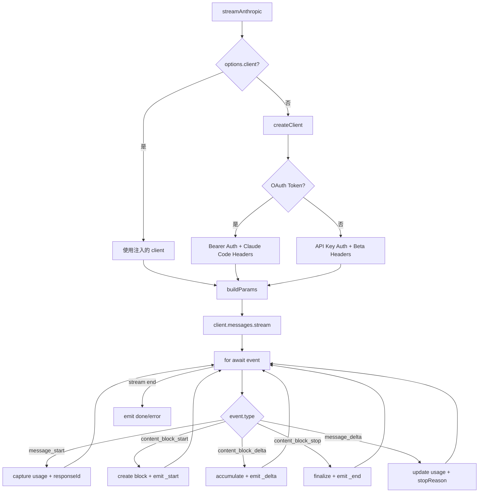

# Anthropic Messages Provider 实现详解

本文深入剖析 `packages/ai` 中 Anthropic Messages Provider 的实现细节，展示如何将 Anthropic Messages API 封装为 pi-ai 的统一流式接口。

对于源码请参考 [`packages/ai/src/providers/anthropic.ts`](/packages/ai/src/providers/anthropic.ts)

## 目录

1. [背景](#背景)
2. [核心架构](#核心架构)
3. [主要函数详解](#主要函数详解)
4. [消息转换机制](#消息转换机制)
5. [特殊场景处理](#特殊场景处理)
6. [使用示例](#使用示例)
7. [最佳实践](#最佳实践)
8. [与 OpenAI Provider 的对比](#与-openai-provider-的对比)

---

## 背景

### Anthropic Messages API 概述

Anthropic Messages API 是 Claude 模型的原生 API，相较于 OpenAI 的 Chat Completions API，它具有以下独特设计：

- **Content Block 设计**：消息内容由多个 Content Block 组成，每个 Block 可以是 `text`、`image`、`tool_use`、`thinking` 或 `redacted_thinking` 类型
- **流式事件丰富**：提供细粒度的流式事件类型，包括 `message_start`、`content_block_start`、`content_block_delta`、`content_block_stop`、`message_delta` 等
- **Extended Thinking**：支持"思考"能力，模型可以在回复前展示推理过程，分为 adaptive（自适应）和 budget-based（预算控制）两种模式
- **双认证模式**：同时支持传统 API Key 和 OAuth Token 认证，后者用于 Claude Pro/Max 订阅用户
- **Prompt Caching**：支持系统提示和消息历史的缓存，可显著降低延迟和成本

### Messages API vs Completions API 对比

| 特性 | Anthropic Messages | OpenAI Completions |
|-----|-------------------|-------------------|
| 消息格式 | Content Block 数组 | 单一 content 字符串 |
| 系统提示 | 独立 `system` 参数 | `messages` 数组中的 `system` 消息 |
| 工具调用 | `tool_use` Block | `tool_calls` 数组 |
| 思考内容 | `thinking` Block + 签名 | `reasoning_content` 字符串 |
| 流式事件 | 多层嵌套事件 | 单一 delta 结构 |
| 缓存控制 | `cache_control` 字段 | 服务端自动 |
| 认证方式 | API Key / OAuth Token | API Key |

### 为什么需要特殊处理

Anthropic Messages API 的独特设计要求 Provider 实现必须处理：

1. **消息结构差异**：Anthropic 使用独立的 `system` 参数而非 `messages` 中的 `system` 角色
2. **Thinking 签名验证**：Extended Thinking 内容需要签名验证，确保多轮对话的完整性
3. **Tool Use ID 格式**：Anthropic 要求工具调用 ID 匹配 `^[a-zA-Z0-9_-]+$` 模式，最长 64 字符
4. **OAuth 身份伪装**：OAuth 认证需要添加 Claude Code 身份头，工具名称需映射为官方命名
5. **流式事件解析**：需要处理多种 delta 类型，包括 `text_delta`、`thinking_delta`、`input_json_delta`、`signature_delta`

---

## 核心架构

### 整体流程



### 关键组件

```
packages/ai/src/providers/
├── anthropic.ts               # Provider 主实现
├── transform-messages.ts      # 消息格式转换工具
├── simple-options.ts          # SimpleStreamOptions 构建
├── github-copilot-headers.ts  # GitHub Copilot 特殊处理
└── register-builtins.ts       # Provider 注册
```

---

## 主要函数详解

### 1. streamAnthropic

核心流式函数，返回 `AssistantMessageEventStream` 事件流。

```typescript
export const streamAnthropic: StreamFunction<"anthropic-messages", AnthropicOptions> = (
  model: Model<"anthropic-messages">,
  context: Context,
  options?: AnthropicOptions,
): AssistantMessageEventStream => {
  const stream = new AssistantMessageEventStream();

  (async () => {
    const output: AssistantMessage = {
      role: "assistant",
      content: [],
      api: model.api as Api,
      provider: model.provider,
      model: model.id,
      usage: { /* ... */ },
      stopReason: "stop",
      timestamp: Date.now(),
    };

    try {
      // 1. 创建客户端（支持注入或新建）
      let client: Anthropic;
      let isOAuth: boolean;

      if (options?.client) {
        client = options.client;
        isOAuth = false;
      } else {
        const apiKey = options?.apiKey ?? getEnvApiKey(model.provider) ?? "";
        const created = createClient(model, apiKey, interleavedThinking, options?.headers);
        client = created.client;
        isOAuth = created.isOAuthToken;
      }

      // 2. 构建请求参数
      let params = buildParams(model, context, isOAuth, options);
      const nextParams = await options?.onPayload?.(params, model);
      if (nextParams !== undefined) {
        params = nextParams as MessageCreateParamsStreaming;
      }

      // 3. 启动流式请求
      const anthropicStream = client.messages.stream({ ...params, stream: true }, { signal: options?.signal });
      stream.push({ type: "start", partial: output });

      // 4. 处理流式事件
      for await (const event of anthropicStream) {
        // 处理各种事件类型...
      }

      // 5. 完成或错误
      stream.push({ type: "done", reason: output.stopReason, message: output });
      stream.end();
    } catch (error) {
      // 错误处理...
      stream.push({ type: "error", reason: output.stopReason, error: output });
      stream.end();
    }
  })();

  return stream;
};
```

**关键设计**：

- **客户端注入**：支持通过 `options.client` 注入自定义客户端（如 `AnthropicVertex`）
- **双认证支持**：自动检测 OAuth Token（`sk-ant-oat` 前缀）并配置相应头
- **事件驱动**：将 Anthropic 的多层事件转换为统一的 pi-ai 事件协议

### 2. streamSimpleAnthropic

简化版流式函数，自动处理 Thinking 模式选择和参数映射。

```typescript
export const streamSimpleAnthropic: StreamFunction<"anthropic-messages", SimpleStreamOptions> = (
  model: Model<"anthropic-messages">,
  context: Context,
  options?: SimpleStreamOptions,
): AssistantMessageEventStream => {
  const apiKey = options?.apiKey || getEnvApiKey(model.provider);
  if (!apiKey) {
    throw new Error(`No API key for provider: ${model.provider}`);
  }

  const base = buildBaseOptions(model, options, apiKey);

  // 未启用 reasoning：禁用 thinking
  if (!options?.reasoning) {
    return streamAnthropic(model, context, { ...base, thinkingEnabled: false });
  }

  // Opus 4.6 / Sonnet 4.6：使用 adaptive thinking + effort 映射
  if (supportsAdaptiveThinking(model.id)) {
    const effort = mapThinkingLevelToEffort(options.reasoning, model.id);
    return streamAnthropic(model, context, {
      ...base,
      thinkingEnabled: true,
      effort,
    });
  }

  // 旧模型：使用 budget-based thinking + token 预算计算
  const adjusted = adjustMaxTokensForThinking(
    base.maxTokens || 0,
    model.maxTokens,
    options.reasoning,
    options.thinkingBudgets,
  );

  return streamAnthropic(model, context, {
    ...base,
    maxTokens: adjusted.maxTokens,
    thinkingEnabled: true,
    thinkingBudgetTokens: adjusted.thinkingBudget,
  });
};
```

**适用场景**：需要快速调用，自动处理新旧模型的 Thinking 模式差异。

### 3. createClient

创建 Anthropic SDK 客户端，处理三种认证模式。

```typescript
function createClient(
  model: Model<"anthropic-messages">,
  apiKey: string,
  interleavedThinking: boolean,
  optionsHeaders?: Record<string, string>,
  dynamicHeaders?: Record<string, string>,
): { client: Anthropic; isOAuthToken: boolean } {
  // Adaptive thinking 模型不需要 interleaved beta
  const needsInterleavedBeta = interleavedThinking && !supportsAdaptiveThinking(model.id);

  // 1. GitHub Copilot 特殊处理
  if (model.provider === "github-copilot") {
    const betaFeatures: string[] = [];
    if (needsInterleavedBeta) {
      betaFeatures.push("interleaved-thinking-2025-05-14");
    }

    return {
      client: new Anthropic({
        apiKey: null,
        authToken: apiKey,
        baseURL: model.baseUrl,
        dangerouslyAllowBrowser: true,
        defaultHeaders: mergeHeaders(
          {
            accept: "application/json",
            "anthropic-dangerous-direct-browser-access": "true",
            ...(betaFeatures.length > 0 ? { "anthropic-beta": betaFeatures.join(",") } : {}),
          },
          model.headers,
          dynamicHeaders,
          optionsHeaders,
        ),
      }),
      isOAuthToken: false,
    };
  }

  const betaFeatures = ["fine-grained-tool-streaming-2025-05-14"];
  if (needsInterleavedBeta) {
    betaFeatures.push("interleaved-thinking-2025-05-14");
  }

  // 2. OAuth Token 认证（Claude Pro/Max）
  if (isOAuthToken(apiKey)) {
    return {
      client: new Anthropic({
        apiKey: null,
        authToken: apiKey,
        baseURL: model.baseUrl,
        dangerouslyAllowBrowser: true,
        defaultHeaders: mergeHeaders(
          {
            accept: "application/json",
            "anthropic-dangerous-direct-browser-access": "true",
            "anthropic-beta": `claude-code-20250219,oauth-2025-04-20,${betaFeatures.join(",")}`,
            "user-agent": `claude-cli/${claudeCodeVersion}`,
            "x-app": "cli",
          },
          model.headers,
          optionsHeaders,
        ),
      }),
      isOAuthToken: true,
    };
  }

  // 3. 标准 API Key 认证
  return {
    client: new Anthropic({
      apiKey,
      baseURL: model.baseUrl,
      dangerouslyAllowBrowser: true,
      defaultHeaders: mergeHeaders(
        {
          accept: "application/json",
          "anthropic-dangerous-direct-browser-access": "true",
          "anthropic-beta": betaFeatures.join(","),
        },
        model.headers,
        optionsHeaders,
      ),
    }),
    isOAuthToken: false,
  };
}
```

**三种认证模式对比**：

| 特性 | API Key | OAuth Token | GitHub Copilot |
|------|---------|-------------|----------------|
| 认证头 | `apiKey` | `authToken` | `authToken` |
| Claude Code 身份 | ❌ | ✅ 必须 | ❌ |
| Beta 特性 | `fine-grained-tool-streaming` | `claude-code-20250219,oauth-2025-04-20,...` | `interleaved-thinking`（可选） |
| 工具名称映射 | ❌ | ✅ | ❌ |
| 动态头 | ❌ | ❌ | ✅ |

### 4. buildParams

构建 Anthropic API 请求参数。

```typescript
function buildParams(
  model: Model<"anthropic-messages">,
  context: Context,
  isOAuthToken: boolean,
  options?: AnthropicOptions,
): MessageCreateParamsStreaming {
  const { cacheControl } = getCacheControl(model.baseUrl, options?.cacheRetention);

  const params: MessageCreateParamsStreaming = {
    model: model.id,
    messages: convertMessages(context.messages, model, isOAuthToken, cacheControl),
    max_tokens: options?.maxTokens || (model.maxTokens / 3) | 0,
    stream: true,
  };

  // 系统提示配置
  if (isOAuthToken) {
    // OAuth 必须包含 Claude Code 身份
    params.system = [
      {
        type: "text",
        text: "You are Claude Code, Anthropic's official CLI for Claude.",
        ...(cacheControl ? { cache_control: cacheControl } : {}),
      },
    ];
    if (context.systemPrompt) {
      params.system.push({
        type: "text",
        text: sanitizeSurrogates(context.systemPrompt),
        ...(cacheControl ? { cache_control: cacheControl } : {}),
      });
    }
  } else if (context.systemPrompt) {
    params.system = [
      {
        type: "text",
        text: sanitizeSurrogates(context.systemPrompt),
        ...(cacheControl ? { cache_control: cacheControl } : {}),
      },
    ];
  }

  // Temperature 与 Thinking 不兼容
  if (options?.temperature !== undefined && !options?.thinkingEnabled) {
    params.temperature = options.temperature;
  }

  // 工具配置
  if (context.tools) {
    params.tools = convertTools(context.tools, isOAuthToken);
  }

  // Thinking 模式配置
  if (options?.thinkingEnabled && model.reasoning) {
    if (supportsAdaptiveThinking(model.id)) {
      // Adaptive thinking（Opus 4.6 / Sonnet 4.6）
      params.thinking = { type: "adaptive" };
      if (options.effort) {
        params.output_config = { effort: options.effort };
      }
    } else {
      // Budget-based thinking（旧模型）
      params.thinking = {
        type: "enabled",
        budget_tokens: options.thinkingBudgetTokens || 1024,
      };
    }
  }

  return params;
}
```

---

## 消息转换机制

### convertMessages 函数

将内部消息格式转换为 Anthropic Messages API 格式。

```typescript
function convertMessages(
  messages: Message[],
  model: Model<"anthropic-messages">,
  isOAuthToken: boolean,
  cacheControl?: { type: "ephemeral"; ttl?: "1h" },
): MessageParam[] {
  const params: MessageParam[] = [];

  // 先通过 transformMessages 进行跨 Provider 转换
  const transformedMessages = transformMessages(messages, model, normalizeToolCallId);

  for (let i = 0; i < transformedMessages.length; i++) {
    const msg = transformedMessages[i];

    if (msg.role === "user") {
      // 处理用户消息（文本/图片）
      params.push(convertUserMessage(msg, model));
    } else if (msg.role === "assistant") {
      // 处理助手消息（文本、思考、工具调用）
      params.push(convertAssistantMessage(msg, isOAuthToken));
    } else if (msg.role === "toolResult") {
      // 处理工具结果（合并连续的 toolResult）
      const { toolResults, nextIndex } = collectToolResults(transformedMessages, i);
      params.push({
        role: "user",
        content: toolResults,
      });
      i = nextIndex;
    }
  }

  // 为最后一条 user 消息添加缓存控制
  if (cacheControl && params.length > 0) {
    addCacheControlToLastMessage(params, cacheControl);
  }

  return params;
}
```

### 特殊场景处理

#### 1. Tool Call ID 规范化

Anthropic 要求工具调用 ID 符合 `^[a-zA-Z0-9_-]+$` 模式，最长 64 字符：

```typescript
function normalizeToolCallId(id: string): string {
  return id.replace(/[^a-zA-Z0-9_-]/g, "_").slice(0, 64);
}
```

#### 2. OAuth 模式下的工具名称映射

OAuth 认证需要伪装成 Claude Code，工具名称必须使用官方命名：

```typescript
// Claude Code 2.x 官方工具名称
const claudeCodeTools = [
  "Read", "Write", "Edit", "Bash", "Grep", "Glob",
  "AskUserQuestion", "EnterPlanMode", "ExitPlanMode",
  "KillShell", "NotebookEdit", "Skill", "Task",
  "TaskOutput", "TodoWrite", "WebFetch", "WebSearch",
];

const ccToolLookup = new Map(claudeCodeTools.map((t) => [t.toLowerCase(), t]));

// 发送请求时：自定义名称 → 官方名称
const toClaudeCodeName = (name: string) => ccToolLookup.get(name.toLowerCase()) ?? name;

// 接收响应时：官方名称 → 原始名称
const fromClaudeCodeName = (name: string, tools?: Tool[]) => {
  if (tools && tools.length > 0) {
    const matchedTool = tools.find((tool) => tool.name.toLowerCase() === name.toLowerCase());
    if (matchedTool) return matchedTool.name;
  }
  return name;
};
```

#### 3. convertContentBlocks 函数

转换工具结果中的内容块（文本/图片）为 Anthropic API 格式：

```typescript
function convertContentBlocks(content: (TextContent | ImageContent)[]):
  | string
  | Array<
      | { type: "text"; text: string }
      | {
          type: "image";
          source: {
            type: "base64";
            media_type: "image/jpeg" | "image/png" | "image/gif" | "image/webp";
            data: string;
          };
        }
    > {
  // 纯文本：返回拼接字符串
  const hasImages = content.some((c) => c.type === "image");
  if (!hasImages) {
    return sanitizeSurrogates(content.map((c) => (c as TextContent).text).join("\n"));
  }

  // 包含图片：转换为 content block 数组
  const blocks = content.map((block) => {
    if (block.type === "text") {
      return {
        type: "text" as const,
        text: sanitizeSurrogates(block.text),
      };
    }
    return {
      type: "image" as const,
      source: {
        type: "base64" as const,
        media_type: block.mimeType as "image/jpeg" | "image/png" | "image/gif" | "image/webp",
        data: block.data,
      },
    };
  });

  // 纯图片无文本：添加占位文本
  const hasText = blocks.some((b) => b.type === "text");
  if (!hasText) {
    blocks.unshift({
      type: "text" as const,
      text: "(see attached image)",
    });
  }

  return blocks;
}
```

**关键设计**：

- **纯文本优化**：只有文本时返回字符串而非数组，减少请求体大小
- **图片处理**：支持 JPEG、PNG、GIF、WebP 格式，使用 base64 编码
- **占位文本**：纯图片场景添加提示文本，符合 API 要求

#### 4. Redacted Thinking 处理

当模型处理敏感内容时，思考内容可能被屏蔽：

```typescript
if (event.content_block.type === "redacted_thinking") {
  const block: Block = {
    type: "thinking",
    thinking: "[Reasoning redacted]",
    thinkingSignature: event.content_block.data,  // 保留签名
    redacted: true,
    index: event.index,
  };
  output.content.push(block);
  stream.push({ type: "thinking_start", contentIndex: output.content.length - 1, partial: output });
}
```

#### 4. 工具结果合并

某些端点（如 z.ai）要求连续的 tool_result 合并为单个消息：

```typescript
else if (msg.role === "toolResult") {
  const toolResults: ContentBlockParam[] = [];

  // 收集当前及后续连续的 toolResult
  let j = i;
  for (; j < transformedMessages.length && transformedMessages[j].role === "toolResult"; j++) {
    const toolMsg = transformedMessages[j] as ToolResultMessage;
    toolResults.push({
      type: "tool_result",
      tool_use_id: toolMsg.toolCallId,
      content: convertContentBlocks(toolMsg.content),
      is_error: toolMsg.isError,
    });
  }

  i = j - 1;  // 跳过已处理的消息

  params.push({
    role: "user",
    content: toolResults,
  });
}
```

#### 5. 缓存控制配置

```typescript
function resolveCacheRetention(cacheRetention?: CacheRetention): CacheRetention {
  if (cacheRetention) return cacheRetention;
  // 支持环境变量 PI_CACHE_RETENTION 向后兼容
  if (process.env.PI_CACHE_RETENTION === "long") return "long";
  return "short";
}

function getCacheControl(
  baseUrl: string,
  cacheRetention?: CacheRetention,
): { retention: CacheRetention; cacheControl?: { type: "ephemeral"; ttl?: "1h" } } {
  const retention = resolveCacheRetention(cacheRetention);
  if (retention === "none") return { retention };

  // 仅 api.anthropic.com 支持 long 保留（1小时）
  const ttl = retention === "long" && baseUrl.includes("api.anthropic.com") ? "1h" : undefined;

  return {
    retention,
    cacheControl: { type: "ephemeral", ...(ttl && { ttl }) },
  };
}
```

---

## 特殊场景处理

### Thinking 模式详解

#### Adaptive Thinking（自适应思考）

适用于 Opus 4.6 和 Sonnet 4.6：

```typescript
// 模型自动决定何时思考、思考多少
params.thinking = { type: "adaptive" };

// 可选的 effort 级别
params.output_config = { effort: "high" };  // "low" | "medium" | "high" | "max"
```

| Effort | 行为 | 适用场景 |
|--------|------|---------|
| `low` | 最少思考，简单任务跳过 | 快速响应场景 |
| `medium` | 适度思考 | 平衡速度与质量 |
| `high` | 深度思考（默认） | 复杂推理任务 |
| `max` | 无限制思考（仅 Opus 4.6） | 最复杂任务 |

#### Budget-based Thinking（预算控制思考）

适用于旧模型（Claude 3.5 Sonnet 等）：

```typescript
// 显式指定思考 token 预算
params.thinking = {
  type: "enabled",
  budget_tokens: 8192,
};
```

**预算计算逻辑**（`adjustMaxTokensForThinking`）：

```typescript
function adjustMaxTokensForThinking(
  baseMaxTokens: number,
  modelMaxTokens: number,
  reasoningLevel: ThinkingLevel,
): { maxTokens: number; thinkingBudget: number } {
  const budgets = {
    minimal: 1024,
    low: 2048,
    medium: 8192,
    high: 16384,
  };

  const thinkingBudget = budgets[reasoningLevel];
  const maxTokens = Math.min(baseMaxTokens + thinkingBudget, modelMaxTokens);

  return { maxTokens, thinkingBudget };
}
```

### Thinking Level 到 Effort 的映射

`streamSimpleAnthropic` 自动处理映射：

| ThinkingLevel | Opus 4.6 | 其他模型 |
| ------------- | -------- | -------- |
| minimal       | low      | low      |
| low           | low      | low      |
| medium        | medium   | medium   |
| high          | high     | high     |
| xhigh         | max      | high     |

### 事件映射详解

| Anthropic 事件 | pi-ai 事件 | 说明 |
|---------------|-----------|------|
| `message_start` | `start` | 初始化 AssistantMessage，捕获 responseId 和初始用量 |
| `content_block_start` (text) | `text_start` | 创建文本 Block |
| `content_block_start` (thinking) | `thinking_start` | 创建思考 Block |
| `content_block_start` (redacted_thinking) | `thinking_start` | 创建被屏蔽的思考 Block |
| `content_block_start` (tool_use) | `toolcall_start` | 创建工具调用 Block |
| `content_block_delta` (text_delta) | `text_delta` | 文本增量 |
| `content_block_delta` (thinking_delta) | `thinking_delta` | 思考内容增量 |
| `content_block_delta` (input_json_delta) | `toolcall_delta` | 工具参数增量 |
| `content_block_delta` (signature_delta) | 内部处理 | 思考签名增量 |
| `content_block_stop` | `text_end` / `thinking_end` / `toolcall_end` | Block 完成 |
| `message_delta` | 用量更新 | 更新 token 用量和 stopReason |
| - | `done` / `error` | 流结束 |

### Content Delta 详细处理

Anthropic 的流式响应包含多种 delta 类型，需要分别处理：

```typescript
for await (const event of anthropicStream) {
  if (event.type === "content_block_delta") {
    const index = blocks.findIndex((b) => b.index === event.index);
    const block = blocks[index];

    switch (event.delta.type) {
      case "text_delta":
        // 文本增量
        if (block?.type === "text") {
          block.text += event.delta.text;
          stream.push({
            type: "text_delta",
            contentIndex: index,
            delta: event.delta.text,
            partial: output,
          });
        }
        break;

      case "thinking_delta":
        // 思考内容增量
        if (block?.type === "thinking") {
          block.thinking += event.delta.thinking;
          stream.push({
            type: "thinking_delta",
            contentIndex: index,
            delta: event.delta.thinking,
            partial: output,
          });
        }
        break;

      case "input_json_delta":
        // 工具参数 JSON 增量（流式解析）
        if (block?.type === "toolCall") {
          block.partialJson += event.delta.partial_json;
          // 实时解析不完整的 JSON
          block.arguments = parseStreamingJson(block.partialJson);
          stream.push({
            type: "toolcall_delta",
            contentIndex: index,
            delta: event.delta.partial_json,
            partial: output,
          });
        }
        break;

      case "signature_delta":
        // 思考签名增量（用于验证）
        if (block?.type === "thinking") {
          block.thinkingSignature = (block.thinkingSignature || "") + event.delta.signature;
        }
        break;
    }
  }
}
```

**关键设计**：

- **索引匹配**：通过 `event.index` 找到对应的内容块
- **流式 JSON 解析**：`parseStreamingJson` 实时解析不完整的 JSON，支持工具参数的流式展示
- **签名累积**：`signature_delta` 累积到 `thinkingSignature`，用于多轮对话完整性验证

### Stop Reason 映射

```typescript
function mapStopReason(reason: Anthropic.Messages.StopReason | string): StopReason {
  switch (reason) {
    case "end_turn": return "stop";
    case "max_tokens": return "length";
    case "tool_use": return "toolUse";
    case "refusal": return "error";
    case "pause_turn": return "stop";  // 可重新提交
    case "stop_sequence": return "stop";  // 未使用
    case "sensitive": return "error";  // 安全过滤器触发
    default:
      throw new Error(`Unhandled stop reason: ${reason}`);
  }
}
```

---

## 使用示例

### 基础流式调用

```typescript
import { streamAnthropic } from "@pi-mono/ai/providers/anthropic";

const stream = streamAnthropic(
  {
    id: "claude-sonnet-4-6-20251001",
    api: "anthropic-messages",
    provider: "anthropic",
    input: ["text", "image"],
    output: ["text", "thinking"],
    reasoning: true,
  },
  {
    messages: [{ role: "user", content: "Hello, how are you?" }],
  },
  {
    apiKey: process.env.ANTHROPIC_API_KEY,
    thinkingEnabled: true,
    effort: "high",
  }
);

// 消费事件流
for await (const event of stream) {
  switch (event.type) {
    case "text_delta":
      process.stdout.write(event.delta);
      break;
    case "thinking_delta":
      process.stdout.write(`[Thinking: ${event.delta}]`);
      break;
    case "done":
      console.log("\n\nComplete!");
      console.log("Usage:", event.message.usage);
      break;
    case "error":
      console.error("Error:", event.error.errorMessage);
      break;
  }
}
```

### 使用 Simple API

```typescript
import { streamSimpleAnthropic } from "@pi-mono/ai/providers/anthropic";

// 自动处理新旧模型的 Thinking 模式
const stream = streamSimpleAnthropic(
  model,
  { messages: [{ role: "user", content: "Solve this complex problem..." }] },
  {
    apiKey: process.env.ANTHROPIC_API_KEY,
    reasoning: "high",  // 自动映射到合适的配置
    maxTokens: 4096,
  }
);
```

### OAuth 认证（Claude Pro/Max）

```typescript
const stream = streamAnthropic(
  model,
  context,
  {
    apiKey: process.env.ANTHROPIC_OAUTH_TOKEN,  // sk-ant-oat-...
    // OAuth 会自动添加 Claude Code 身份头
    // 工具名称会自动映射为官方命名
  }
);
```

### 带工具调用的示例

```typescript
const stream = streamAnthropic(
  model,
  {
    messages: [{ role: "user", content: "What's the weather in Beijing?" }],
    tools: [
      {
        name: "get_weather",
        description: "Get weather for a location",
        parameters: {
          type: "object",
          properties: {
            location: { type: "string" },
          },
          required: ["location"],
        },
      },
    ],
  },
  { toolChoice: "auto" }
);

for await (const event of stream) {
  if (event.type === "toolcall_end") {
    console.log("Tool:", event.toolCall.name);
    console.log("Args:", JSON.stringify(event.toolCall.arguments));
  }
}
```

### 获取完整结果

```typescript
const stream = streamAnthropic(model, context, options);

// 方式 1：使用 result() Promise
const message = await stream.result();
console.log(message.content);
console.log(message.usage);

// 方式 2：手动累积
let fullText = "";
let fullThinking = "";
for await (const event of stream) {
  if (event.type === "text_delta") {
    fullText += event.delta;
  } else if (event.type === "thinking_delta") {
    fullThinking += event.delta;
  }
}
```

---

## 最佳实践

### 1. Thinking 模式选择

```typescript
// 简单任务：禁用 Thinking
await streamAnthropic(model, context, { thinkingEnabled: false });

// 复杂推理：使用 adaptive thinking（新模型）
await streamAnthropic(model, context, {
  thinkingEnabled: true,
  effort: "high",  // 或 "max"（仅 Opus 4.6）
});

// 旧模型：使用 budget-based thinking
await streamAnthropic(olderModel, context, {
  thinkingEnabled: true,
  thinkingBudgetTokens: 8192,
});
```

### 2. 流式消费模式

```typescript
const stream = streamAnthropic(model, context, { thinkingEnabled: true });

for await (const event of stream) {
  switch (event.type) {
    case "thinking_start":
      console.log("\n[Thinking...]");
      break;
    case "thinking_delta":
      process.stdout.write(event.delta);  // 实时显示思考过程
      break;
    case "thinking_end":
      console.log("\n[End thinking]");
      break;
    case "text_delta":
      process.stdout.write(event.delta);
      break;
    case "toolcall_end":
      console.log(`\nTool: ${event.toolCall.name}`);
      console.log(`Args: ${JSON.stringify(event.toolCall.arguments)}`);
      break;
  }
}
```

### 3. 缓存优化策略

```typescript
// 短期缓存（5 分钟）：适合实时对话
await streamAnthropic(model, context, { cacheRetention: "short" });

// 长期缓存（1 小时）：适合长时间会话
await streamAnthropic(model, context, { cacheRetention: "long" });

// 禁用缓存：敏感数据场景
await streamAnthropic(model, context, { cacheRetention: "none" });

// 环境变量配置（向后兼容）
process.env.PI_CACHE_RETENTION = "long";
```

### 4. 信号取消

```typescript
const controller = new AbortController();

const stream = streamAnthropic(
  model,
  context,
  { signal: controller.signal }
);

// 5 秒后取消
setTimeout(() => controller.abort(), 5000);
```

### 5. 自定义 Headers

```typescript
streamAnthropic(
  model,
  context,
  {
    headers: {
      "X-Request-ID": "unique-request-id",
      "X-Custom-Header": "value",
    },
  }
);
```

---

## 与 OpenAI Provider 的对比

| 特性 | Anthropic Messages Provider | OpenAI Completions Provider |
|-----|---------------------------|----------------------------|
| **认证方式** | API Key / OAuth Token / GitHub Copilot | API Key |
| **系统提示** | 独立 `system` 参数 | `messages` 中的 `system` 消息 |
| **Thinking/Reasoning** | Extended Thinking with signatures | `reasoning_effort` 参数 |
| **流式事件** | 多层嵌套（message/block/delta） | 扁平 delta 结构 |
| **工具调用流式** | `input_json_delta` 增量 | `tool_calls.function.arguments` 增量 |
| **缓存控制** | `cache_control` 字段 | 服务端自动 |
| **特殊处理** | OAuth 身份伪装、Tool ID 规范化 | Developer 角色映射 |
| **SDK** | `@anthropic-ai/sdk` | `openai` |

---

## 总结

Anthropic Messages Provider 的核心价值在于：

1. **协议适配**：将 Anthropic 独特的 Content Block 设计转换为统一的 pi-ai 事件协议
2. **双认证支持**：同时支持 API Key 和 OAuth Token，后者需要身份伪装
3. **Thinking 完整支持**：处理 adaptive 和 budget-based 两种模式，维护签名验证
4. **缓存优化**：配置 Prompt Caching 以降低延迟和成本
5. **跨 Provider 兼容**：通过 `transformMessages` 处理 Tool Call ID 规范化

理解这个 Provider 的实现，有助于：

- 调试 Anthropic/Claude 相关的问题
- 实现 OAuth 认证的 Claude Pro/Max 集成
- 利用 Extended Thinking 构建复杂推理应用
- 优化 Prompt Caching 策略以降低成本
- 为其他类似 API（如 Kimi For Coding）提供参考实现
