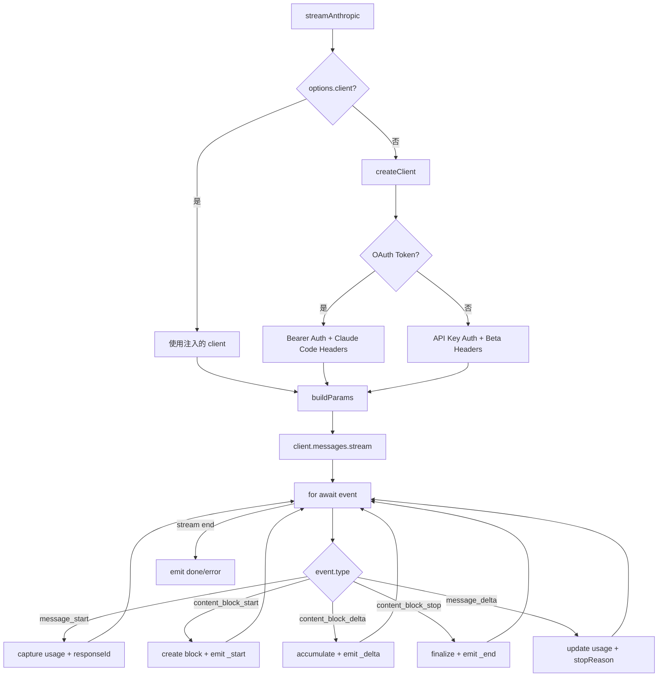

# Anthropic Messages Provider 实现详解

本文深入剖析 `packages/ai` 中 Anthropic Messages Provider 的实现细节，展示如何将 Anthropic Messages API 封装为 pi-ai 的统一流式接口。

## 背景

### Anthropic Messages API 概述

Anthropic Messages API 是 Claude 模型的原生 API，相较于 OpenAI 的 Chat Completions API，它具有以下独特设计：

- **Content Block 设计**：消息内容由多个 Content Block 组成，每个 Block 可以是 `text`、`image`、`tool_use`、`thinking` 或 `redacted_thinking` 类型
- **流式事件丰富**：提供细粒度的流式事件类型，包括 `message_start`、`content_block_start`、`content_block_delta`、`content_block_stop`、`message_delta` 等
- **Extended Thinking**：支持"思考"能力，模型可以在回复前展示推理过程，分为 adaptive（自适应）和 budget-based（预算控制）两种模式
- **双认证模式**：同时支持传统 API Key 和 OAuth Token 认证，后者用于 Claude Pro/Max 订阅用户
- **Prompt Caching**：支持系统提示和消息历史的缓存，可显著降低延迟和成本

### Messages API vs Completions API 对比

| 特性 | Anthropic Messages | OpenAI Completions |
|-----|-------------------|-------------------|
| 消息格式 | Content Block 数组 | 单一 content 字符串 |
| 系统提示 | 独立 `system` 参数 | `messages` 数组中的 `system` 消息 |
| 工具调用 | `tool_use` Block | `tool_calls` 数组 |
| 思考内容 | `thinking` Block + 签名 | `reasoning_content` 字符串 |
| 流式事件 | 多层嵌套事件 | 单一 delta 结构 |
| 缓存控制 | `cache_control` 字段 | 服务端自动 |
| 认证方式 | API Key / OAuth Token | API Key |

### 为什么需要特殊处理

Anthropic Messages API 的独特设计要求 Provider 实现必须处理：

1. **消息结构差异**：Anthropic 使用独立的 `system` 参数而非 `messages` 中的 `system` 角色
2. **Thinking 签名验证**：Extended Thinking 内容需要签名验证，确保多轮对话的完整性
3. **Tool Use ID 格式**：Anthropic 要求工具调用 ID 匹配 `^[a-zA-Z0-9_-]+$` 模式，最长 64 字符
4. **OAuth 身份伪装**：OAuth 认证需要添加 Claude Code 身份头，工具名称需映射为官方命名
5. **流式事件解析**：需要处理多种 delta 类型，包括 `text_delta`、`thinking_delta`、`input_json_delta`、`signature_delta`

## 做了什么

### 核心职责

Anthropic Messages Provider 负责：

1. **客户端创建**：初始化 Anthropic SDK 客户端，配置认证方式（API Key 或 OAuth Token）和 Beta 特性
2. **请求参数构建**：将 pi-ai 的 `StreamOptions` 转换为 Anthropic API 请求格式，处理 Thinking 模式配置
3. **消息格式转换**：处理 pi-ai 消息与 Anthropic 消息格式的双向转换，包括 Tool Call ID 规范化
4. **流式事件解析**：解析 Anthropic 丰富的流式事件，转换为统一的 pi-ai 事件协议
5. **Thinking 模式管理**：支持 adaptive 和 budget-based 两种 Thinking 模式，处理签名验证
6. **缓存优化**：配置 Prompt Caching 的 cache_control，支持 short 和 long 两种保留策略

### 关键实现文件

```
packages/ai/src/providers/anthropic.ts          # Provider 核心实现
packages/ai/src/providers/transform-messages.ts # 消息格式转换（跨 Provider）
packages/ai/src/providers/register-builtins.ts  # Provider 注册与懒加载
packages/ai/src/providers/simple-options.ts     # 统一选项映射
packages/ai/src/env-api-keys.ts                 # 环境变量与认证
```

## 流程

### 整体架构流程



### 1. 客户端创建 (createClient)

客户端创建支持两种认证模式：

```typescript
function createClient(
  model: Model<"anthropic-messages">,
  apiKey: string,
  interleavedThinking: boolean,
  optionsHeaders?: Record<string, string>,
  dynamicHeaders?: Record<string, string>,
): { client: Anthropic; isOAuthToken: boolean } {
  // 判断是否为 OAuth Token
  const isOAuth = isOAuthToken(apiKey);  // 检查是否包含 "sk-ant-oat"

  // OAuth: Bearer 认证 + Claude Code 身份头
  if (isOAuth) {
    return new Anthropic({
      apiKey: null,
      authToken: apiKey,  // 使用 Bearer Token
      baseURL: model.baseUrl,
      dangerouslyAllowBrowser: true,
      defaultHeaders: {
        "anthropic-beta": "claude-code-20250219,oauth-2025-04-20,...",
        "user-agent": `claude-cli/${claudeCodeVersion}`,
        "x-app": "cli",
      },
    });
  }

  // API Key: 标准 X-Api-Key 认证
  return new Anthropic({
    apiKey,
    baseURL: model.baseUrl,
    dangerouslyAllowBrowser: true,
    defaultHeaders: {
      "anthropic-beta": "fine-grained-tool-streaming-2025-05-14,...",
    },
  });
}
```

**关键设计**：

- **OAuth Token 检测**：通过 `sk-ant-oat` 前缀识别 OAuth Token
- **Beta 特性配置**：不同认证方式启用不同的 Beta 特性
- **GitHub Copilot 特殊处理**：Copilot 使用 Bearer Auth 但不添加 Claude Code 身份头
- **Interleaved Thinking Beta**：仅对非 adaptive thinking 模型启用

### 2. 请求参数构建 (buildParams)

```typescript
function buildParams(
  model: Model<"anthropic-messages">,
  context: Context,
  isOAuthToken: boolean,
  options?: AnthropicOptions,
): MessageCreateParamsStreaming {
  const params: MessageCreateParamsStreaming = {
    model: model.id,
    messages: convertMessages(context.messages, model, isOAuthToken, cacheControl),
    max_tokens: options?.maxTokens || (model.maxTokens / 3) | 0,
    stream: true,
  };

  // 独立的 system 参数（非 messages 数组）
  if (isOAuthToken) {
    // OAuth 必须包含 Claude Code 身份
    params.system = [
      { type: "text", text: "You are Claude Code, Anthropic's official CLI for Claude." },
      { type: "text", text: context.systemPrompt },
    ];
  } else if (context.systemPrompt) {
    params.system = [{ type: "text", text: context.systemPrompt }];
  }

  // Thinking 模式配置
  if (options?.thinkingEnabled && model.reasoning) {
    if (supportsAdaptiveThinking(model.id)) {
      // Opus 4.6 和 Sonnet 4.6: 自适应思考
      params.thinking = { type: "adaptive" };
      if (options.effort) {
        params.output_config = { effort: options.effort };
      }
    } else {
      // 旧模型: 预算控制思考
      params.thinking = {
        type: "enabled",
        budget_tokens: options.thinkingBudgetTokens || 1024,
      };
    }
  }

  // Temperature 与 Thinking 不兼容
  if (options?.temperature !== undefined && !options?.thinkingEnabled) {
    params.temperature = options.temperature;
  }

  return params;
}
```

**关键设计**：

- **独立 system 参数**：Anthropic 将系统提示与消息分离
- **Thinking 双模式**：adaptive 用于新模型，budget-based 用于旧模型
- **Temperature 限制**：启用 Thinking 时不能设置 Temperature
- **缓存控制**：为 system 和最后一条 user 消息添加 cache_control

### 3. Thinking 模式详解

Anthropic 的 Extended Thinking 分为两种模式：

#### Adaptive Thinking（自适应思考）

适用于 Opus 4.6 和 Sonnet 4.6：

```typescript
// 模型自动决定何时思考、思考多少
params.thinking = { type: "adaptive" };

// 可选的 effort 级别
params.output_config = { effort: "high" };  // "low" | "medium" | "high" | "max"
```

| Effort | 行为 | 适用场景 |
|--------|------|---------|
| `low` | 最少思考，简单任务跳过 | 快速响应场景 |
| `medium` | 适度思考 | 平衡速度与质量 |
| `high` | 深度思考（默认） | 复杂推理任务 |
| `max` | 无限制思考（仅 Opus 4.6） | 最复杂任务 |

#### Budget-based Thinking（预算控制思考）

适用于旧模型（Claude 3.5 Sonnet 等）：

```typescript
// 显式指定思考 token 预算
params.thinking = {
  type: "enabled",
  budget_tokens: 8192,  // 分配给思考的 token 数
};
```

**预算计算逻辑**：

```typescript
function adjustMaxTokensForThinking(
  baseMaxTokens: number,
  modelMaxTokens: number,
  reasoningLevel: ThinkingLevel,
): { maxTokens: number; thinkingBudget: number } {
  const budgets = {
    minimal: 1024,
    low: 2048,
    medium: 8192,
    high: 16384,
  };

  const thinkingBudget = budgets[reasoningLevel];
  const maxTokens = Math.min(baseMaxTokens + thinkingBudget, modelMaxTokens);

  return { maxTokens, thinkingBudget };
}
```

### 4. 流式请求与响应解析

```typescript
const anthropicStream = client.messages.stream(params, { signal: options?.signal });

for await (const event of anthropicStream) {
  if (event.type === "message_start") {
    // 捕获初始用量和响应 ID
    output.responseId = event.message.id;
    output.usage.input = event.message.usage.input_tokens;
    output.usage.cacheRead = event.message.usage.cache_read_input_tokens;
  }

  else if (event.type === "content_block_start") {
    if (event.content_block.type === "text") {
      const block = { type: "text", text: "", index: event.index };
      output.content.push(block);
      stream.push({ type: "text_start", contentIndex: output.content.length - 1 });
    }
    else if (event.content_block.type === "thinking") {
      const block = { type: "thinking", thinking: "", thinkingSignature: "", index: event.index };
      output.content.push(block);
      stream.push({ type: "thinking_start", contentIndex: output.content.length - 1 });
    }
    else if (event.content_block.type === "tool_use") {
      const block = {
        type: "toolCall",
        id: event.content_block.id,
        name: event.content_block.name,
        arguments: {},
        index: event.index,
      };
      output.content.push(block);
      stream.push({ type: "toolcall_start", contentIndex: output.content.length - 1 });
    }
  }

  else if (event.type === "content_block_delta") {
    // 处理各种 delta 类型...
  }

  else if (event.type === "content_block_stop") {
    // 完成当前 block...
  }

  else if (event.type === "message_delta") {
    // 更新用量和 stop reason...
  }
}
```

### 5. Content Delta 处理

Anthropic 的 `content_block_delta` 事件包含多种 delta 类型：

```typescript
if (event.type === "content_block_delta") {
  if (event.delta.type === "text_delta") {
    // 文本增量
    block.text += event.delta.text;
    stream.push({ type: "text_delta", delta: event.delta.text });
  }
  else if (event.delta.type === "thinking_delta") {
    // 思考内容增量
    block.thinking += event.delta.thinking;
    stream.push({ type: "thinking_delta", delta: event.delta.thinking });
  }
  else if (event.delta.type === "input_json_delta") {
    // 工具参数 JSON 增量
    block.partialJson += event.delta.partial_json;
    block.arguments = parseStreamingJson(block.partialJson);  // 流式 JSON 解析
    stream.push({ type: "toolcall_delta", delta: event.delta.partial_json });
  }
  else if (event.delta.type === "signature_delta") {
    // Thinking 签名增量（用于验证思考内容完整性）
    block.thinkingSignature += event.delta.signature;
  }
}
```

### 6. 事件映射详解

| Anthropic 事件 | pi-ai 事件 | 说明 |
|---------------|-----------|------|
| `message_start` | `start` | 初始化 AssistantMessage，捕获 responseId 和初始用量 |
| `content_block_start` (text) | `text_start` | 创建文本 Block |
| `content_block_start` (thinking) | `thinking_start` | 创建思考 Block |
| `content_block_start` (tool_use) | `toolcall_start` | 创建工具调用 Block |
| `content_block_delta` (text_delta) | `text_delta` | 文本增量 |
| `content_block_delta` (thinking_delta) | `thinking_delta` | 思考内容增量 |
| `content_block_delta` (input_json_delta) | `toolcall_delta` | 工具参数增量 |
| `content_block_delta` (signature_delta) | 内部处理 | 思考签名增量 |
| `content_block_stop` | `text_end` / `thinking_end` / `toolcall_end` | Block 完成 |
| `message_delta` | 用量更新 | 更新 token 用量和 stopReason |
| - | `done` / `error` | 流结束 |

### 7. 特殊场景处理

#### 7.1 工具调用解析与 ID 规范化

```typescript
// 规范化 Tool Call ID 以符合 Anthropic 要求
function normalizeToolCallId(id: string): string {
  return id.replace(/[^a-zA-Z0-9_-]/g, "_").slice(0, 64);
}

// OAuth 模式下工具名称映射
const claudeCodeTools = [
  "Read", "Write", "Edit", "Bash", "Grep", "Glob",
  "AskUserQuestion", "EnterPlanMode", "ExitPlanMode", ...
];

const toClaudeCodeName = (name: string) =>
  ccToolLookup.get(name.toLowerCase()) ?? name;
```

#### 7.2 Prompt Caching

```typescript
function getCacheControl(
  baseUrl: string,
  cacheRetention?: CacheRetention,
): { cacheControl?: { type: "ephemeral"; ttl?: "1h" } } {
  const retention = cacheRetention ?? "short";

  if (retention === "none") return {};

  // 仅对 api.anthropic.com 支持 long 保留
  const ttl = retention === "long" && baseUrl.includes("api.anthropic.com")
    ? "1h"
    : undefined;

  return { cacheControl: { type: "ephemeral", ...(ttl && { ttl }) } };
}

// 应用缓存控制
if (cacheControl && params.system) {
  params.system[params.system.length - 1].cache_control = cacheControl;
}
```

#### 7.3 错误处理

```typescript
try {
  const stream = client.messages.stream(params);
  // ...
} catch (error) {
  output.stopReason = options?.signal?.aborted ? "aborted" : "error";
  output.errorMessage = error instanceof Error ? error.message : JSON.stringify(error);
  stream.push({ type: "error", reason: output.stopReason, error: output });
}

// Stop Reason 映射
function mapStopReason(reason: string): StopReason {
  switch (reason) {
    case "end_turn": return "stop";
    case "max_tokens": return "length";
    case "tool_use": return "toolUse";
    case "refusal":
    case "sensitive": return "error";
    default: throw new Error(`Unhandled stop reason: ${reason}`);
  }
}
```

## 最佳实践

### 1. Thinking 模式选择

```typescript
// 简单任务：禁用 Thinking
await streamAnthropic(model, context, { thinkingEnabled: false });

// 复杂推理：使用 adaptive thinking（新模型）
await streamAnthropic(model, context, {
  thinkingEnabled: true,
  effort: "high",  // 或 "max"（仅 Opus 4.6）
});

// 旧模型：使用 budget-based thinking
await streamAnthropic(olderModel, context, {
  thinkingEnabled: true,
  thinkingBudgetTokens: 8192,
});
```

### 2. 流式消费模式

```typescript
const stream = streamAnthropic(model, context, { thinkingEnabled: true });

for await (const event of stream) {
  switch (event.type) {
    case "thinking_start":
      console.log("\n[Thinking...]");
      break;
    case "thinking_delta":
      process.stdout.write(event.delta);  // 实时显示思考过程
      break;
    case "thinking_end":
      console.log("\n[End thinking]");
      break;
    case "text_delta":
      process.stdout.write(event.delta);
      break;
    case "toolcall_end":
      console.log(`\nTool: ${event.toolCall.name}`);
      console.log(`Args: ${JSON.stringify(event.toolCall.arguments)}`);
      break;
  }
}
```

### 3. 缓存优化策略

```typescript
// 短期缓存（5 分钟）：适合实时对话
await streamAnthropic(model, context, { cacheRetention: "short" });

// 长期缓存（1 小时）：适合长时间会话
await streamAnthropic(model, context, { cacheRetention: "long" });

// 禁用缓存：敏感数据场景
await streamAnthropic(model, context, { cacheRetention: "none" });
```

## 与 OpenAI Provider 的对比

| 特性 | Anthropic Messages Provider | OpenAI Completions Provider |
|-----|---------------------------|----------------------------|
| **认证方式** | API Key / OAuth Token / GitHub Copilot | API Key |
| **系统提示** | 独立 `system` 参数 | `messages` 中的 `system` 消息 |
| **Thinking/Reasoning** | Extended Thinking with signatures | `reasoning_effort` 参数 |
| **流式事件** | 多层嵌套（message/block/delta） | 扁平 delta 结构 |
| **工具调用流式** | `input_json_delta` 增量 | `tool_calls.function.arguments` 增量 |
| **缓存控制** | `cache_control` 字段 | 服务端自动 |
| **特殊处理** | OAuth 身份伪装、Tool ID 规范化 | Developer 角色映射 |
| **SDK** | `@anthropic-ai/sdk` | `openai` |

## 总结

Anthropic Messages Provider 的核心价值在于：

1. **协议适配**：将 Anthropic 独特的 Content Block 设计转换为统一的 pi-ai 事件协议
2. **双认证支持**：同时支持 API Key 和 OAuth Token，后者需要身份伪装
3. **Thinking 完整支持**：处理 adaptive 和 budget-based 两种模式，维护签名验证
4. **缓存优化**：配置 Prompt Caching 以降低延迟和成本
5. **跨 Provider 兼容**：通过 `transformMessages` 处理 Tool Call ID 规范化

理解这个 Provider 的实现，有助于：

- 调试 Anthropic/Claude 相关的问题
- 实现 OAuth 认证的 Claude Pro/Max 集成
- 利用 Extended Thinking 构建复杂推理应用
- 优化 Prompt Caching 策略以降低成本
- 为其他类似 API（如 Kimi For Coding）提供参考实现