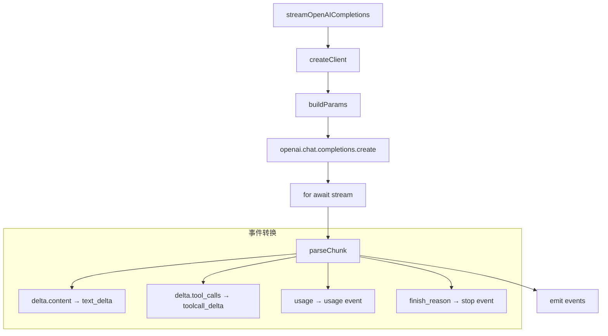

# OpenAI Completions Provider 实现详解

本文深入剖析 `packages/ai` 中 OpenAI Completions Provider 的实现细节，展示如何将 OpenAI Chat Completions API 封装为 pi-ai 的统一流式接口。

## 背景

### OpenAI Chat Completions API 概述

OpenAI Chat Completions API 是目前业界最广泛使用的 LLM API 之一，提供了：

- **流式响应 (Streaming)**：通过 SSE (Server-Sent Events) 实时返回生成内容
- **函数调用 (Function Calling)**：支持模型调用外部工具/函数
- **结构化输出 (Structured Outputs)**：支持 JSON Schema 约束输出格式
- **多模态输入**：支持文本、图像等多种输入类型
- **推理模型**：o1/o3 系列支持 reasoning_effort 参数控制推理深度

### 为什么需要 Provider 封装

尽管 OpenAI 提供了官方 SDK，但 pi-ai 需要：

1. **统一接口**：所有 Provider 对外暴露相同的 `StreamOptions` 和事件格式
2. **流式抽象**：将不同 Provider 的流式协议转换为统一的异步事件流
3. **类型安全**：TypeScript 类型定义与运行时行为保持一致
4. **错误处理**：统一的错误分类和重试策略

## 做了什么

### 核心职责

OpenAI Completions Provider 负责：

1. **客户端创建**：初始化 OpenAI SDK 客户端，配置认证和连接参数
2. **请求构建**：将 pi-ai 的 `StreamOptions` 转换为 OpenAI API 请求格式
3. **消息转换**：处理 OpenAI 与内部消息格式的双向转换
4. **流式解析**：解析 SSE 响应，提取 delta 内容并转换为统一事件
5. **特殊处理**：支持工具调用、思考内容、系统消息等特殊场景

### 关键实现文件

```
packages/ai/src/providers/openai-completions.ts    # Provider 实现
packages/ai/src/providers/openai-messages.ts       # 消息格式转换
packages/ai/src/providers/register-builtins.ts     # Provider 注册
```

## 流程

### 整体架构流程



### 1. 客户端创建 (createClient)

```typescript
function createClient(options: OpenAICompletionsStreamOptions) {
  return new OpenAI({
    apiKey: options.apiKey,
    baseURL: options.baseUrl,
    timeout: options.timeout ?? 60000,
    maxRetries: options.maxRetries ?? 2,
    defaultHeaders: options.headers,
  });
}
```

**关键设计**：

- 支持自定义 `baseUrl`：兼容 Azure OpenAI、第三方代理等场景
- 可配置超时和重试：适应不同网络环境和模型响应时间
- 自定义 Headers：支持请求追踪、速率限制等高级场景

### 2. 请求参数构建 (buildParams)

```typescript
function buildParams(options: OpenAICompletionsStreamOptions) {
  const params: OpenAI.ChatCompletionCreateParams = {
    model: options.model,
    messages: toOpenAIMessages(options.messages),  // 消息格式转换
    stream: true,
    stream_options: { include_usage: true },
  };

  // 可选参数
  if (options.temperature !== undefined) {
    params.temperature = options.temperature;
  }
  if (options.maxTokens !== undefined) {
    params.max_tokens = options.maxTokens;
  }
  if (options.tools?.length) {
    params.tools = toOpenAITools(options.tools);   // 工具定义转换
  }
  if (options.responseFormat) {
    params.response_format = options.responseFormat; // JSON 模式
  }

  // o1/o3 系列特殊参数
  if (options.reasoningEffort !== undefined) {
    params.reasoning_effort = options.reasoningEffort;
  }

  return params;
}
```

**关键设计**：

- **条件参数**：只发送非 undefined 的参数，避免覆盖服务器默认值
- **消息转换**：通过 `toOpenAIMessages` 处理角色映射（system/developer）
- **工具转换**：将内部工具定义转换为 OpenAI 的 function 格式
- **推理模型支持**：o1/o3 系列使用 `reasoning_effort` 而非 `temperature`

### 3. 流式请求与响应解析

```typescript
export async function* streamOpenAICompletions(
  options: OpenAICompletionsStreamOptions
): AssistantMessageEventStream {
  const client = createClient(options);
  const params = buildParams(options);

  // 发起流式请求
  const stream = await client.chat.completions.create(params);

  // 累积状态
  let contentBuffer = "";
  let toolCalls: OpenAI.ChatCompletionMessageToolCall[] = [];

  for await (const chunk of stream) {
    const delta = chunk.choices[0]?.delta;
    if (!delta) continue;

    // 处理文本内容
    if (delta.content) {
      contentBuffer += delta.content;
      yield {
        type: "text_delta",
        content: delta.content,
      };
    }

    // 处理工具调用
    if (delta.tool_calls) {
      for (const tc of delta.tool_calls) {
        yield {
          type: "toolcall_delta",
          toolCall: parseToolCallDelta(tc),
        };
      }
    }

    // 处理用量统计
    if (chunk.usage) {
      yield {
        type: "usage",
        usage: {
          inputTokens: chunk.usage.prompt_tokens,
          outputTokens: chunk.usage.completion_tokens,
          totalTokens: chunk.usage.total_tokens,
        },
      };
    }
  }

  // 流结束事件
  yield { type: "stop", reason: "complete" };
}
```

**关键设计**：

- **增量处理**：使用 `for await...of` 逐块处理，内存友好
- **状态累积**：维护 `contentBuffer` 和 `toolCalls` 用于完整内容组装
- **事件映射**：将 OpenAI 的 delta 格式映射为 pi-ai 的统一事件

### 4. 事件映射详解

| OpenAI 事件 | pi-ai 事件 | 说明 |
|------------|-----------|------|
| `delta.content` | `text_delta` | 文本片段 |
| `delta.tool_calls` | `toolcall_delta` | 工具调用片段 |
| `chunk.usage` | `usage` | Token 用量统计 |
| `finish_reason` | `stop` | 流结束原因 |

### 5. 特殊场景处理

#### 5.1 工具调用解析

```typescript
function parseToolCallDelta(
  delta: OpenAI.ChatCompletionChunk.Choice.Delta.ToolCall
): ToolCallDelta {
  return {
    index: delta.index,
    id: delta.id,
    type: delta.type ?? "function",
    function: {
      name: delta.function?.name,
      arguments: delta.function?.arguments,
    },
  };
}
```

工具调用采用**增量组装**模式：

- 每个 chunk 可能只包含部分信息（如只有 id，或只有 name）
- 通过 `index` 字段关联同一工具调用的多个 delta
- 在 consumer 端完成完整 tool call 的组装

#### 5.2 系统消息角色映射

OpenAI o1/o3 系列模型使用 `developer` 角色替代 `system`：

```typescript
function toOpenAIMessage(message: Message): OpenAI.ChatCompletionMessageParam {
  const role = message.role === "system" && isReasoningModel(model)
    ? "developer"
    : message.role;

  return { role, content: message.content };
}
```

#### 5.3 错误处理

```typescript
try {
  const stream = await client.chat.completions.create(params);
  // ...
} catch (error) {
  if (error instanceof OpenAI.APIError) {
    throw new AIError(
      `OpenAI API Error: ${error.message}`,
      { status: error.status, code: error.code }
    );
  }
  throw error;
}
```

## 最佳实践

### 1. 超时配置

对于推理模型（o1/o3），建议增加超时时间：

```typescript
streamOpenAICompletions({
  model: "o3-mini",
  messages,
  timeout: 300000,  // 5 分钟，推理模型可能需要更长时间
  reasoningEffort: "high",
});
```

### 2. 流式消费模式

```typescript
const stream = streamOpenAICompletions({ model: "gpt-4o", messages });

for await (const event of stream) {
  switch (event.type) {
    case "text_delta":
      process.stdout.write(event.content);
      break;
    case "toolcall_delta":
      accumulateToolCall(event.toolCall);
      break;
    case "usage":
      console.log(`Tokens: ${event.usage.totalTokens}`);
      break;
    case "stop":
      console.log("\nStream complete");
      break;
  }
}
```

### 3. 与消息转换层协作

OpenAI Provider 依赖 `openai-messages.ts` 处理消息格式：

```typescript
// 内部消息 → OpenAI 格式
const openaiMessages = toOpenAIMessages(messages);

// OpenAI 响应 → 内部格式
const assistantMessage = fromOpenAIMessage(completion.choices[0].message);
```

## 总结

OpenAI Completions Provider 的核心价值在于：

1. **协议封装**：将 OpenAI 的 SSE 流式协议转换为统一的异步生成器
2. **格式转换**：处理消息、工具、响应格式的双向转换
3. **特性适配**：支持推理模型、工具调用、结构化输出等高级特性
4. **错误抽象**：将 SDK 错误转换为统一的 AIError

理解这个 Provider 的实现，有助于：

- 调试 OpenAI 相关的问题
- 实现自定义的 OpenAI 代理或中间件
- 为其他类似 API（如兼容 OpenAI 格式的第三方服务）提供参考实现
