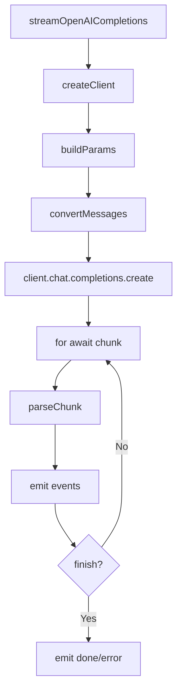

# OpenAI Completions Provider 实现详解

本文深入剖析 `packages/ai` 中 OpenAI Completions Provider 的实现细节，展示如何将 OpenAI Chat Completions API 封装为 pi-ai 的统一流式接口。

源码位置：[`packages/ai/src/providers/openai-completions.ts`](/packages/ai/src/providers/openai-completions.ts)

---

## 目录

1. [背景与职责](#背景与职责)
2. [核心架构](#核心架构)
3. [主要函数详解](#主要函数详解)
4. [消息转换机制](#消息转换机制)
5. [Provider 兼容性层](#provider-兼容性层)
6. [事件流协议](#事件流协议)
7. [使用示例](#使用示例)
8. [最佳实践](#最佳实践)

---

## 背景与职责

### 为什么需要 Provider 封装

尽管 OpenAI 提供了官方 SDK，但 pi-ai 需要：

1. **统一接口**：所有 Provider 对外暴露相同的 `StreamOptions` 和事件格式
2. **流式抽象**：将不同 Provider 的流式协议转换为统一的异步事件流
3. **多 Provider 兼容**：支持 OpenAI、GitHub Copilot、OpenRouter、Groq、xAI、DeepSeek 等
4. **类型安全**：TypeScript 类型定义与运行时行为保持一致

### 核心职责

OpenAI Completions Provider 负责：

1. **客户端创建**：初始化 OpenAI SDK 客户端，配置认证和连接参数
2. **请求构建**：将 pi-ai 的 `StreamOptions` 转换为 OpenAI API 请求格式
3. **消息转换**：处理 OpenAI 与内部消息格式的双向转换
4. **流式解析**：解析 SSE 响应，提取 delta 内容并转换为统一事件
5. **特殊处理**：支持工具调用、思考内容、系统消息、图片输入等特殊场景

---

## 核心架构

### 整体流程



### 关键组件

```
packages/ai/src/providers/
├── openai-completions.ts      # Provider 主实现
├── transform-messages.ts      # 消息格式转换工具
├── simple-options.ts          # SimpleStreamOptions 构建
└── github-copilot-headers.ts  # GitHub Copilot 特殊处理
```

---

## 主要函数详解

### 1. streamOpenAICompletions

核心流式函数，返回 `AssistantMessageEventStream` 事件流。

```typescript
export const streamOpenAICompletions: StreamFunction<
  "openai-completions",
  OpenAICompletionsOptions
> = (
  model: Model<"openai-completions">,
  context: Context,
  options?: OpenAICompletionsOptions,
): AssistantMessageEventStream => {
  const stream = new AssistantMessageEventStream();

  // 内部使用 IIFE 异步处理
  (async () => {
    // 1. 初始化输出对象
    const output: AssistantMessage = { /* ... */ };

    try {
      // 2. 创建客户端和请求参数
      const client = createClient(model, context, apiKey, options?.headers);
      const params = buildParams(model, context, options);

      // 3. 调用 OpenAI API
      const openaiStream = await client.chat.completions.create(params);

      // 4. 推送 start 事件
      stream.push({ type: "start", partial: output });

      // 5. 逐块解析 SSE 流
      for await (const chunk of openaiStream) {
        // 解析 chunk，推送 text_delta / thinking_delta / toolcall_delta 等事件
      }

      // 6. 推送完成事件
      stream.push({ type: "done", reason: output.stopReason, message: output });
    } catch (error) {
      // 7. 错误处理
      stream.push({ type: "error", reason: "error", error: output });
    }
  })();

  return stream;
};
```

**关键设计**：

- **立即返回**：函数同步返回事件流，内部异步处理 API 调用
- **状态机管理**：使用 `currentBlock` 跟踪当前内容块类型（文本/思考/工具调用）
- **统一事件协议**：所有 Provider 输出相同格式的事件

### 2. streamSimpleOpenAICompletions

简化版流式函数，基于 `SimpleStreamOptions` 构建参数。

```typescript
export const streamSimpleOpenAICompletions: StreamFunction<
  "openai-completions",
  SimpleStreamOptions
> = (
  model: Model<"openai-completions">,
  context: Context,
  options?: SimpleStreamOptions,
): AssistantMessageEventStream => {
  const base = buildBaseOptions(model, options, apiKey);
  const reasoningEffort = supportsXhigh(model)
    ? options?.reasoning
    : clampReasoning(options?.reasoning);

  return streamOpenAICompletions(model, context, {
    ...base,
    reasoningEffort,
    toolChoice,
  });
};
```

**适用场景**：需要快速调用，不需要精细控制参数时使用。

### 3. createClient

创建 OpenAI SDK 客户端，处理认证和特殊 Headers。

```typescript
function createClient(
  model: Model<"openai-completions">,
  context: Context,
  apiKey?: string,
  optionsHeaders?: Record<string, string>,
) {
  const headers = { ...model.headers };

  // GitHub Copilot 特殊处理
  if (model.provider === "github-copilot") {
    const hasImages = hasCopilotVisionInput(context.messages);
    const copilotHeaders = buildCopilotDynamicHeaders({ messages, hasImages });
    Object.assign(headers, copilotHeaders);
  }

  // 合并用户自定义 Headers
  if (optionsHeaders) {
    Object.assign(headers, optionsHeaders);
  }

  return new OpenAI({
    apiKey,
    baseURL: model.baseUrl,
    dangerouslyAllowBrowser: true,
    defaultHeaders: headers,
  });
}
```

### 4. buildParams

构建 OpenAI API 请求参数，处理各种兼容性场景。

```typescript
function buildParams(
  model: Model<"openai-completions">,
  context: Context,
  options?: OpenAICompletionsOptions
) {
  const compat = getCompat(model);  // 获取兼容性配置
  const messages = convertMessages(model, context, compat);

  const params: OpenAI.Chat.Completions.ChatCompletionCreateParamsStreaming = {
    model: model.id,
    messages,
    stream: true,
  };

  // 用量统计（部分 Provider 不支持）
  if (compat.supportsUsageInStreaming !== false) {
    (params as any).stream_options = { include_usage: true };
  }

  // Token 限制字段名兼容
  if (options?.maxTokens) {
    if (compat.maxTokensField === "max_tokens") {
      (params as any).max_tokens = options.maxTokens;
    } else {
      params.max_completion_tokens = options.maxTokens;
    }
  }

  // 工具调用
  if (context.tools) {
    params.tools = convertTools(context.tools, compat);
  }

  // 推理参数（不同 Provider 格式不同）
  if (options?.reasoningEffort && model.reasoning) {
    if (compat.thinkingFormat === "openrouter") {
      (params as any).reasoning = { effort: options.reasoningEffort };
    } else if (compat.supportsReasoningEffort) {
      (params as any).reasoning_effort = options.reasoningEffort;
    }
  }

  return params;
}
```

---

## 消息转换机制

### convertMessages 函数

将内部消息格式转换为 OpenAI Chat Completion 格式。

```typescript
export function convertMessages(
  model: Model<"openai-completions">,
  context: Context,
  compat: Required<OpenAICompletionsCompat>,
): ChatCompletionMessageParam[] {
  const params: ChatCompletionMessageParam[] = [];

  // 1. 系统提示词
  if (context.systemPrompt) {
    const useDeveloperRole = model.reasoning && compat.supportsDeveloperRole;
    const role = useDeveloperRole ? "developer" : "system";
    params.push({ role, content: sanitizeSurrogates(context.systemPrompt) });
  }

  // 2. 转换对话消息
  for (const msg of context.messages) {
    if (msg.role === "user") {
      // 处理文本/图片混合内容
      params.push(convertUserMessage(msg, model));
    } else if (msg.role === "assistant") {
      // 处理助手消息（文本、思考、工具调用）
      params.push(convertAssistantMessage(msg, compat));
    } else if (msg.role === "toolResult") {
      // 处理工具结果
      params.push(convertToolResultMessage(msg, compat));
    }
  }

  return params;
}
```

### 特殊场景处理

#### 1. Unicode 代理字符净化

在发送文本内容到 OpenAI API 之前，系统会调用 `sanitizeSurrogates()` 函数净化 Unicode 代理字符：

```typescript
import { sanitizeSurrogates } from "../utils/sanitize-unicode.js";

// 系统提示词净化
params.push({ role, content: sanitizeSurrogates(context.systemPrompt) });

// 用户文本内容净化
return { type: "text", text: sanitizeSurrogates(item.text) };
```

**为什么需要净化？**

Unicode 中超出基本多文种平面（BMP）的字符（如 emoji）使用**代理对（surrogate pair）**表示：
- **高位代理**：`0xD800-0xDBFF`
- **低位代理**：`0xDC00-0xDFFF`

当代理字符**未正确配对**时（只有高位没有低位，或只有低位没有高位），会导致许多 Provider 的 JSON 序列化错误。

**示例**：

```typescript
// 合法的 emoji（正确配对的代理）会被保留
sanitizeSurrogates("Hello 🙈 World") // => "Hello 🙈 World"

// 未配对的高位代理会被移除
const unpaired = String.fromCharCode(0xD83D); // 只有高位，没有低位
sanitizeSurrogates(`Text ${unpaired} here`) // => "Text  here"
```

#### 2. 工具调用 ID 规范化

不同 Provider 对工具调用 ID 格式要求不同：

```typescript
const normalizeToolCallId = (id: string): string => {
  // 处理 pipe-separated IDs (GitHub Copilot, OpenAI Codex 等)
  if (id.includes("|")) {
    const [callId] = id.split("|");
    // 清理特殊字符，截断至 40 字符（OpenAI 限制）
    return callId.replace(/[^a-zA-Z0-9_-]/g, "_").slice(0, 40);
  }

  if (model.provider === "openai") {
    return id.length > 40 ? id.slice(0, 40) : id;
  }
  return id;
};
```

#### 2. 思考内容处理

支持多种推理字段格式：

```typescript
// 支持的字段优先级：reasoning_content > reasoning > reasoning_text
const reasoningFields = ["reasoning_content", "reasoning", "reasoning_text"];

// 部分 Provider 需要将思考内容作为普通文本发送
if (compat.requiresThinkingAsText) {
  const thinkingText = thinkingBlocks.map((b) => b.thinking).join("\n\n");
  assistantMsg.content = [{ type: "text", text: thinkingText }];
}
```

#### 3. 图片输入处理

```typescript
const content: ChatCompletionContentPart[] = msg.content.map((item) => {
  if (item.type === "text") {
    return { type: "text", text: sanitizeSurrogates(item.text) };
  } else {
    return {
      type: "image_url",
      image_url: {
        url: `data:${item.mimeType};base64,${item.data}`,
      },
    };
  }
});

// 如果模型不支持图片输入，过滤掉图片内容
const filteredContent = !model.input.includes("image")
  ? content.filter((c) => c.type !== "image_url")
  : content;
```

#### 4. OpenRouter Anthropic 缓存控制

```typescript
function maybeAddOpenRouterAnthropicCacheControl(
  model: Model<"openai-completions">,
  messages: ChatCompletionMessageParam[],
): void {
  if (model.provider !== "openrouter" || !model.id.startsWith("anthropic/")) return;

  // 在最后一个 user/assistant 消息的文本部分添加 cache_control
  for (let i = messages.length - 1; i >= 0; i--) {
    const msg = messages[i];
    if (msg.role !== "user" && msg.role !== "assistant") continue;

    // 找到最后一个文本部分并添加 cache_control
    if (Array.isArray(msg.content)) {
      for (let j = content.length - 1; j >= 0; j--) {
        if (content[j]?.type === "text") {
          Object.assign(content[j], { cache_control: { type: "ephemeral" } });
          return;
        }
      }
    }
  }
}
```

---

## Provider 兼容性层

### OpenAICompletionsCompat 接口

定义不同 Provider 的兼容性配置：

```typescript
interface OpenAICompletionsCompat {
  supportsStore?: boolean;              // 是否支持 store 参数
  supportsDeveloperRole?: boolean;      // 是否支持 developer 角色
  supportsReasoningEffort?: boolean;    // 是否支持 reasoning_effort
  reasoningEffortMap?: Record<string, string>; // 推理参数映射
  supportsUsageInStreaming?: boolean;   // 流式响应是否包含用量
  maxTokensField?: "max_tokens" | "max_completion_tokens";
  requiresToolResultName?: boolean;     // 工具结果是否需要 name 字段
  requiresAssistantAfterToolResult?: boolean; // 工具结果后是否需要助手消息
  requiresThinkingAsText?: boolean;     // 思考内容是否作为文本发送
  thinkingFormat?: "openai" | "openrouter" | "zai" | "qwen";
  supportsStrictMode?: boolean;         // 是否支持 strict 工具模式
}
```

### 自动检测机制

```typescript
function detectCompat(model: Model<"openai-completions">): Required<OpenAICompletionsCompat> {
  const provider = model.provider;
  const baseUrl = model.baseUrl;

  // Provider 检测
  const isZai = provider === "zai" || baseUrl.includes("api.z.ai");
  const isGrok = provider === "xai" || baseUrl.includes("api.x.ai");
  const isGroq = provider === "groq" || baseUrl.includes("groq.com");

  // 非标准 Provider（不支持某些 OpenAI 特性）
  const isNonStandard =
    provider === "cerebras" ||
    provider === "xai" ||
    baseUrl.includes("deepseek.com") ||
    isZai;

  return {
    supportsStore: !isNonStandard,
    supportsDeveloperRole: !isNonStandard,
    supportsReasoningEffort: !isGrok && !isZai,
    // ... 其他配置
  };
}
```

### 支持的 Provider

| Provider | 特殊处理 |
|---------|---------|
| OpenAI | 标准实现 |
| GitHub Copilot | 动态 Headers，工具调用 ID 规范化 |
| OpenRouter | 路由偏好，Anthropic 缓存控制 |
| Groq | reasoning_effort 映射 |
| xAI (Grok) | 不支持 reasoning_effort |
| DeepSeek | 非标准 Provider |
| Z.ai | thinkingFormat: "zai" |
| Cerebras | 非标准 Provider |

---

## 事件流协议

### 事件类型映射

| OpenAI 响应 | pi-ai 事件 | 说明 |
|------------|-----------|------|
| 流开始 | `start` | 携带初始 `partial` 对象 |
| `delta.content` | `text_start` → `text_delta` → `text_end` | 文本内容块 |
| `delta.reasoning_*` | `thinking_start` → `thinking_delta` → `thinking_end` | 推理内容块 |
| `delta.tool_calls` | `toolcall_start` → `toolcall_delta` → `toolcall_end` | 工具调用块 |
| `chunk.usage` | 更新 `partial.usage` | Token 用量统计 |
| `finish_reason` | `done` / `error` | 流结束原因 |

### 状态机处理

```typescript
let currentBlock: TextContent | ThinkingContent | ToolCall | null = null;

for await (const chunk of openaiStream) {
  const choice = chunk.choices?.[0];
  if (!choice) continue;

  // 处理文本内容
  if (choice.delta?.content) {
    if (!currentBlock || currentBlock.type !== "text") {
      // 结束上一个块，开始新文本块
      finishCurrentBlock(currentBlock);
      currentBlock = { type: "text", text: "" };
      stream.push({ type: "text_start", contentIndex: blockIndex(), partial: output });
    }
    currentBlock.text += choice.delta.content;
    stream.push({ type: "text_delta", contentIndex: blockIndex(), delta: choice.delta.content, partial: output });
  }

  // 类似处理 thinking 和 toolCall...
}

// 流结束，完成最后一个块
finishCurrentBlock(currentBlock);
```

### 工具调用流式解析

```typescript
if (choice?.delta?.tool_calls) {
  for (const toolCall of choice.delta.tool_calls) {
    // 新工具调用开始
    if (!currentBlock || currentBlock.type !== "toolCall" || currentBlock.id !== toolCall.id) {
      finishCurrentBlock(currentBlock);
      currentBlock = {
        type: "toolCall",
        id: toolCall.id || "",
        name: toolCall.function?.name || "",
        arguments: {},
        partialArgs: "",
      };
      stream.push({ type: "toolcall_start", contentIndex: blockIndex(), partial: output });
    }

    // 累积参数
    if (toolCall.function?.arguments) {
      currentBlock.partialArgs += toolCall.function.arguments;
      // 流式解析 JSON，处理不完整的 JSON
      currentBlock.arguments = parseStreamingJson(currentBlock.partialArgs);
    }

    stream.push({ type: "toolcall_delta", contentIndex: blockIndex(), delta, partial: output });
  }
}
```

---

## 使用示例

### 基础流式调用

```typescript
import { streamOpenAICompletions } from "@pi-mono/ai/providers/openai-completions";

const stream = streamOpenAICompletions(
  {
    id: "gpt-4o",
    api: "openai-completions",
    provider: "openai",
    input: ["text", "image"],
    output: ["text"],
  },
  {
    messages: [{ role: "user", content: "Hello, how are you?" }],
  },
  {
    apiKey: process.env.OPENAI_API_KEY,
    temperature: 0.7,
    maxTokens: 1000,
  }
);

// 消费事件流
for await (const event of stream) {
  switch (event.type) {
    case "text_delta":
      process.stdout.write(event.delta);
      break;
    case "done":
      console.log("\n\nComplete!");
      console.log("Usage:", event.message.usage);
      break;
    case "error":
      console.error("Error:", event.error.errorMessage);
      break;
  }
}
```

### 带工具调用的示例

```typescript
const stream = streamOpenAICompletions(
  model,
  {
    messages: [{ role: "user", content: "What's the weather in Beijing?" }],
    tools: [
      {
        name: "get_weather",
        description: "Get weather for a location",
        parameters: {
          type: "object",
          properties: {
            location: { type: "string" },
          },
          required: ["location"],
        },
      },
    ],
  },
  { toolChoice: "auto" }
);

for await (const event of stream) {
  if (event.type === "toolcall_end") {
    console.log("Tool call:", event.toolCall);
    // { name: "get_weather", arguments: { location: "Beijing" } }
  }
}
```

### 使用 Simple API

```typescript
import { streamSimpleOpenAICompletions } from "@pi-mono/ai/providers/openai-completions";

const stream = streamSimpleOpenAICompletions(
  model,
  { messages: [{ role: "user", content: "Hello!" }] },
  {
    apiKey: process.env.OPENAI_API_KEY,
    reasoning: "high",  // 简化参数，自动映射到 reasoningEffort
  }
);
```

### 获取完整结果

```typescript
const stream = streamOpenAICompletions(model, context, options);

// 方式 1：使用 result() Promise
const message = await stream.result();
console.log(message.content);
console.log(message.usage);

// 方式 2：手动累积
let fullText = "";
for await (const event of stream) {
  if (event.type === "text_delta") {
    fullText += event.delta;
  }
}
```

---

## 最佳实践

### 1. 超时配置

对于推理模型（o1/o3），建议增加超时时间：

```typescript
streamOpenAICompletions(
  model,
  context,
  {
    timeout: 300000,  // 5 分钟，推理模型可能需要更长时间
    reasoningEffort: "high",
  }
);
```

### 2. 错误处理

```typescript
try {
  const stream = streamOpenAICompletions(model, context, options);

  for await (const event of stream) {
    // 处理事件...
  }
} catch (error) {
  if (error.message?.includes("rate limit")) {
    // 处理速率限制
  } else if (error.message?.includes("context length")) {
    // 处理上下文超限
  }
}
```

### 3. 信号取消

```typescript
const controller = new AbortController();

const stream = streamOpenAICompletions(
  model,
  context,
  { signal: controller.signal }
);

// 5 秒后取消
setTimeout(() => controller.abort(), 5000);
```

### 4. 自定义 Headers

```typescript
streamOpenAICompletions(
  model,
  context,
  {
    headers: {
      "X-Request-ID": "unique-request-id",
      "X-Custom-Header": "value",
    },
  }
);
```

---

## 总结

OpenAI Completions Provider 的核心价值：

1. **协议封装**：将 OpenAI 的 SSE 流式协议转换为统一的异步事件流
2. **多 Provider 兼容**：通过 `OpenAICompletionsCompat` 层支持 10+ 个 Provider
3. **格式转换**：处理消息、工具、响应格式的双向转换
4. **特殊场景**：支持推理模型、工具调用、图片输入、缓存控制等高级特性

理解这个 Provider 的实现，有助于：

- 调试 OpenAI 相关的问题
- 实现自定义的 OpenAI 代理或中间件
- 为其他兼容 OpenAI 格式的第三方服务提供参考实现
- 添加新的 Provider 支持
