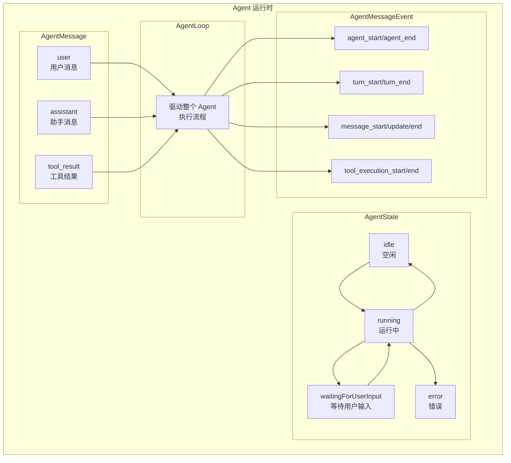
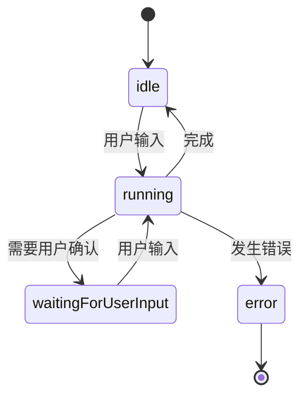

# 7. Agent 核心概念：状态、消息、事件流

问下大家，你有没有想过，一个 AI Agent 是怎么工作的？

OpenClaw 刚开始以为 Agent 就是调用一下 LLM API，拿到回复就完事了。但深入了解后发现，一个真正的 Agent 要复杂得多：
- 它需要**记住**之前的对话
- 它需要**调用工具**来完成任务
- 它需要**管理状态**（空闲、运行中、等待输入等）
- 它需要**处理事件流**（开始、文本增量、工具调用、结束等）

pi-agent 就是 pi-mono 框架中负责这些核心功能的运行时。今天我们就来深入理解它的设计。

## Agent 与 LLM 的区别

很多人容易混淆 Agent 和 LLM 的概念：

| 特性 | LLM | Agent |
|-----|-----|-------|
| 本质 | 语言模型 | 运行时框架 |
| 状态 | 无状态 | 有状态 |
| 工具 | 不能直接调用 | 可以调用工具 |
| 记忆 | 通过上下文 | 通过消息队列 |
| 事件 | 一次性响应 | 流式事件 |

**简单理解：**
- LLM 是"大脑" - 负责理解和生成语言
- Agent 是"身体" - 负责管理状态、调用工具、处理事件流

## pi-agent 架构概览



## 1. AgentState - 状态管理

### 状态定义

```typescript
// packages/agent/src/types.ts

export type AgentState =
  | "idle"           // 空闲，等待用户输入
  | "running"        // 运行中，正在与 LLM 交互
  | "waitingForUserInput"  // 等待用户输入（如确认）
  | "error";         // 发生错误
```

### 状态流转



### 状态管理实现

```typescript
// packages/agent/src/agent.ts

export class Agent {
  private state: AgentState = "idle";
  private stateListeners: Set<(state: AgentState) => void> = new Set();
  
  /** 获取当前状态 */
  getState(): AgentState {
    return this.state;
  }
  
  /** 设置状态 */
  private setState(newState: AgentState): void {
    if (this.state !== newState) {
      this.state = newState;
      // 通知所有监听器
      this.stateListeners.forEach(listener => listener(newState));
    }
  }
  
  /** 订阅状态变化 */
  onStateChange(listener: (state: AgentState) => void): () => void {
    this.stateListeners.add(listener);
    return () => this.stateListeners.delete(listener);
  }
}
```

## 2. AgentMessage - 消息系统

### 消息类型

```typescript
// packages/agent/src/types.ts

export type AgentMessage =
  | UserAgentMessage
  | AssistantAgentMessage
  | ToolResultAgentMessage;

// 用户消息
export interface UserAgentMessage {
  type: "user";
  id: string;
  content: string;
  timestamp: number;
}

// 助手消息
export interface AssistantAgentMessage {
  type: "assistant";
  id: string;
  content: string;
  toolCalls?: ToolCall[];  // 包含的工具调用
  timestamp: number;
}

// 工具结果消息
export interface ToolResultAgentMessage {
  type: "tool_result";
  id: string;
  toolCallId: string;  // 对应的 ToolCall ID
  content: string;
  isError: boolean;
  timestamp: number;
}
```

### 消息队列

Agent 维护两个消息队列：

```typescript
export class Agent {
  // 引导消息队列 - 用于控制 Agent 行为
  private steeringQueue: AgentMessage[] = [];
  
  // 跟进消息队列 - 用于补充上下文
  private followUpQueue: AgentMessage[] = [];
  
  // 历史消息
  private history: AgentMessage[] = [];
  
  /** 添加引导消息 */
  addSteeringMessage(message: AgentMessage): void {
    this.steeringQueue.push(message);
  }
  
  /** 添加跟进消息 */
  addFollowUpMessage(message: AgentMessage): void {
    this.followUpQueue.push(message);
  }
  
  /** 获取所有待处理消息 */
  getPendingMessages(): AgentMessage[] {
    return [...this.steeringQueue, ...this.followUpQueue];
  }
  
  /** 清空队列 */
  clearQueues(): void {
    this.steeringQueue = [];
    this.followUpQueue = [];
  }
}
```

**设计要点：**
- **steeringQueue** - 高优先级消息，用于引导 Agent 行为（如系统提示）
- **followUpQueue** - 普通消息，用于补充上下文
- **history** - 完整的历史记录

## 3. AgentMessageEvent - 事件系统

### 事件类型

```typescript
// packages/agent/src/types.ts

export type AgentMessageEvent =
  // Agent 生命周期
  | AgentStartEvent
  | AgentEndEvent
  
  // Turn（一轮对话）生命周期
  | TurnStartEvent
  | TurnEndEvent
  
  // 消息生命周期
  | MessageStartEvent
  | MessageUpdateEvent
  | MessageEndEvent
  
  // 工具执行
  | ToolExecutionStartEvent
  | ToolExecutionEndEvent
  
  // 流式内容
  | ContentDeltaEvent;

// Agent 开始
export interface AgentStartEvent {
  type: "agent_start";
  agentId: string;
}

// Agent 结束
export interface AgentEndEvent {
  type: "agent_end";
  agentId: string;
  reason: "completed" | "error" | "aborted";
}

// Turn 开始
export interface TurnStartEvent {
  type: "turn_start";
  turnId: string;
}

// Turn 结束
export interface TurnEndEvent {
  type: "turn_end";
  turnId: string;
}

// 消息开始
export interface MessageStartEvent {
  type: "message_start";
  messageId: string;
  role: "assistant";
}

// 消息更新（流式）
export interface MessageUpdateEvent {
  type: "message_update";
  messageId: string;
  content: string;  // 当前完整内容
  delta: string;    // 新增的片段
}

// 消息结束
export interface MessageEndEvent {
  type: "message_end";
  messageId: string;
  finalContent: string;
}

// 工具执行开始
export interface ToolExecutionStartEvent {
  type: "tool_execution_start";
  toolCallId: string;
  toolName: string;
  arguments: Record<string, unknown>;
}

// 工具执行结束
export interface ToolExecutionEndEvent {
  type: "tool_execution_end";
  toolCallId: string;
  result: string;
  isError: boolean;
  duration: number;  // 执行耗时（毫秒）
}
```

### 事件流示例

一次完整的对话会产生这样的事件流：

```
agent_start
  └── turn_start
        ├── message_start (assistant)
        ├── message_update ("Hello")
        ├── message_update ("Hello, how")
        ├── message_update ("Hello, how can")
        ├── message_update ("Hello, how can I")
        ├── message_update ("Hello, how can I help")
        └── message_end
  └── turn_end
agent_end (completed)
```

包含工具调用的对话：

```
agent_start
  └── turn_start
        ├── message_start
        ├── message_update ("I'll")
        ├── message_update ("I'll check")
        ├── message_update ("I'll check the")
        ├── message_update ("I'll check the weather")
        ├── tool_execution_start (get_weather, {city: "Beijing"})
        ├── tool_execution_end (result: "Sunny, 25°C", duration: 500ms)
        ├── message_update ("The weather")
        ├── message_update ("The weather in Beijing")
        ├── message_update ("The weather in Beijing is sunny")
        └── message_end
  └── turn_end
agent_end (completed)
```

## 4. Tool - 工具系统

### 工具定义

```typescript
// packages/agent/src/types.ts

export interface Tool {
  name: string;
  description: string;
  parameters: ToolParameters;
  execute: (args: Record<string, unknown>) => Promise<string>;
}

export interface ToolParameters {
  type: "object";
  properties: Record<string, ToolParameterProperty>;
  required?: string[];
}

export interface ToolParameterProperty {
  type: "string" | "number" | "boolean" | "array" | "object";
  description?: string;
  enum?: string[];
}
```

### 工具调用

```typescript
export interface ToolCall {
  id: string;
  name: string;
  arguments: Record<string, unknown>;
}
```

### 工具注册

```typescript
export class Agent {
  private tools: Map<string, Tool> = new Map();
  
  /** 注册工具 */
  registerTool(tool: Tool): void {
    this.tools.set(tool.name, tool);
  }
  
  /** 获取工具 */
  getTool(name: string): Tool | undefined {
    return this.tools.get(name);
  }
  
  /** 获取所有工具 */
  getAllTools(): Tool[] {
    return Array.from(this.tools.values());
  }
  
  /** 执行工具 */
  async executeTool(toolCall: ToolCall): Promise<string> {
    const tool = this.getTool(toolCall.name);
    if (!tool) {
      throw new Error(`Unknown tool: ${toolCall.name}`);
    }
    return await tool.execute(toolCall.arguments);
  }
}
```

## 5. Agent 完整示例

```typescript
import { Agent } from "@mariozechner/pi-agent-core";

// 创建 Agent
const agent = new Agent({
  api: "openai/gpt-4o",
  apiKey: process.env.OPENAI_API_KEY,
});

// 注册工具
agent.registerTool({
  name: "get_weather",
  description: "Get weather information for a city",
  parameters: {
    type: "object",
    properties: {
      city: { type: "string", description: "City name" },
    },
    required: ["city"],
  },
  execute: async (args) => {
    const { city } = args;
    // 调用天气 API
    return `Weather in ${city}: Sunny, 25°C`;
  },
});

// 订阅事件
agent.onEvent((event) => {
  switch (event.type) {
    case "message_update":
      process.stdout.write(event.delta);
      break;
    case "tool_execution_start":
      console.log(`\n[Using tool: ${event.toolName}]`);
      break;
    case "tool_execution_end":
      console.log(`[Tool result: ${event.result}]`);
      break;
  }
});

// 运行 Agent
const stream = agent.run("What's the weather in Beijing?");
for await (const event of stream) {
  // 处理事件...
}
```

## 核心设计原则

1. **状态驱动** - 所有操作都围绕状态变化展开
2. **事件驱动** - 使用事件流实现异步通信
3. **消息队列** - 区分 steering 和 followUp 消息
4. **工具集成** - 工具是一等公民，支持同步/异步执行
5. **可观测性** - 丰富的事件类型便于调试和监控

## 总结

pi-agent 的核心概念包括：

1. **AgentState** - 管理 Agent 的运行状态
2. **AgentMessage** - 定义消息类型和队列
3. **AgentMessageEvent** - 事件驱动架构的核心
4. **Tool** - 工具定义和执行机制

这些概念相互配合，构成了一个完整的 Agent 运行时框架。在下一篇文章中，我们将深入 AgentLoop 的实现细节。

---

**下篇预告：**《AgentLoop 设计与事件循环机制》 - 深入理解 Agent 的执行引擎。
