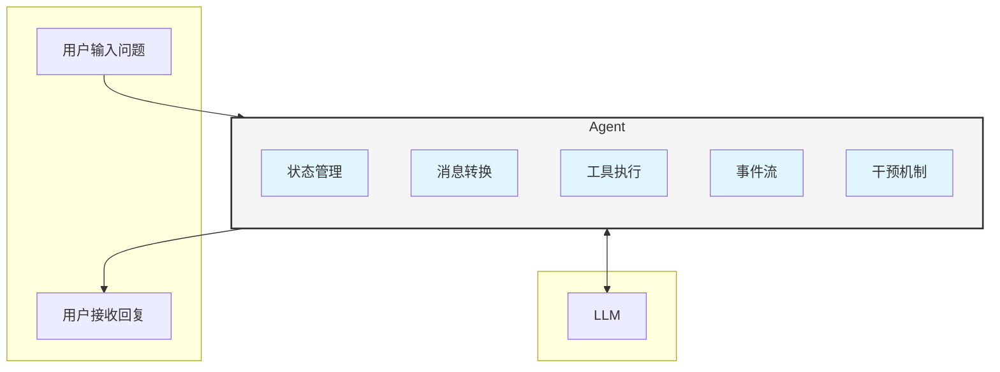
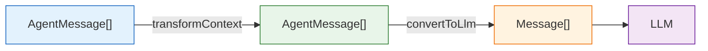
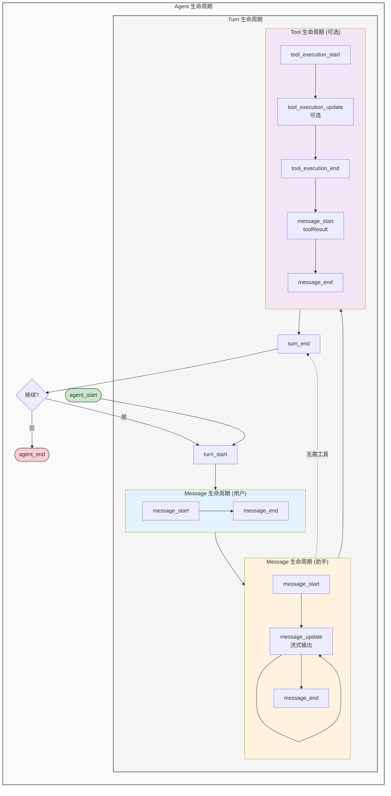
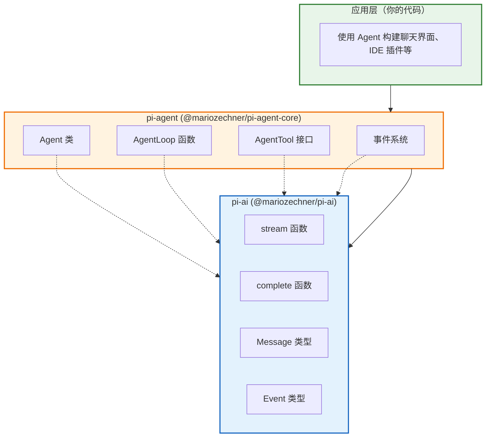

# Agent 核心概念：状态、消息、事件流

> **难度：入门** | **预计阅读时间：20 分钟**

想象一下，你正在构建一个 AI 编码助手。用户输入代码问题，AI 需要：
1. 理解上下文（之前的对话）
2. 可能调用工具（读取文件、执行命令）
3. 流式返回结果
4. 处理用户的实时干预（"停！换个思路"）

这个过程中，状态如何管理？消息如何流转？工具如何执行？

pi-agent 就是为解决这些问题而生的。

## 什么是 Agent？

Agent 是一个**有状态的对话管理器**，它在用户和 LLM 之间架起桥梁：



与直接使用 pi-ai 的 `streamSimple` 不同，Agent 提供了：

| 特性 | pi-ai (底层) | pi-agent (高层) |
|------|-------------|----------------|
| **状态管理** | 无状态，每次调用独立 | 维护完整对话状态 |
| **工具执行** | 返回 tool_call，自行处理 | 自动执行，支持并行/串行 |
| **消息转换** | 手动处理 | 自动转换 + 支持自定义消息类型 |
| **实时干预** | 不支持 | Steering/Follow-up 机制 |
| **事件粒度** | 消息级别 | 细粒度（message_start/update/end） |

## 核心概念一：AgentMessage

Agent 使用 `AgentMessage` 作为消息抽象，它比底层的 `Message` 更灵活：

```typescript
// packages/agent/src/types.ts

// AgentMessage = 标准 LLM 消息 + 自定义消息类型
export type AgentMessage = Message | CustomAgentMessages[keyof CustomAgentMessages];

// 标准 LLM 消息（来自 pi-ai）
type Message = UserMessage | AssistantMessage | ToolResultMessage;

// 自定义消息类型（通过声明合并扩展）
export interface CustomAgentMessages {
  // 默认空，应用可以扩展
}
```

### 为什么需要 AgentMessage？

假设你在构建一个 IDE 插件，需要显示：
- 用户输入
- AI 回复
- **代码片段预览**（仅 UI 显示，不发送给 LLM）
- **系统通知**（仅 UI 显示）

```typescript
// 扩展自定义消息类型
declare module "@mariozechner/agent" {
  interface CustomAgentMessages {
    // 代码预览消息（仅 UI 使用）
    codePreview: {
      role: "codePreview";
      language: string;
      code: string;
      timestamp: number;
    };

    // 系统通知（仅 UI 使用）
    notification: {
      role: "notification";
      text: string;
      level: "info" | "warning" | "error";
      timestamp: number;
    };
  }
}

// 现在可以安全使用
const previewMsg: AgentMessage = {
  role: "codePreview",
  language: "typescript",
  code: "const x = 1;",
  timestamp: Date.now(),
};
```

### 消息转换流程

自定义消息不会直接发送给 LLM，需要经过 `convertToLlm` 转换：



> **转换说明：**
> - `transformContext()`：**可选**，用于修剪上下文
> - `convertToLlm()`：**必需**，用于过滤和转换消息

```typescript
const agent = new Agent({
  convertToLlm: (messages) => messages.flatMap(m => {
    // 过滤掉 UI 专用消息
    if (m.role === "codePreview" || m.role === "notification") {
      return [];
    }
    // 转换自定义消息为标准消息
    if (m.role === "custom") {
      return [{ role: "user", content: m.content, timestamp: m.timestamp }];
    }
    // 标准消息直接透传
    return [m];
  }),
});
```

## 核心概念二：AgentState

Agent 维护完整的状态，你可以随时访问：

```typescript
// packages/agent/src/types.ts

export interface AgentState {
  systemPrompt: string;           // 系统提示词
  model: Model<any>;              // 当前使用的模型
  tools: AgentTool<any>[];        // 可用工具列表
  messages: AgentMessage[];       // 完整对话历史
  isStreaming: boolean;           // 是否正在流式输出
  streamMessage: AgentMessage | null;  // 当前流式消息（部分）
  pendingToolCalls: Set<string>;  // 正在执行的工具调用
  error?: string;                 // 错误信息
}
```

> **注意**：`thinkingLevel` 是在创建 Agent 时通过 `initialState` 或 `setThinkingLevel()` 方法设置的，用于控制模型的推理深度（off/minimal/low/medium/high/xhigh）。它不会存储在 `AgentState` 接口中，而是通过 Agent 实例单独管理。
```

### 状态访问与修改

```typescript
const agent = new Agent({
  initialState: {
    systemPrompt: "You are a helpful coding assistant.",
    model: getModel("anthropic", "claude-sonnet-4-20250514"),
    tools: [readFileTool, writeFileTool],
  },
});

// 读取状态
console.log(agent.state.isStreaming);  // false
console.log(agent.state.messages.length);  // 0

// 修改状态
agent.setSystemPrompt("New system prompt");
agent.setModel(getModel("openai", "gpt-4o"));
agent.setThinkingLevel("high");
agent.setTools([newTool1, newTool2]);

// 会话管理
agent.sessionId = "session-123";  // 用于 Provider 缓存（如 OpenAI Codex 的会话缓存）
agent.replaceMessages(newMessages);  // 替换消息历史
agent.appendMessage(message);  // 追加消息
agent.clearMessages();  // 清空消息
agent.reset();  // 重置所有状态
```

## 核心概念三：事件流

Agent 通过事件流与外部通信，这是构建响应式 UI 的关键。

### 事件类型全景



### 订阅事件

```typescript
const unsubscribe = agent.subscribe((event) => {
  switch (event.type) {
    case "agent_start":
      console.log("Agent 开始处理");
      break;

    case "message_start":
      console.log(`消息开始: ${event.message.role}`);
      break;

    case "message_update":
      // 只有助手消息会触发 update
      if (event.assistantMessageEvent.type === "text_delta") {
        process.stdout.write(event.assistantMessageEvent.delta);
      }
      break;

    case "message_end":
      console.log(`消息完成: ${event.message.role}`);
      break;

    case "tool_execution_start":
      console.log(`工具开始: ${event.toolName}`);
      break;

    case "tool_execution_end":
      console.log(`工具完成: ${event.toolName}, 是否错误: ${event.isError}`);
      break;

    case "turn_end":
      console.log(`Turn 完成，工具结果数: ${event.toolResults.length}`);
      break;

    case "agent_end":
      console.log(`Agent 完成，新增消息数: ${event.messages.length}`);
      break;
  }
});

// 取消订阅
unsubscribe();
```

## 核心概念四：工具定义

Agent 的工具比 pi-ai 的 Tool 更强大，增加了执行函数：

```typescript
// packages/agent/src/types.ts

export interface AgentTool<TParameters extends TSchema = TSchema, TDetails = any>
  extends Tool<TParameters> {
  label: string;  // UI 显示用的标签（必需）
  execute: (
    toolCallId: string,
    params: Static<TParameters>,
    signal?: AbortSignal,
    onUpdate?: AgentToolUpdateCallback<TDetails>,
  ) => Promise<AgentToolResult<TDetails>>;
}
```

> **关于 `label` 字段**：
> - `label` 是 **必需字段**（非可选），用于在 UI 中显示工具的人类可读名称
> - 与 `name`（机器标识符）不同，`label` 面向用户，建议使用中文或友好的英文描述
> - 例如：`name: "read_file"` vs `label: "读取文件"`

export interface AgentToolResult<T> {
  content: (TextContent | ImageContent)[];  // 返回给 LLM 的内容
  details: T;  // 额外详情（用于 UI 显示、日志等）
}
```

### 定义工具示例

```typescript
import { Type } from "@sinclair/typebox";

const readFileTool: AgentTool = {
  name: "read_file",
  label: "读取文件",  // 中文标签，用于 UI
  description: "读取文件内容",
  parameters: Type.Object({
    path: Type.String({ description: "文件路径" }),
  }),
  execute: async (toolCallId, params, signal, onUpdate) => {
    // 可选：流式更新进度
    onUpdate?.({
      content: [{ type: "text", text: "正在读取..." }],
      details: { progress: 0 },
    });

    const content = await fs.readFile(params.path, "utf-8");

    return {
      content: [{ type: "text", text: content }],
      details: {
        path: params.path,
        size: content.length,
        lines: content.split("\n").length,
      },
    };
  },
};
```

### 工具错误处理

**重要**：工具失败时**抛出错误**，不要返回错误内容：

```typescript
execute: async (toolCallId, params, signal) => {
  // ✅ 正确：抛出错误
  if (!fs.existsSync(params.path)) {
    throw new Error(`文件不存在: ${params.path}`);
  }

  // ❌ 错误：返回错误作为内容
  if (!fs.existsSync(params.path)) {
    return {
      content: [{ type: "text", text: "Error: file not found" }],
      details: {},
    };
  }

  return { content: [...], details: {...} };
}
```

**错误处理流程**：

当工具抛出错误时，Agent 会自动处理：

1. **捕获错误**：Agent 捕获异常并包装为 `isError: true` 的 tool result
2. **事件通知**：通过 `tool_execution_end` 事件通知 UI，包含 `isError: true` 标志
3. **LLM 反馈**：错误信息作为 `toolResult` 消息发送给 LLM，让模型知道执行失败
4. **状态记录**：错误信息会记录在 `AgentState.error` 字段中

```typescript
// 订阅工具执行事件以处理错误
agent.subscribe((event) => {
  if (event.type === "tool_execution_end") {
    if (event.isError) {
      console.error(`工具 ${event.toolName} 执行失败:`, event.result.content[0].text);
    } else {
      console.log(`工具 ${event.toolName} 执行成功`);
    }
  }
});
```

## 快速开始

### 基础示例

```typescript
import { Agent } from "@mariozechner/pi-agent-core";
import { getModel } from "@mariozechner/pi-ai";

// 创建 Agent
const agent = new Agent({
  initialState: {
    systemPrompt: "你是一个有用的助手。",
    model: getModel("anthropic", "claude-sonnet-4-20250514"),
  },
});

// 订阅事件（用于 UI 更新）
agent.subscribe((event) => {
  if (event.type === "message_update" &&
      event.assistantMessageEvent.type === "text_delta") {
    process.stdout.write(event.assistantMessageEvent.delta);
  }
});

// 发送消息
await agent.prompt("你好，请介绍一下自己");
```

### 带工具的示例

```typescript
import { Type } from "@sinclair/typebox";

// 定义计算器工具
const calculatorTool: AgentTool = {
  name: "calculate",
  label: "计算器",
  description: "执行数学计算",
  parameters: Type.Object({
    expression: Type.String({ description: "数学表达式，如 1 + 2" }),
  }),
  execute: async (toolCallId, params) => {
    try {
      // 注意：实际生产代码应使用安全的计算库
      const result = eval(params.expression);  // ⚠️ 仅示例，不要生产使用
      return {
        content: [{ type: "text", text: String(result) }],
        details: { expression: params.expression, result },
      };
    } catch (e) {
      throw new Error(`计算错误: ${e.message}`);
    }
  },
};

const agent = new Agent({
  initialState: {
    systemPrompt: "你可以使用计算器工具帮助用户计算。",
    model: getModel("openai", "gpt-4o-mini"),
    tools: [calculatorTool],
  },
});

// 订阅事件以观察工具调用
agent.subscribe((event) => {
  if (event.type === "tool_execution_start") {
    console.log(`\n[工具开始] ${event.toolName}`);
  }
  if (event.type === "tool_execution_end") {
    console.log(`[工具完成] 结果: ${event.result.content[0].text}`);
  }
});

await agent.prompt("计算 123 * 456");
```

## 与 pi-coding-agent 的关系

同一个场景，使用 pi-agent 和 pi-coding-agent 的对比：

### 场景：读取文件并总结内容

**使用 pi-agent（编程方式，完全可控）**：

```typescript
import { Agent } from "@mariozechner/pi-agent-core";
import { getModel } from "@mariozechner/pi-ai";
import fs from "fs";

// 1. 创建 Agent 实例
const agent = new Agent({
  initialState: {
    systemPrompt: "你是一个文件分析助手。",
    model: getModel("anthropic", "claude-sonnet-4-20250514"),
    tools: [{
      name: "read_file",
      label: "读取文件",
      description: "读取文件内容",
      parameters: Type.Object({ path: Type.String() }),
      execute: async (id, params) => {
        const content = await fs.readFile(params.path, "utf-8");
        return { content: [{ type: "text", text: content }], details: {} };
      },
    }],
  },
});

// 2. 订阅事件（自行处理 UI 更新）
agent.subscribe((event) => {
  if (event.type === "message_update") {
    process.stdout.write(event.assistantMessageEvent.delta);
  }
  if (event.type === "tool_execution_start") {
    console.log(`\n[工具] 开始读取: ${event.toolName}`);
  }
});

// 3. 发送消息
await agent.prompt("读取 README.md 并总结内容");
```

**使用 pi-coding-agent（CLI 方式，开箱即用）**：

```bash
# 直接运行命令
pi "读取 README.md 并总结内容"
```

或编程方式：

```typescript
import { createAgentSession } from "@mariozechner/pi-coding-agent";

const session = await createAgentSession();

// TUI 自动显示文件内容和回复
await session.prompt("读取 README.md 并总结内容");
```

### 对比总结

| 维度 | pi-agent | pi-coding-agent |
|------|----------|-----------------|
| **代码量** | 较多（需自行实现工具和 UI） | 极少（内置工具和 TUI） |
| **灵活性** | 高（完全可控） | 中（通过扩展系统定制） |
| **适用场景** | 自定义应用、IDE 插件 | 终端编码、快速任务 |
| **学习成本** | 较高（需理解 Agent 机制） | 低（开箱即用） |

**选择建议**：
- 需要**完全控制** Agent 行为 → 使用 **pi-agent**
- 需要**快速使用**编码助手 → 使用 **pi-coding-agent**

## 与 pi-ai 的关系



## 核心概念五：干预机制（Steering & Follow-up）

Agent 提供了两种干预机制，让你可以在 **Turn 边界** 影响 Agent 的行为：

> ⚠️ **重要限制**：Steering 和 Follow-up **不能中断正在进行的 Turn**。一个 Turn 一旦开始（调用 LLM），就会完整执行（包括 LLM 响应和工具执行），直到 `turn_end` 后才能干预。

### Steering（转向）

在 Agent 完成当前 Turn（包括工具执行）后，你可以发送 Steering 消息来**影响下一个 Turn**：

```typescript
// 用户想调整 AI 的方向
agent.steer({
  role: "user",
  content: "停！先不要读那个文件，帮我看看 package.json instead.",
  timestamp: Date.now(),
});
```

**特点**：
- 在 **Turn 结束后**（`turn_end` 事件后）生效
- 用于**调整下一个 Turn 的方向**
- 适合用户在 Turn 边界临时改变主意的场景

**⚠️ 不能取消已规划的工具调用**：

Steering **不能取消当前 Turn 已经规划的工具调用**。例如：

```
Turn 1: LLM 返回 "创建 React" + toolCall_1
        ↓
        【用户发送 steering】
        ↓
        执行 toolCall_1 → React 被创建（无法阻止！）
        ↓
Turn 1 结束
        ↓
Turn 2: 注入 steering → 重新调用 LLM → 可能创建 Vue
        ↓
结果：React 和 Vue 都被创建了
```

如果需要在工具执行前拦截，请使用 `beforeToolCall` hook（详见 02-agent-loop.md）。

### Follow-up（跟进）

在 Agent 完成所有 Turn、即将停止时，你可以发送 Follow-up 消息来**开启新的对话周期**：

```typescript
// Agent 刚回答完问题，用户想继续追问
agent.followUp({
  role: "user",
  content: "基于以上结果，帮我生成一份报告。",
  timestamp: Date.now(),
});
```

**特点**：
- 在 **所有 Turn 结束后**（`agent_end` 前）触发新的 Turn
- 用于**连续对话**和任务链
- 适合多轮交互的场景

**与 Steering 的区别**：
- Steering：在当前 Turn 结束后立即生效，影响下一个 Turn
- Follow-up：在所有 Turn 结束后生效，开启新的对话周期

### 工作模式

两种消息都支持两种工作模式：

| 模式 | 说明 |
|------|------|
| `"one-at-a-time"`（默认） | 每次只处理一条消息，适合顺序执行 |
| `"all"` | 一次性处理所有队列消息，适合批量操作 |

```typescript
// 设置工作模式
agent.setSteeringMode("one-at-a-time");
agent.setFollowUpMode("all");

// 清空队列（如果需要取消已排队的消息）
agent.clearSteeringQueue();
agent.clearFollowUpQueue();
agent.clearAllQueues();
```

> **下篇详解**: [02-agent-loop.md](02-agent-loop.md) 将深入讲解 AgentLoop 的事件循环机制，包括 Steering/Follow-up 的完整实现细节、工具执行的并行/串行模式等。

## 总结

pi-agent 的核心概念：

1. **AgentMessage**: 灵活的消息抽象，支持自定义消息类型
2. **AgentState**: 完整的状态管理，随时可访问和修改
3. **事件流**: 细粒度的事件系统，支持构建响应式 UI
4. **AgentTool**: 带执行函数的工具定义，支持流式更新
5. **干预机制**: Steering 和 Follow-up 实现实时交互控制

这些概念共同构成了一个**生产级的 Agent 运行时**，让你可以：
- 维护复杂的对话状态
- 自动执行工具调用
- 实时响应用户干预
- 构建流畅的流式 UI
- 实现灵活的交互控制
