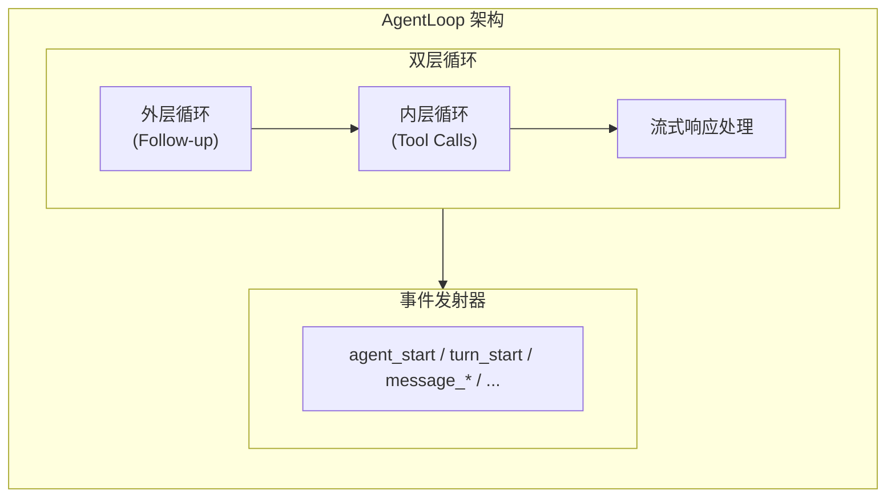
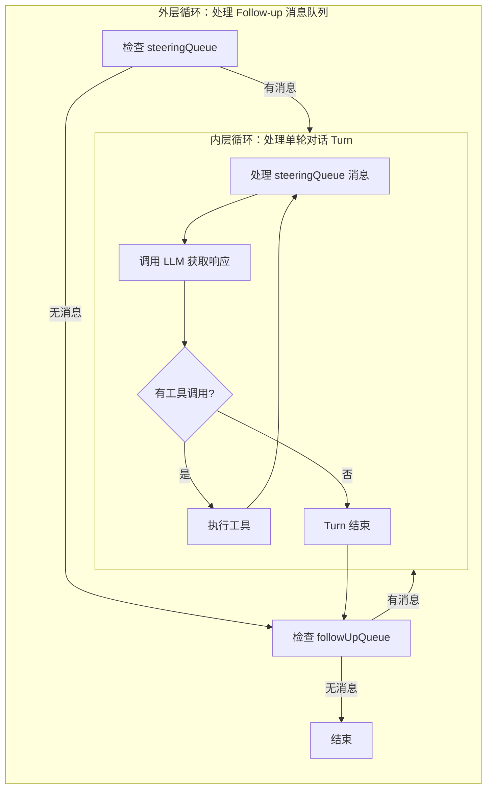
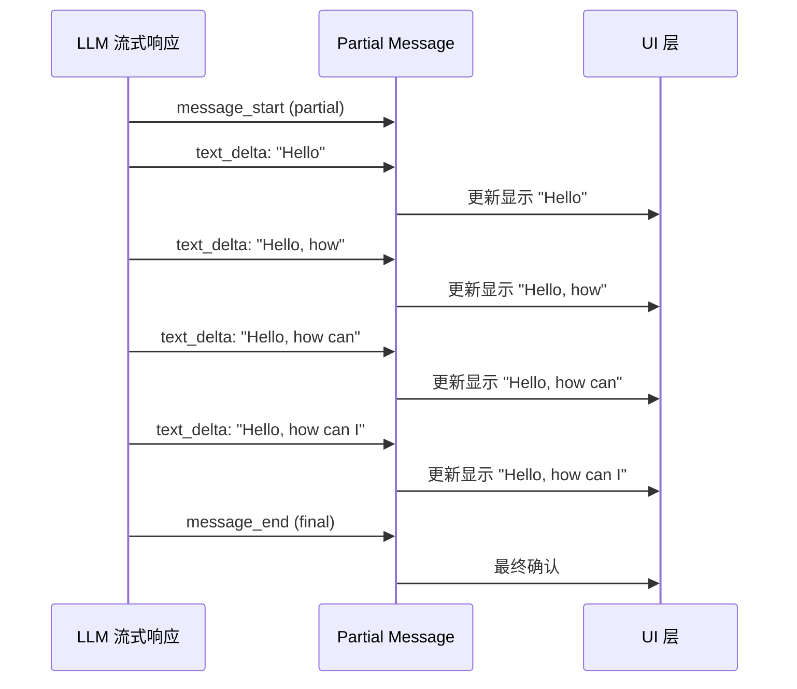
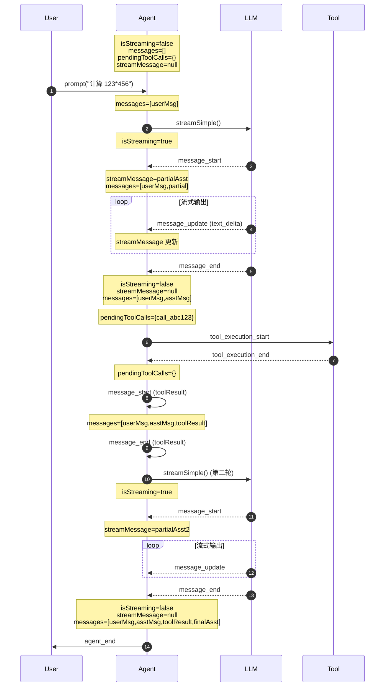

# AgentLoop 设计与事件循环机制

> **难度：进阶** | **预计阅读时间：25 分钟**

上一章我们了解了 Agent 的核心概念。本章将深入 Agent 的"心脏"——AgentLoop，理解它是如何驱动整个对话流程的。

## 为什么需要 AgentLoop？

想象一个场景：用户让 AI 助手"创建一个 React 项目"。这个任务需要：

1. AI 分析需求 → 调用 `create_directory` 工具
2. 等待工具完成 → AI 继续 → 调用 `write_file` 写入 package.json
3. 等待工具完成 → AI 继续 → 调用 `write_file` 写入 App.tsx
4. ...可能还有更多工具调用

这是一个**多轮对话**过程，每轮可能包含：
- 用户消息（或工具结果）
- AI 响应（可能包含工具调用）
- 工具执行

AgentLoop 就是管理这个循环的核心机制。

## AgentLoop 架构



## 双层循环设计

AgentLoop 采用**双层循环**设计：



### 代码实现

```typescript
// packages/agent/src/agent-loop.ts

async function runLoop(
  currentContext: AgentContext,
  newMessages: AgentMessage[],
  config: AgentLoopConfig,
  signal: AbortSignal | undefined,
  emit: AgentEventSink,
  streamFn?: StreamFn,
): Promise<void> {
  let firstTurn = true;
  // 检查 steering 消息
  let pendingMessages: AgentMessage[] = (await config.getSteeringMessages?.()) || [];

  // ═══════════════════════════════════════════════════════════
  // 外层循环：处理 Follow-up 消息
  // ═══════════════════════════════════════════════════════════
  while (true) {
    let hasMoreToolCalls = true;

    // ═════════════════════════════════════════════════════════
    // 内层循环：处理工具调用和 steering 消息
    // ═════════════════════════════════════════════════════════
    while (hasMoreToolCalls || pendingMessages.length > 0) {
      if (!firstTurn) {
        await emit({ type: "turn_start" });
      } else {
        firstTurn = false;
      }

      // 1. 处理 pending 消息（steering 消息注入）
      if (pendingMessages.length > 0) {
        for (const message of pendingMessages) {
          await emit({ type: "message_start", message });
          await emit({ type: "message_end", message });
          currentContext.messages.push(message);
          newMessages.push(message);
        }
        pendingMessages = [];
      }

      // 2. 流式获取助手响应
      const message = await streamAssistantResponse(
        currentContext, config, signal, emit, streamFn
      );
      newMessages.push(message);

      // 错误处理
      if (message.stopReason === "error" || message.stopReason === "aborted") {
        await emit({ type: "turn_end", message, toolResults: [] });
        await emit({ type: "agent_end", messages: newMessages });
        return;
      }

      // 3. 检查并执行工具调用
      const toolCalls = message.content.filter((c) => c.type === "toolCall");
      hasMoreToolCalls = toolCalls.length > 0;

      const toolResults: ToolResultMessage[] = [];
      if (hasMoreToolCalls) {
        toolResults.push(...await executeToolCalls(
          currentContext, message, config, signal, emit
        ));

        for (const result of toolResults) {
          currentContext.messages.push(result);
          newMessages.push(result);
        }
      }

      await emit({ type: "turn_end", message, toolResults });

      // 4. 获取下一批 steering 消息
      pendingMessages = (await config.getSteeringMessages?.()) || [];
    }

    // ═════════════════════════════════════════════════════════
    // 内层循环结束，检查 Follow-up 消息
    // ═════════════════════════════════════════════════════════
    const followUpMessages = (await config.getFollowUpMessages?.()) || [];
    if (followUpMessages.length > 0) {
      pendingMessages = followUpMessages;
      continue;  // 回到外层循环
    }

    break;  // 无更多消息，结束
  }

  await emit({ type: "agent_end", messages: newMessages });
}
```

## Steering 与 Follow-up 机制

这是 AgentLoop 最强大的特性之一：**允许在对话进行中实时干预**。

### Steering（引导）

**场景**：AI 正在生成代码，用户突然说"等等，用 TypeScript 而不是 JavaScript"

```typescript
// 用户输入 steering 消息
agent.steer({
  role: "user",
  content: [{ type: "text", text: "请改用 TypeScript" }],
  timestamp: Date.now(),
});

// Agent 会在当前 Turn 结束后处理这个消息
```

**特点**：
- 高优先级，在当前 Turn 结束后立即处理
- 会触发新的 LLM 调用
- 适合**实时纠正** AI 的行为

### Follow-up（跟进）

**场景**：AI 完成了任务，用户想继续对话"再帮我添加测试"

```typescript
// 用户输入 follow-up 消息
agent.followUp({
  role: "user",
  content: [{ type: "text", text: "请为刚才的代码添加单元测试" }],
  timestamp: Date.now(),
});

// Agent 会在所有 Turn 结束后处理这个消息
```

**特点**：
- 低优先级，在所有 Turn 结束后处理
- 适合**任务完成后**的连续对话
- 不会打断当前正在进行的工具调用

### 两种模式对比

```typescript
// 模式配置
export interface AgentOptions {
  steeringMode?: "all" | "one-at-a-time";  // 默认: "one-at-a-time"
  followUpMode?: "all" | "one-at-a-time";  // 默认: "one-at-a-time"
}
```

| 模式 | 行为 | 适用场景 |
|------|------|---------|
| `"one-at-a-time"` | 每次只处理一条消息 | 需要逐步确认、交互式对话 |
| `"all"` | 一次性处理所有消息 | 批量指令、自动化流程 |

```typescript
// 配置示例
const agent = new Agent({
  steeringMode: "one-at-a-time",  // 用户说一条，AI 处理一条
  followUpMode: "all",            // 批量处理后续指令
});
```

## 流式响应处理

AgentLoop 通过 `streamAssistantResponse` 处理 LLM 的流式响应：

```typescript
async function streamAssistantResponse(
  context: AgentContext,
  config: AgentLoopConfig,
  signal: AbortSignal | undefined,
  emit: AgentEventSink,
  streamFn?: StreamFn,
): Promise<AssistantMessage> {
  // 1. 可选：转换上下文（如修剪历史）
  let messages = context.messages;
  if (config.transformContext) {
    messages = await config.transformContext(messages, signal);
  }

  // 2. 转换为 LLM 兼容的消息格式
  const llmMessages = await config.convertToLlm(messages);

  // 3. 构建 LLM 上下文
  const llmContext: Context = {
    systemPrompt: context.systemPrompt,
    messages: llmMessages,
    tools: context.tools,
  };

  // 4. 调用流式 API
  const response = await streamFunction(config.model, llmContext, {
    ...config,
    signal,
  });

  // 5. 处理流式事件
  let partialMessage: AssistantMessage | null = null;
  let addedPartial = false;

  for await (const event of response) {
    switch (event.type) {
      case "start":
        partialMessage = event.partial;
        context.messages.push(partialMessage);
        addedPartial = true;
        await emit({ type: "message_start", message: { ...partialMessage } });
        break;

      case "text_start":
      case "text_delta":
      case "text_end":
      case "thinking_start":
      case "thinking_delta":
      case "thinking_end":
      case "toolcall_start":
      case "toolcall_delta":
      case "toolcall_end":
        if (partialMessage) {
          partialMessage = event.partial;
          context.messages[context.messages.length - 1] = partialMessage;
          await emit({
            type: "message_update",
            assistantMessageEvent: event,
            message: { ...partialMessage },
          });
        }
        break;

      case "done":
      case "error": {
        const finalMessage = await response.result();
        // ... 更新消息并发射 message_end
        return finalMessage;
      }
    }
  }
  // ...
}
```

### 关键设计：Partial Message

为什么需要 `partialMessage`？



`partialMessage` 在流式过程中被**原地更新**，这样：
1. UI 可以实时显示最新内容
2. 如果中途出错，已有内容不会丢失
3. 工具调用可以在流式过程中被解析

## 完整的生命周期示例

让我们追踪一次完整的对话：

```typescript
// 场景：用户让 AI 计算 123 * 456

const agent = new Agent({
  initialState: {
    systemPrompt: "你是一个计算器助手。",
    model: getModel("openai", "gpt-4o-mini"),
    tools: [calculatorTool],
  },
});

// 订阅事件
agent.subscribe((event) => {
  console.log(`[${event.type}]`, JSON.stringify(event).slice(0, 100));
});

// 发送消息
await agent.prompt("计算 123 * 456");
```

### 事件流输出

```
[agent_start] {}
[turn_start] {}
[message_start] {"message":{"role":"user","content":[{"type":"text","text":"计算 123 * 456"}]...
[message_end] {"message":{"role":"user","content":[{"type":"text","text":"计算 123 * 456"}]...
[message_start] {"message":{"role":"assistant","content":[],"api":"openai-responses"...
[message_update] {"message":{"role":"assistant","content":[{"type":"text","text":"我来"...
[message_update] {"message":{"role":"assistant","content":[{"type":"text","text":"我来帮"...
[message_update] {"message":{"role":"assistant","content":[{"type":"text","text":"我来帮你"...
... (更多 text_delta)
[message_update] {"assistantMessageEvent":{"type":"toolcall_start"...
[message_update] {"assistantMessageEvent":{"type":"toolcall_delta"...
[message_update] {"assistantMessageEvent":{"type":"toolcall_end"...
[message_end] {"message":{"role":"assistant","content":[{"type":"text","text":"我来帮你计算："...
[tool_execution_start] {"toolCallId":"call_abc123","toolName":"calculate","args":{"expression":"123 * 456"}}
[tool_execution_end] {"toolCallId":"call_abc123","toolName":"calculate","result":{"content":[{"type":"text","text":"56088"}]...
[message_start] {"message":{"role":"toolResult","toolCallId":"call_abc123"...
[message_end] {"message":{"role":"toolResult","toolCallId":"call_abc123"...
[turn_end] {"message":{...},"toolResults":[{"role":"toolResult","toolCallId":"call_abc123"...
[message_start] {"message":{"role":"assistant","content":[]...
[message_update] ... (AI 生成最终回复)
[message_end] ...
[turn_end] ...
[agent_end] {"messages":[...]}
```

### 状态变化

> **图表说明**：以下时序图展示了一个完整的 Agent 执行流程，包含用户消息、助手回复、工具调用和最终回复。
> - **参与者**：`User`（用户）、`Agent`（Agent 运行时）、`LLM`（大语言模型）、`Tool`（工具执行）
> - **状态标注**：每条消息右侧标注了关键状态变化



**关键状态说明**：
- **isStreaming**：`true` 表示正在流式接收 LLM 响应（message_start 到 message_end 之间）
- **messages**：完整的对话历史数组，包含 user、assistant、toolResult 消息
- **pendingToolCalls**：Set 集合，包含正在执行的工具调用 ID
- **streamMessage**：当前流式消息的部分内容（仅在流式期间非空）

## 错误处理

AgentLoop 有完善的错误处理机制：

```typescript
// 1. 流式过程中的错误
if (message.stopReason === "error" || message.stopReason === "aborted") {
  await emit({ type: "turn_end", message, toolResults: [] });
  await emit({ type: "agent_end", messages: newMessages });
  return;
}

// 2. 工具执行错误（在 executePreparedToolCall 中捕获）
try {
  const result = await prepared.tool.execute(...);
  return { result, isError: false };
} catch (error) {
  return {
    result: createErrorToolResult(error.message),
    isError: true,
  };
}

// 3. 顶层错误处理（在 _runLoop 中）
try {
  await runAgentLoop(...);
} catch (err: any) {
  // 构造错误消息并追加到历史
  const errorMsg: AgentMessage = {
    role: "assistant",
    content: [{ type: "text", text: "" }],
    stopReason: signal?.aborted ? "aborted" : "error",
    errorMessage: err?.message || String(err),
    // ...
  };
  this.appendMessage(errorMsg);
  this.emit({ type: "agent_end", messages: [errorMsg] });
}
```

## 高级用法：自定义 StreamFn

你可以注入自定义的流函数，用于代理后端、日志记录等：

```typescript
const agent = new Agent({
  streamFn: async (model, context, options) => {
    // 1. 记录请求日志
    console.log("[LLM Request]", { model, messageCount: context.messages.length });
    
    // 2. 调用实际的流函数
    const stream = streamSimple(model, context, options);
    
    // 3. 包装流以添加日志
    return {
      async *[Symbol.asyncIterator]() {
        for await (const event of stream) {
          console.log("[LLM Event]", event.type);
          yield event;
        }
      },
      async result() {
        const result = await stream.result();
        console.log("[LLM Result]", result.stopReason);
        return result;
      },
    };
  },
});
```

## 总结

AgentLoop 的核心设计：

1. **双层循环**：外层处理 Follow-up，内层处理 Turn + Tool Calls
2. **消息队列**：steeringQueue（高优先级）+ followUpQueue（低优先级）
3. **流式处理**：实时更新 partialMessage，支持中断恢复
4. **事件驱动**：完整的事件生命周期，便于构建响应式 UI
5. **错误隔离**：工具错误不中断对话，顶层错误有兜底处理

---

**下篇预告**: [03-tool-execution.md](03-tool-execution.md) —— 深入工具调用执行机制，包括并行/串行模式、before/after 钩子、流式工具更新等。
