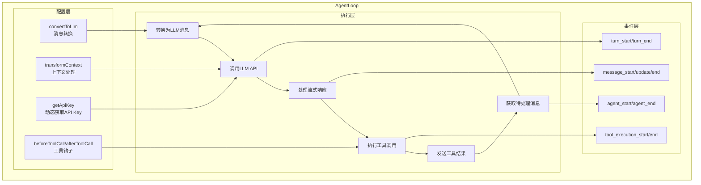

# 8. AgentLoop 设计与事件循环机制

问下大家，你有没有想过，一个 Agent 是怎么"动起来"的？

OpenClaw 刚开始以为 Agent 就是简单调用一下 API，但深入了解后发现，Agent 需要处理的事情远比想象的复杂：
- 它要**循环**接收用户输入
- 它要**协调**消息队列和 LLM 交互
- 它要**处理**工具调用和结果
- 它要**管理**多轮对话的上下文

pi-agent 的 **AgentLoop** 就是负责这些核心逻辑的"引擎"。今天我们就来深入剖析它的设计。

## AgentLoop 的职责

AgentLoop 是 Agent 的**执行引擎**，负责：

1. **消息处理** - 从队列中获取消息，准备发送给 LLM
2. **LLM 交互** - 调用 pi-ai 获取流式响应
3. **事件转换** - 将 pi-ai 的事件转换为 Agent 事件
4. **工具执行** - 检测并执行工具调用
5. **循环控制** - 决定何时继续、何时结束

## 架构概览



## AgentLoopConfig 配置

AgentLoop 通过配置对象实现高度可定制：

```typescript
// packages/agent/src/agent-loop.ts

export interface AgentLoopConfig {
  /** 将 AgentMessage 转换为 LLM Message */
  convertToLlm: (messages: AgentMessage[]) => Message[];
  
  /** 转换上下文（如添加系统提示） */
  transformContext?: (messages: Message[]) => Message[];
  
  /** 动态获取 API Key */
  getApiKey?: () => string | undefined;
  
  /** 获取引导消息 */
  getSteeringMessages?: () => AgentMessage[];
  
  /** 获取跟进消息 */
  getFollowUpMessages?: () => AgentMessage[];
  
  /** 工具调用前钩子 */
  beforeToolCall?: (toolCall: ToolCall) => Promise<void>;
  
  /** 工具调用后钩子 */
  afterToolCall?: (toolCall: ToolCall, result: string) => Promise<void>;
  
  /** 事件处理器 */
  onEvent?: (event: AgentMessageEvent) => void;
  
  /** 最大迭代次数（防止无限循环） */
  maxIterations?: number;
  
  /** 工具执行模式 */
  toolExecutionMode?: "sequential" | "parallel";
}
```

## runAgentLoop 实现

### 核心循环

```typescript
// packages/agent/src/agent-loop.ts

export async function* runAgentLoop(
  config: AgentLoopConfig,
  options: StreamOptions
): AsyncGenerator<AgentMessageEvent> {
  const maxIterations = config.maxIterations ?? 10;
  let iteration = 0;
  
  // 发送 agent_start 事件
  yield { type: "agent_start", agentId: generateId() };
  
  try {
    while (iteration < maxIterations) {
      iteration++;
      
      // 发送 turn_start 事件
      const turnId = generateId();
      yield { type: "turn_start", turnId };
      
      // 1. 获取待处理消息
      const steeringMessages = config.getSteeringMessages?.() ?? [];
      const followUpMessages = config.getFollowUpMessages?.() ?? [];
      const pendingMessages = [...steeringMessages, ...followUpMessages];
      
      if (pendingMessages.length === 0) {
        // 没有消息，结束循环
        break;
      }
      
      // 2. 转换为 LLM 消息
      let llmMessages = config.convertToLlm(pendingMessages);
      
      // 3. 转换上下文
      if (config.transformContext) {
        llmMessages = config.transformContext(llmMessages);
      }
      
      // 4. 调用 LLM
      const stream = stream(options.api, {
        ...options,
        messages: llmMessages,
        apiKey: config.getApiKey?.() ?? options.apiKey,
      });
      
      // 5. 处理流式响应
      const result = yield* processStream(stream, config);
      
      // 6. 如果有工具调用，执行它们
      if (result.toolCalls.length > 0) {
        yield* executeTools(result.toolCalls, config);
      } else {
        // 没有工具调用，本轮结束
        break;
      }
      
      // 发送 turn_end 事件
      yield { type: "turn_end", turnId };
    }
    
    // 发送 agent_end 事件
    yield { type: "agent_end", agentId: "...", reason: "completed" };
    
  } catch (error) {
    // 发送错误事件
    yield { type: "agent_end", agentId: "...", reason: "error" };
    throw error;
  }
}
```

### 流处理

```typescript
async function* processStream(
  stream: AsyncGenerator<AgentMessageEvent>,
  config: AgentLoopConfig
): AsyncGenerator<AgentMessageEvent, { content: string; toolCalls: ToolCall[] }> {
  let content = "";
  const toolCalls: Map<string, Partial<ToolCall>> = new Map();
  let currentToolCall: string | null = null;
  
  // 发送 message_start
  const messageId = generateId();
  yield { type: "message_start", messageId, role: "assistant" };
  
  for await (const event of stream) {
    // 转发 pi-ai 的事件
    switch (event.type) {
      case "text_delta":
        content += event.data;
        yield {
          type: "message_update",
          messageId,
          content,
          delta: event.data,
        };
        break;
        
      case "toolcall_start":
        currentToolCall = event.id;
        toolCalls.set(event.id, {
          id: event.id,
          name: event.name,
          arguments: {},
        });
        break;
        
      case "toolcall_delta":
        if (currentToolCall) {
          const toolCall = toolCalls.get(currentToolCall);
          if (toolCall) {
            // 累积 JSON 参数
            const args = toolCall.arguments as Record<string, string>;
            // 解析增量 JSON...
          }
        }
        break;
        
      case "toolcall_end":
        currentToolCall = null;
        break;
        
      case "done":
        // 流结束
        break;
    }
    
    // 调用配置的 onEvent
    config.onEvent?.(event);
  }
  
  // 发送 message_end
  yield { type: "message_end", messageId, finalContent: content };
  
  // 返回结果
  return {
    content,
    toolCalls: Array.from(toolCalls.values()) as ToolCall[],
  };
}
```

### 工具执行

```typescript
async function* executeTools(
  toolCalls: ToolCall[],
  config: AgentLoopConfig
): AsyncGenerator<AgentMessageEvent> {
  const mode = config.toolExecutionMode ?? "sequential";
  
  if (mode === "sequential") {
    // 顺序执行
    for (const toolCall of toolCalls) {
      yield* executeSingleTool(toolCall, config);
    }
  } else {
    // 并行执行
    const promises = toolCalls.map(async (toolCall) => {
      // 执行工具...
    });
    await Promise.all(promises);
  }
}

async function* executeSingleTool(
  toolCall: ToolCall,
  config: AgentLoopConfig
): AsyncGenerator<AgentMessageEvent> {
  // 发送 tool_execution_start
  yield {
    type: "tool_execution_start",
    toolCallId: toolCall.id,
    toolName: toolCall.name,
    arguments: toolCall.arguments,
  };
  
  // 调用 beforeToolCall 钩子
  if (config.beforeToolCall) {
    await config.beforeToolCall(toolCall);
  }
  
  // 执行工具
  const startTime = Date.now();
  let result: string;
  let isError = false;
  
  try {
    result = await executeTool(toolCall);
  } catch (error) {
    result = error instanceof Error ? error.message : String(error);
    isError = true;
  }
  
  const duration = Date.now() - startTime;
  
  // 调用 afterToolCall 钩子
  if (config.afterToolCall) {
    await config.afterToolCall(toolCall, result);
  }
  
  // 发送 tool_execution_end
  yield {
    type: "tool_execution_end",
    toolCallId: toolCall.id,
    result,
    isError,
    duration,
  };
}
```

## 执行流程详解

### 单轮对话流程

```
用户输入
    │
    ▼
┌─────────────────┐
│  addSteering    │  添加用户消息到 steeringQueue
└────────┬────────┘
         │
         ▼
┌─────────────────┐
│   runAgentLoop  │
└────────┬────────┘
         │
         ├──► agent_start
         │
         ├──► turn_start
         │
         ├──► 获取 steeringQueue 消息
         │
         ├──► convertToLlm 转换消息
         │
         ├──► stream() 调用 LLM
         │       │
         │       ├──► message_start
         │       ├──► message_update (多次)
         │       └──► message_end
         │
         ├──► turn_end
         │
         └──► agent_end
```

### 多轮对话流程（含工具调用）

```
用户: "查一下北京天气"
    │
    ▼
┌──────────────────────────────────────────┐
│              Turn 1                      │
│  LLM: "我来查一下"                        │
│       [调用 get_weather 工具]            │
│                                          │
│  执行工具 -> 结果: "晴天 25°C"            │
│                                          │
│  将结果添加到 followUpQueue              │
└──────────────────────────────────────────┘
    │
    ▼
┌──────────────────────────────────────────┐
│              Turn 2                      │
│  LLM: "北京今天晴天，25°C"                │
│  （没有工具调用，结束）                   │
└──────────────────────────────────────────┘
    │
    ▼
agent_end
```

## 配置示例

### 基础配置

```typescript
const config: AgentLoopConfig = {
  convertToLlm: (messages) => {
    return messages.map(m => ({
      role: m.type === "user" ? "user" : "assistant",
      content: [{ type: "text", text: m.content }],
    }));
  },
  
  getSteeringMessages: () => agent.getSteeringQueue(),
  getFollowUpMessages: () => agent.getFollowUpQueue(),
  
  onEvent: (event) => {
    console.log("Event:", event.type);
  },
};
```

### 高级配置（带工具钩子）

```typescript
const config: AgentLoopConfig = {
  convertToLlm: (messages) => {
    // 添加系统提示
    const systemMessage = {
      role: "system",
      content: [{ type: "text", text: "You are a helpful assistant." }],
    };
    return [systemMessage, ...convertMessages(messages)];
  },
  
  transformContext: (messages) => {
    // 截断过长的上下文
    const maxMessages = 20;
    if (messages.length > maxMessages) {
      return messages.slice(-maxMessages);
    }
    return messages;
  },
  
  getApiKey: () => {
    // 动态获取 API Key（如从环境变量或配置服务）
    return process.env.OPENAI_API_KEY;
  },
  
  beforeToolCall: async (toolCall) => {
    console.log(`Executing tool: ${toolCall.name}`);
    // 可以在这里做权限检查
  },
  
  afterToolCall: async (toolCall, result) => {
    console.log(`Tool result: ${result}`);
    // 可以在这里记录日志
  },
  
  maxIterations: 5,  // 最多 5 轮对话
  toolExecutionMode: "parallel",  // 并行执行工具
};
```

## 错误处理

### 常见错误场景

1. **LLM API 错误** - 网络问题、配额不足等
2. **工具执行错误** - 工具抛出异常
3. **无限循环** - Agent 反复调用工具

### 错误处理策略

```typescript
async function* runAgentLoop(config: AgentLoopConfig, options: StreamOptions) {
  try {
    yield { type: "agent_start", agentId };
    
    // ... 主循环
    
  } catch (error) {
    // 发送错误事件
    yield {
      type: "agent_end",
      agentId,
      reason: "error",
    };
    
    // 重新抛出，让上层处理
    throw error;
  }
}

// 使用时的错误处理
try {
  for await (const event of runAgentLoop(config, options)) {
    // 处理事件...
  }
} catch (error) {
  console.error("Agent error:", error);
  // 可以在这里恢复状态、重试等
}
```

## 性能优化

### 1. 上下文截断

```typescript
transformContext: (messages) => {
  // 只保留最近 N 条消息
  const maxContextMessages = 20;
  return messages.slice(-maxContextMessages);
}
```

### 2. 工具超时

```typescript
async function executeToolWithTimeout(
  toolCall: ToolCall,
  timeoutMs: number
): Promise<string> {
  return Promise.race([
    executeTool(toolCall),
    new Promise<string>((_, reject) =>
      setTimeout(() => reject(new Error("Tool timeout")), timeoutMs)
    ),
  ]);
}
```

### 3. 并行工具执行

```typescript
toolExecutionMode: "parallel",

// 在 executeTools 中
const results = await Promise.all(
  toolCalls.map(tc => executeSingleTool(tc, config))
);
```

## 总结

AgentLoop 是 pi-agent 的核心执行引擎：

1. **配置驱动** - 通过 AgentLoopConfig 实现高度可定制
2. **事件循环** - 使用 AsyncGenerator 实现流式事件
3. **消息队列** - 区分 steering 和 followUp 消息
4. **工具集成** - 支持顺序/并行执行模式
5. **循环控制** - maxIterations 防止无限循环

这种设计让 Agent 的行为完全可控，同时也非常灵活。

---

**下篇预告：**《工具调用与执行模式》 - 深入理解 pi-agent 的工具系统。
