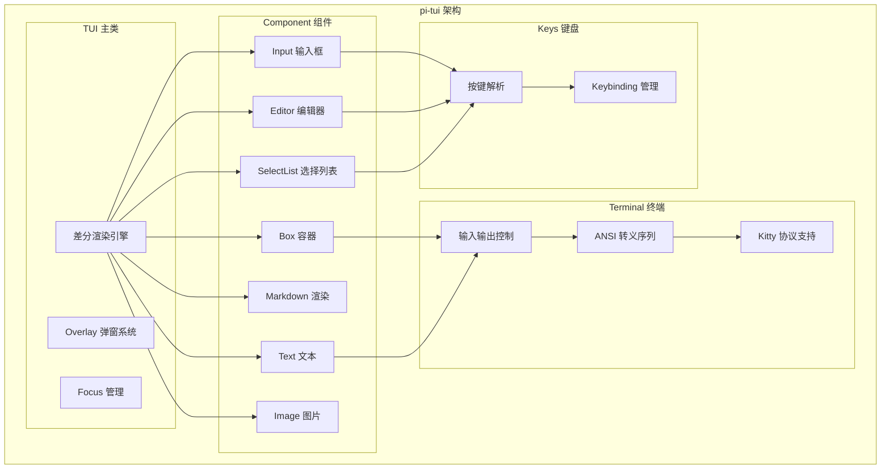

# 11. pi-tui 框架设计：差分渲染与同步输出

问下大家，你有没有想过，终端里的那些漂亮的交互界面是怎么实现的？

OpenClaw 刚开始以为终端只能打印纯文本，直到看到 pi-tui 才发现，原来终端也能做出这么流畅的 UI！差分渲染、同步输出、组件化架构...这些现代前端的概念在终端里一样能用。

今天我们就来深入理解 pi-tui 的设计。

## 终端 UI 的挑战

### 传统终端输出的问题

```typescript
// 传统方式：直接打印
console.log("Loading...");
console.log("Progress: 50%");
// 输出：
// Loading...
// Progress: 50%
// 问题：无法更新已打印的内容！
```

### 终端 UI 需要解决的问题

1. **如何更新已显示的内容？** - 需要 ANSI 转义序列
2. **如何定位光标？** - 需要精确的光标控制
3. **如何处理用户输入？** - 需要键盘事件处理
4. **如何保持流畅？** - 需要差分渲染

## pi-tui 架构概览



## 差分渲染（Differential Rendering）

### 什么是差分渲染？

差分渲染只更新**变化的部分**，而不是重新渲染整个界面。

```
第 1 帧：                    第 2 帧（传统）：
┌────────────┐              ┌────────────┐
│ Hello      │              │ Hello      │  ← 重新渲染
│ World      │              │ World!     │  ← 重新渲染
│ Loading... │              │ Done!      │  ← 重新渲染
└────────────┘              └────────────┘

第 2 帧（差分）：
┌────────────┐
│ Hello      │  ← 不变，跳过
│ World!     │  ← 只更新这一行
│ Done!      │  ← 只更新这一行
└────────────┘
```

### pi-tui 的差分渲染实现

```typescript
// packages/tui/src/tui.ts

export class TUI {
  // 当前帧的缓冲区
  private currentBuffer: string[][] = [];
  
  // 上一帧的缓冲区（用于比较）
  private previousBuffer: string[][] = [];
  
  /**
   * 渲染组件
   */
  render(component: Component): void {
    // 1. 获取组件的最新输出
    const newBuffer = component.render();
    
    // 2. 计算差分
    const diff = this.computeDiff(this.previousBuffer, newBuffer);
    
    // 3. 只输出变化的部分
    this.applyDiff(diff);
    
    // 4. 更新缓冲区
    this.previousBuffer = newBuffer;
  }
  
  /**
   * 计算两个缓冲区的差异
   */
  private computeDiff(
    oldBuffer: string[][],
    newBuffer: string[][]
  ): Diff[] {
    const diffs: Diff[] = [];
    
    const maxRows = Math.max(oldBuffer.length, newBuffer.length);
    
    for (let row = 0; row < maxRows; row++) {
      const oldRow = oldBuffer[row] || [];
      const newRow = newBuffer[row] || [];
      
      // 比较每一行
      if (this.rowsDiffer(oldRow, newRow)) {
        diffs.push({
          row,
          content: newRow.join(""),
        });
      }
    }
    
    return diffs;
  }
  
  /**
   * 应用差异到终端
   */
  private applyDiff(diffs: Diff[]): void {
    for (const diff of diffs) {
      // 移动光标到指定行
      this.moveCursor(0, diff.row);
      
      // 清除该行
      this.clearLine();
      
      // 输出新内容
      this.write(diff.content);
    }
  }
}
```

### 性能优势

```
场景：100 行界面，只有 1 行变化

传统渲染：
- 输出 100 行
- 100 次 write 调用
- 大量数据传输

差分渲染：
- 输出 1 行
- 1 次 write 调用
- 最小数据传输
- 性能提升 100 倍！
```

## 同步输出（Synchronized Output）

### 问题：闪烁

快速更新时，用户会看到中间状态，导致闪烁：

```
时间线：
t1: 清除屏幕
    ↓
t2: 输出第 1 行
    ↓
t3: 输出第 2 行  ← 用户看到不完整的画面！
    ↓
t4: 输出第 3 行
```

### 解决方案：同步输出

使用 ANSI 转义序列批量输出：

```typescript
// packages/tui/src/tui.ts

export class TUI {
  /**
   * 开始同步输出
   * 所有后续输出会被缓存，直到调用 endSync()
   */
  beginSync(): void {
    // ESC P = 0 q  (DECSYNC 开始同步)
    this.write("\x1bP=0q");
  }
  
  /**
   * 结束同步输出
   * 一次性刷新所有缓存的输出
   */
  endSync(): void {
    // ESC P = 1 q  (DECSYNC 结束同步)
    this.write("\x1bP=1q");
  }
  
  /**
   * 带同步的渲染
   */
  renderWithSync(component: Component): void {
    this.beginSync();
    try {
      this.render(component);
    } finally {
      this.endSync();
    }
  }
}
```

### 效果对比

```
无同步输出：
┌─────────┐    ┌─────────┐    ┌─────────┐
│         │ -> │ Hello   │ -> │ Hello   │
│         │    │         │    │ World   │
└─────────┘    └─────────┘    └─────────┘
   ↑              ↑              ↑
 空白          不完整         完整

有同步输出：
┌─────────┐    ┌─────────┐
│         │ -> │ Hello   │
│         │    │ World   │
└─────────┘    └─────────┘
   ↑              ↑
 空白          直接显示完整画面
```

## 组件系统

### Component 接口

```typescript
// packages/tui/src/tui.ts

export interface Component {
  /**
   * 渲染组件，返回字符缓冲区
   * 每个字符包含 ANSI 样式信息
   */
  render(): string[][];
  
  /**
   * 组件尺寸
   */
  getSize(): { width: number; height: number };
  
  /**
   * 处理输入事件
   */
  handleInput?(key: KeyData): boolean;
  
  /**
   * 是否可获得焦点
   */
  isFocusable?(): boolean;
  
  /**
   * 获得焦点时的回调
   */
  onFocus?(): void;
  
  /**
   * 失去焦点时的回调
   */
  onBlur?(): void;
}
```

### Container 容器

```typescript
// packages/tui/src/tui.ts

export class Container implements Component {
  private children: Component[] = [];
  private layout: Layout;
  
  /**
   * 添加子组件
   */
  addChild(child: Component): void {
    this.children.push(child);
  }
  
  /**
   * 移除子组件
   */
  removeChild(child: Component): void {
    const index = this.children.indexOf(child);
    if (index >= 0) {
      this.children.splice(index, 1);
    }
  }
  
  /**
   * 渲染所有子组件并合并
   */
  render(): string[][] {
    const buffers = this.children.map(c => c.render());
    return this.layout.merge(buffers);
  }
}
```

## Overlay 弹窗系统

### 为什么需要 Overlay？

弹窗需要显示在现有内容之上，但不破坏原有布局：

```
主界面：
┌─────────────────────┐
│ Hello World         │
│                     │
│ [Button]            │
└─────────────────────┘

弹窗（Overlay）：
┌─────────────────────┐
│ Hello World         │
│ ┌───────────────┐   │
│ │ Confirm?      │   │  ← 悬浮在主界面之上
│ │ [Yes] [No]    │   │
│ └───────────────┘   │
│ [Button]            │
└─────────────────────┘
```

### Overlay 实现

```typescript
// packages/tui/src/tui.ts

export interface OverlayOptions {
  anchor?: "center" | "top" | "bottom" | "left" | "right";
  margin?: OverlayMargin;
  modal?: boolean;  // 是否为模态弹窗
}

export class TUI {
  private overlays: Array<{
    component: Component;
    options: OverlayOptions;
  }> = [];
  
  /**
   * 显示 Overlay
   */
  showOverlay(component: Component, options?: OverlayOptions): OverlayHandle {
    const overlay = { component, options: options || {} };
    this.overlays.push(overlay);
    
    // 重新渲染以显示弹窗
    this.render();
    
    return {
      close: () => this.closeOverlay(overlay),
    };
  }
  
  /**
   * 关闭 Overlay
   */
  closeOverlay(overlay: OverlayData): void {
    const index = this.overlays.indexOf(overlay);
    if (index >= 0) {
      this.overlays.splice(index, 1);
      this.render();
    }
  }
  
  /**
   * 渲染主内容 + 所有 Overlay
   */
  private renderWithOverlays(): string[][] {
    // 1. 渲染主内容
    let buffer = this.mainComponent.render();
    
    // 2. 叠加所有弹窗
    for (const overlay of this.overlays) {
      const overlayBuffer = overlay.component.render();
      buffer = this.mergeOverlay(buffer, overlayBuffer, overlay.options);
    }
    
    return buffer;
  }
}
```

## Focus 管理

### Focusable 接口

```typescript
// packages/tui/src/tui.ts

export interface Focusable {
  /**
   * 是否可获得焦点
   */
  isFocusable(): boolean;
  
  /**
   * 获得焦点
   */
  onFocus(): void;
  
  /**
   * 失去焦点
   */
  onBlur(): void;
  
  /**
   * 处理键盘输入
   */
  handleKey(key: KeyData): boolean;
}

export function isFocusable(component: Component): component is Focusable {
  return "isFocusable" in component && component.isFocusable();
}
```

### Focus 管理器

```typescript
export class TUI {
  private focusableComponents: Focusable[] = [];
  private focusedIndex: number = -1;
  
  /**
   * 注册可获得焦点的组件
   */
  registerFocusable(component: Focusable): void {
    this.focusableComponents.push(component);
    
    // 如果没有焦点，自动聚焦第一个
    if (this.focusedIndex < 0) {
      this.setFocus(0);
    }
  }
  
  /**
   * 设置焦点
   */
  setFocus(index: number): void {
    // 失去旧焦点
    if (this.focusedIndex >= 0) {
      this.focusableComponents[this.focusedIndex]?.onBlur();
    }
    
    // 获得新焦点
    this.focusedIndex = index;
    if (index >= 0 && index < this.focusableComponents.length) {
      this.focusableComponents[index].onFocus();
    }
  }
  
  /**
   * 切换到下一个焦点
   */
  focusNext(): void {
    const next = (this.focusedIndex + 1) % this.focusableComponents.length;
    this.setFocus(next);
  }
  
  /**
   * 切换到上一个焦点
   */
  focusPrevious(): void {
    const prev = (this.focusedIndex - 1 + this.focusableComponents.length) 
                  % this.focusableComponents.length;
    this.setFocus(prev);
  }
}
```

## 使用示例

### 创建一个简单的 TUI 应用

```typescript
import { TUI, Container, Box, Text, Input } from "@mariozechner/pi-tui";

// 创建 TUI 实例
const tui = new TUI();

// 创建容器
const container = new Container();

// 添加标题
const title = new Text("Hello pi-tui!", {
  style: { bold: true, fg: "blue" },
});
container.addChild(title);

// 添加输入框
const input = new Input({
  placeholder: "Type something...",
  onSubmit: (value) => {
    console.log("Submitted:", value);
  },
});
container.addChild(input);

// 设置主组件
tui.setMainComponent(container);

// 开始渲染
tui.start();

// 处理输入
tui.onInput((key) => {
  // 输入已自动转发给焦点的组件
});
```

## 总结

pi-tui 的框架设计非常现代：

1. **差分渲染** - 只更新变化的部分，性能优秀
2. **同步输出** - 使用 ANSI 转义序列避免闪烁
3. **组件化** - 类似 React/Vue 的组件模型
4. **Overlay 系统** - 支持弹窗和悬浮层
5. **Focus 管理** - 完整的焦点系统

这些设计让终端 UI 开发变得像 Web 开发一样简单。

---

**下篇预告：**《pi-tui 组件化架构与内置组件》 - 深入理解 Box、Text、Input、Editor 等组件的实现。
