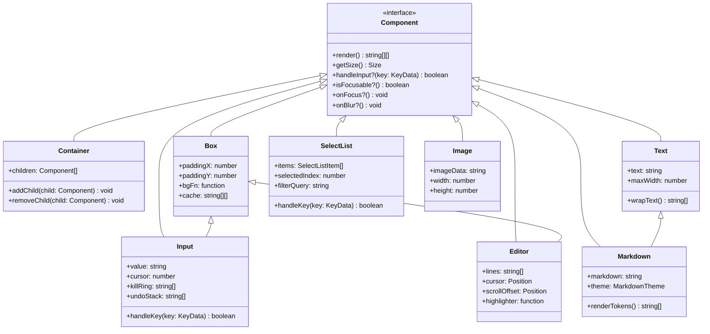

# 12. pi-tui 组件化架构与内置组件

问下大家，你有没有想过，终端 UI 组件是怎么实现的？

OpenClaw 刚开始以为终端组件很简单，就是打印字符。但深入了解 pi-tui 后发现，一个完整的终端组件要考虑的事情可多了：
- 尺寸计算
- 布局管理
- 样式渲染
- 键盘交互
- 状态管理

今天我们就来深入理解 pi-tui 的组件系统。

## 组件系统架构



## 核心组件详解

### 1. Box - 容器组件

Box 是最基础的容器组件，提供边框、内边距、背景等功能。

```typescript
// packages/tui/src/components/box.ts

export interface BoxOptions {
  /** 内边距 - 水平方向 */
  paddingX?: number;
  
  /** 内边距 - 垂直方向 */
  paddingY?: number;
  
  /** 背景函数，用于自定义背景 */
  bgFn?: (x: number, y: number, width: number, height: number) => string;
  
  /** 子组件 */
  children?: Component[];
}

export class Box implements Component {
  private options: BoxOptions;
  private cache: string[][] | null = null;
  
  constructor(options: BoxOptions = {}) {
    this.options = {
      paddingX: 0,
      paddingY: 0,
      ...options,
    };
  }
  
  /**
   * 渲染 Box
   */
  render(): string[][] {
    // 如果有缓存，直接返回
    if (this.cache) {
      return this.cache;
    }
    
    // 获取子组件的尺寸
    const childSizes = this.options.children?.map(c => c.getSize()) || [];
    
    // 计算 Box 尺寸
    const width = this.calculateWidth(childSizes);
    const height = this.calculateHeight(childSizes);
    
    // 创建缓冲区
    const buffer: string[][] = [];
    
    // 渲染背景
    for (let y = 0; y < height; y++) {
      const row: string[] = [];
      for (let x = 0; x < width; x++) {
        // 应用背景函数或默认背景
        const char = this.options.bgFn?.(x, y, width, height) || " ";
        row.push(char);
      }
      buffer.push(row);
    }
    
    // 渲染子组件
    if (this.options.children) {
      this.renderChildren(buffer, this.options.children);
    }
    
    // 缓存结果
    this.cache = buffer;
    
    return buffer;
  }
  
  /**
   * 计算宽度
   */
  private calculateWidth(childSizes: Size[]): number {
    const maxChildWidth = Math.max(...childSizes.map(s => s.width), 0);
    return maxChildWidth + this.options.paddingX! * 2;
  }
  
  /**
   * 计算高度
   */
  private calculateHeight(childSizes: Size[]): number {
    const totalChildHeight = childSizes.reduce((sum, s) => sum + s.height, 0);
    return totalChildHeight + this.options.paddingY! * 2;
  }
  
  /**
   * 渲染子组件
   */
  private renderChildren(buffer: string[][], children: Component[]): void {
    let currentY = this.options.paddingY!;
    
    for (const child of children) {
      const childBuffer = child.render();
      
      // 将子组件的内容合并到 buffer
      for (let y = 0; y < childBuffer.length; y++) {
        for (let x = 0; x < childBuffer[y].length; x++) {
          const targetX = x + this.options.paddingX!;
          const targetY = y + currentY;
          
          if (targetY < buffer.length && targetX < buffer[targetY].length) {
            buffer[targetY][targetX] = childBuffer[y][x];
          }
        }
      }
      
      currentY += childBuffer.length;
    }
  }
  
  /**
   * 获取尺寸
   */
  getSize(): Size {
    const buffer = this.render();
    return {
      width: buffer[0]?.length || 0,
      height: buffer.length,
    };
  }
  
  /**
   * 添加子组件
   */
  addChild(child: Component): void {
    this.options.children ||= [];
    this.options.children.push(child);
    this.cache = null;  // 清除缓存
  }
  
  /**
   * 移除子组件
   */
  removeChild(child: Component): void {
    const index = this.options.children?.indexOf(child);
    if (index !== undefined && index >= 0) {
      this.options.children!.splice(index, 1);
      this.cache = null;  // 清除缓存
    }
  }
}
```

**使用示例：**

```typescript
const box = new Box({
  paddingX: 2,
  paddingY: 1,
  bgFn: (x, y, w, h) => {
    // 创建边框效果
    if (x === 0 || x === w - 1) return "│";
    if (y === 0) return x === 0 ? "┌" : x === w - 1 ? "┐" : "─";
    if (y === h - 1) return x === 0 ? "└" : x === w - 1 ? "┘" : "─";
    return " ";
  },
});

box.addChild(new Text("Hello World"));
```

### 2. Text - 文本组件

Text 组件用于显示多行文本，支持自动换行和样式。

```typescript
// packages/tui/src/components/text.ts

export interface TextOptions {
  /** 最大宽度 */
  maxWidth?: number;
  
  /** 水平内边距 */
  paddingX?: number;
  
  /** 背景函数 */
  bgFn?: (x: number, y: number, width: number, height: number) => string;
}

export class Text implements Component {
  private text: string;
  private options: TextOptions;
  private cache: string[][] | null = null;
  
  constructor(text: string, options: TextOptions = {}) {
    this.text = text;
    this.options = {
      maxWidth: 80,
      paddingX: 0,
      ...options,
    };
  }
  
  /**
   * 渲染文本
   */
  render(): string[][] {
    if (this.cache) {
      return this.cache;
    }
    
    // 自动换行
    const lines = this.wrapText(this.text, this.options.maxWidth!);
    
    const buffer: string[][] = [];
    
    for (let y = 0; y < lines.length; y++) {
      const row: string[] = [];
      
      // 左内边距
      for (let x = 0; x < this.options.paddingX!; x++) {
        row.push(" ");
      }
      
      // 文本内容
      for (const char of lines[y]) {
        row.push(char);
      }
      
      // 右内边距
      while (row.length < this.options.maxWidth!) {
        row.push(" ");
      }
      
      buffer.push(row);
    }
    
    this.cache = buffer;
    return buffer;
  }
  
  /**
   * 自动换行
   */
  private wrapText(text: string, maxWidth: number): string[] {
    const lines: string[] = [];
    let currentLine = "";
    
    for (const word of text.split(" ")) {
      if (currentLine.length + word.length + 1 > maxWidth) {
        lines.push(currentLine);
        currentLine = word;
      } else {
        currentLine += (currentLine ? " " : "") + word;
      }
    }
    
    if (currentLine) {
      lines.push(currentLine);
    }
    
    return lines;
  }
  
  /**
   * 更新文本
   */
  setText(text: string): void {
    this.text = text;
    this.cache = null;  // 清除缓存
  }
  
  getSize(): Size {
    const buffer = this.render();
    return {
      width: buffer[0]?.length || 0,
      height: buffer.length,
    };
  }
}
```

### 3. Input - 输入组件

Input 是单行文本输入组件，支持丰富的键盘操作。

```typescript
// packages/tui/src/components/input.ts

export interface InputOptions {
  /** 占位符 */
  placeholder?: string;
  
  /** 最大宽度 */
  maxWidth?: number;
  
  /** 提交回调 */
  onSubmit?: (value: string) => void;
  
  /** 变化回调 */
  onChange?: (value: string) => void;
}

export class Input implements Component, Focusable {
  private value: string = "";
  private cursor: number = 0;
  private scrollOffset: number = 0;
  private options: InputOptions;
  private focused: boolean = false;
  
  // Kill Ring（Emacs 风格剪切）
  private killRing: string[] = [];
  
  // Undo 栈
  private undoStack: string[] = [];
  
  constructor(options: InputOptions = {}) {
    this.options = {
      maxWidth: 40,
      ...options,
    };
  }
  
  /**
   * 渲染输入框
   */
  render(): string[][] {
    const displayWidth = this.options.maxWidth!;
    const visibleText = this.getVisibleText(displayWidth);
    
    const row: string[] = [];
    
    // 显示内容或占位符
    const display = this.value || this.options.placeholder || "";
    const placeholderStyle = !this.value && this.options.placeholder;
    
    for (let i = 0; i < displayWidth; i++) {
      const char = visibleText[i] || " ";
      if (placeholderStyle) {
        row.push(gray(char));  // 占位符灰色显示
      } else {
        row.push(char);
      }
    }
    
    return [row];
  }
  
  /**
   * 获取可见文本（考虑滚动）
   */
  private getVisibleText(width: number): string {
    return this.value.slice(this.scrollOffset, this.scrollOffset + width);
  }
  
  /**
   * 处理键盘输入
   */
  handleKey(key: KeyData): boolean {
    // 保存到 Undo 栈
    this.undoStack.push(this.value);
    if (this.undoStack.length > 100) {
      this.undoStack.shift();
    }
    
    switch (key.key) {
      case "Enter":
        this.options.onSubmit?.(this.value);
        return true;
        
      case "Backspace":
        this.deleteCharBefore();
        return true;
        
      case "Delete":
        this.deleteCharAfter();
        return true;
        
      case "ArrowLeft":
        this.moveCursor(-1);
        return true;
        
      case "ArrowRight":
        this.moveCursor(1);
        return true;
        
      case "Home":
        this.cursor = 0;
        this.updateScroll();
        return true;
        
      case "End":
        this.cursor = this.value.length;
        this.updateScroll();
        return true;
        
      case "u":
        if (key.ctrl) {
          // Ctrl+U: 删除到行首
          this.killToStart();
          return true;
        }
        break;
        
      case "k":
        if (key.ctrl) {
          // Ctrl+K: 删除到行尾
          this.killToEnd();
          return true;
        }
        break;
        
      case "y":
        if (key.ctrl) {
          // Ctrl+Y: 粘贴（Yank）
          this.yank();
          return true;
        }
        break;
        
      case "_":
        if (key.ctrl) {
          // Ctrl+_: 撤销
          this.undo();
          return true;
        }
        break;
    }
    
    // 普通字符输入
    if (key.key.length === 1) {
      this.insertChar(key.key);
      return true;
    }
    
    return false;
  }
  
  /**
   * 插入字符
   */
  private insertChar(char: string): void {
    this.value = this.value.slice(0, this.cursor) + char + this.value.slice(this.cursor);
    this.cursor++;
    this.updateScroll();
    this.options.onChange?.(this.value);
  }
  
  /**
   * 删除光标前字符
   */
  private deleteCharBefore(): void {
    if (this.cursor > 0) {
      this.value = this.value.slice(0, this.cursor - 1) + this.value.slice(this.cursor);
      this.cursor--;
      this.updateScroll();
      this.options.onChange?.(this.value);
    }
  }
  
  /**
   * 删除到行首（Kill）
   */
  private killToStart(): void {
    const killed = this.value.slice(0, this.cursor);
    this.killRing.push(killed);
    this.value = this.value.slice(this.cursor);
    this.cursor = 0;
    this.updateScroll();
    this.options.onChange?.(this.value);
  }
  
  /**
   * 粘贴（Yank）
   */
  private yank(): void {
    const text = this.killRing[this.killRing.length - 1];
    if (text) {
      this.value = this.value.slice(0, this.cursor) + text + this.value.slice(this.cursor);
      this.cursor += text.length;
      this.updateScroll();
      this.options.onChange?.(this.value);
    }
  }
  
  /**
   * 撤销
   */
  private undo(): void {
    if (this.undoStack.length > 0) {
      this.value = this.undoStack.pop()!;
      this.cursor = this.value.length;
      this.updateScroll();
      this.options.onChange?.(this.value);
    }
  }
  
  /**
   * 更新滚动位置
   */
  private updateScroll(): void {
    const width = this.options.maxWidth!;
    
    if (this.cursor < this.scrollOffset) {
      this.scrollOffset = this.cursor;
    } else if (this.cursor >= this.scrollOffset + width) {
      this.scrollOffset = this.cursor - width + 1;
    }
  }
  
  isFocusable(): boolean {
    return true;
  }
  
  onFocus(): void {
    this.focused = true;
  }
  
  onBlur(): void {
    this.focused = false;
  }
  
  getSize(): Size {
    return { width: this.options.maxWidth!, height: 1 };
  }
}
```

### 4. Editor - 编辑器组件

Editor 是多行文本编辑器，支持语法高亮和复杂编辑。

```typescript
// packages/tui/src/components/editor.ts

export interface EditorOptions {
  /** 初始内容 */
  initialContent?: string;
  
  /** 宽度 */
  width?: number;
  
  /** 高度 */
  height?: number;
  
  /** 是否只读 */
  readonly?: boolean;
  
  /** 语法高亮函数 */
  highlighter?: (line: string) => string;
}

export class Editor implements Component, Focusable {
  private lines: string[] = [];
  private cursor: { line: number; col: number } = { line: 0, col: 0 };
  private options: EditorOptions;
  private scrollOffset: { x: number; y: number } = { x: 0, y: 0 };
  
  constructor(options: EditorOptions = {}) {
    this.options = {
      width: 80,
      height: 24,
      ...options,
    };
    
    if (options.initialContent) {
      this.lines = options.initialContent.split("\n");
    } else {
      this.lines = [""];
    }
  }
  
  /**
   * 渲染编辑器
   */
  render(): string[][] {
    const buffer: string[][] = [];
    const visibleHeight = this.options.height!;
    const visibleWidth = this.options.width!;
    
    // 渲染可见行
    for (let i = 0; i < visibleHeight; i++) {
      const lineIndex = this.scrollOffset.y + i;
      const line = this.lines[lineIndex] || "";
      const visibleLine = line.slice(this.scrollOffset.x, this.scrollOffset.x + visibleWidth);
      
      // 应用语法高亮
      const highlighted = this.options.highlighter?.(visibleLine) || visibleLine;
      
      const row: string[] = [];
      for (const char of highlighted) {
        row.push(char);
      }
      
      // 填充剩余空间
      while (row.length < visibleWidth) {
        row.push(" ");
      }
      
      buffer.push(row);
    }
    
    return buffer;
  }
  
  /**
   * 处理键盘输入
   */
  handleKey(key: KeyData): boolean {
    if (this.options.readonly) {
      return this.handleReadonlyKeys(key);
    }
    
    switch (key.key) {
      case "ArrowUp":
        this.moveCursor(0, -1);
        return true;
        
      case "ArrowDown":
        this.moveCursor(0, 1);
        return true;
        
      case "ArrowLeft":
        this.moveCursor(-1, 0);
        return true;
        
      case "ArrowRight":
        this.moveCursor(1, 0);
        return true;
        
      case "Enter":
        this.insertNewLine();
        return true;
        
      case "Backspace":
        this.deleteBefore();
        return true;
        
      case "Tab":
        this.insertTab();
        return true;
    }
    
    if (key.key.length === 1) {
      this.insertChar(key.key);
      return true;
    }
    
    return false;
  }
  
  /**
   * 移动光标
   */
  private moveCursor(dx: number, dy: number): void {
    const newLine = this.cursor.line + dy;
    const newCol = this.cursor.col + dx;
    
    if (newLine >= 0 && newLine < this.lines.length) {
      this.cursor.line = newLine;
      // 限制列位置
      this.cursor.col = Math.min(newCol, this.lines[newLine].length);
    }
    
    this.updateScroll();
  }
  
  /**
   * 插入新行
   */
  private insertNewLine(): void {
    const line = this.lines[this.cursor.line];
    const before = line.slice(0, this.cursor.col);
    const after = line.slice(this.cursor.col);
    
    this.lines[this.cursor.line] = before;
    this.lines.splice(this.cursor.line + 1, 0, after);
    
    this.cursor.line++;
    this.cursor.col = 0;
    this.updateScroll();
  }
  
  /**
   * 更新滚动位置
   */
  private updateScroll(): void {
    const visibleHeight = this.options.height!;
    const visibleWidth = this.options.width!;
    
    // 垂直滚动
    if (this.cursor.line < this.scrollOffset.y) {
      this.scrollOffset.y = this.cursor.line;
    } else if (this.cursor.line >= this.scrollOffset.y + visibleHeight) {
      this.scrollOffset.y = this.cursor.line - visibleHeight + 1;
    }
    
    // 水平滚动
    if (this.cursor.col < this.scrollOffset.x) {
      this.scrollOffset.x = this.cursor.col;
    } else if (this.cursor.col >= this.scrollOffset.x + visibleWidth) {
      this.scrollOffset.x = this.cursor.col - visibleWidth + 1;
    }
  }
  
  getSize(): Size {
    return {
      width: this.options.width!,
      height: this.options.height!,
    };
  }
  
  /**
   * 获取内容
   */
  getContent(): string {
    return this.lines.join("\n");
  }
  
  /**
   * 设置内容
   */
  setContent(content: string): void {
    this.lines = content.split("\n");
    this.cursor = { line: 0, col: 0 };
    this.scrollOffset = { x: 0, y: 0 };
  }
}
```

### 5. Markdown - Markdown 渲染组件

Markdown 组件用于在终端中渲染 Markdown 内容。

```typescript
// packages/tui/src/components/markdown.ts

export interface MarkdownTheme {
  heading?: (text: string, level: number) => string;
  link?: (text: string, url: string) => string;
  code?: (text: string) => string;
  codeBlock?: (text: string, lang?: string) => string;
  quote?: (text: string) => string;
  listBullet?: (text: string) => string;
  bold?: (text: string) => string;
  italic?: (text: string) => string;
}

export interface MarkdownOptions {
  /** 最大宽度 */
  maxWidth?: number;
  
  /** 主题 */
  theme?: MarkdownTheme;
}

export class Markdown implements Component {
  private markdown: string;
  private options: MarkdownOptions;
  private cache: string[][] | null = null;
  
  constructor(markdown: string, options: MarkdownOptions = {}) {
    this.markdown = markdown;
    this.options = {
      maxWidth: 80,
      theme: defaultTheme,
      ...options,
    };
  }
  
  /**
   * 渲染 Markdown
   */
  render(): string[][] {
    if (this.cache) {
      return this.cache;
    }
    
    // 解析 Markdown
    const tokens = marked.lexer(this.markdown);
    
    // 渲染为终端格式
    const lines = this.renderTokens(tokens);
    
    // 转换为缓冲区
    const buffer: string[][] = [];
    for (const line of lines) {
      const row: string[] = [];
      for (const char of line) {
        row.push(char);
      }
      buffer.push(row);
    }
    
    this.cache = buffer;
    return buffer;
  }
  
  /**
   * 渲染 Token
   */
  private renderTokens(tokens: Token[]): string[] {
    const lines: string[] = [];
    
    for (const token of tokens) {
      switch (token.type) {
        case "heading":
          lines.push(this.renderHeading(token.text, token.depth));
          break;
          
        case "paragraph":
          lines.push(...this.renderParagraph(token.text));
          break;
          
        case "code":
          lines.push(...this.renderCodeBlock(token.text, token.lang));
          break;
          
        case "list":
          lines.push(...this.renderList(token.items));
          break;
          
        case "blockquote":
          lines.push(...this.renderQuote(token.text));
          break;
      }
    }
    
    return lines;
  }
  
  /**
   * 渲染标题
   */
  private renderHeading(text: string, level: number): string {
    const prefix = "#".repeat(level) + " ";
    const styled = this.options.theme?.heading?.(text, level) || bold(text);
    return prefix + styled;
  }
  
  /**
   * 渲染代码块
   */
  private renderCodeBlock(code: string, lang?: string): string[] {
    const lines = code.split("\n");
    const styled = this.options.theme?.codeBlock?.(code, lang);
    
    if (styled) {
      return styled.split("\n");
    }
    
    // 默认样式
    return [
      "```" + (lang || ""),
      ...lines.map(line => "  " + dim(line)),
      "```",
    ];
  }
  
  /**
   * 更新 Markdown 内容
   */
  setMarkdown(markdown: string): void {
    this.markdown = markdown;
    this.cache = null;
  }
  
  getSize(): Size {
    const buffer = this.render();
    return {
      width: buffer[0]?.length || 0,
      height: buffer.length,
    };
  }
}
```

### 6. SelectList - 选择列表组件

SelectList 用于显示可选择的列表项。

```typescript
// packages/tui/src/components/select-list.ts

export interface SelectListItem {
  /** 主文本 */
  label: string;
  
  /** 描述（可选） */
  description?: string;
  
  /** 值 */
  value: string;
}

export interface SelectListOptions {
  /** 列表项 */
  items: SelectListItem[];
  
  /** 最大高度 */
  maxHeight?: number;
  
  /** 选择回调 */
  onSelect?: (item: SelectListItem) => void;
  
  /** 过滤回调 */
  onFilter?: (query: string) => void;
}

export class SelectList implements Component, Focusable {
  private options: SelectListOptions;
  private selectedIndex: number = 0;
  private scrollOffset: number = 0;
  private filterQuery: string = "";
  private filteredItems: SelectListItem[];
  
  constructor(options: SelectListOptions) {
    this.options = {
      maxHeight: 10,
      ...options,
    };
    this.filteredItems = options.items;
  }
  
  /**
   * 渲染选择列表
   */
  render(): string[][] {
    const buffer: string[][] = [];
    const visibleHeight = Math.min(
      this.options.maxHeight!,
      this.filteredItems.length
    );
    
    for (let i = 0; i < visibleHeight; i++) {
      const itemIndex = this.scrollOffset + i;
      const item = this.filteredItems[itemIndex];
      
      if (!item) break;
      
      const isSelected = itemIndex === this.selectedIndex;
      const row = this.renderItem(item, isSelected);
      buffer.push(row);
    }
    
    return buffer;
  }
  
  /**
   * 渲染单个项
   */
  private renderItem(item: SelectListItem, isSelected: boolean): string[] {
    const row: string[] = [];
    
    // 选择指示器
    row.push(isSelected ? "▶ " : "  ");
    
    // 主标签
    const label = isSelected ? inverse(item.label) : item.label;
    for (const char of label) {
      row.push(char);
    }
    
    // 描述
    if (item.description) {
      row.push(" ");
      const desc = dim(item.description);
      for (const char of desc) {
        row.push(char);
      }
    }
    
    return row;
  }
  
  /**
   * 处理键盘输入
   */
  handleKey(key: KeyData): boolean {
    switch (key.key) {
      case "ArrowUp":
        this.moveSelection(-1);
        return true;
        
      case "ArrowDown":
        this.moveSelection(1);
        return true;
        
      case "Enter":
        const selected = this.filteredItems[this.selectedIndex];
        if (selected) {
          this.options.onSelect?.(selected);
        }
        return true;
        
      case "Escape":
        // 取消选择
        return true;
        
      default:
        // 过滤输入
        if (key.key.length === 1) {
          this.filterQuery += key.key;
          this.applyFilter();
          return true;
        }
    }
    
    return false;
  }
  
  /**
   * 移动选择
   */
  private moveSelection(delta: number): void {
    const newIndex = this.selectedIndex + delta;
    
    if (newIndex >= 0 && newIndex < this.filteredItems.length) {
      this.selectedIndex = newIndex;
      this.updateScroll();
    }
  }
  
  /**
   * 应用过滤
   */
  private applyFilter(): void {
    this.filteredItems = this.options.items.filter(item =>
      item.label.toLowerCase().includes(this.filterQuery.toLowerCase())
    );
    this.selectedIndex = 0;
    this.scrollOffset = 0;
    this.options.onFilter?.(this.filterQuery);
  }
  
  /**
   * 更新滚动位置
   */
  private updateScroll(): void {
    const visibleHeight = this.options.maxHeight!;
    
    if (this.selectedIndex < this.scrollOffset) {
      this.scrollOffset = this.selectedIndex;
    } else if (this.selectedIndex >= this.scrollOffset + visibleHeight) {
      this.scrollOffset = this.selectedIndex - visibleHeight + 1;
    }
  }
  
  getSize(): Size {
    const buffer = this.render();
    return {
      width: buffer[0]?.length || 0,
      height: buffer.length,
    };
  }
}
```

## 组件组合示例

```typescript
import { TUI, Box, Text, Input, SelectList } from "@mariozechner/pi-tui";

// 创建表单
const form = new Box({ paddingX: 2, paddingY: 1 });

// 标题
form.addChild(new Text("User Registration", { style: { bold: true } }));

// 用户名输入
const usernameInput = new Input({
  placeholder: "Username",
  onSubmit: (value) => console.log("Username:", value),
});
form.addChild(usernameInput);

// 角色选择
const roleSelect = new SelectList({
  items: [
    { label: "Admin", value: "admin" },
    { label: "User", value: "user" },
    { label: "Guest", value: "guest" },
  ],
  onSelect: (item) => console.log("Role:", item.value),
});
form.addChild(roleSelect);

// 创建 TUI
const tui = new TUI();
tui.setMainComponent(form);
tui.start();
```

## 总结

pi-tui 的组件系统非常完善：

1. **Box** - 容器组件，支持内边距和背景
2. **Text** - 文本组件，支持自动换行
3. **Input** - 输入组件，支持 Emacs 风格快捷键
4. **Editor** - 编辑器组件，支持多行编辑
5. **Markdown** - Markdown 渲染组件
6. **SelectList** - 选择列表组件，支持过滤

每个组件都遵循统一的接口，可以灵活组合。

---

**下篇预告：**《pi-tui 终端交互与输入处理》 - 深入理解键盘事件和输入处理机制。
