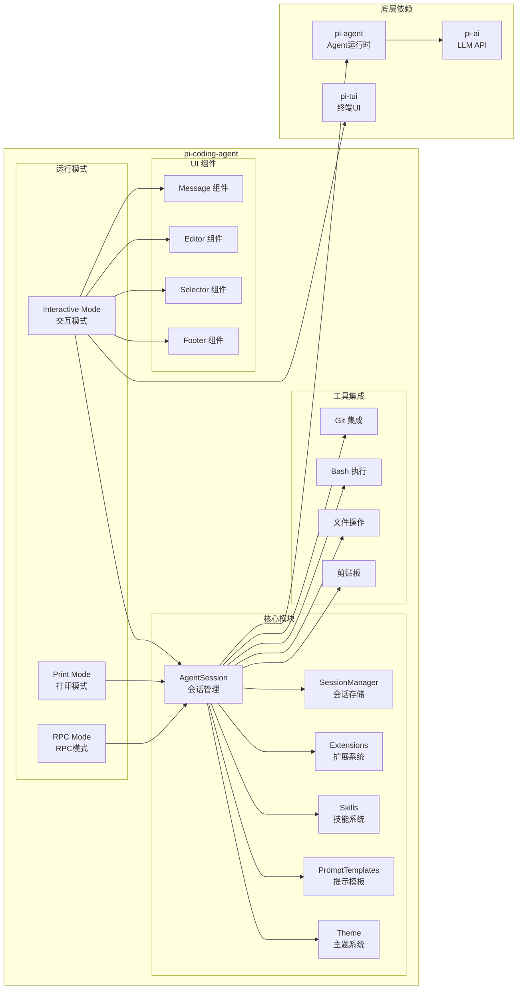
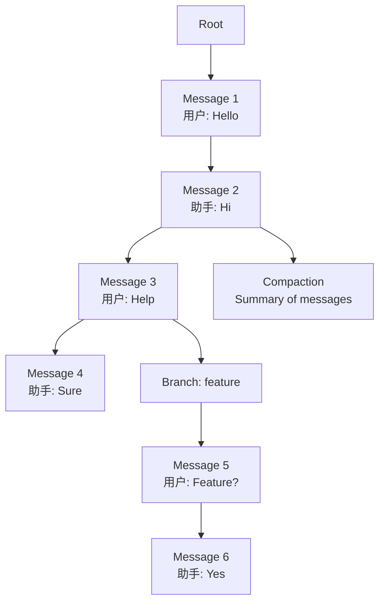

# 14. pi-coding-agent 架构解析

问下大家，你有没有用过 Claude Code、Aider 这些终端编码助手？

OpenClaw 用过之后发现，这些工具的核心能力都差不多：
- 读取和修改代码文件
- 执行 Shell 命令
- 与 Git 集成
- 管理对话历史

pi-coding-agent 就是 pi-mono 框架中基于 pi-agent 和 pi-tui 构建的**终端编码助手**。今天我们就来深入理解它的架构设计。

## pi-coding-agent 是什么？

pi-coding-agent 是一个**终端交互式编码 Agent**，它：

1. **基于 pi-agent** - 使用 Agent 运行时管理对话和工具调用
2. **基于 pi-tui** - 使用终端 UI 框架提供交互界面
3. **支持多种模式** - 交互模式、打印模式、RPC 模式
4. **高度可扩展** - 通过扩展系统和技能机制定制功能

## 架构概览



## 运行模式

### 1. 交互模式（Interactive Mode）

这是最主要的模式，提供完整的终端交互界面：

```typescript
// packages/coding-agent/src/modes/interactive/interactive-mode.ts

export class InteractiveMode {
  private tui: TUI;
  private session: AgentSession;

  async start(): Promise<void> {
    // 初始化 TUI
    this.tui = new TUI();

    // 初始化会话
    this.session = new AgentSession();
    await this.session.load();

    // 设置 UI 组件
    this.setupUI();

    // 启动事件循环
    this.tui.start();

    // 进入主循环
    await this.mainLoop();
  }

  private setupUI(): void {
    // 创建消息显示区域
    const messageArea = new MessageArea();
    this.tui.addComponent(messageArea);

    // 创建输入框
    const inputBox = new InputBox({
      onSubmit: (text) => this.handleUserInput(text),
    });
    this.tui.addComponent(inputBox);

    // 创建 Footer
    const footer = new Footer();
    this.tui.addComponent(footer);
  }

  private async handleUserInput(text: string): Promise<void> {
    // 添加到会话
    this.session.addUserMessage(text);

    // 运行 Agent
    const stream = this.session.run();

    // 显示流式响应
    for await (const event of stream) {
      this.tui.updateMessageArea(event);
    }
  }
}
```

### 2. 打印模式（Print Mode）

用于非交互式场景，直接输出到 stdout：

```typescript
// packages/coding-agent/src/modes/print-mode.ts

export class PrintMode {
  async run(input: string): Promise<void> {
    const session = new AgentSession();

    // 添加用户输入
    session.addUserMessage(input);

    // 运行并输出
    const stream = session.run();

    for await (const event of stream) {
      if (event.type === "message_update") {
        process.stdout.write(event.delta);
      }
    }

    console.log();  // 换行
  }
}

// 使用
// pi "请帮我创建一个 React 组件"
```

### 3. RPC 模式

用于与其他程序通信，通过 JSON Lines 协议：

```typescript
// packages/coding-agent/src/modes/rpc/rpc-mode.ts

export class RPCMode {
  async start(): Promise<void> {
    // 监听 stdin
    process.stdin.on("data", (data) => {
      const request = JSON.parse(data.toString());
      this.handleRequest(request);
    });
  }

  private async handleRequest(request: RPCRequest): Promise<void> {
    switch (request.method) {
      case "chat":
        const stream = this.session.run(request.params.message);
        for await (const event of stream) {
          this.sendResponse({ type: "event", data: event });
        }
        break;

      case "getSession":
        this.sendResponse({
          type: "session",
          data: this.session.getEntries(),
        });
        break;
    }
  }
}
```

## AgentSession - 会话核心

### 会话管理

AgentSession 是 pi-coding-agent 的核心类：

```typescript
// packages/coding-agent/src/core/agent-session.ts

export class AgentSession {
  private sessionManager: SessionManager;
  private agent: Agent;
  private currentBranch: string = "main";

  constructor(options: SessionOptions = {}) {
    this.sessionManager = new SessionManager();
    this.agent = new Agent({
      api: options.api || "openai/gpt-4o",
      tools: this.buildTools(),
    });
  }

  /**
   * 加载会话
   */
  async load(): Promise<void> {
    await this.sessionManager.load();

    // 恢复当前分支
    const info = this.sessionManager.getSessionInfo();
    this.currentBranch = info.currentBranch || "main";
  }

  /**
   * 添加用户消息
   */
  addUserMessage(content: string): void {
    this.sessionManager.addEntry({
      type: "message",
      role: "user",
      content,
      branch: this.currentBranch,
    });
  }

  /**
   * 运行 Agent
   */
  async *run(): AsyncGenerator<AgentMessageEvent> {
    // 获取当前分支的所有消息
    const entries = this.sessionManager.getBranchEntries(this.currentBranch);

    // 转换为 Agent 消息
    const messages = this.convertEntries(entries);

    // 运行 Agent
    const stream = this.agent.run(messages);

    // 转发事件并持久化
    for await (const event of stream) {
      yield event;

      // 持久化消息
      if (event.type === "message_end") {
        this.sessionManager.addEntry({
          type: "message",
          role: "assistant",
          content: event.finalContent,
          branch: this.currentBranch,
        });
      }
    }
  }

  /**
   * 构建工具列表
   */
  private buildTools(): Tool[] {
    return [
      this.createReadFileTool(),
      this.createWriteFileTool(),
      this.createBashTool(),
      this.createGitTool(),
      // ... 更多工具
    ];
  }
}
```

## SessionManager - 会话存储

### 会话条目

```typescript
// packages/coding-agent/src/core/session-manager.ts

export type SessionEntry =
  | MessageEntry
  | ModelChangeEntry
  | ThinkingLevelChangeEntry
  | CompactionEntry
  | BranchSummaryEntry
  | CustomEntry;

export interface MessageEntry {
  type: "message";
  id: string;
  parentId?: string;  // 父条目 ID
  branch: string;     // 分支名称
  role: "user" | "assistant";
  content: string;
  timestamp: number;
}

export interface ModelChangeEntry {
  type: "model_change";
  id: string;
  branch: string;
  model: string;
  timestamp: number;
}

export interface CompactionEntry {
  type: "compaction";
  id: string;
  branch: string;
  summary: string;    // 压缩后的摘要
  originalIds: string[];  // 被压缩的条目 ID
  timestamp: number;
}
```

### 树形结构

SessionEntry 通过 `parentId` 形成树形结构：



## 核心功能

### 1. 文件操作工具

```typescript
private createReadFileTool(): Tool {
  return {
    name: "read_file",
    description: "Read the contents of a file",
    parameters: {
      type: "object",
      properties: {
        path: { type: "string" },
        offset: { type: "number" },
        limit: { type: "number" },
      },
      required: ["path"],
    },
    execute: async (args) => {
      const { path, offset = 0, limit = 100 } = args;
      const content = await fs.readFile(path, "utf-8");
      const lines = content.split("\n");
      return lines.slice(offset, offset + limit).join("\n");
    },
  };
}

private createWriteFileTool(): Tool {
  return {
    name: "write_file",
    description: "Write content to a file",
    parameters: {
      type: "object",
      properties: {
        path: { type: "string" },
        content: { type: "string" },
      },
      required: ["path", "content"],
    },
    execute: async (args) => {
      const { path, content } = args;
      await fs.writeFile(path, content, "utf-8");
      return `File ${path} written successfully`;
    },
  };
}
```

### 2. Bash 执行工具

```typescript
private createBashTool(): Tool {
  return {
    name: "bash",
    description: "Execute a bash command",
    parameters: {
      type: "object",
      properties: {
        command: { type: "string" },
        timeout: { type: "number" },
      },
      required: ["command"],
    },
    execute: async (args) => {
      const { command, timeout = 60000 } = args;

      const result = await exec(command, { timeout });

      return JSON.stringify({
        stdout: result.stdout,
        stderr: result.stderr,
        exitCode: result.exitCode,
      });
    },
  };
}
```

### 3. Git 集成

```typescript
private createGitTool(): Tool {
  return {
    name: "git",
    description: "Execute git commands",
    parameters: {
      type: "object",
      properties: {
        command: { type: "string" },
      },
      required: ["command"],
    },
    execute: async (args) => {
      const { command } = args;
      const result = await exec(`git ${command}`);
      return result.stdout || result.stderr;
    },
  };
}
```

## UI 组件

### 消息显示组件

```typescript
// packages/coding-agent/src/modes/interactive/components/assistant-message.ts

export class AssistantMessageComponent implements Component {
  private content: string = "";
  private isStreaming: boolean = false;

  render(): string[][] {
    const lines = this.content.split("\n");
    const buffer: string[][] = [];

    // 渲染消息头部
    buffer.push(["┌", "─".repeat(78), "┐"]);

    // 渲染内容
    for (const line of lines) {
      const wrapped = wrapText(line, 76);
      for (const w of wrapped) {
        buffer.push(["│ ", w.padEnd(76), " │"]);
      }
    }

    // 渲染底部
    if (this.isStreaming) {
      buffer.push(["│ ", "...".padEnd(76), " │"]);
    }
    buffer.push(["└", "─".repeat(78), "┘"]);

    return buffer;
  }

  updateContent(content: string, isStreaming: boolean): void {
    this.content = content;
    this.isStreaming = isStreaming;
  }
}
```

### Footer 组件

```typescript
// packages/coding-agent/src/modes/interactive/components/footer.ts

export class FooterComponent implements Component {
  render(): string[][] {
    const shortcuts = [
      "Ctrl+S: Sessions",
      "Ctrl+M: Models",
      "Ctrl+T: Theme",
      "Ctrl+X: Exit",
    ];

    const line = shortcuts.join(" | ");

    return [[
      dim(line.padEnd(80)),
    ]];
  }
}
```

## 配置系统

### 配置文件

```typescript
// packages/coding-agent/src/config.ts

export interface Config {
  // API 配置
  api: string;
  apiKey?: string;

  // 模型配置
  model: string;
  thinkingLevel: "none" | "low" | "medium" | "high";

  // UI 配置
  theme: string;
  showThinking: boolean;

  // 行为配置
  autoCompact: boolean;
  compactThreshold: number;

  // 扩展配置
  extensions: string[];
}

export const defaultConfig: Config = {
  api: "openai/gpt-4o",
  model: "gpt-4o",
  thinkingLevel: "none",
  theme: "default",
  showThinking: false,
  autoCompact: true,
  compactThreshold: 50,
  extensions: [],
};

export async function loadConfig(): Promise<Config> {
  const configPath = path.join(os.homedir(), ".config", "pi", "config.json");

  try {
    const content = await fs.readFile(configPath, "utf-8");
    return { ...defaultConfig, ...JSON.parse(content) };
  } catch {
    return defaultConfig;
  }
}
```

## 总结

pi-coding-agent 是一个功能完善的终端编码助手：

1. **多模式支持** - 交互模式、打印模式、RPC 模式
2. **会话管理** - AgentSession + SessionManager 管理对话历史
3. **工具集成** - 文件操作、Bash 执行、Git 集成
4. **UI 组件** - 基于 pi-tui 的丰富组件
5. **可配置** - 主题、模型、行为等都可配置

在下一篇文章中，我们将深入会话管理和分支机制。

---

**下篇预告：**《会话管理与分支机制》 - 深入理解 pi-coding-agent 的会话存储和分支系统。
