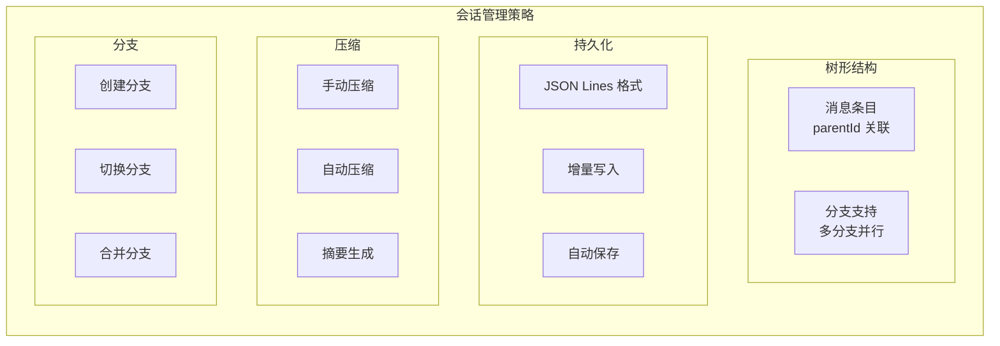
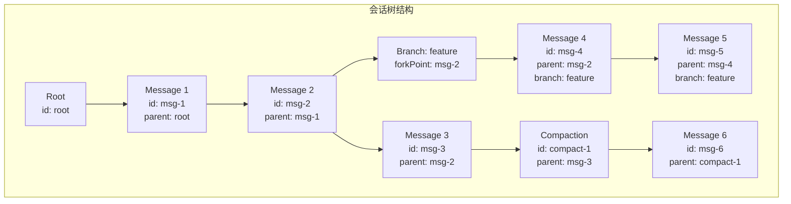

# 15. 会话管理与分支机制

> 状态说明：这是一篇 Session 树、分支和压缩机制的专题展开。
> 主线里的 [04-session-management.md](04-session-management.md) 已经补入“分支与压缩”的总览；如果你想看更细的树结构和条目类型，再回到本文。

问下大家，你有没有想过，编码助手的对话历史是怎么管理的？

OpenClaw 刚开始以为就是简单的数组存储，但深入了解 pi-coding-agent 后发现，它的会话管理非常强大：
- 支持**分支**（类似 Git 分支）
- 支持**压缩**（自动总结历史）
- 支持**切换**（在不同会话间切换）
- 支持**持久化**（保存到文件）

今天我们就来深入理解 pi-coding-agent 的会话管理系统。

## 会话管理的核心问题

### 为什么需要复杂的会话管理？

1. **上下文长度限制** - LLM 有 Token 限制，不能无限累积历史
2. **对话分支** - 用户可能想尝试不同的对话方向
3. **持久化** - 需要保存对话历史以便后续查看
4. **压缩** - 长对话需要压缩以节省 Token

### pi-coding-agent 的解决方案



## SessionManager 架构

### 核心数据结构

```typescript
// packages/coding-agent/src/core/session-manager.ts

export interface SessionManager {
  // 会话条目存储
  entries: Map<string, SessionEntry>;
  
  // 分支信息
  branches: Map<string, BranchInfo>;
  
  // 当前分支
  currentBranch: string;
  
  // 会话元数据
  metadata: SessionMetadata;
}

export interface SessionEntry {
  id: string;
  type: EntryType;
  parentId?: string;
  branch: string;
  timestamp: number;
  data: EntryData;
}

export type EntryType =
  | "message"
  | "model_change"
  | "thinking_level_change"
  | "compaction"
  | "branch_summary"
  | "custom";

export interface BranchInfo {
  name: string;
  headId: string;  // 分支最新条目 ID
  parentBranch?: string;  // 父分支
  forkPoint?: string;  // 分叉点
  createdAt: number;
}
```

### 树形结构实现



## 条目类型详解

### 1. Message Entry

```typescript
export interface MessageEntryData {
  role: "user" | "assistant";
  content: string;
  toolCalls?: ToolCall[];
  attachments?: Attachment[];
}

// 示例
{
  id: "msg-123",
  type: "message",
  parentId: "msg-122",
  branch: "main",
  timestamp: 1704067200000,
  data: {
    role: "user",
    content: "帮我创建一个 React 组件",
  },
}
```

### 2. Compaction Entry

```typescript
export interface CompactionEntryData {
  summary: string;  // 压缩后的摘要
  originalIds: string[];  // 被压缩的条目 ID
  tokenCount: number;  // 原始 Token 数
  summaryTokenCount: number;  // 摘要 Token 数
}

// 示例
{
  id: "compact-1",
  type: "compaction",
  parentId: "msg-100",
  branch: "main",
  timestamp: 1704067200000,
  data: {
    summary: "用户要求创建一个 React 组件，Agent 提供了多种实现方案...",
    originalIds: ["msg-50", "msg-51", ..., "msg-100"],
    tokenCount: 5000,
    summaryTokenCount: 200,
  },
}
```

### 3. Model Change Entry

```typescript
export interface ModelChangeEntryData {
  fromModel: string;
  toModel: string;
  reason?: string;
}

// 示例
{
  id: "model-1",
  type: "model_change",
  parentId: "msg-50",
  branch: "main",
  timestamp: 1704067200000,
  data: {
    fromModel: "openai/gpt-4o",
    toModel: "anthropic/claude-3-5-sonnet",
    reason: "需要更强的推理能力",
  },
}
```

## 分支机制

### 分支操作

```typescript
// packages/coding-agent/src/core/session-manager.ts

export class SessionManager {
  private branches: Map<string, BranchInfo> = new Map();
  private currentBranch: string = "main";
  
  /**
   * 创建新分支
   */
  createBranch(name: string, fromEntryId?: string): void {
    const parentBranch = this.currentBranch;
    const forkPoint = fromEntryId || this.getBranchHead(parentBranch);
    
    const branchInfo: BranchInfo = {
      name,
      headId: forkPoint,
      parentBranch,
      forkPoint,
      createdAt: Date.now(),
    };
    
    this.branches.set(name, branchInfo);
  }
  
  /**
   * 切换分支
   */
  switchBranch(name: string): void {
    if (!this.branches.has(name)) {
      throw new Error(`Branch ${name} does not exist`);
    }
    
    this.currentBranch = name;
  }
  
  /**
   * 获取分支的所有条目
   */
  getBranchEntries(branch: string): SessionEntry[] {
    const entries: SessionEntry[] = [];
    const branchInfo = this.branches.get(branch);
    
    if (!branchInfo) return entries;
    
    // 从分支 head 开始回溯
    let currentId: string | undefined = branchInfo.headId;
    
    while (currentId) {
      const entry = this.entries.get(currentId);
      if (!entry) break;
      
      entries.unshift(entry);  // 添加到开头
      
      // 如果到达分叉点，继续从父分支获取
      if (currentId === branchInfo.forkPoint && branchInfo.parentBranch) {
        const parentBranchInfo = this.branches.get(branchInfo.parentBranch);
        if (parentBranchInfo) {
          currentId = parentBranchInfo.headId;
          continue;
        }
      }
      
      currentId = entry.parentId;
    }
    
    return entries;
  }
  
  /**
   * 获取分支 head
   */
  getBranchHead(branch: string): string | undefined {
    return this.branches.get(branch)?.headId;
  }
  
  /**
   * 更新分支 head
   */
  updateBranchHead(branch: string, entryId: string): void {
    const branchInfo = this.branches.get(branch);
    if (branchInfo) {
      branchInfo.headId = entryId;
    }
  }
}
```

### 分支使用示例

```typescript
const sessionManager = new SessionManager();

// 初始对话
sessionManager.addEntry({
  type: "message",
  data: { role: "user", content: "创建一个按钮组件" },
});

// 创建 feature 分支
sessionManager.createBranch("feature");

// 在 feature 分支上继续
sessionManager.switchBranch("feature");
sessionManager.addEntry({
  type: "message",
  data: { role: "assistant", content: "使用 TypeScript 实现..." },
});

// 切换回 main
sessionManager.switchBranch("main");
sessionManager.addEntry({
  type: "message",
  data: { role: "assistant", content: "使用 JavaScript 实现..." },
});

// 现在有两个不同的实现方向！
```

## 压缩机制

### 手动压缩

```typescript
// packages/coding-agent/src/core/session-manager.ts

export class SessionManager {
  /**
   * 压缩条目
   */
  async compact(entryIds: string[], summary: string): Promise<string> {
    // 创建压缩条目
    const compactionEntry: SessionEntry = {
      id: generateId(),
      type: "compaction",
      parentId: this.getEntryParent(entryIds[0]),
      branch: this.currentBranch,
      timestamp: Date.now(),
      data: {
        summary,
        originalIds: entryIds,
        tokenCount: await this.calculateTokens(entryIds),
        summaryTokenCount: await this.calculateTokenCount(summary),
      },
    };
    
    // 添加压缩条目
    this.addEntry(compactionEntry);
    
    // 标记原始条目为已压缩（可选）
    for (const id of entryIds) {
      this.markAsCompacted(id);
    }
    
    return compactionEntry.id;
  }
  
  /**
   * 使用 LLM 自动生成摘要
   */
  async autoCompact(entryIds: string[]): Promise<string> {
    // 获取条目内容
    const entries = entryIds.map(id => this.entries.get(id));
    const content = entries
      .filter(e => e?.type === "message")
      .map(e => `${e.data.role}: ${e.data.content}`)
      .join("\n\n");
    
    // 调用 LLM 生成摘要
    const summary = await this.generateSummary(content);
    
    return this.compact(entryIds, summary);
  }
}
```

### 自动压缩

```typescript
// packages/coding-agent/src/core/agent-session.ts

export class AgentSession {
  private config: Config;
  
  constructor(config: Config) {
    this.config = config;
    
    // 如果启用自动压缩，设置监听器
    if (config.autoCompact) {
      this.setupAutoCompaction();
    }
  }
  
  private setupAutoCompaction(): void {
    this.onEntryAdded(() => {
      const entryCount = this.sessionManager.getEntryCount();
      
      // 超过阈值时自动压缩
      if (entryCount > this.config.compactThreshold) {
        this.autoCompact();
      }
    });
  }
  
  private async autoCompact(): Promise<void> {
    // 获取最旧的条目（排除最近的）
    const entriesToCompact = this.sessionManager.getOldestEntries(
      this.config.compactThreshold / 2
    );
    
    // 生成摘要
    await this.sessionManager.autoCompact(entriesToCompact);
  }
}
```

## 持久化存储

### JSON Lines 格式

```typescript
// packages/coding-agent/src/core/session-manager.ts

export class SessionManager {
  private sessionPath: string;
  
  constructor(sessionPath: string) {
    this.sessionPath = sessionPath;
  }
  
  /**
   * 加载会话
   */
  async load(): Promise<void> {
    if (!fs.existsSync(this.sessionPath)) {
      // 创建默认分支
      this.createBranch("main");
      return;
    }
    
    const content = await fs.readFile(this.sessionPath, "utf-8");
    const lines = content.split("\n").filter(line => line.trim());
    
    for (const line of lines) {
      try {
        const entry = JSON.parse(line);
        this.entries.set(entry.id, entry);
        
        // 恢复分支信息
        if (entry.type === "branch_summary") {
          this.branches.set(entry.data.name, entry.data);
        }
      } catch (e) {
        console.error("Failed to parse entry:", line);
      }
    }
  }
  
  /**
   * 保存会话（增量）
   */
  async save(): Promise<void> {
    // 只追加新条目
    const newEntries = this.getUnsavedEntries();
    
    const lines = newEntries.map(e => JSON.stringify(e)).join("\n");
    
    await fs.appendFile(this.sessionPath, lines + "\n");
    
    this.markAsSaved(newEntries);
  }
  
  /**
   * 完整保存（压缩）
   */
  async saveFull(): Promise<void> {
    const lines: string[] = [];
    
    // 保存所有条目
    for (const entry of this.entries.values()) {
      lines.push(JSON.stringify(entry));
    }
    
    // 保存分支信息
    for (const branch of this.branches.values()) {
      lines.push(JSON.stringify({
        type: "branch_summary",
        data: branch,
      }));
    }
    
    await fs.writeFile(this.sessionPath, lines.join("\n") + "\n");
  }
}
```

### 会话文件结构

```
~/.local/share/pi/sessions/
├── session-abc123.jsonl    # 会话文件
├── session-def456.jsonl
└── ...

session-abc123.jsonl 内容：
{"id":"root","type":"root","timestamp":1704067200000}
{"id":"msg-1","type":"message","parentId":"root","branch":"main","timestamp":1704067201000,"data":{"role":"user","content":"Hello"}}
{"id":"msg-2","type":"message","parentId":"msg-1","branch":"main","timestamp":1704067202000,"data":{"role":"assistant","content":"Hi!"}}
{"id":"branch-1","type":"branch_summary","data":{"name":"feature","headId":"msg-2","parentBranch":"main","forkPoint":"msg-2","createdAt":1704067203000}}
```

## 会话切换

### 会话管理器

```typescript
// packages/coding-agent/src/core/session-switcher.ts

export class SessionSwitcher {
  private sessionsDir: string;
  
  constructor() {
    this.sessionsDir = path.join(os.homedir(), ".local", "share", "pi", "sessions");
  }
  
  /**
   * 列出所有会话
   */
  async listSessions(): Promise<SessionInfo[]> {
    const files = await fs.readdir(this.sessionsDir);
    const sessions: SessionInfo[] = [];
    
    for (const file of files) {
      if (file.endsWith(".jsonl")) {
        const info = await this.getSessionInfo(file);
        sessions.push(info);
      }
    }
    
    return sessions.sort((a, b) => b.lastModified - a.lastModified);
  }
  
  /**
   * 创建新会话
   */
  async createSession(name?: string): Promise<string> {
    const id = generateId();
    const sessionName = name || `session-${id.slice(0, 8)}`;
    const sessionPath = path.join(this.sessionsDir, `${sessionName}.jsonl`);
    
    // 创建空会话文件
    await fs.writeFile(sessionPath, "\n");
    
    return sessionPath;
  }
  
  /**
   * 删除会话
   */
  async deleteSession(sessionPath: string): Promise<void> {
    await fs.unlink(sessionPath);
  }
  
  /**
   * 重命名会话
   */
  async renameSession(oldPath: string, newName: string): Promise<void> {
    const dir = path.dirname(oldPath);
    const newPath = path.join(dir, `${newName}.jsonl`);
    await fs.rename(oldPath, newPath);
  }
}
```

### UI 集成

```typescript
// 在交互模式中显示会话列表
async function showSessionSwitcher(): Promise<void> {
  const switcher = new SessionSwitcher();
  const sessions = await switcher.listSessions();
  
  const items = sessions.map(s => ({
    label: s.name,
    description: `${s.entryCount} messages, last modified ${formatTime(s.lastModified)}`,
    value: s.path,
  }));
  
  const selector = new SelectList({
    items: [
      { label: "Create new session", value: "new" },
      ...items,
    ],
    onSelect: async (item) => {
      if (item.value === "new") {
        const path = await switcher.createSession();
        await switchToSession(path);
      } else {
        await switchToSession(item.value);
      }
    },
  });
  
  tui.showOverlay(selector);
}
```

## 总结

pi-coding-agent 的会话管理系统非常强大：

1. **树形结构** - 使用 parentId 关联条目，支持复杂关系
2. **分支机制** - 类似 Git 的分支系统，支持多线探索
3. **压缩机制** - 手动和自动压缩，节省 Token
4. **持久化** - JSON Lines 格式，增量写入
5. **会话切换** - 支持多个会话管理和切换

这种设计让编码助手能够处理复杂的对话场景。

---

**下篇预告：**《提示模板与主题定制》 - 深入理解 pi-coding-agent 的提示系统和主题机制。
