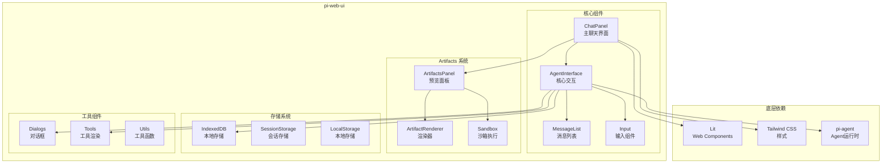
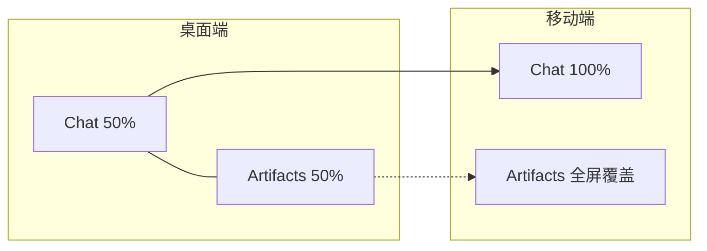

# 17. pi-web-ui 设计：Web 组件库架构

问下大家，你有没有想过，Web 版的 AI 聊天界面是怎么实现的？

OpenClaw 刚开始以为就是简单的 HTML + CSS，但深入了解 pi-web-ui 后发现，它是一个完整的 Web 组件库：
- 基于 **Lit** 的 Web Components
- 支持 **Artifacts**（代码预览）
- **IndexedDB** 本地存储
- 响应式布局

今天我们就来深入理解 pi-web-ui 的设计。

## pi-web-ui 是什么？

pi-web-ui 是 pi-mono 框架的 **Web UI 组件库**，它提供：

1. **ChatPanel** - 完整的聊天界面组件
2. **AgentInterface** - 核心聊天交互组件
3. **Artifacts** - 代码/内容预览系统
4. **Storage** - IndexedDB 本地存储
5. **Dialogs** - 对话框组件

## 架构概览



## 技术栈

### Lit - Web Components 框架

pi-web-ui 使用 **Lit** 构建 Web Components：

```typescript
// packages/web-ui/src/components/AgentInterface.ts

import { LitElement, html, css } from "lit";
import { customElement, property, state } from "lit/decorators.js";

@customElement("agent-interface")
export class AgentInterface extends LitElement {
  // 响应式属性
  @property({ type: String }) api = "openai/gpt-4o";
  @property({ type: Array }) tools: Tool[] = [];
  
  // 内部状态
  @state() private messages: Message[] = [];
  @state() private isStreaming = false;
  
  // 样式
  static styles = css`
    :host {
      display: flex;
      flex-direction: column;
      height: 100%;
    }
    
    .message-list {
      flex: 1;
      overflow-y: auto;
      padding: 1rem;
    }
    
    .input-area {
      border-top: 1px solid var(--border-color);
      padding: 1rem;
    }
  `;
  
  // 渲染
  render() {
    return html`
      <div class="message-list">
        ${this.messages.map(msg => this.renderMessage(msg))}
      </div>
      <div class="input-area">
        <message-input
          @submit="${this.handleSubmit}"
          ?disabled="${this.isStreaming}"
        ></message-input>
      </div>
    `;
  }
  
  private renderMessage(msg: Message) {
    return html`
      <message-item
        .message="${msg}"
        .isStreaming="${msg.id === this.currentMessageId}"
      ></message-item>
    `;
  }
  
  private async handleSubmit(e: CustomEvent) {
    const text = e.detail.text;
    await this.sendMessage(text);
  }
}
```

### Tailwind CSS - 样式系统

```typescript
// packages/web-ui/src/styles/tailwind.ts

import { css } from "lit";

export const tailwindStyles = css`
  /* Tailwind 基础样式 */
  @tailwind base;
  @tailwind components;
  @tailwind utilities;
  
  /* 自定义变量 */
  :host {
    --primary-color: #3b82f6;
    --secondary-color: #6b7280;
    --background-color: #ffffff;
    --surface-color: #f3f4f6;
    --border-color: #e5e7eb;
    --text-primary: #1f2937;
    --text-secondary: #6b7280;
    --error-color: #ef4444;
    --success-color: #22c55e;
  }
  
  /* 深色模式 */
  @media (prefers-color-scheme: dark) {
    :host {
      --background-color: #1a1a1a;
      --surface-color: #2d2d2d;
      --border-color: #404040;
      --text-primary: #ffffff;
      --text-secondary: #a0a0a0;
    }
  }
`;
```

## ChatPanel - 主聊天界面

### 组件结构

```typescript
// packages/web-ui/src/ChatPanel.ts

import { LitElement, html, css } from "lit";
import { customElement, property, state } from "lit/decorators.js";

@customElement("chat-panel")
export class ChatPanel extends LitElement {
  @property({ type: String }) api = "openai/gpt-4o";
  @property({ type: String }) title = "Chat";
  
  @state() private showArtifacts = false;
  @state() private currentArtifact: Artifact | null = null;
  @state() private isMobile = false;
  
  static styles = css`
    :host {
      display: flex;
      height: 100vh;
      width: 100vw;
    }
    
    .chat-container {
      flex: 1;
      display: flex;
      flex-direction: column;
      min-width: 0;
    }
    
    .artifacts-panel {
      width: 50%;
      border-left: 1px solid var(--border-color);
      display: none;
    }
    
    .artifacts-panel.visible {
      display: block;
    }
    
    /* 移动端适配 */
    @media (max-width: 768px) {
      .chat-container {
        width: 100%;
      }
      
      .artifacts-panel {
        position: fixed;
        top: 0;
        right: 0;
        width: 100%;
        height: 100%;
        z-index: 100;
        background: var(--background-color);
      }
      
      .artifacts-panel:not(.visible) {
        display: none;
      }
    }
  `;
  
  render() {
    return html`
      <div class="chat-container">
        <chat-header
          .title="${this.title}"
          @toggle-artifacts="${this.toggleArtifacts}"
        ></chat-header>
        
        <agent-interface
          .api="${this.api}"
          @artifact-created="${this.handleArtifact}"
        ></agent-interface>
      </div>
      
      <div class="artifacts-panel ${this.showArtifacts ? 'visible' : ''}">
        <artifacts-panel
          .artifact="${this.currentArtifact}"
          @close="${this.closeArtifacts}"
        ></artifacts-panel>
      </div>
    `;
  }
  
  private toggleArtifacts() {
    this.showArtifacts = !this.showArtifacts;
  }
  
  private handleArtifact(e: CustomEvent) {
    this.currentArtifact = e.detail.artifact;
    this.showArtifacts = true;
  }
  
  private closeArtifacts() {
    this.showArtifacts = false;
  }
  
  connectedCallback() {
    super.connectedCallback();
    
    // 监听窗口大小变化
    this.checkMobile();
    window.addEventListener("resize", () => this.checkMobile());
  }
  
  private checkMobile() {
    this.isMobile = window.innerWidth < 768;
  }
}
```

### 响应式布局



## AgentInterface - 核心交互

### 消息流管理

```typescript
// packages/web-ui/src/components/AgentInterface.ts

@customElement("agent-interface")
export class AgentInterface extends LitElement {
  @property({ type: String }) api = "openai/gpt-4o";
  @property({ type: Array }) tools: Tool[] = [];
  
  @state() private messages: Message[] = [];
  @state() private isStreaming = false;
  @state() private currentMessageId: string | null = null;
  
  private agent: Agent;
  private messageListRef: Ref<MessageList> = createRef();
  
  constructor() {
    super();
    this.agent = new Agent({
      api: this.api,
      tools: this.tools,
    });
  }
  
  /**
   * 发送消息
   */
  async sendMessage(text: string, attachments?: Attachment[]): Promise<void> {
    // 添加用户消息
    const userMessage: Message = {
      id: generateId(),
      role: "user",
      content: text,
      attachments,
      timestamp: Date.now(),
    };
    
    this.messages = [...this.messages, userMessage];
    
    // 创建助手消息占位
    const assistantMessageId = generateId();
    this.currentMessageId = assistantMessageId;
    
    const assistantMessage: Message = {
      id: assistantMessageId,
      role: "assistant",
      content: "",
      timestamp: Date.now(),
    };
    
    this.messages = [...this.messages, assistantMessage];
    this.isStreaming = true;
    
    // 运行 Agent
    const stream = this.agent.run({
      messages: this.messages,
    });
    
    // 处理流式响应
    for await (const event of stream) {
      await this.handleEvent(event, assistantMessageId);
    }
    
    this.isStreaming = false;
    this.currentMessageId = null;
  }
  
  /**
   * 处理事件
   */
  private async handleEvent(
    event: AgentMessageEvent,
    messageId: string
  ): Promise<void> {
    switch (event.type) {
      case "text_delta":
        this.appendToMessage(messageId, event.data);
        break;
        
      case "toolcall_start":
        this.addToolCall(messageId, event);
        break;
        
      case "toolcall_end":
        this.completeToolCall(messageId, event);
        break;
        
      case "artifact_created":
        this.dispatchEvent(new CustomEvent("artifact-created", {
          detail: { artifact: event.artifact },
        }));
        break;
    }
    
    // 自动滚动
    this.scrollToBottom();
  }
  
  /**
   * 追加内容到消息
   */
  private appendToMessage(messageId: string, text: string): void {
    this.messages = this.messages.map(msg => {
      if (msg.id === messageId) {
        return { ...msg, content: msg.content + text };
      }
      return msg;
    });
  }
  
  /**
   * 自动滚动到底部
   */
  private scrollToBottom(): void {
    if (this.messageListRef.value) {
      this.messageListRef.value.scrollToBottom();
    }
  }
  
  render() {
    return html`
      <div class="agent-interface">
        <message-list
          ${ref(this.messageListRef)}
          .messages="${this.messages}"
          .currentMessageId="${this.currentMessageId}"
        ></message-list>
        
        <input-area
          @submit="${(e: CustomEvent) => this.sendMessage(e.detail.text, e.detail.attachments)}"
          ?disabled="${this.isStreaming}"
        ></input-area>
      </div>
    `;
  }
}
```

## Storage - 本地存储

### IndexedDB 封装

```typescript
// packages/web-ui/src/storage/IndexedDBStorage.ts

const DB_NAME = "pi-chat";
const DB_VERSION = 1;

export class IndexedDBStorage {
  private db: IDBDatabase | null = null;
  
  /**
   * 初始化数据库
   */
  async init(): Promise<void> {
    return new Promise((resolve, reject) => {
      const request = indexedDB.open(DB_NAME, DB_VERSION);
      
      request.onerror = () => reject(request.error);
      request.onsuccess = () => {
        this.db = request.result;
        resolve();
      };
      
      request.onupgradeneeded = (event) => {
        const db = (event.target as IDBOpenDBRequest).result;
        
        // 创建消息存储
        if (!db.objectStoreNames.contains("messages")) {
          const store = db.createObjectStore("messages", { keyPath: "id" });
          store.createIndex("sessionId", "sessionId", { unique: false });
          store.createIndex("timestamp", "timestamp", { unique: false });
        }
        
        // 创建会话存储
        if (!db.objectStoreNames.contains("sessions")) {
          db.createObjectStore("sessions", { keyPath: "id" });
        }
        
        // 创建附件存储
        if (!db.objectStoreNames.contains("attachments")) {
          db.createObjectStore("attachments", { keyPath: "id" });
        }
      };
    });
  }
  
  /**
   * 保存消息
   */
  async saveMessage(message: Message): Promise<void> {
    if (!this.db) await this.init();
    
    return new Promise((resolve, reject) => {
      const transaction = this.db!.transaction(["messages"], "readwrite");
      const store = transaction.objectStore("messages");
      
      const request = store.put(message);
      request.onsuccess = () => resolve();
      request.onerror = () => reject(request.error);
    });
  }
  
  /**
   * 获取会话的所有消息
   */
  async getMessages(sessionId: string): Promise<Message[]> {
    if (!this.db) await this.init();
    
    return new Promise((resolve, reject) => {
      const transaction = this.db!.transaction(["messages"], "readonly");
      const store = transaction.objectStore("messages");
      const index = store.index("sessionId");
      
      const request = index.getAll(sessionId);
      request.onsuccess = () => {
        const messages = request.result as Message[];
        // 按时间排序
        messages.sort((a, b) => a.timestamp - b.timestamp);
        resolve(messages);
      };
      request.onerror = () => reject(request.error);
    });
  }
  
  /**
   * 删除消息
   */
  async deleteMessage(id: string): Promise<void> {
    if (!this.db) await this.init();
    
    return new Promise((resolve, reject) => {
      const transaction = this.db!.transaction(["messages"], "readwrite");
      const store = transaction.objectStore("messages");
      
      const request = store.delete(id);
      request.onsuccess = () => resolve();
      request.onerror = () => reject(request.error);
    });
  }
  
  /**
   * 清空会话
   */
  async clearSession(sessionId: string): Promise<void> {
    const messages = await this.getMessages(sessionId);
    
    for (const message of messages) {
      await this.deleteMessage(message.id);
    }
  }
}
```

## Dialogs - 对话框组件

### 对话框基类

```typescript
// packages/web-ui/src/dialogs/Dialog.ts

import { LitElement, html, css } from "lit";

export abstract class Dialog extends LitElement {
  static styles = css`
    .dialog-overlay {
      position: fixed;
      top: 0;
      left: 0;
      width: 100%;
      height: 100%;
      background: rgba(0, 0, 0, 0.5);
      display: flex;
      align-items: center;
      justify-content: center;
      z-index: 1000;
    }
    
    .dialog-content {
      background: var(--background-color);
      border-radius: 8px;
      padding: 1.5rem;
      max-width: 90%;
      max-height: 90%;
      overflow: auto;
    }
    
    .dialog-header {
      display: flex;
      justify-content: space-between;
      align-items: center;
      margin-bottom: 1rem;
    }
    
    .dialog-title {
      font-size: 1.25rem;
      font-weight: 600;
    }
    
    .dialog-close {
      background: none;
      border: none;
      cursor: pointer;
      font-size: 1.5rem;
    }
  `;
  
  abstract renderContent(): unknown;
  
  render() {
    return html`
      <div class="dialog-overlay" @click="${this.handleOverlayClick}">
        <div class="dialog-content" @click="${(e: Event) => e.stopPropagation()}">
          <div class="dialog-header">
            <span class="dialog-title">${this.title}</span>
            <button class="dialog-close" @click="${this.close}">×</button>
          </div>
          ${this.renderContent()}
        </div>
      </div>
    `;
  }
  
  private handleOverlayClick() {
    this.close();
  }
  
  close() {
    this.dispatchEvent(new CustomEvent("dialog-close"));
  }
}
```

### 模型选择对话框

```typescript
// packages/web-ui/src/dialogs/ModelSelectorDialog.ts

import { html } from "lit";
import { customElement, property } from "lit/decorators.js";
import { Dialog } from "./Dialog.js";

@customElement("model-selector-dialog")
export class ModelSelectorDialog extends Dialog {
  @property({ type: Array }) models: ModelOption[] = [];
  @property({ type: String }) selectedModel = "";
  
  title = "Select Model";
  
  renderContent() {
    return html`
      <div class="model-list">
        ${this.models.map(model => html`
          <div
            class="model-item ${model.id === this.selectedModel ? 'selected' : ''}"
            @click="${() => this.selectModel(model.id)}"
          >
            <div class="model-name">${model.name}</div>
            <div class="model-description">${model.description}</div>
          </div>
        `)}
      </div>
    `;
  }
  
  private selectModel(modelId: string) {
    this.dispatchEvent(new CustomEvent("model-selected", {
      detail: { modelId },
    }));
    this.close();
  }
}
```

## 使用示例

### 基础使用

```html
<!DOCTYPE html>
<html>
<head>
  <title>Pi Chat</title>
  <script type="module" src="./node_modules/@mariozechner/pi-web-ui/dist/index.js"></script>
  <style>
    body {
      margin: 0;
      height: 100vh;
    }
  </style>
</head>
<body>
  <chat-panel
    api="openai/gpt-4o"
    title="My Chat"
  ></chat-panel>
  
  <script>
    const panel = document.querySelector("chat-panel");
    
    // 监听事件
    panel.addEventListener("message-sent", (e) => {
      console.log("Message sent:", e.detail);
    });
    
    panel.addEventListener("artifact-created", (e) => {
      console.log("Artifact created:", e.detail.artifact);
    });
  </script>
</body>
</html>
```

### 自定义配置

```typescript
import { ChatPanel, IndexedDBStorage } from "@mariozechner/pi-web-ui";

// 初始化存储
const storage = new IndexedDBStorage();
await storage.init();

// 创建 ChatPanel
const panel = document.createElement("chat-panel");
panel.api = "anthropic/claude-3-5-sonnet-20241022";
panel.title = "Claude Chat";
panel.storage = storage;

// 添加自定义工具
panel.tools = [
  {
    name: "search_web",
    description: "Search the web",
    execute: async (args) => {
      // 实现搜索逻辑
      return "Search results...";
    },
  },
];

document.body.appendChild(panel);
```

## 总结

pi-web-ui 是一个功能完善的 Web UI 组件库：

1. **Lit 框架** - 使用现代 Web Components 技术
2. **ChatPanel** - 完整的聊天界面，支持响应式布局
3. **AgentInterface** - 核心交互组件，管理消息流
4. **Storage** - IndexedDB 本地存储，支持离线使用
5. **Dialogs** - 可扩展的对话框系统

在下一篇文章中，我们将深入 Artifacts 系统。

---

**下篇预告：**《Chat UI 与 Artifacts 实现》 - 深入理解消息渲染和代码预览系统。
