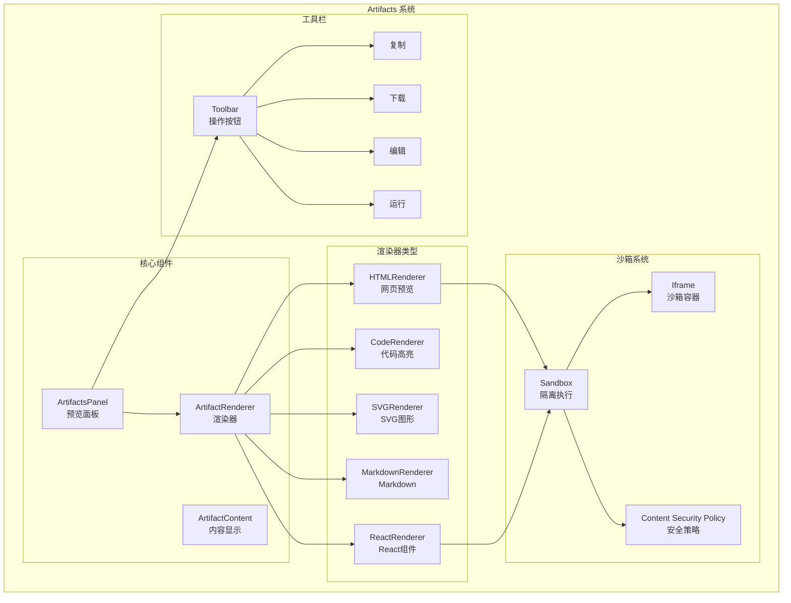

# 18. Chat UI 与 Artifacts 实现

问下大家，你有没有用过 Claude 的 Artifacts 功能？当你让 AI 生成代码时，它会显示在一个独立的窗口里，可以预览、编辑、甚至运行。

pi-web-ui 也提供了类似的 Artifacts 系统。今天我们就来深入理解它的实现。

## Artifacts 是什么？

Artifacts 是 AI 生成的**独立内容单元**，可以是：
- 代码片段（HTML、CSS、JavaScript、React 等）
- 文档（Markdown、文本）
- 数据（JSON、CSV）
- SVG 图形

### Artifacts 的优势

1. **独立显示** - 不混杂在对话中
2. **可交互** - 可以编辑、复制、下载
3. **可预览** - 代码可以实时预览效果
4. **版本管理** - 支持修改历史

## Artifacts 架构



## Artifacts 数据结构

### Artifact 类型定义

```typescript
// packages/web-ui/src/artifacts/types.ts

export interface Artifact {
  /** 唯一标识 */
  id: string;
  
  /** 标题 */
  title: string;
  
  /** 类型 */
  type: ArtifactType;
  
  /** 内容 */
  content: string;
  
  /** 语言（代码类型） */
  language?: string;
  
  /** 创建时间 */
  createdAt: number;
  
  /** 修改时间 */
  updatedAt: number;
  
  /** 版本历史 */
  versions?: ArtifactVersion[];
  
  /** 额外元数据 */
  metadata?: Record<string, unknown>;
}

export type ArtifactType =
  | "application/vnd.react"
  | "text/html"
  | "text/markdown"
  | "text/svg"
  | "application/json"
  | "text/code"
  | "text/plain";

export interface ArtifactVersion {
  /** 版本号 */
  version: number;
  
  /** 内容 */
  content: string;
  
  /** 修改时间 */
  timestamp: number;
  
  /** 修改说明 */
  comment?: string;
}
```

### 创建 Artifact

```typescript
// packages/web-ui/src/artifacts/ArtifactFactory.ts

export class ArtifactFactory {
  /**
   * 从代码创建 Artifact
   */
  static fromCode(
    title: string,
    language: string,
    content: string
  ): Artifact {
    const type = this.detectType(language);
    
    return {
      id: generateId(),
      title,
      type,
      language,
      content,
      createdAt: Date.now(),
      updatedAt: Date.now(),
      versions: [{
        version: 1,
        content,
        timestamp: Date.now(),
      }],
    };
  }
  
  /**
   * 检测 Artifact 类型
   */
  private static detectType(language: string): ArtifactType {
    const typeMap: Record<string, ArtifactType> = {
      "html": "text/html",
      "svg": "text/svg",
      "markdown": "text/markdown",
      "md": "text/markdown",
      "json": "application/json",
      "jsx": "application/vnd.react",
      "tsx": "application/vnd.react",
    };
    
    return typeMap[language.toLowerCase()] || "text/code";
  }
}
```

## ArtifactsPanel - 预览面板

### 组件实现

```typescript
// packages/web-ui/src/components/ArtifactsPanel.ts

import { LitElement, html, css } from "lit";
import { customElement, property, state } from "lit/decorators.js";

@customElement("artifacts-panel")
export class ArtifactsPanel extends LitElement {
  @property({ type: Object }) artifact: Artifact | null = null;
  
  @state() private activeTab: "preview" | "code" = "preview";
  @state() private isEditing = false;
  @state() private editContent = "";
  
  static styles = css`
    :host {
      display: flex;
      flex-direction: column;
      height: 100%;
      background: var(--background-color);
    }
    
    .header {
      display: flex;
      justify-content: space-between;
      align-items: center;
      padding: 0.75rem 1rem;
      border-bottom: 1px solid var(--border-color);
    }
    
    .title {
      font-weight: 600;
      font-size: 0.875rem;
    }
    
    .tabs {
      display: flex;
      gap: 0.5rem;
    }
    
    .tab {
      padding: 0.25rem 0.75rem;
      border-radius: 4px;
      cursor: pointer;
      font-size: 0.75rem;
    }
    
    .tab.active {
      background: var(--primary-color);
      color: white;
    }
    
    .toolbar {
      display: flex;
      gap: 0.5rem;
    }
    
    .toolbar button {
      padding: 0.25rem 0.5rem;
      border: 1px solid var(--border-color);
      border-radius: 4px;
      background: transparent;
      cursor: pointer;
      font-size: 0.75rem;
    }
    
    .toolbar button:hover {
      background: var(--surface-color);
    }
    
    .content {
      flex: 1;
      overflow: auto;
    }
    
    .empty {
      display: flex;
      align-items: center;
      justify-content: center;
      height: 100%;
      color: var(--text-secondary);
    }
  `;
  
  render() {
    if (!this.artifact) {
      return html`
        <div class="empty">
          <p>No artifact selected</p>
        </div>
      `;
    }
    
    return html`
      <div class="header">
        <span class="title">${this.artifact.title}</span>
        
        <div class="tabs">
          <div
            class="tab ${this.activeTab === 'preview' ? 'active' : ''}"
            @click="${() => this.setTab('preview')}"
          >
            Preview
          </div>
          <div
            class="tab ${this.activeTab === 'code' ? 'active' : ''}"
            @click="${() => this.setTab('code')}"
          >
            Code
          </div>
        </div>
        
        <div class="toolbar">
          <button @click="${this.copyContent}">Copy</button>
          <button @click="${this.downloadContent}">Download</button>
          ${this.canEdit() ? html`
            <button @click="${this.toggleEdit}">
              ${this.isEditing ? 'Save' : 'Edit'}
            </button>
          ` : ''}
        </div>
      </div>
      
      <div class="content">
        ${this.activeTab === 'preview' 
          ? this.renderPreview() 
          : this.renderCode()}
      </div>
    `;
  }
  
  private renderPreview() {
    if (this.isEditing) {
      return html`
        <textarea
          .value="${this.editContent}"
          @input="${(e: InputEvent) => this.editContent = (e.target as HTMLTextAreaElement).value}"
          style="width: 100%; height: 100%; border: none; padding: 1rem;"
        ></textarea>
      `;
    }
    
    return html`
      <artifact-renderer
        .artifact="${this.artifact}"
      ></artifact-renderer>
    `;
  }
  
  private renderCode() {
    return html`
      <code-viewer
        .code="${this.artifact?.content}"
        .language="${this.artifact?.language}"
      ></code-viewer>
    `;
  }
  
  private setTab(tab: "preview" | "code") {
    this.activeTab = tab;
  }
  
  private canEdit(): boolean {
    return ["text/code", "text/html", "text/markdown"].includes(
      this.artifact?.type || ""
    );
  }
  
  private toggleEdit() {
    if (this.isEditing) {
      // 保存编辑
      this.saveEdit();
    } else {
      // 开始编辑
      this.editContent = this.artifact?.content || "";
      this.isEditing = true;
    }
  }
  
  private saveEdit() {
    if (this.artifact) {
      this.artifact.content = this.editContent;
      this.artifact.updatedAt = Date.now();
      
      // 添加新版本
      const newVersion: ArtifactVersion = {
        version: (this.artifact.versions?.length || 0) + 1,
        content: this.editContent,
        timestamp: Date.now(),
      };
      
      this.artifact.versions = [
        ...(this.artifact.versions || []),
        newVersion,
      ];
      
      this.dispatchEvent(new CustomEvent("artifact-updated", {
        detail: { artifact: this.artifact },
      }));
    }
    
    this.isEditing = false;
  }
  
  private copyContent() {
    if (this.artifact) {
      navigator.clipboard.writeText(this.artifact.content);
      this.showToast("Copied to clipboard");
    }
  }
  
  private downloadContent() {
    if (this.artifact) {
      const blob = new Blob([this.artifact.content], { type: "text/plain" });
      const url = URL.createObjectURL(blob);
      const a = document.createElement("a");
      a.href = url;
      a.download = this.artifact.title;
      a.click();
      URL.revokeObjectURL(url);
    }
  }
  
  private showToast(message: string) {
    // 显示提示
    this.dispatchEvent(new CustomEvent("show-toast", {
      detail: { message },
    }));
  }
}
```

## ArtifactRenderer - 渲染器

### 渲染器基类

```typescript
// packages/web-ui/src/artifacts/renderers/ArtifactRenderer.ts

export abstract class ArtifactRenderer {
  /**
   * 检查是否支持该类型
   */
  abstract supports(type: ArtifactType): boolean;
  
  /**
   * 渲染 Artifact
   */
  abstract render(artifact: Artifact): HTMLElement;
  
  /**
   * 清理资源
   */
  cleanup?(): void;
}

// 渲染器注册表
const renderers: ArtifactRenderer[] = [];

export function registerRenderer(renderer: ArtifactRenderer): void {
  renderers.push(renderer);
}

export function getRenderer(type: ArtifactType): ArtifactRenderer | undefined {
  return renderers.find(r => r.supports(type));
}
```

### HTML 渲染器

```typescript
// packages/web-ui/src/artifacts/renderers/HTMLRenderer.ts

import { ArtifactRenderer } from "./ArtifactRenderer.js";

export class HTMLRenderer implements ArtifactRenderer {
  supports(type: ArtifactType): boolean {
    return type === "text/html";
  }
  
  render(artifact: Artifact): HTMLElement {
    const container = document.createElement("div");
    container.style.width = "100%";
    container.style.height = "100%";
    container.style.border = "none";
    
    // 使用 iframe 沙箱
    const iframe = document.createElement("iframe");
    iframe.style.width = "100%";
    iframe.style.height = "100%";
    iframe.style.border = "none";
    iframe.sandbox.add("allow-scripts");
    iframe.sandbox.add("allow-same-origin");
    
    // 写入内容
    const doc = iframe.contentDocument || iframe.contentWindow?.document;
    if (doc) {
      doc.open();
      doc.write(artifact.content);
      doc.close();
    }
    
    container.appendChild(iframe);
    return container;
  }
}

// 注册
registerRenderer(new HTMLRenderer());
```

### 代码渲染器

```typescript
// packages/web-ui/src/artifacts/renderers/CodeRenderer.ts

import { highlightCode } from "../../utils/highlight.js";

export class CodeRenderer implements ArtifactRenderer {
  supports(type: ArtifactType): boolean {
    return type === "text/code" || type === "application/json";
  }
  
  render(artifact: Artifact): HTMLElement {
    const container = document.createElement("div");
    container.className = "code-container";
    container.style.padding = "1rem";
    container.style.overflow = "auto";
    
    // 代码高亮
    const highlighted = highlightCode(
      artifact.content,
      artifact.language || "text"
    );
    
    const pre = document.createElement("pre");
    pre.style.margin = "0";
    pre.style.fontFamily = "monospace";
    pre.style.fontSize = "0.875rem";
    pre.style.lineHeight = "1.5";
    
    const code = document.createElement("code");
    code.innerHTML = highlighted;
    
    pre.appendChild(code);
    container.appendChild(pre);
    
    return container;
  }
}

registerRenderer(new CodeRenderer());
```

### React 渲染器

```typescript
// packages/web-ui/src/artifacts/renderers/ReactRenderer.ts

export class ReactRenderer implements ArtifactRenderer {
  supports(type: ArtifactType): boolean {
    return type === "application/vnd.react";
  }
  
  render(artifact: Artifact): HTMLElement {
    const container = document.createElement("div");
    container.style.width = "100%";
    container.style.height = "100%";
    
    const iframe = document.createElement("iframe");
    iframe.style.width = "100%";
    iframe.style.height = "100%";
    iframe.style.border = "none";
    iframe.sandbox.add("allow-scripts");
    
    // 构建完整的 HTML
    const html = this.buildReactHTML(artifact.content);
    
    const doc = iframe.contentDocument || iframe.contentWindow?.document;
    if (doc) {
      doc.open();
      doc.write(html);
      doc.close();
    }
    
    container.appendChild(iframe);
    return container;
  }
  
  private buildReactHTML(code: string): string {
    return `
      <!DOCTYPE html>
      <html>
        <head>
          <meta charset="UTF-8">
          <script src="https://unpkg.com/react@18/umd/react.development.js"></script>
          <script src="https://unpkg.com/react-dom@18/umd/react-dom.development.js"></script>
          <script src="https://unpkg.com/@babel/standalone/babel.min.js"></script>
        </head>
        <body>
          <div id="root"></div>
          <script type="text/babel">
            ${code}
            
            const root = ReactDOM.createRoot(document.getElementById('root'));
            root.render(<App />);
          </script>
        </body>
      </html>
    `;
  }
}

registerRenderer(new ReactRenderer());
```

## 消息中的 Artifacts

### 解析消息中的 Artifact

```typescript
// packages/web-ui/src/utils/artifact-parser.ts

const ARTIFACT_REGEX = /<artifact\s+type="([^"]+)"(?:\s+title="([^"]+)")?(?:\s+language="([^"]+)")?>([\s\S]*?)<\/artifact>/g;

export interface ParsedMessage {
  text: string;
  artifacts: Artifact[];
}

export function parseMessage(content: string): ParsedMessage {
  const artifacts: Artifact[] = [];
  let text = content;
  
  let match;
  while ((match = ARTIFACT_REGEX.exec(content)) !== null) {
    const [, type, title, language, artifactContent] = match;
    
    const artifact = ArtifactFactory.fromCode(
      title || "Untitled",
      language || type,
      artifactContent.trim()
    );
    
    artifacts.push(artifact);
    
    // 从文本中移除 artifact 标签
    text = text.replace(match[0], `[${artifact.title}]`);
  }
  
  return { text, artifacts };
}
```

### 消息组件集成

```typescript
// packages/web-ui/src/components/MessageItem.ts

@customElement("message-item")
export class MessageItem extends LitElement {
  @property({ type: Object }) message!: Message;
  
  render() {
    const { text, artifacts } = parseMessage(this.message.content);
    
    return html`
      <div class="message ${this.message.role}">
        <div class="avatar">
          ${this.message.role === "user" ? "👤" : "🤖"}
        </div>
        
        <div class="content">
          <div class="text">${this.renderMarkdown(text)}</div>
          
          ${artifacts.map(artifact => html`
            <artifact-card
              .artifact="${artifact}"
              @click="${() => this.openArtifact(artifact)}"
            ></artifact-card>
          `)}
        </div>
      </div>
    `;
  }
  
  private renderMarkdown(text: string): TemplateResult {
    // 渲染 Markdown
    const html = marked.parse(text);
    return html`${unsafeHTML(html)}`;
  }
  
  private openArtifact(artifact: Artifact) {
    this.dispatchEvent(new CustomEvent("artifact-open", {
      detail: { artifact },
    }));
  }
}
```

## 沙箱安全

### Content Security Policy

```typescript
// packages/web-ui/src/artifacts/sandbox.ts

export function createSandboxIframe(): HTMLIFrameElement {
  const iframe = document.createElement("iframe");
  
  // 设置 CSP
  iframe.setAttribute(
    "csp",
    "default-src 'self'; " +
    "script-src 'unsafe-inline' 'unsafe-eval' https://unpkg.com; " +
    "style-src 'unsafe-inline' https://unpkg.com; " +
    "img-src 'self' data: https:; " +
    "connect-src 'none'; " +
    "frame-src 'none';"
  );
  
  // 设置沙箱
  iframe.sandbox.add("allow-scripts");
  iframe.sandbox.add("allow-same-origin");
  // 不允许：allow-popups, allow-forms, allow-top-navigation
  
  return iframe;
}
```

## 总结

pi-web-ui 的 Artifacts 系统非常强大：

1. **多类型支持** - HTML、代码、Markdown、React 等
2. **独立渲染** - 每种类型有专门的渲染器
3. **沙箱安全** - 使用 iframe + CSP 隔离执行
4. **交互功能** - 复制、下载、编辑、版本管理
5. **消息集成** - 自动解析消息中的 Artifact

这种设计让 AI 生成的内容可以更好地展示和交互。

---

**至此，pi-web-ui 篇章完成！** 接下来可以进入扩展系统和技能机制的教程。
