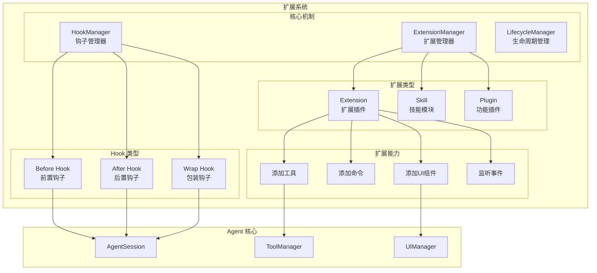

# 19. 扩展系统设计：Hooks 与插件机制

问下大家，你有没有想过，如何让编码助手支持自定义功能？

OpenClaw 刚开始以为只能修改源码，但深入了解 pi-coding-agent 后发现，它提供了强大的**扩展系统**：
- **Hooks** - 在关键节点插入自定义逻辑
- **Extensions** - 加载外部插件
- **Skills** - 预定义的功能模块

今天我们就来深入理解 pi-coding-agent 的扩展系统。

## 为什么需要扩展系统？

### 核心问题

1. **功能定制** - 不同用户有不同需求
2. **生态建设** - 让社区贡献功能
3. **核心精简** - 保持核心代码简洁
4. **热更新** - 无需重启即可加载新功能

### pi-coding-agent 的设计哲学

> "不内置太多功能，而是通过扩展系统让你自己添加"

这意味着：
- 没有内置 MCP
- 没有内置子 Agent
- 没有内置权限弹窗
- 没有内置计划模式

但你可以通过扩展实现这些！

## 扩展系统架构



## Hook 系统

### Hook 类型

```typescript
// packages/coding-agent/src/extensions/hooks.ts

export type HookType =
  | "beforeSendMessage"    // 发送消息前
  | "afterSendMessage"     // 发送消息后
  | "beforeToolCall"       // 工具调用前
  | "afterToolCall"        // 工具调用后
  | "beforeRender"         // 渲染前
  | "afterRender"          // 渲染后
  | "onSessionLoad"        // 会话加载时
  | "onSessionSave"        // 会话保存时
  | "onError";             // 发生错误时

export interface HookContext {
  /** 当前会话 */
  session: AgentSession;
  
  /** 配置 */
  config: Config;
  
  /** 数据 */
  data: Record<string, unknown>;
}

export type HookHandler<T = unknown> = (
  context: HookContext,
  data: T
) => Promise<T | void> | T | void;
```

### Hook 管理器

```typescript
// packages/coding-agent/src/extensions/hook-manager.ts

export class HookManager {
  private hooks: Map<HookType, HookHandler[]> = new Map();
  
  /**
   * 注册 Hook
   */
  register<T>(type: HookType, handler: HookHandler<T>): void {
    if (!this.hooks.has(type)) {
      this.hooks.set(type, []);
    }
    this.hooks.get(type)!.push(handler);
  }
  
  /**
   * 注销 Hook
   */
  unregister<T>(type: HookType, handler: HookHandler<T>): void {
    const handlers = this.hooks.get(type);
    if (handlers) {
      const index = handlers.indexOf(handler);
      if (index >= 0) {
        handlers.splice(index, 1);
      }
    }
  }
  
  /**
   * 执行 Hooks
   */
  async execute<T extends Record<string, unknown>>(
    type: HookType,
    context: HookContext,
    data: T
  ): Promise<T> {
    const handlers = this.hooks.get(type) || [];
    let result = data;
    
    for (const handler of handlers) {
      const handlerResult = await handler(context, result);
      if (handlerResult !== undefined) {
        result = { ...result, ...handlerResult };
      }
    }
    
    return result;
  }
  
  /**
   * 执行 Hooks（并行）
   */
  async executeParallel<T extends Record<string, unknown>>(
    type: HookType,
    context: HookContext,
    data: T
  ): Promise<T> {
    const handlers = this.hooks.get(type) || [];
    
    const results = await Promise.all(
      handlers.map(handler => handler(context, data))
    );
    
    // 合并结果
    return results.reduce((acc, result) => {
      if (result !== undefined) {
        return { ...acc, ...result };
      }
      return acc;
    }, data);
  }
}

// 全局实例
export const hookManager = new HookManager();
```

### 使用示例

```typescript
// 在 AgentSession 中触发 Hooks

export class AgentSession {
  async sendMessage(text: string): Promise<void> {
    // 触发 beforeSendMessage
    const context = { session: this, config: this.config, data: {} };
    const modified = await hookManager.execute("beforeSendMessage", context, {
      text,
    });
    
    // 使用修改后的文本
    const finalText = modified.text;
    
    // 发送消息...
    
    // 触发 afterSendMessage
    await hookManager.execute("afterSendMessage", context, {
      text: finalText,
      messageId: message.id,
    });
  }
}
```

## Extension 系统

### Extension 接口

```typescript
// packages/coding-agent/src/extensions/types.ts

export interface Extension {
  /** 扩展名称 */
  name: string;
  
  /** 版本 */
  version: string;
  
  /** 描述 */
  description?: string;
  
  /** 作者 */
  author?: string;
  
  /** 初始化函数 */
  init: (context: ExtensionContext) => Promise<void> | void;
  
  /** 清理函数 */
  destroy?: () => Promise<void> | void;
}

export interface ExtensionContext {
  /** Agent 会话 */
  session: AgentSession;
  
  /** Hook 管理器 */
  hooks: HookManager;
  
  /** 配置 */
  config: Config;
  
  /** 工具管理器 */
  tools: ToolManager;
  
  /** UI 管理器 */
  ui: UIManager;
  
  /** 日志 */
  logger: Logger;
}
```

### Extension 管理器

```typescript
// packages/coding-agent/src/extensions/extension-manager.ts

export class ExtensionManager {
  private extensions: Map<string, Extension> = new Map();
  private loadedExtensions: Set<string> = new Set();
  
  /**
   * 注册扩展
   */
  register(extension: Extension): void {
    if (this.extensions.has(extension.name)) {
      console.warn(`Extension ${extension.name} is already registered`);
      return;
    }
    
    this.extensions.set(extension.name, extension);
  }
  
  /**
   * 加载扩展
   */
  async load(name: string, context: ExtensionContext): Promise<void> {
    const extension = this.extensions.get(name);
    if (!extension) {
      throw new Error(`Extension ${name} not found`);
    }
    
    if (this.loadedExtensions.has(name)) {
      console.warn(`Extension ${name} is already loaded`);
      return;
    }
    
    try {
      await extension.init(context);
      this.loadedExtensions.add(name);
      context.logger.info(`Extension ${name} loaded`);
    } catch (error) {
      context.logger.error(`Failed to load extension ${name}:`, error);
      throw error;
    }
  }
  
  /**
   * 卸载扩展
   */
  async unload(name: string): Promise<void> {
    const extension = this.extensions.get(name);
    if (!extension) {
      return;
    }
    
    if (extension.destroy) {
      try {
        await extension.destroy();
      } catch (error) {
        console.error(`Error destroying extension ${name}:`, error);
      }
    }
    
    this.loadedExtensions.delete(name);
  }
  
  /**
   * 列出所有扩展
   */
  listExtensions(): Extension[] {
    return Array.from(this.extensions.values());
  }
  
  /**
   * 列出已加载的扩展
   */
  listLoadedExtensions(): string[] {
    return Array.from(this.loadedExtensions);
  }
}

export const extensionManager = new ExtensionManager();
```

## 扩展示例

### 示例 1：日志扩展

```typescript
// extensions/logger-extension.ts

import { Extension, ExtensionContext } from "@mariozechner/pi-coding-agent";

const loggerExtension: Extension = {
  name: "logger",
  version: "1.0.0",
  description: "Log all messages to file",
  
  init(context: ExtensionContext) {
    const logFile = path.join(os.homedir(), ".pi", "logs", "chat.log");
    
    // 注册 Hook
    context.hooks.register("afterSendMessage", async (ctx, data) => {
      const logEntry = `[${new Date().toISOString()}] User: ${data.text}\n`;
      await fs.appendFile(logFile, logEntry);
    });
    
    context.hooks.register("afterReceiveMessage", async (ctx, data) => {
      const logEntry = `[${new Date().toISOString()}] Assistant: ${data.text}\n`;
      await fs.appendFile(logFile, logEntry);
    });
    
    context.logger.info("Logger extension initialized");
  },
  
  destroy() {
    context.logger.info("Logger extension destroyed");
  },
};

export default loggerExtension;
```

### 示例 2：Git 集成扩展

```typescript
// extensions/git-extension.ts

const gitExtension: Extension = {
  name: "git-integration",
  version: "1.0.0",
  description: "Enhanced Git integration",
  
  init(context) {
    // 添加自定义工具
    context.tools.register({
      name: "git_diff",
      description: "Show git diff for a file",
      parameters: {
        type: "object",
        properties: {
          file: { type: "string" },
          staged: { type: "boolean" },
        },
      },
      execute: async (args) => {
        const { file, staged = false } = args;
        const flag = staged ? "--staged" : "";
        const result = await exec(`git diff ${flag} -- ${file}`);
        return result.stdout;
      },
    });
    
    // 添加 Hook
    context.hooks.register("beforeToolCall", async (ctx, data) => {
      if (data.toolName === "write_file") {
        // 在修改文件前创建 Git 备份
        const { path } = data.arguments;
        await exec(`git stash push -m "Auto-backup before edit" -- ${path}`);
      }
    });
  },
};

export default gitExtension;
```

### 示例 3：UI 扩展

```typescript
// extensions/ui-extension.ts

const uiExtension: Extension = {
  name: "custom-ui",
  version: "1.0.0",
  description: "Add custom UI components",
  
  init(context) {
    // 添加自定义命令
    context.ui.registerCommand({
      name: "clear",
      description: "Clear chat history",
      shortcut: "Ctrl+L",
      execute: () => {
        context.session.clearMessages();
      },
    });
    
    // 添加自定义组件
    context.ui.registerComponent({
      name: "status-bar",
      position: "footer",
      render: () => {
        return html`
          <div class="status-bar">
            <span>Model: ${context.config.model}</span>
            <span>Messages: ${context.session.getMessageCount()}</span>
          </div>
        `;
      },
    });
  },
};

export default uiExtension;
```

## 扩展加载

### 从文件加载

```typescript
// packages/coding-agent/src/extensions/loader.ts

export async function loadExtensionFromFile(
  filePath: string,
  context: ExtensionContext
): Promise<void> {
  // 动态导入
  const module = await import(filePath);
  const extension = module.default || module;
  
  // 验证扩展格式
  if (!extension.name || !extension.init) {
    throw new Error("Invalid extension format");
  }
  
  // 注册并加载
  extensionManager.register(extension);
  await extensionManager.load(extension.name, context);
}
```

### 从 npm 包加载

```typescript
// packages/coding-agent/src/extensions/loader.ts

export async function loadExtensionFromNpm(
  packageName: string,
  context: ExtensionContext
): Promise<void> {
  // 尝试从 node_modules 加载
  const modulePath = require.resolve(packageName, {
    paths: [
      path.join(process.cwd(), "node_modules"),
      path.join(os.homedir(), ".pi", "extensions", "node_modules"),
    ],
  });
  
  await loadExtensionFromFile(modulePath, context);
}
```

### 配置文件加载

```json
// ~/.config/pi/config.json
{
  "extensions": [
    "./extensions/logger-extension.ts",
    "@pi/extension-git",
    "@pi/extension-docker"
  ]
}
```

```typescript
// packages/coding-agent/src/extensions/loader.ts

export async function loadExtensionsFromConfig(
  config: Config,
  context: ExtensionContext
): Promise<void> {
  for (const extPath of config.extensions || []) {
    try {
      if (extPath.startsWith("@") || !extPath.startsWith(".")) {
        // npm 包
        await loadExtensionFromNpm(extPath, context);
      } else {
        // 本地文件
        const fullPath = path.resolve(extPath);
        await loadExtensionFromFile(fullPath, context);
      }
    } catch (error) {
      console.error(`Failed to load extension ${extPath}:`, error);
    }
  }
}
```

## UI 集成

### 扩展选择器

```typescript
// packages/coding-agent/src/modes/interactive/components/extension-selector.ts

export async function showExtensionSelector(): Promise<void> {
  const extensions = extensionManager.listExtensions();
  const loaded = extensionManager.listLoadedExtensions();
  
  const items = extensions.map(ext => ({
    label: ext.name,
    description: `${ext.description || ""} (${loaded.includes(ext.name) ? "loaded" : "not loaded"})`,
    value: ext.name,
    checked: loaded.includes(ext.name),
  }));
  
  const selector = new MultiSelectList({
    items,
    onConfirm: async (selected) => {
      // 卸载未选中的
      for (const name of loaded) {
        if (!selected.includes(name)) {
          await extensionManager.unload(name);
        }
      }
      
      // 加载选中的
      for (const name of selected) {
        if (!loaded.includes(name)) {
          await extensionManager.load(name, getExtensionContext());
        }
      }
    },
  });
  
  tui.showOverlay(selector);
}
```

## 总结

pi-coding-agent 的扩展系统非常灵活：

1. **Hook 系统** - 在关键节点插入自定义逻辑
2. **Extension 接口** - 标准化的扩展定义
3. **多种能力** - 添加工具、命令、UI 组件
4. **动态加载** - 支持文件和 npm 包
5. **生命周期** - 完整的初始化和清理机制

这种设计让 pi-coding-agent 既保持核心简洁，又能通过扩展实现丰富功能。

---

**下篇预告：**《技能系统：Skill 注册与执行》 - 深入理解预定义功能模块的实现。
