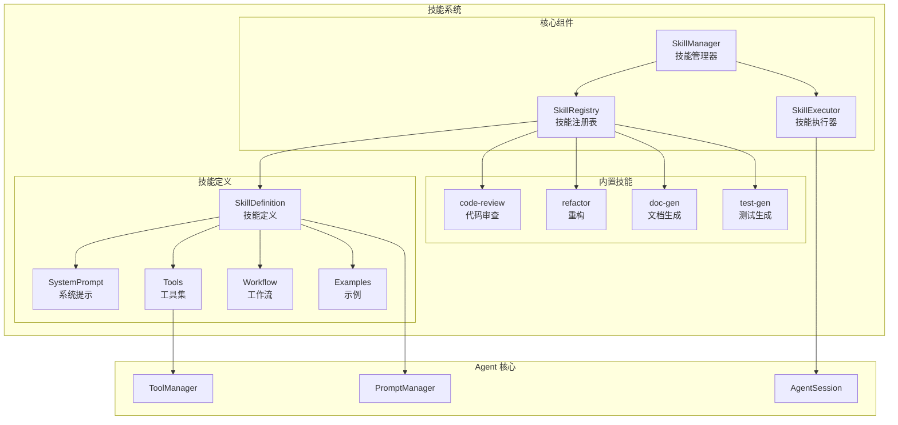

# 20. 技能系统：Skill 注册与执行

问下大家，你有没有想过，如何让编码助手快速获得特定领域的能力？

OpenClaw 刚开始以为只能训练模型，但深入了解 pi-coding-agent 后发现，它提供了**技能系统（Skill System）**：
- 预定义的**提示模板**
- 专用的**工具集**
- 特定的**工作流程**

今天我们就来深入理解 pi-coding-agent 的技能系统。

## 技能是什么？

技能（Skill）是**预打包的功能模块**，包含：

1. **系统提示** - 定义技能的行为和风格
2. **工具集** - 该技能需要的专用工具
3. **工作流** - 执行特定任务的步骤
4. **示例** - 少样本学习示例

### 技能 vs 扩展

| 特性 | Skill | Extension |
|-----|-------|-----------|
| 目的 | 特定任务能力 | 通用功能增强 |
| 复杂度 | 简单 | 复杂 |
| 开发成本 | 低 | 高 |
| 运行时切换 | 是 | 否 |
| 用户可创建 | 是 | 需要编程 |

## 技能系统架构



## 技能定义

### Skill 接口

```typescript
// packages/coding-agent/src/core/skills.ts

export interface Skill {
  /** 技能名称 */
  name: string;
  
  /** 显示名称 */
  displayName: string;
  
  /** 描述 */
  description: string;
  
  /** 系统提示 */
  systemPrompt: string;
  
  /** 工具列表 */
  tools?: Tool[];
  
  /** 示例 */
  examples?: SkillExample[];
  
  /** 工作流步骤 */
  workflow?: WorkflowStep[];
  
  /** 参数 */
  parameters?: SkillParameter[];
}

export interface SkillExample {
  /** 用户输入 */
  input: string;
  
  /** 预期输出 */
  output: string;
  
  /** 说明 */
  explanation?: string;
}

export interface WorkflowStep {
  /** 步骤名称 */
  name: string;
  
  /** 步骤描述 */
  description: string;
  
  /** 条件（可选） */
  condition?: string;
  
  /** 提示模板 */
  prompt: string;
}

export interface SkillParameter {
  /** 参数名 */
  name: string;
  
  /** 参数类型 */
  type: "string" | "number" | "boolean" | "array";
  
  /** 描述 */
  description: string;
  
  /** 是否必需 */
  required?: boolean;
  
  /** 默认值 */
  default?: unknown;
}
```

### 内置技能示例

```typescript
// packages/coding-agent/src/skills/code-review.ts

export const codeReviewSkill: Skill = {
  name: "code-review",
  displayName: "Code Review",
  description: "Review code for quality, bugs, and best practices",
  
  systemPrompt: `You are a code reviewer. Your job is to review code and provide constructive feedback.

Review criteria:
1. Code style and formatting
2. Potential bugs and edge cases
3. Security vulnerabilities
4. Performance issues
5. Best practices and design patterns
6. Readability and maintainability

Provide specific, actionable feedback with line numbers when possible.
Be constructive and educational in your reviews.`,

  tools: [
    {
      name: "read_file",
      description: "Read the file to review",
    },
    {
      name: "get_git_diff",
      description: "Get the diff of changes",
    },
  ],
  
  examples: [
    {
      input: "Review this function: function add(a, b) { return a + b; }",
      output: "The function looks good, but consider:\n1. Add type checking\n2. Add JSDoc comments\n3. Handle edge cases (NaN, Infinity)",
      explanation: "Basic function review with improvement suggestions",
    },
  ],
  
  workflow: [
    {
      name: "analyze",
      description: "Analyze the code structure",
      prompt: "First, understand the overall structure and purpose of the code.",
    },
    {
      name: "review",
      description: "Review line by line",
      prompt: "Now review the code line by line, looking for issues.",
    },
    {
      name: "summarize",
      description: "Summarize findings",
      prompt: "Summarize your findings with specific recommendations.",
    },
  ],
};
```

## 技能管理器

### SkillManager 实现

```typescript
// packages/coding-agent/src/core/skills.ts

export class SkillManager {
  private skills: Map<string, Skill> = new Map();
  private activeSkill: string | null = null;
  
  constructor() {
    // 注册内置技能
    this.registerBuiltInSkills();
  }
  
  /**
   * 注册技能
   */
  register(skill: Skill): void {
    this.skills.set(skill.name, skill);
  }
  
  /**
   * 获取技能
   */
  get(name: string): Skill | undefined {
    return this.skills.get(name);
  }
  
  /**
   * 列出所有技能
   */
  list(): Skill[] {
    return Array.from(this.skills.values());
  }
  
  /**
   * 激活技能
   */
  activate(name: string): void {
    if (!this.skills.has(name)) {
      throw new Error(`Skill ${name} not found`);
    }
    this.activeSkill = name;
  }
  
  /**
   * 获取当前激活的技能
   */
  getActive(): Skill | null {
    if (!this.activeSkill) return null;
    return this.skills.get(this.activeSkill) || null;
  }
  
  /**
   * 停用技能
   */
  deactivate(): void {
    this.activeSkill = null;
  }
  
  /**
   * 检查是否有激活的技能
   */
  hasActive(): boolean {
    return this.activeSkill !== null;
  }
  
  /**
   * 获取技能的系统提示
   */
  getSystemPrompt(): string {
    const skill = this.getActive();
    if (!skill) return "";
    
    let prompt = skill.systemPrompt;
    
    // 添加示例
    if (skill.examples && skill.examples.length > 0) {
      prompt += "\n\nExamples:\n";
      for (const example of skill.examples) {
        prompt += `\nInput: ${example.input}\n`;
        prompt += `Output: ${example.output}\n`;
        if (example.explanation) {
          prompt += `Explanation: ${example.explanation}\n`;
        }
      }
    }
    
    return prompt;
  }
  
  /**
   * 获取技能的工具
   */
  getTools(): Tool[] {
    const skill = this.getActive();
    return skill?.tools || [];
  }
  
  /**
   * 注册内置技能
   */
  private registerBuiltInSkills(): void {
    this.register(codeReviewSkill);
    this.register(refactorSkill);
    this.register(docGenSkill);
    this.register(testGenSkill);
  }
}

export const skillManager = new SkillManager();
```

## 技能执行

### 执行流程

```typescript
// packages/coding-agent/src/core/skill-executor.ts

export class SkillExecutor {
  private session: AgentSession;
  private skillManager: SkillManager;
  
  constructor(session: AgentSession) {
    this.session = session;
    this.skillManager = skillManager;
  }
  
  /**
   * 使用技能执行任务
   */
  async execute(userInput: string): Promise<void> {
    const skill = this.skillManager.getActive();
    if (!skill) {
      throw new Error("No active skill");
    }
    
    // 1. 准备上下文
    const context = this.prepareContext(skill, userInput);
    
    // 2. 如果有工作流，按步骤执行
    if (skill.workflow && skill.workflow.length > 0) {
      await this.executeWorkflow(skill.workflow, context);
    } else {
      // 3. 否则直接执行
      await this.executeDirect(context);
    }
  }
  
  /**
   * 准备上下文
   */
  private prepareContext(skill: Skill, userInput: string): SkillContext {
    // 构建系统提示
    const systemPrompt = this.skillManager.getSystemPrompt();
    
    // 获取工具
    const tools = this.skillManager.getTools();
    
    return {
      systemPrompt,
      userInput,
      tools,
      parameters: {},
    };
  }
  
  /**
   * 执行工作流
   */
  private async executeWorkflow(
    steps: WorkflowStep[],
    context: SkillContext
  ): Promise<void> {
    for (const step of steps) {
      // 检查条件
      if (step.condition && !this.evaluateCondition(step.condition, context)) {
        continue;
      }
      
      // 执行步骤
      const stepPrompt = `${step.prompt}\n\n${context.userInput}`;
      
      await this.session.sendMessage(stepPrompt);
      
      // 等待完成
      await this.waitForCompletion();
    }
  }
  
  /**
   * 直接执行
   */
  private async executeDirect(context: SkillContext): Promise<void> {
    // 添加系统提示到消息
    const messageWithContext = `[System: ${context.systemPrompt}]\n\n${context.userInput}`;
    
    await this.session.sendMessage(messageWithContext);
  }
  
  /**
   * 评估条件
   */
  private evaluateCondition(condition: string, context: SkillContext): boolean {
    // 简化实现，实际可以使用表达式引擎
    try {
      return new Function("context", `return ${condition}`)(context);
    } catch {
      return false;
    }
  }
  
  /**
   * 等待完成
   */
  private async waitForCompletion(): Promise<void> {
    // 等待 Agent 完成响应
    return new Promise((resolve) => {
      const check = () => {
        if (!this.session.isStreaming()) {
          resolve();
        } else {
          setTimeout(check, 100);
        }
      };
      check();
    });
  }
}
```

## 技能使用示例

### 代码审查技能

```typescript
// 用户激活技能
skillManager.activate("code-review");

// 用户输入
await session.sendMessage("Review src/utils/helper.ts");

// Agent 会使用 code-review 技能的系统提示和工具
// 输出详细的代码审查报告
```

### 重构技能

```typescript
export const refactorSkill: Skill = {
  name: "refactor",
  displayName: "Refactor",
  description: "Refactor code to improve quality",
  
  systemPrompt: `You are a refactoring expert. Your job is to improve code quality while maintaining functionality.

Refactoring goals:
1. Improve readability
2. Reduce complexity
3. Remove duplication
4. Improve naming
5. Apply design patterns

Always explain your changes and provide the refactored code.`,

  tools: [
    { name: "read_file", description: "Read the file to refactor" },
    { name: "write_file", description: "Write the refactored code" },
  ],
  
  workflow: [
    {
      name: "analyze",
      description: "Analyze the current code",
      prompt: "Analyze the code and identify refactoring opportunities.",
    },
    {
      name: "plan",
      description: "Plan the refactoring",
      prompt: "Create a refactoring plan with specific steps.",
    },
    {
      name: "execute",
      description: "Execute the refactoring",
      prompt: "Apply the refactoring changes.",
    },
    {
      name: "verify",
      description: "Verify the changes",
      prompt: "Verify that the refactored code maintains the same functionality.",
    },
  ],
};
```

### 文档生成技能

```typescript
export const docGenSkill: Skill = {
  name: "doc-gen",
  displayName: "Documentation Generator",
  description: "Generate documentation for code",
  
  systemPrompt: `You are a technical writer. Your job is to generate clear, comprehensive documentation.

Documentation types:
1. API documentation
2. README files
3. Code comments
4. Usage examples
5. Architecture diagrams

Follow best practices for technical writing.`,

  parameters: [
    {
      name: "format",
      type: "string",
      description: "Documentation format (markdown, jsdoc, etc.)",
      default: "markdown",
    },
    {
      name: "includeExamples",
      type: "boolean",
      description: "Include code examples",
      default: true,
    },
  ],
};
```

## 自定义技能

### 创建自定义技能

```typescript
// skills/my-custom-skill.ts

import { Skill } from "@mariozechner/pi-coding-agent";

const mySkill: Skill = {
  name: "my-skill",
  displayName: "My Custom Skill",
  description: "Description of what this skill does",
  
  systemPrompt: `You are an expert in [domain].

Your task is to [specific task].

Guidelines:
1. [Guideline 1]
2. [Guideline 2]
3. [Guideline 3]`,

  tools: [
    {
      name: "my_custom_tool",
      description: "Description of the tool",
    },
  ],
  
  examples: [
    {
      input: "Example input",
      output: "Example output",
    },
  ],
};

export default mySkill;
```

### 加载自定义技能

```typescript
// 在配置中加载
{
  "skills": [
    "./skills/my-custom-skill.ts"
  ]
}

// 动态加载
import mySkill from "./skills/my-custom-skill.ts";
skillManager.register(mySkill);
```

## UI 集成

### 技能选择器

```typescript
// packages/coding-agent/src/modes/interactive/components/skill-selector.ts

export async function showSkillSelector(): Promise<void> {
  const skills = skillManager.list();
  const active = skillManager.getActive();
  
  const items = skills.map(skill => ({
    label: skill.displayName,
    description: skill.description,
    value: skill.name,
    selected: skill.name === active?.name,
  }));
  
  const selector = new SelectList({
    items: [
      { label: "No Skill", value: "none", selected: !active },
      ...items,
    ],
    onSelect: (item) => {
      if (item.value === "none") {
        skillManager.deactivate();
      } else {
        skillManager.activate(item.value);
      }
      
      footer.showMessage(`Skill: ${item.label}`);
    },
  });
  
  tui.showOverlay(selector);
}
```

### Footer 显示

```typescript
// 在 Footer 显示当前技能
function renderFooter(): string {
  const activeSkill = skillManager.getActive();
  const skillText = activeSkill 
    ? `[Skill: ${activeSkill.displayName}]` 
    : "";
  
  return `${skillText} [Ctrl+K: Skills]`;
}
```

## 总结

pi-coding-agent 的技能系统非常实用：

1. **Skill 定义** - 系统提示、工具、示例、工作流
2. **SkillManager** - 注册、激活、管理技能
3. **SkillExecutor** - 按工作流执行或直接使用
4. **内置技能** - 代码审查、重构、文档生成等
5. **自定义技能** - 用户可创建自己的技能

这种设计让编码助手能够快速获得特定领域的能力。

---

**至此，扩展系统篇章完成！** 接下来可以进入学习心得篇章。
