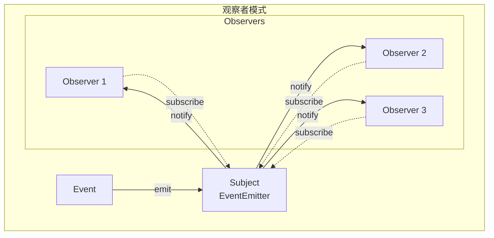
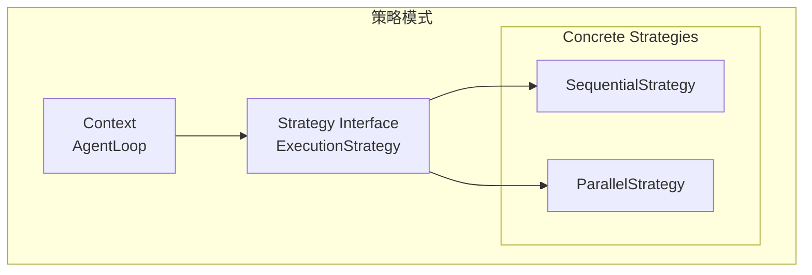
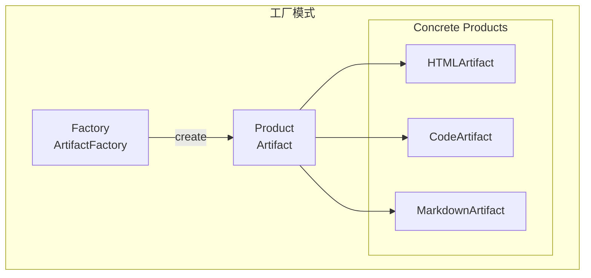
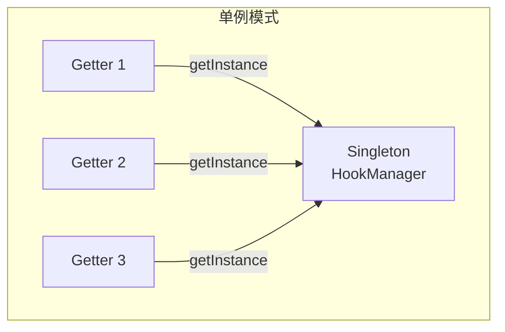
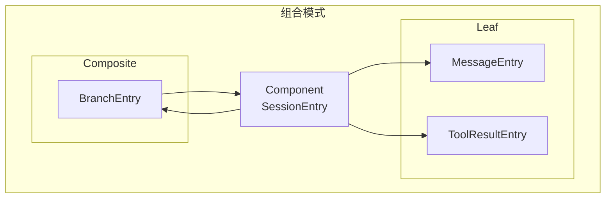
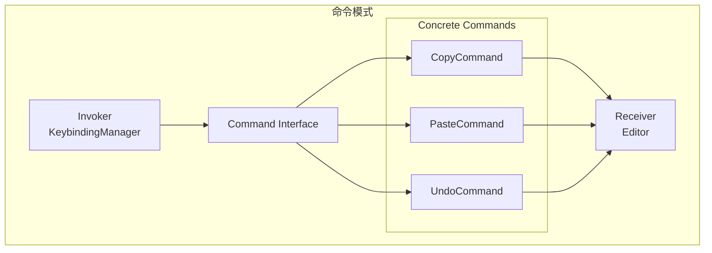

# 21. 从源码中学到的设计模式

问下大家，你有没有想过，优秀的开源项目都用了哪些设计模式？

OpenClaw 在阅读 pi-mono 源码的过程中，发现了很多经典的设计模式。今天我们就来总结一下，从 pi-mono 中学到的设计模式。

## 1. 适配器模式（Adapter Pattern）

### 应用场景

pi-ai 需要统一 20+ LLM 提供商的 API，这就是典型的适配器模式。

```mermaid
graph TB
    subgraph "适配器模式"
        Client[Client<br/>stream()]
        Target[Target<br/>ApiProvider]
        
        subgraph "Adapters"
            A1[OpenAIAdapter]
            A2[AnthropicAdapter]
            A3[GoogleAdapter]
        end
        
        subgraph "Adaptees"
            O1[OpenAI API]
            O2[Anthropic API]
            O3[Google API]
        end
    end
    
    Client --> Target
    Target --> A1
    Target --> A2
    Target --> A3
    A1 --> O1
    A2 --> O2
    A3 --> O3
```

### 代码示例

```typescript
// 统一接口
interface ApiProvider {
  stream(model: string, options: StreamOptions): AsyncGenerator<AgentMessageEvent>;
}

// OpenAI 适配器
class OpenAIAdapter implements ApiProvider {
  async stream(model, options) {
    // 调用 OpenAI API
    const response = await fetch("https://api.openai.com/v1/chat/completions", {
      // ...
    });
    // 转换为统一格式
    return this.parseStream(response);
  }
}

// Anthropic 适配器
class AnthropicAdapter implements ApiProvider {
  async stream(model, options) {
    // 调用 Anthropic API
    const response = await fetch("https://api.anthropic.com/v1/messages", {
      // ...
    });
    // 转换为统一格式
    return this.parseStream(response);
  }
}
```

### 学习要点

- **接口统一** - 定义清晰的统一接口
- **转换逻辑** - 在适配器中完成格式转换
- **易于扩展** - 添加新 Provider 只需新增适配器

## 2. 注册表模式（Registry Pattern）

### 应用场景

pi-ai 的 Provider 注册、pi-agent 的工具注册都使用了注册表模式。

```mermaid
graph TB
    subgraph "注册表模式"
        R[Registry<br/>Map<string, T>]
        
        subgraph "Operations"
            Reg[register()]
            Get[get()]
            List[list()]
        end
        
        subgraph "Registered Items"
            I1[Item 1]
            I2[Item 2]
            I3[Item 3]
        end
    end
    
    Reg --> R
    Get --> R
    List --> R
    R --> I1
    R --> I2
    R --> I3
```

### 代码示例

```typescript
// Provider 注册表
class ApiRegistry {
  private providers = new Map<string, ApiProvider>();
  
  register(provider: ApiProvider): void {
    this.providers.set(provider.name, provider);
  }
  
  get(name: string): ApiProvider {
    const provider = this.providers.get(name);
    if (!provider) throw new Error(`Unknown provider: ${name}`);
    return provider;
  }
  
  list(): string[] {
    return Array.from(this.providers.keys());
  }
}
```

### 学习要点

- **集中管理** - 所有对象集中存储
- **动态注册** - 运行时动态添加
- **类型安全** - TypeScript 泛型保证类型

## 3. 观察者模式（Observer Pattern）

### 应用场景

pi-tui 的事件系统、pi-agent 的事件流都使用了观察者模式。



### 代码示例

```typescript
// 事件发射器
class EventEmitter<T> {
  private listeners = new Set<(event: T) => void>();
  
  on(listener: (event: T) => void): () => void {
    this.listeners.add(listener);
    return () => this.listeners.delete(listener);
  }
  
  emit(event: T): void {
    for (const listener of this.listeners) {
      listener(event);
    }
  }
}

// 使用
const messageEvents = new EventEmitter<MessageEvent>();

// 订阅
const unsubscribe = messageEvents.on((event) => {
  console.log("New message:", event);
});

// 发布
messageEvents.emit({ type: "text", content: "Hello" });

// 取消订阅
unsubscribe();
```

### 学习要点

- **解耦** - 发布者和订阅者解耦
- **多订阅** - 支持多个订阅者
- **内存管理** - 及时取消订阅避免内存泄漏

## 4. 策略模式（Strategy Pattern）

### 应用场景

pi-agent 的工具执行模式（顺序/并行）、消息转换策略都使用了策略模式。



### 代码示例

```typescript
// 策略接口
interface ExecutionStrategy {
  execute(tools: ToolCall[]): Promise<ToolResult[]>;
}

// 顺序执行策略
class SequentialStrategy implements ExecutionStrategy {
  async execute(tools): Promise<ToolResult[]> {
    const results: ToolResult[] = [];
    for (const tool of tools) {
      results.push(await this.executeTool(tool));
    }
    return results;
  }
}

// 并行执行策略
class ParallelStrategy implements ExecutionStrategy {
  async execute(tools): Promise<ToolResult[]> {
    return Promise.all(tools.map(t => this.executeTool(t)));
  }
}

// 使用
class AgentLoop {
  private strategy: ExecutionStrategy;
  
  setStrategy(strategy: ExecutionStrategy): void {
    this.strategy = strategy;
  }
  
  async run(): Promise<void> {
    const results = await this.strategy.execute(tools);
  }
}
```

### 学习要点

- **接口统一** - 所有策略实现相同接口
- **运行时切换** - 可以动态切换策略
- **易于扩展** - 添加新策略无需修改现有代码

## 5. 工厂模式（Factory Pattern）

### 应用场景

pi-coding-agent 的 Artifact 创建、消息创建都使用了工厂模式。



### 代码示例

```typescript
// 工厂类
class ArtifactFactory {
  static create(type: string, content: string): Artifact {
    switch (type) {
      case "html":
        return new HTMLArtifact(content);
      case "code":
        return new CodeArtifact(content);
      case "markdown":
        return new MarkdownArtifact(content);
      default:
        throw new Error(`Unknown type: ${type}`);
    }
  }
}

// 使用
const artifact = ArtifactFactory.create("html", "<h1>Hello</h1>");
```

### 学习要点

- **封装创建** - 将对象创建封装在工厂中
- **集中管理** - 所有创建逻辑集中在一处
- **易于扩展** - 添加新产品只需修改工厂

## 6. 装饰器模式（Decorator Pattern）

### 应用场景

TypeScript 的装饰器语法在 pi-web-ui 中广泛使用。

```mermaid
graph TB
    subgraph "装饰器模式"
        Component[Component<br/>LitElement]
        Decorator[Decorator<br/>@customElement]
        Concrete[Concrete Component<br/>ChatPanel]
    end
    
    Component --> Concrete
    Decorator -.->|enhances| Concrete
```

### 代码示例

```typescript
// 装饰器定义
function customElement(tagName: string) {
  return function(constructor: any) {
    customElements.define(tagName, constructor);
  };
}

// 使用装饰器
@customElement("chat-panel")
class ChatPanel extends LitElement {
  // ...
}

// 等价于
customElements.define("chat-panel", ChatPanel);
```

### 学习要点

- **声明式** - 使用装饰器语法更声明式
- **可组合** - 多个装饰器可以组合使用
- **元编程** - 在运行时修改类行为

## 7. 模板方法模式（Template Method Pattern）

### 应用场景

pi-tui 的组件渲染流程、pi-agent 的 AgentLoop 都使用了模板方法模式。

```mermaid
graph TB
    subgraph "模板方法模式"
        Abstract[Abstract Class<br/>Component]
        
        subgraph "Template Methods"
            TM1[render() - 模板方法]
            TM2[update() - 模板方法]
        end
        
        subgraph "Hook Methods"
            HM1[renderContent() - 子类实现]
            HM2[shouldUpdate() - 子类实现]
        end
        
        Concrete[Concrete Class<br/>TextComponent]
    end
    
    Abstract --> TM1
    Abstract --> TM2
    TM1 --> HM1
    TM2 --> HM2
    Abstract --> Concrete
```

### 代码示例

```typescript
// 抽象类
abstract class Component {
  // 模板方法
  render(): string[][] {
    // 1. 准备
    this.beforeRender();
    
    // 2. 子类实现的具体渲染
    const content = this.renderContent();
    
    // 3. 后处理
    return this.afterRender(content);
  }
  
  // 钩子方法
  protected beforeRender(): void {}
  protected abstract renderContent(): string[][];
  protected afterRender(content: string[][]): string[][] {
    return content;
  }
}

// 具体实现
class TextComponent extends Component {
  protected renderContent(): string[][] {
    return [["Hello"]];
  }
}
```

### 学习要点

- **骨架方法** - 定义算法骨架
- **钩子方法** - 子类实现具体步骤
- **复用性** - 公共逻辑在父类中复用

## 8. 单例模式（Singleton Pattern）

### 应用场景

pi-coding-agent 的各种管理器（HookManager、ExtensionManager、SkillManager）都使用了单例模式。



### 代码示例

```typescript
// 单例实现
class HookManager {
  private static instance: HookManager;
  
  private constructor() {}
  
  static getInstance(): HookManager {
    if (!HookManager.instance) {
      HookManager.instance = new HookManager();
    }
    return HookManager.instance;
  }
}

// 或者使用模块级别的单例
export const hookManager = new HookManager();
```

### 学习要点

- **唯一实例** - 全局只有一个实例
- **延迟加载** - 需要时才创建
- **线程安全** - 考虑并发问题

## 9. 组合模式（Composite Pattern）

### 应用场景

pi-tui 的组件树、pi-coding-agent 的会话条目树都使用了组合模式。



### 代码示例

```typescript
// 组件接口
interface SessionEntry {
  id: string;
  parentId?: string;
  getChildren(): SessionEntry[];
}

// 叶子节点
class MessageEntry implements SessionEntry {
  getChildren(): SessionEntry[] {
    return [];  // 叶子节点没有子节点
  }
}

// 组合节点
class BranchEntry implements SessionEntry {
  private children: SessionEntry[] = [];
  
  addChild(child: SessionEntry): void {
    this.children.push(child);
  }
  
  getChildren(): SessionEntry[] {
    return this.children;
  }
}
```

### 学习要点

- **统一接口** - 叶子和组合节点实现相同接口
- **递归处理** - 可以递归处理整个树
- **透明性** - 客户端无需区分叶子和组合

## 10. 命令模式（Command Pattern）

### 应用场景

pi-tui 的键盘快捷键、pi-coding-agent 的撤销功能都使用了命令模式。



### 代码示例

```typescript
// 命令接口
interface Command {
  execute(): void;
  undo(): void;
}

// 具体命令
class WriteCommand implements Command {
  private previousContent: string;
  
  constructor(
    private editor: Editor,
    private content: string
  ) {}
  
  execute(): void {
    this.previousContent = this.editor.getContent();
    this.editor.setContent(this.content);
  }
  
  undo(): void {
    this.editor.setContent(this.previousContent);
  }
}

// 调用者
class Editor {
  private history: Command[] = [];
  
  executeCommand(command: Command): void {
    command.execute();
    this.history.push(command);
  }
  
  undo(): void {
    const command = this.history.pop();
    if (command) {
      command.undo();
    }
  }
}
```

### 学习要点

- **封装请求** - 将请求封装为对象
- **可撤销** - 支持撤销操作
- **队列化** - 命令可以排队执行

## 总结

从 pi-mono 中学到的设计模式：

| 模式 | 应用场景 | 核心价值 |
|-----|---------|---------|
| 适配器模式 | 统一多 Provider API | 接口统一、易于扩展 |
| 注册表模式 | Provider/工具注册 | 集中管理、动态注册 |
| 观察者模式 | 事件系统 | 解耦、多订阅 |
| 策略模式 | 工具执行模式 | 运行时切换、易于扩展 |
| 工厂模式 | Artifact 创建 | 封装创建、集中管理 |
| 装饰器模式 | Web Components | 声明式、可组合 |
| 模板方法模式 | 组件渲染 | 复用公共逻辑 |
| 单例模式 | 管理器类 | 全局唯一实例 |
| 组合模式 | 会话树 | 统一处理树结构 |
| 命令模式 | 快捷键、撤销 | 封装请求、可撤销 |

这些设计模式让 pi-mono 的代码既灵活又可维护，是学习的绝佳范例。

---

**下篇预告：**《TypeScript 高级技巧实践》 - 总结 pi-mono 中使用的 TypeScript 高级特性。
