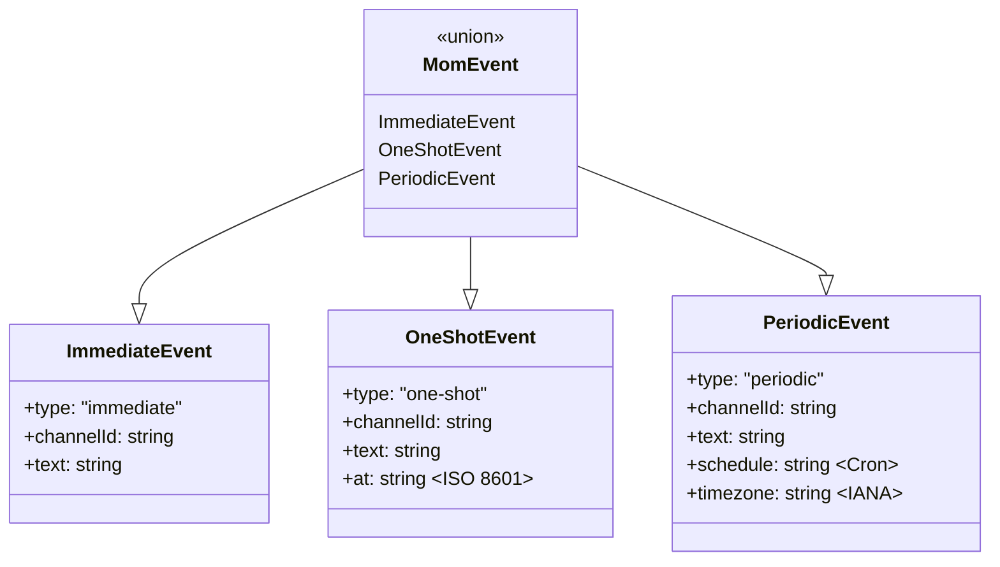
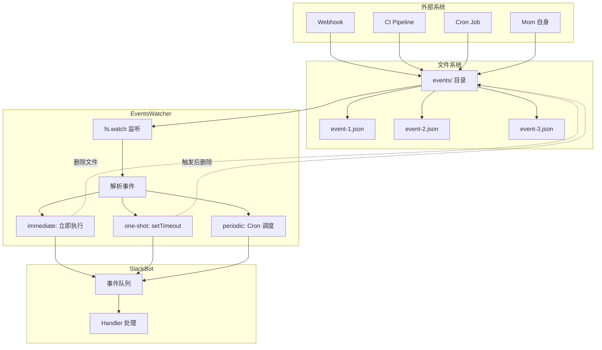

# 03. 事件系统 - 定时唤醒与外部触发

> **难度：专家** | **预计阅读时间：25 分钟**

问下大家，你有没有想过，一个 Slack Bot 是如何实现定时提醒和外部事件响应的？

OpenClaw 刚开始以为就是简单的 `setTimeout`，但深入了解 mom 的事件系统后发现，它是一个非常精巧的设计：

- 支持**三种事件类型**：即时、单次、周期性
- 支持**文件驱动**：外部系统可直接写文件触发
- 支持**自动清理**：过期事件自动删除
- 支持**静默完成**：避免频道垃圾消息

今天我们就来深入理解 mom 的事件系统。

## 问题引入：为什么需要事件系统？

### 传统方案的问题

假设你想让 Slack Bot 每天早上 9 点提醒你查看邮件，传统方案可能是：

```typescript
// ❌ 传统方案的问题
setInterval(async () => {
  await slack.postMessage("查看邮件");
}, 24 * 60 * 60 * 1000);
```

问题：
1. **进程重启后丢失** - 定时器不会持久化
2. **无法动态修改** - 想改时间得重启程序
3. **无法外部触发** - Webhook 无法唤醒 Bot
4. **无法管理** - 不知道有哪些定时任务

### Mom 的解决方案

Mom 采用**文件驱动的事件系统**：

```
data/events/
├── reminder-dentist-1704067200.json    # 单次提醒
├── daily-inbox-check.json              # 周期性任务
└── webhook-github-issue.json           # 即时事件
```

优势：
1. **持久化** - 文件即事件，重启不丢失
2. **可管理** - 查看/修改/删除都是文件操作
3. **外部可控** - 任何程序都能创建事件
4. **类型明确** - 三种事件类型覆盖所有场景

## 核心概念

### 三种事件类型

| 类型 | 触发时机 | 持久性 | 典型场景 |
|------|---------|--------|---------|
| **immediate** | 文件创建时立即触发 | 触发后删除 | Webhook、外部信号 |
| **one-shot** | 指定时间点触发 | 触发后删除 | 提醒、定时任务 |
| **periodic** | 按 Cron 表达式重复触发 | 持续存在 | 每日检查、定期汇总 |

### 事件数据结构



### 架构概览



## 实现详解

### 事件类型定义

```typescript
// packages/mom/src/events.ts

/**
 * 即时事件 - 文件创建后立即触发
 * 用于 Webhook、外部信号、Mom 编写的程序触发
 */
export interface ImmediateEvent {
  type: "immediate";
  channelId: string;  // 目标 Slack 频道
  text: string;       // 触发时发送的消息
}

/**
 * 单次事件 - 指定时间点触发一次
 * 用于提醒、定时任务
 */
export interface OneShotEvent {
  type: "one-shot";
  channelId: string;
  text: string;
  at: string;  // ISO 8601 格式，必须包含时区偏移
}

/**
 * 周期性事件 - 按 Cron 表达式重复触发
 * 用于每日检查、定期汇总
 */
export interface PeriodicEvent {
  type: "periodic";
  channelId: string;
  text: string;
  schedule: string;  // Cron 表达式
  timezone: string;  // IANA 时区名
}

export type MomEvent = ImmediateEvent | OneShotEvent | PeriodicEvent;
```

### EventsWatcher 核心实现

```typescript
// packages/mom/src/events.ts

import { Cron } from "croner";
import { existsSync, type FSWatcher, mkdirSync, readdirSync, statSync, unlinkSync, watch } from "fs";
import { readFile } from "fs/promises";
import { join } from "path";

/**
 * 事件监听器配置
 */
const DEBOUNCE_MS = 100;    // 文件变更防抖间隔
const MAX_RETRIES = 3;      // 文件读取最大重试次数
const RETRY_BASE_MS = 100;  // 重试基础间隔

/**
 * EventsWatcher - 事件监听与调度器
 * 
 * 核心职责：
 * 1. 监听 events/ 目录的文件变更
 * 2. 解析事件 JSON 并调度执行
 * 3. 管理 setTimeout 和 Cron 任务
 */
export class EventsWatcher {
  // 存储单次事件的定时器
  private timers: Map<string, NodeJS.Timeout> = new Map();
  
  // 存储周期性事件的 Cron 任务
  private crons: Map<string, Cron> = new Map();
  
  // 文件变更防抖定时器
  private debounceTimers: Map<string, NodeJS.Timeout> = new Map();
  
  // EventsWatcher 启动时间戳
  private startTime: number;
  
  // 文件系统监听器
  private watcher: FSWatcher | null = null;
  
  // 已知文件集合
  private knownFiles: Set<string> = new Set();

  constructor(
    private eventsDir: string,  // events 目录路径
    private slack: SlackBot,    // Slack Bot 实例
  ) {
    this.startTime = Date.now();
  }

  /**
   * 启动事件监听
   */
  start(): void {
    // 确保 events 目录存在
    if (!existsSync(this.eventsDir)) {
      mkdirSync(this.eventsDir, { recursive: true });
    }

    log.logInfo(`Events watcher starting, dir: ${this.eventsDir}`);

    // 扫描现有文件（重启恢复）
    this.scanExisting();

    // 开始监听文件变更
    this.watcher = watch(this.eventsDir, (_eventType, filename) => {
      if (!filename || !filename.endsWith(".json")) return;
      
      // 防抖处理
      this.debounce(filename, () => this.handleFileChange(filename));
    });

    log.logInfo(`Events watcher started, tracking ${this.knownFiles.size} files`);
  }

  /**
   * 停止事件监听
   */
  stop(): void {
    // 关闭文件监听器
    if (this.watcher) {
      this.watcher.close();
      this.watcher = null;
    }

    // 清理所有防抖定时器
    for (const timer of this.debounceTimers.values()) {
      clearTimeout(timer);
    }
    this.debounceTimers.clear();

    // 清理所有单次定时器
    for (const timer of this.timers.values()) {
      clearTimeout(timer);
    }
    this.timers.clear();

    // 停止所有 Cron 任务
    for (const cron of this.crons.values()) {
      cron.stop();
    }
    this.crons.clear();

    this.knownFiles.clear();
    log.logInfo("Events watcher stopped");
  }
}
```

### 文件变更处理

```typescript
// packages/mom/src/events.ts (续)

export class EventsWatcher {
  // ... 前面的代码

  /**
   * 防抖处理 - 避免短时间内多次触发
   */
  private debounce(filename: string, fn: () => void): void {
    const existing = this.debounceTimers.get(filename);
    if (existing) {
      clearTimeout(existing);
    }
    
    this.debounceTimers.set(
      filename,
      setTimeout(() => {
        this.debounceTimers.delete(filename);
        fn();
      }, DEBOUNCE_MS),
    );
  }

  /**
   * 扫描现有事件文件（重启恢复）
   */
  private scanExisting(): void {
    let files: string[];
    try {
      files = readdirSync(this.eventsDir).filter((f) => f.endsWith(".json"));
    } catch (err) {
      log.logWarning("Failed to read events directory", String(err));
      return;
    }

    for (const filename of files) {
      this.handleFile(filename);
    }
  }

  /**
   * 处理文件变更
   */
  private handleFileChange(filename: string): void {
    const filePath = join(this.eventsDir, filename);

    if (!existsSync(filePath)) {
      // 文件被删除
      this.handleDelete(filename);
    } else if (this.knownFiles.has(filename)) {
      // 文件被修改 - 取消现有调度，重新调度
      this.cancelScheduled(filename);
      this.handleFile(filename);
    } else {
      // 新文件
      this.handleFile(filename);
    }
  }

  /**
   * 处理文件删除
   */
  private handleDelete(filename: string): void {
    if (!this.knownFiles.has(filename)) return;

    log.logInfo(`Event file deleted: ${filename}`);
    this.cancelScheduled(filename);
    this.knownFiles.delete(filename);
  }

  /**
   * 取消已调度的事件
   */
  private cancelScheduled(filename: string): void {
    // 取消单次定时器
    const timer = this.timers.get(filename);
    if (timer) {
      clearTimeout(timer);
      this.timers.delete(filename);
    }

    // 取消 Cron 任务
    const cron = this.crons.get(filename);
    if (cron) {
      cron.stop();
      this.crons.delete(filename);
    }
  }
}
```

### 事件解析与调度

```typescript
// packages/mom/src/events.ts (续)

export class EventsWatcher {
  // ... 前面的代码

  /**
   * 处理事件文件
   */
  private async handleFile(filename: string): Promise<void> {
    const filePath = join(this.eventsDir, filename);

    // 解析事件（带重试机制）
    let event: MomEvent | null = null;
    let lastError: Error | null = null;

    for (let i = 0; i < MAX_RETRIES; i++) {
      try {
        const content = await readFile(filePath, "utf-8");
        event = this.parseEvent(content, filename);
        break;
      } catch (err) {
        lastError = err instanceof Error ? err : new Error(String(err));
        if (i < MAX_RETRIES - 1) {
          await this.sleep(RETRY_BASE_MS * 2 ** i);  // 指数退避
        }
      }
    }

    if (!event) {
      log.logWarning(
        `Failed to parse event file after ${MAX_RETRIES} retries: ${filename}`,
        lastError?.message
      );
      this.deleteFile(filename);
      return;
    }

    this.knownFiles.add(filename);

    // 根据类型调度
    switch (event.type) {
      case "immediate":
        this.handleImmediate(filename, event);
        break;
      case "one-shot":
        this.handleOneShot(filename, event);
        break;
      case "periodic":
        this.handlePeriodic(filename, event);
        break;
    }
  }

  /**
   * 解析事件 JSON
   */
  private parseEvent(content: string, filename: string): MomEvent | null {
    const data = JSON.parse(content);

    // 验证必需字段
    if (!data.type || !data.channelId || !data.text) {
      throw new Error(`Missing required fields (type, channelId, text) in ${filename}`);
    }

    switch (data.type) {
      case "immediate":
        return { type: "immediate", channelId: data.channelId, text: data.text };

      case "one-shot":
        if (!data.at) {
          throw new Error(`Missing 'at' field for one-shot event in ${filename}`);
        }
        return {
          type: "one-shot",
          channelId: data.channelId,
          text: data.text,
          at: data.at,
        };

      case "periodic":
        if (!data.schedule) {
          throw new Error(`Missing 'schedule' field for periodic event in ${filename}`);
        }
        if (!data.timezone) {
          throw new Error(`Missing 'timezone' field for periodic event in ${filename}`);
        }
        return {
          type: "periodic",
          channelId: data.channelId,
          text: data.text,
          schedule: data.schedule,
          timezone: data.timezone,
        };

      default:
        throw new Error(`Unknown event type '${data.type}' in ${filename}`);
    }
  }
}
```

### 三种事件的处理逻辑

```typescript
// packages/mom/src/events.ts (续)

export class EventsWatcher {
  // ... 前面的代码

  /**
   * 处理即时事件
   */
  private handleImmediate(filename: string, event: ImmediateEvent): void {
    const filePath = join(this.eventsDir, filename);

    // 检查是否过期（在启动前创建的文件不执行）
    try {
      const stat = statSync(filePath);
      if (stat.mtimeMs < this.startTime) {
        log.logInfo(`Stale immediate event, deleting: ${filename}`);
        this.deleteFile(filename);
        return;
      }
    } catch {
      return;  // 文件可能已被删除
    }

    log.logInfo(`Executing immediate event: ${filename}`);
    this.execute(filename, event);
  }

  /**
   * 处理单次事件
   */
  private handleOneShot(filename: string, event: OneShotEvent): void {
    const atTime = new Date(event.at).getTime();
    const now = Date.now();

    // 检查是否过期
    if (atTime <= now) {
      log.logInfo(`One-shot event in the past, deleting: ${filename}`);
      this.deleteFile(filename);
      return;
    }

    const delay = atTime - now;
    log.logInfo(`Scheduling one-shot event: ${filename} in ${Math.round(delay / 1000)}s`);

    // 设置定时器
    const timer = setTimeout(() => {
      this.timers.delete(filename);
      log.logInfo(`Executing one-shot event: ${filename}`);
      this.execute(filename, event);
    }, delay);

    this.timers.set(filename, timer);
  }

  /**
   * 处理周期性事件
   */
  private handlePeriodic(filename: string, event: PeriodicEvent): void {
    try {
      // 使用 croner 库创建 Cron 任务
      const cron = new Cron(
        event.schedule,
        { timezone: event.timezone },
        () => {
          log.logInfo(`Executing periodic event: ${filename}`);
          this.execute(filename, event, false);  // 不删除周期性事件
        }
      );

      this.crons.set(filename, cron);

      const next = cron.nextRun();
      log.logInfo(
        `Scheduled periodic event: ${filename}, next run: ${next?.toISOString() ?? "unknown"}`
      );
    } catch (err) {
      log.logWarning(`Invalid cron schedule for ${filename}: ${event.schedule}`, String(err));
      this.deleteFile(filename);
    }
  }
}
```

### 事件执行与 Slack 集成

```typescript
// packages/mom/src/events.ts (续)

export class EventsWatcher {
  // ... 前面的代码

  /**
   * 执行事件
   * @param filename 事件文件名
   * @param event 事件对象
   * @param deleteAfter 执行后是否删除文件
   */
  private execute(filename: string, event: MomEvent, deleteAfter: boolean = true): void {
    // 构建消息格式
    let scheduleInfo: string;
    switch (event.type) {
      case "immediate":
        scheduleInfo = "immediate";
        break;
      case "one-shot":
        scheduleInfo = event.at;
        break;
      case "periodic":
        scheduleInfo = event.schedule;
        break;
    }

    // 消息格式：[EVENT:文件名:类型:调度信息] 文本
    const message = `[EVENT:${filename}:${event.type}:${scheduleInfo}] ${event.text}`;

    // 创建合成 SlackEvent
    const syntheticEvent: SlackEvent = {
      type: "mention",
      channel: event.channelId,
      user: "EVENT",  // 标记为事件触发
      text: message,
      ts: Date.now().toString(),
    };

    // 加入 SlackBot 事件队列
    const enqueued = this.slack.enqueueEvent(syntheticEvent);

    if (enqueued && deleteAfter) {
      // 成功入队且需要删除（immediate 和 one-shot）
      this.deleteFile(filename);
    } else if (!enqueued) {
      log.logWarning(`Event queue full, discarded: ${filename}`);
      // 队列满时仍然删除 immediate/one-shot
      if (deleteAfter) {
        this.deleteFile(filename);
      }
    }
  }

  /**
   * 删除事件文件
   */
  private deleteFile(filename: string): void {
    const filePath = join(this.eventsDir, filename);
    try {
      unlinkSync(filePath);
    } catch (err) {
      // ENOENT 表示文件已删除，其他错误记录警告
      if (err instanceof Error && "code" in err && err.code !== "ENOENT") {
        log.logWarning(`Failed to delete event file: ${filename}`, String(err));
      }
    }
    this.knownFiles.delete(filename);
  }

  private sleep(ms: number): Promise<void> {
    return new Promise((resolve) => setTimeout(resolve, ms));
  }
}
```

## 与 Agent 的集成

### Agent 接收事件

当事件触发时，Agent 会收到特殊格式的消息：

```typescript
// packages/mom/src/agent.ts

// 事件消息格式
// [EVENT:filename:type:schedule] text

// 示例
"[EVENT:dentist-reminder.json:one-shot:2025-12-15T09:00:00+01:00] Remind Mario about dentist"
"[EVENT:inbox-check.json:periodic:0 9 * * 1-5] Check inbox and summarize"
```

### Agent 系统提示词中的事件说明

```typescript
// packages/mom/src/agent.ts

function buildSystemPrompt(/* ... */): string {
  return `
// ... 其他内容 ...

## Events
You can schedule events that wake you up at specific times or when external things happen.
Events are JSON files in \`${workspacePath}/events/\`.

### Event Types

**Immediate** - Triggers as soon as harness sees the file. Use in scripts/webhooks.
\`\`\`json
{"type": "immediate", "channelId": "${channelId}", "text": "New GitHub issue opened"}
\`\`\`

**One-shot** - Triggers once at a specific time. Use for reminders.
\`\`\`json
{"type": "one-shot", "channelId": "${channelId}", "text": "Remind Mario about dentist", "at": "2025-12-15T09:00:00+01:00"}
\`\`\`

**Periodic** - Triggers on a cron schedule. Use for recurring tasks.
\`\`\`json
{"type": "periodic", "channelId": "${channelId}", "text": "Check inbox", "schedule": "0 9 * * 1-5", "timezone": "Europe/Vienna"}
\`\`\`

### Cron Format
\`minute hour day-of-month month day-of-week\`
- \`0 9 * * *\` = daily at 9:00
- \`0 9 * * 1-5\` = weekdays at 9:00
- \`30 14 * * 1\` = Mondays at 14:30
- \`0 0 1 * *\` = first of each month at midnight

### Silent Completion
For periodic events where there's nothing to report, respond with just \`[SILENT]\`.
This deletes the status message and posts nothing to Slack.
`;
}
```

### 静默完成机制

```typescript
// packages/mom/src/agent.ts

// 在 run() 方法中检查 [SILENT] 标记
if (finalText.trim() === "[SILENT]" || finalText.trim().startsWith("[SILENT]")) {
  try {
    await ctx.deleteMessage();
    log.logInfo("Silent response - deleted message and thread");
  } catch (err) {
    const errMsg = err instanceof Error ? err.message : String(err);
    log.logWarning("Failed to delete message for silent response", errMsg);
  }
}
```

## 使用模式

### 模式 1：创建提醒事件

```bash
# Mom 收到请求："明天早上 9 点提醒我看牙医"
# 她会执行以下 bash 命令：

cat > /workspace/events/dentist-reminder-$(date +%s).json << 'EOF'
{
  "type": "one-shot",
  "channelId": "C123ABC",
  "text": "Remind Mario about dentist",
  "at": "2025-12-15T09:00:00+01:00"
}
EOF
```

### 模式 2：创建周期性检查

```bash
# Mom 收到请求："每个工作日早上 9 点检查我的邮箱"
# 她会创建周期性事件：

cat > /workspace/events/daily-inbox-check.json << 'EOF'
{
  "type": "periodic",
  "channelId": "C123ABC",
  "text": "Check inbox and summarize new emails",
  "schedule": "0 9 * * 1-5",
  "timezone": "Europe/Vienna"
}
EOF
```

### 模式 3：外部系统触发

```typescript
// 外部 Webhook 处理程序
import { writeFile } from "fs/promises";
import { join } from "path";

async function handleGitHubWebhook(payload: GitHubIssuePayload): Promise<void> {
  // 创建即时事件
  const event = {
    type: "immediate",
    channelId: "C123ABC",  // 目标频道
    text: `New GitHub issue opened: ${payload.issue.title}\n${payload.issue.html_url}`,
  };

  const filename = `github-issue-${Date.now()}.json`;
  const eventsDir = "/path/to/data/events";

  await writeFile(
    join(eventsDir, filename),
    JSON.stringify(event, null, 2)
  );

  // 文件创建后，EventsWatcher 会立即检测并触发事件
}
```

### 模式 4：管理事件

```bash
# 列出所有事件
ls /workspace/events/

# 查看事件内容
cat /workspace/events/daily-inbox-check.json

# 取消事件
rm /workspace/events/dentist-reminder.json

# 修改周期性事件（直接编辑文件，EventsWatcher 会自动重新调度）
vim /workspace/events/daily-inbox-check.json
```

### 模式 5：静默完成

```typescript
// 周期性邮箱检查的 Agent 响应

// 情况 1：有新邮件
// Agent 返回：
"发现 3 封新邮件：
1. 来自 John 的项目更新
2. 来自 HR 的会议邀请
3. 来自 Support 的工单通知"

// 情况 2：没有新邮件
// Agent 返回：
"[SILENT]"
// 这会删除状态消息，不会在频道中产生噪音
```

## 最佳实践

### ✅ 应该做的

1. **使用唯一的文件名**
   ```bash
   # ✅ 包含时间戳或随机后缀
   dentist-reminder-1704067200.json
   webhook-issue-$(date +%s).json

   # ❌ 使用固定名称可能覆盖现有事件
   reminder.json
   ```

2. **合理使用静默完成**
   ```typescript
   // ✅ 周期性检查无结果时使用 [SILENT]
   if (newEmails.length === 0) {
     return "[SILENT]";
   }

   // ❌ 不必要的噪音
   return "没有新邮件";  // 每天 9 点都会发一条无意义消息
   ```

3. **周期性事件要防抖**
   ```typescript
   // ✅ 每 15 分钟检查一次
   { "schedule": "*/15 * * * *" }

   // ❌ 每封邮件创建一个即时事件
   // 如果 1 分钟收到 50 封邮件，会创建 50 个事件
   ```

4. **指定正确的时区**
   ```json
   // ✅ 明确指定时区
   { "timezone": "Asia/Shanghai", "schedule": "0 9 * * *" }

   // ❌ 依赖系统时区可能导致混淆
   ```

### ❌ 避免的错误

1. **创建过多周期性事件**
   ```json
   // ❌ 每 5 秒检查一次
   { "schedule": "*/5 * * * * *" }  // 不是标准 Cron 格式

   // ✅ 使用合理的频率
   { "schedule": "*/15 * * * *" }  // 每 15 分钟
   ```

2. **忽略时区偏移**
   ```json
   // ❌ 缺少时区信息
   { "at": "2025-12-15T09:00:00" }

   // ✅ 包含时区偏移
   { "at": "2025-12-15T09:00:00+08:00" }
   ```

3. **事件队列溢出**
   ```typescript
   // ❌ 同时创建超过 5 个事件
   for (let i = 0; i < 10; i++) {
     await createEvent(...);  // 第 6 个开始会被丢弃
   }

   // ✅ 控制事件数量
   // 每个频道最多 5 个事件排队
   ```

## 调度机制对比

```
┌─────────────────────────────────────────────────────────────────┐
│                        事件调度机制                               │
├─────────────────────────────────────────────────────────────────┤
│                                                                 │
│  Immediate                                                      │
│  ┌──────────┐                                                   │
│  │ 文件创建 │──────┐                                            │
│  └──────────┘      │                                            │
│                    ▼                                            │
│           ┌───────────────┐                                     │
│           │ 立即执行      │                                     │
│           │ 删除文件      │                                     │
│           └───────────────┘                                     │
│                                                                 │
│  One-shot                                                       │
│  ┌──────────────────┐                                           │
│  │ 文件创建         │                                           │
│  └──────────────────┘                                           │
│           │                                                     │
│           ▼                                                     │
│  ┌─────────────────────┐                                        │
│  │ 解析 at 时间戳      │                                        │
│  └─────────────────────┘                                        │
│           │                                                     │
│           ▼                                                     │
│  ┌─────────────────────┐                                        │
│  │ setTimeout(delay)   │                                        │
│  └─────────────────────┘                                        │
│           │                                                     │
│           ▼ (定时器触发)                                         │
│  ┌─────────────────────┐                                        │
│  │ 执行事件            │                                        │
│  │ 删除文件            │                                        │
│  └─────────────────────┘                                        │
│                                                                 │
│  Periodic                                                       │
│  ┌──────────────────┐                                           │
│  │ 文件创建         │                                           │
│  └──────────────────┘                                           │
│           │                                                     │
│           ▼                                                     │
│  ┌─────────────────────┐                                        │
│  │ 解析 Cron 表达式    │                                        │
│  └─────────────────────┘                                        │
│           │                                                     │
│           ▼                                                     │
│  ┌─────────────────────┐                                        │
│  │ Cron.schedule()     │◄─────────────────────┐                 │
│  └─────────────────────┘                      │                 │
│           │                                   │                 │
│           ▼ (Cron 触发)                        │                 │
│  ┌─────────────────────┐                      │                 │
│  │ 执行事件            │                      │                 │
│  │ 保留文件            │──────────────────────┘                 │
│  └─────────────────────┘      (等待下次触发)                     │
│                                                                 │
└─────────────────────────────────────────────────────────────────┘
```

## 总结

Mom 的事件系统设计精巧：

1. **文件驱动** - 事件即文件，持久化且可管理
2. **类型丰富** - immediate、one-shot、periodic 覆盖所有场景
3. **外部可控** - 任何程序都能通过写文件触发事件
4. **自动清理** - 过期事件自动删除，避免资源泄露
5. **静默完成** - `[SILENT]` 机制避免频道噪音
6. **容错设计** - 文件读取重试、过期检测、队列保护

这种设计让 Mom 能够处理复杂的异步任务，同时保持代码简洁。

---

**下篇预告：**《安全指南》 - 深入理解 Docker 沙箱、权限控制和最佳安全实践。