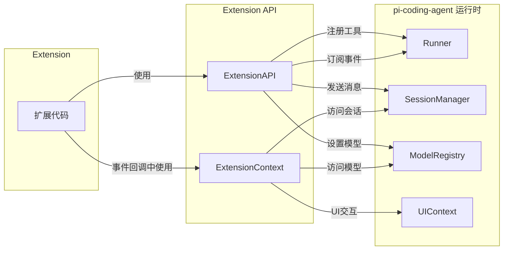
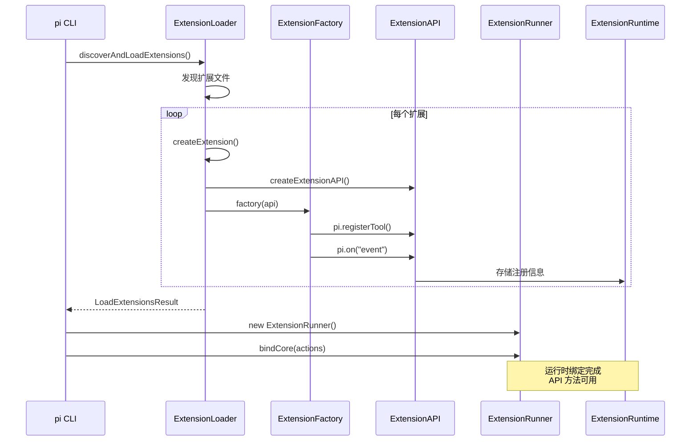

# 02. Extension API 详解

> 难度：专家 | 预计阅读时间：35 分钟

在前一章节中，我们了解了 Extension 系统的事件驱动架构。今天，OpenClaw 带你深入理解 Extension API——这是扩展与 pi-coding-agent 交互的核心接口。

## 问题引入：为什么需要 Extension API？

假设你想为 pi 添加一个新功能：

1. **注册一个自定义工具** —— 让 AI 能够调用你定义的操作
2. **拦截工具调用** —— 在敏感操作前进行权限检查
3. **修改系统提示词** —— 为特定项目定制 AI 行为
4. **添加 UI 元素** —— 在状态栏显示自定义信息

这些需求都通过 **Extension API** 实现。它是扩展与 pi 运行时通信的唯一桥梁。



## 核心概念

### ExtensionAPI vs ExtensionContext

这两个接口是 Extension 系统的核心，但用途不同：

| 接口 | 用途 | 获取时机 | 生命周期 |
|------|------|---------|---------|
| **ExtensionAPI** | 注册工具、命令、事件监听器 | 扩展初始化时作为参数传入 | 扩展生命周期内持久存在 |
| **ExtensionContext** | 访问运行时状态、UI | 每次事件回调时传入 | 每次调用都创建新实例 |

```typescript
// ExtensionAPI - 用于"注册"
export default function myExtension(pi: ExtensionAPI) {
  // 注册工具
  pi.registerTool({ ... });

  // 注册命令
  pi.registerCommand("my-command", { ... });

  // 订阅事件
  pi.on("tool_call", async (event, ctx) => {
    // ExtensionContext - 用于"访问"
    const model = ctx.model;           // 当前模型
    const cwd = ctx.cwd;               // 工作目录
    await ctx.ui.confirm("确认?", "..."); // UI 交互
  });
}
```

### 架构图：Extension 加载流程



## ExtensionAPI 详解

### 1. 事件订阅 API

`pi.on()` 方法用于订阅生命周期事件：

```typescript
// packages/coding-agent/src/core/extensions/types.ts

export interface ExtensionAPI {
  // 会话事件
  on(event: "session_start", handler: ExtensionHandler<SessionStartEvent>): void;
  on(event: "session_switch", handler: ExtensionHandler<SessionSwitchEvent>): void;
  on(event: "session_shutdown", handler: ExtensionHandler<SessionShutdownEvent>): void;

  // 工具事件
  on(event: "tool_call", handler: ExtensionHandler<ToolCallEvent, ToolCallEventResult>): void;
  on(event: "tool_result", handler: ExtensionHandler<ToolResultEvent, ToolResultEventResult>): void;

  // Agent 事件
  on(event: "agent_start", handler: ExtensionHandler<AgentStartEvent>): void;
  on(event: "agent_end", handler: ExtensionHandler<AgentEndEvent>): void;
  on(event: "turn_start", handler: ExtensionHandler<TurnStartEvent>): void;
  on(event: "turn_end", handler: ExtensionHandler<TurnEndEvent>): void;

  // 消息事件
  on(event: "message_start", handler: ExtensionHandler<MessageStartEvent>): void;
  on(event: "message_update", handler: ExtensionHandler<MessageUpdateEvent>): void;
  on(event: "message_end", handler: ExtensionHandler<MessageEndEvent>): void;

  // 上下文事件
  on(event: "context", handler: ExtensionHandler<ContextEvent, ContextEventResult>): void;
  on(event: "input", handler: ExtensionHandler<InputEvent, InputEventResult>): void;

  // ... 更多事件
}
```

**事件处理模式**：

```typescript
// 模式1：观察者模式 - 只监听，不修改
pi.on("turn_start", async (event, ctx) => {
  console.log(`Turn ${event.turnIndex} started`);
  // 返回 void，不影响执行
});

// 模式2：拦截器模式 - 可以阻止或修改
pi.on("tool_call", async (event, ctx) => {
  if (event.toolName === "bash" && event.input.command?.includes("rm -rf")) {
    const confirmed = await ctx.ui.confirm("危险操作", "确认执行 rm -rf?");
    if (!confirmed) {
      return { block: true, reason: "用户取消" };
    }
  }
  // 返回 void 或 { block: false } 继续执行
});

// 模式3：转换器模式 - 修改数据
pi.on("context", async (event, ctx) => {
  // 修改发送给 LLM 的消息
  const messages = event.messages;
  // ... 转换逻辑
  return { messages };
});
```

### 2. 工具注册 API

`pi.registerTool()` 用于注册自定义工具：

```typescript
// packages/coding-agent/src/core/extensions/types.ts

export interface ToolDefinition<TParams extends TSchema = TSchema, TDetails = unknown> {
  // 工具标识
  name: string;           // 工具名称（LLM 调用时使用）
  label: string;          // UI 显示名称
  description: string;    // LLM 理解工具用途的描述

  // 提示词增强（可选）
  promptSnippet?: string;      // 工具概要（显示在系统提示词中）
  promptGuidelines?: string[]; // 工具专属指南

  // 参数定义（使用 TypeBox）
  parameters: TParams;

  // 执行函数
  execute(
    toolCallId: string,                        // 工具调用 ID
    params: Static<TParams>,                   // 解析后的参数
    signal: AbortSignal | undefined,           // 取消信号
    onUpdate: AgentToolUpdateCallback<TDetails>, // 流式更新回调
    ctx: ExtensionContext                      // 运行时上下文
  ): Promise<AgentToolResult<TDetails>>;

  // 自定义渲染（可选）
  renderCall?: (args: Static<TParams>, theme: Theme) => Component | undefined;
  renderResult?: (
    result: AgentToolResult<TDetails>,
    options: ToolRenderResultOptions,
    theme: Theme
  ) => Component | undefined;
}
```

**完整的工具注册示例**：

```typescript
import { Type, StringEnum } from "@mariozechner/pi-ai";
import type { ExtensionAPI } from "@mariozechner/pi-coding-agent";

export default function weatherExtension(pi: ExtensionAPI) {
  pi.registerTool({
    name: "get_weather",
    label: "获取天气",
    description: "获取指定城市的当前天气信息",

    // 提示词增强
    promptSnippet: "get_weather(city) - 获取城市天气",
    promptGuidelines: [
      "调用前先确认城市名称正确",
      "温度单位为摄氏度"
    ],

    // 参数定义（使用 TypeBox）
    parameters: Type.Object({
      city: Type.String({ description: "城市名称，如 '北京'、'上海'" }),
      unit: StringEnum(["celsius", "fahrenheit"] as const, {
        description: "温度单位",
        default: "celsius"
      })
    }),

    // 执行函数
    async execute(toolCallId, params, signal, onUpdate, ctx) {
      const { city, unit } = params;

      // 流式更新示例
      onUpdate?.({
        type: "update",
        details: { status: "fetching", city }
      });

      try {
        // 调用天气 API
        const response = await fetch(
          `https://api.weather.example.com/${encodeURIComponent(city)}`,
          { signal }
        );

        if (!response.ok) {
          return {
            content: [{ type: "text", text: `获取天气失败: ${response.status}` }],
            isError: true,
            details: { error: true }
          };
        }

        const data = await response.json();

        // 返回结果
        return {
          content: [{
            type: "text",
            text: `${city} 当前天气: ${data.condition}, 温度: ${data.temp}°${unit === 'celsius' ? 'C' : 'F'}`
          }],
          details: {
            city,
            temperature: data.temp,
            condition: data.condition,
            fetchedAt: new Date().toISOString()
          }
        };
      } catch (error) {
        if (signal?.aborted) {
          return {
            content: [{ type: "text", text: "请求已取消" }],
            isError: true
          };
        }
        throw error;
      }
    },

    // 自定义结果渲染（可选）
    renderResult(result, options, theme) {
      if (result.isError || !result.details?.condition) {
        return undefined; // 使用默认渲染
      }

      const d = result.details as any;
      return {
        render(width: number) {
          return [
            theme.fg("accent", `🌤 ${d.city}`),
            `${d.condition}, ${d.temperature}°C`,
            "",
            theme.fg("dim", `更新于: ${d.fetchedAt}`)
          ];
        },
        invalidate() {}
      };
    }
  });
}
```

**工具覆盖（Override）**：

扩展可以注册与内置工具同名的工具来覆盖默认行为：

```typescript
// examples/extensions/tool-override.ts

export default function (pi: ExtensionAPI) {
  pi.registerTool({
    name: "read",  // 覆盖内置的 read 工具
    label: "read (audited)",
    description: "读取文件内容，敏感路径会被阻止",

    parameters: Type.Object({
      path: Type.String({ description: "文件路径" }),
      offset: Type.Optional(Type.Number()),
      limit: Type.Optional(Type.Number())
    }),

    async execute(_id, params, _signal, _onUpdate, ctx) {
      const absolutePath = resolve(ctx.cwd, params.path);

      // 检查敏感路径
      if (isBlockedPath(absolutePath)) {
        logAccess(absolutePath, false, "blocked");
        return {
          content: [{
            type: "text",
            text: `访问被拒绝: "${params.path}" 是敏感文件`
          }],
          details: { blocked: true }
        };
      }

      // 允许访问
      logAccess(absolutePath, true);
      // ... 执行实际读取
    }

    // 不提供 renderCall/renderResult 则使用内置渲染器
  });
}
```

### 3. 命令注册 API

`pi.registerCommand()` 用于注册斜杠命令：

```typescript
export interface RegisteredCommand {
  name: string;
  description?: string;
  getArgumentCompletions?: (argumentPrefix: string) => AutocompleteItem[] | null;
  handler: (args: string, ctx: ExtensionCommandContext) => Promise<void>;
}
```

**命令注册示例**：

```typescript
// examples/extensions/commands.ts

export default function commandsExtension(pi: ExtensionAPI) {
  pi.registerCommand("commands", {
    description: "列出所有可用命令",

    // 参数自动补全
    getArgumentCompletions: (prefix) => {
      const sources = ["extension", "prompt", "skill"];
      const filtered = sources.filter(s => s.startsWith(prefix));
      return filtered.length > 0
        ? filtered.map(s => ({ value: s, label: s }))
        : null;
    },

    // 命令处理函数
    handler: async (args, ctx) => {
      const commands = pi.getCommands();
      const sourceFilter = args.trim();

      const filtered = sourceFilter
        ? commands.filter(c => c.source === sourceFilter)
        : commands;

      if (filtered.length === 0) {
        ctx.ui.notify("没有找到命令", "info");
        return;
      }

      // 显示选择器
      const items = filtered.map(c => `/${c.name}${c.description ? ` - ${c.description}` : ""}`);
      const selected = await ctx.ui.select("可用命令", items);

      if (selected) {
        // 用户选择了某个命令
        ctx.ui.notify(`已选择: ${selected}`, "info");
      }
    }
  });
}
```

### 4. 快捷键注册 API

`pi.registerShortcut()` 用于注册键盘快捷键：

```typescript
// examples/extensions/status-line.ts

export default function (pi: ExtensionAPI) {
  pi.registerShortcut("ctrl+shift+s", {
    description: "显示状态信息",
    handler: async (ctx) => {
      const usage = ctx.getContextUsage();
      if (usage) {
        ctx.ui.notify(
          `上下文: ${usage.tokens?.toLocaleString()} / ${usage.contextWindow.toLocaleString()} tokens (${usage.percent}%)`,
          "info"
        );
      }
    }
  });
}
```

### 5. CLI 标志注册 API

`pi.registerFlag()` 用于注册命令行标志：

```typescript
export default function (pi: ExtensionAPI) {
  pi.registerFlag("debug", {
    type: "boolean",
    description: "启用调试模式",
    default: false
  });

  pi.registerFlag("output-format", {
    type: "string",
    description: "输出格式",
    default: "text"
  });

  // 在扩展中使用标志值
  pi.on("session_start", async (_event, _ctx) => {
    const debug = pi.getFlag("debug");
    if (debug) {
      console.log("调试模式已启用");
    }
  });
}
```

### 6. 消息发送 API

`pi.sendMessage()` 和 `pi.sendUserMessage()` 用于发送消息：

```typescript
// 发送自定义消息
pi.sendMessage({
  customType: "notification",
  content: "任务完成",
  display: "inline",
  details: { taskId: "123" }
});

// 发送用户消息（触发 AI 响应）
pi.sendUserMessage("请帮我检查代码质量", {
  deliverAs: "steer"  // 在当前 turn 结束后立即处理
});

// 或
pi.sendUserMessage("继续优化", {
  deliverAs: "followUp"  // 在所有工作完成后处理
});
```

### 7. 模型管理 API

```typescript
// 切换模型
const success = await pi.setModel(model);

// 获取/设置思考级别
const level = pi.getThinkingLevel();
pi.setThinkingLevel("high");
```

### 8. Provider 注册 API

`pi.registerProvider()` 用于注册自定义 LLM 提供商：

```typescript
pi.registerProvider("my-proxy", {
  baseUrl: "https://proxy.example.com",
  apiKey: "MY_PROXY_API_KEY",
  api: "anthropic-messages",
  models: [
    {
      id: "claude-sonnet-4-20250514",
      name: "Claude 4 Sonnet (proxy)",
      reasoning: false,
      input: ["text", "image"],
      cost: { input: 0, output: 0, cacheRead: 0, cacheWrite: 0 },
      contextWindow: 200000,
      maxTokens: 16384
    }
  ]
});
```

### 9. 共享事件总线

`pi.events` 提供扩展间通信机制：

```typescript
// 扩展 A：发送事件
pi.events.emit("custom-event", { data: "hello" });

// 扩展 B：监听事件
pi.events.on("custom-event", (payload) => {
  console.log("收到:", payload);
});
```

## ExtensionContext 详解

`ExtensionContext` 在每次事件回调中传入，提供运行时状态访问：

```typescript
export interface ExtensionContext {
  // UI 交互
  ui: ExtensionUIContext;      // UI 方法
  hasUI: boolean;              // UI 是否可用

  // 工作环境
  cwd: string;                 // 当前工作目录

  // 会话访问
  sessionManager: ReadonlySessionManager;  // 只读会话管理器

  // 模型信息
  modelRegistry: ModelRegistry;  // 模型注册表
  model: Model<any> | undefined; // 当前模型

  // Agent 状态
  isIdle(): boolean;             // 是否空闲（非流式）
  abort(): void;                 // 中止当前操作
  hasPendingMessages(): boolean; // 是否有待处理消息

  // 会话控制
  shutdown(): void;                          // 优雅关闭
  getContextUsage(): ContextUsage | undefined;  // 上下文使用情况
  compact(options?: CompactOptions): void;  // 触发压缩
  getSystemPrompt(): string;                 // 获取系统提示词
}
```

### UI 交互方法

```typescript
export interface ExtensionUIContext {
  // 对话框
  select(title: string, options: string[], opts?): Promise<string | undefined>;
  confirm(title: string, message: string, opts?): Promise<boolean>;
  input(title: string, placeholder?: string, opts?): Promise<string | undefined>;

  // 通知
  notify(message: string, type?: "info" | "warning" | "error"): void;

  // 状态显示
  setStatus(key: string, text: string | undefined): void;
  setWorkingMessage(message?: string): void;

  // Widget
  setWidget(key: string, content: string[] | undefined, options?): void;

  // 编辑器
  pasteToEditor(text: string): void;
  setEditorText(text: string): void;
  getEditorText(): string;

  // 主题
  readonly theme: Theme;
  setTheme(theme: string | Theme): { success: boolean; error?: string };
}
```

**UI 交互示例**：

```typescript
// examples/extensions/status-line.ts

pi.on("turn_start", async (_event, ctx) => {
  const theme = ctx.ui.theme;
  const spinner = theme.fg("accent", "●");
  const text = theme.fg("dim", " 处理中...");

  // 设置状态栏
  ctx.ui.setStatus("my-status", spinner + text);
});

pi.on("turn_end", async (_event, ctx) => {
  const theme = ctx.ui.theme;
  const check = theme.fg("success", "✓");
  const text = theme.fg("dim", " 完成");

  ctx.ui.setStatus("my-status", check + text);
});
```

### ExtensionCommandContext

命令处理函数接收 `ExtensionCommandContext`，包含额外的会话控制方法：

```typescript
export interface ExtensionCommandContext extends ExtensionContext {
  waitForIdle(): Promise<void>;
  newSession(options?): Promise<{ cancelled: boolean }>;
  fork(entryId: string): Promise<{ cancelled: boolean }>;
  navigateTree(targetId: string, options?): Promise<{ cancelled: boolean }>;
  switchSession(sessionPath: string): Promise<{ cancelled: boolean }>;
  reload(): Promise<void>;
}
```

## 实现详解

### 加载机制

Extension 通过 jiti 动态加载 TypeScript 模块：

```typescript
// packages/coding-agent/src/core/extensions/loader.ts

async function loadExtension(
  extensionPath: string,
  cwd: string,
  eventBus: EventBus,
  runtime: ExtensionRuntime
): Promise<{ extension: Extension | null; error: string | null }> {
  // 1. 解析路径
  const resolvedPath = resolvePath(extensionPath, cwd);

  // 2. 使用 jiti 加载模块
  const factory = await loadExtensionModule(resolvedPath);
  if (!factory) {
    return { extension: null, error: "无效的扩展工厂函数" };
  }

  // 3. 创建 Extension 对象
  const extension = createExtension(extensionPath, resolvedPath);

  // 4. 创建 ExtensionAPI
  const api = createExtensionAPI(extension, runtime, cwd, eventBus);

  // 5. 调用工厂函数
  await factory(api);

  return { extension, error: null };
}
```

**ExtensionAPI 创建过程**：

```typescript
function createExtensionAPI(
  extension: Extension,
  runtime: ExtensionRuntime,
  cwd: string,
  eventBus: EventBus
): ExtensionAPI {
  const api = {
    // 注册方法 - 写入 extension 对象
    on(event: string, handler: HandlerFn): void {
      const list = extension.handlers.get(event) ?? [];
      list.push(handler);
      extension.handlers.set(event, list);
    },

    registerTool(tool: ToolDefinition): void {
      extension.tools.set(tool.name, {
        definition: tool,
        extensionPath: extension.path
      });
      runtime.refreshTools();
    },

    // 动作方法 - 委托给 runtime
    sendMessage(message, options): void {
      runtime.sendMessage(message, options);
    },

    // ... 其他方法
  };

  return api as ExtensionAPI;
}
```

### 运行时绑定

ExtensionRunner 在初始化后绑定核心功能：

```typescript
// packages/coding-agent/src/core/extensions/runner.ts

class ExtensionRunner {
  bindCore(
    actions: ExtensionActions,
    contextActions: ExtensionContextActions,
    providerActions?: {
      registerProvider?: (name, config) => void;
      unregisterProvider?: (name) => void;
    }
  ): void {
    // 复制动作方法到 runtime
    this.runtime.sendMessage = actions.sendMessage;
    this.runtime.sendUserMessage = actions.sendUserMessage;
    this.runtime.setActiveTools = actions.setActiveTools;
    // ... 更多绑定

    // 刷新 Provider 注册队列
    for (const { name, config } of this.runtime.pendingProviderRegistrations) {
      providerActions?.registerProvider?.(name, config)
        ?? this.modelRegistry.registerProvider(name, config);
    }
  }

  createContext(): ExtensionContext {
    return {
      ui: this.uiContext,
      hasUI: this.hasUI(),
      cwd: this.cwd,
      sessionManager: this.sessionManager,
      modelRegistry: this.modelRegistry,
      get model() { return this.getModel(); },
      isIdle: () => this.isIdleFn(),
      abort: () => this.abortFn(),
      // ...
    };
  }
}
```

### 事件发射

事件通过专门的 emit 方法处理：

```typescript
class ExtensionRunner {
  // 通用事件发射
  async emit<TEvent extends RunnerEmitEvent>(event: TEvent): Promise<...> {
    const ctx = this.createContext();

    for (const ext of this.extensions) {
      const handlers = ext.handlers.get(event.type);
      if (!handlers) continue;

      for (const handler of handlers) {
        try {
          const result = await handler(event, ctx);
          // 处理结果...
        } catch (err) {
          this.emitError({
            extensionPath: ext.path,
            event: event.type,
            error: err.message
          });
        }
      }
    }
  }

  // 工具调用事件（支持阻止）
  async emitToolCall(event: ToolCallEvent): Promise<ToolCallEventResult | undefined> {
    const ctx = this.createContext();

    for (const ext of this.extensions) {
      const handlers = ext.handlers.get("tool_call");
      if (!handlers) continue;

      for (const handler of handlers) {
        const result = await handler(event, ctx);
        if (result?.block) {
          return result;  // 阻止工具执行
        }
      }
    }
  }

  // 上下文事件（支持修改）
  async emitContext(messages: AgentMessage[]): Promise<AgentMessage[]> {
    const ctx = this.createContext();
    let currentMessages = structuredClone(messages);

    for (const ext of this.extensions) {
      const handlers = ext.handlers.get("context");
      if (!handlers) continue;

      for (const handler of handlers) {
        const event = { type: "context", messages: currentMessages };
        const result = await handler(event, ctx);
        if (result?.messages) {
          currentMessages = result.messages;  // 更新消息
        }
      }
    }

    return currentMessages;
  }
}
```

## 使用模式

### 模式一：工具增强

为现有工具添加功能，如日志、权限检查：

```typescript
export default function (pi: ExtensionAPI) {
  pi.on("tool_call", async (event, ctx) => {
    // 拦截 bash 工具
    if (event.toolName === "bash") {
      const command = event.input.command;

      // 危险命令检查
      if (command?.includes("rm -rf") || command?.includes("sudo")) {
        const confirmed = await ctx.ui.confirm(
          "危险操作",
          `确认执行: ${command}?`
        );
        if (!confirmed) {
          return { block: true, reason: "用户取消" };
        }
      }
    }
  });
}
```

### 模式二：状态持久化

使用 `pi.appendEntry()` 保存状态：

```typescript
interface TodoState {
  todos: Array<{ id: number; text: string; done: boolean }>;
  nextId: number;
}

let state: TodoState = { todos: [], nextId: 1 };

export default function todoExtension(pi: ExtensionAPI) {
  // 注册工具
  pi.registerTool({
    name: "todo",
    // ...

    async execute(_id, params, _signal, _onUpdate, ctx) {
      // 更新状态
      state.todos.push({ id: state.nextId++, text: params.text, done: false });

      // 持久化到会话
      pi.appendEntry<TodoState>("todo-state", state);

      return {
        content: [{ type: "text", text: `已添加: ${params.text}` }],
        details: state  // details 也会持久化
      };
    }
  });

  // 恢复状态
  pi.on("session_start", async (_event, ctx) => {
    for (const entry of ctx.sessionManager.getBranch()) {
      if (entry.type === "custom" && entry.customType === "todo-state") {
        state = entry.data as TodoState;
      }
    }
  });
}
```

### 模式三：自定义 UI

使用 `ctx.ui.custom()` 创建复杂交互：

```typescript
pi.registerCommand("settings", {
  handler: async (_args, ctx) => {
    const result = await ctx.ui.custom((tui, theme, keybindings, done) => {
      // 创建自定义组件
      const container = new Container();

      const settingsList = new SettingsList(
        items,
        15,
        getSettingsListTheme(),
        (id, newValue) => {
          // 处理设置变更
          updateSetting(id, newValue);
        },
        () => done(undefined)
      );

      container.addChild(settingsList);

      return {
        render(width: number) {
          return container.render(width);
        },
        invalidate() {
          container.invalidate();
        },
        handleInput(data: string) {
          settingsList.handleInput?.(data);
          tui.requestRender();
        }
      };
    });
  }
});
```

### 模式四：工具覆盖

完全替换内置工具行为：

```typescript
// 完全覆盖 read 工具
pi.registerTool({
  name: "read",
  label: "read (sandboxed)",
  description: "沙箱环境中的文件读取",
  parameters: readSchema,

  async execute(_id, params, _signal, _onUpdate, ctx) {
    // 通过 SSH 执行远程读取
    const result = await sshClient.readFile(params.path);
    return {
      content: [{ type: "text", text: result }]
    };
  }
});
```

## 最佳实践

### ✅ 应该做的

1. **使用 TypeBox 定义参数**

   ```typescript
   // ✅ 推荐
   import { Type, StringEnum } from "@mariozechner/pi-ai";

   parameters: Type.Object({
     action: StringEnum(["list", "add", "remove"] as const),
     name: Type.Optional(Type.String())
   })

   // ❌ 避免（Google API 不兼容）
   parameters: Type.Object({
     action: Type.Union([Type.Literal("list"), Type.Literal("add")])
   })
   ```

2. **在 details 中持久化状态**

   ```typescript
   return {
     content: [{ type: "text", text: "完成" }],
     details: { todos, nextId }  // 随消息一起保存
   };
   ```

3. **处理 AbortSignal**

   ```typescript
   async execute(_id, params, signal, _onUpdate, ctx) {
     const response = await fetch(url, { signal });
     // ...
   }
   ```

4. **检查 UI 可用性**

   ```typescript
   pi.on("turn_end", async (_event, ctx) => {
     if (!ctx.hasUI) return;  // RPC/Print 模式下跳过

     ctx.ui.notify("完成", "info");
   });
   ```

### ❌ 避免的错误

1. **在加载阶段调用动作方法**

   ```typescript
   // ❌ 错误 - 此时 runtime 未绑定
   export default function (pi: ExtensionAPI) {
     pi.sendMessage({ ... });  // 会抛出异常
   }

   // ✅ 正确 - 在事件回调中调用
   export default function (pi: ExtensionAPI) {
     pi.on("session_start", async () => {
       pi.sendMessage({ ... });
     });
   }
   ```

2. **阻塞事件处理**

   ```typescript
   // ❌ 错误 - 同步阻塞
   pi.on("tool_call", async (event, ctx) => {
     while (true) { /* 死循环 */ }
   });

   // ✅ 正确 - 异步处理
   pi.on("tool_call", async (event, ctx) => {
     const result = await someAsyncOperation();
   });
   ```

3. **忽略错误处理**

   ```typescript
   // ❌ 错误 - 可能导致进程崩溃
   async execute() {
     const data = JSON.parse(someString);  // 可能抛出异常
   }

   // ✅ 正确 - 返回错误结果
   async execute() {
     try {
       const data = JSON.parse(someString);
       // ...
     } catch (err) {
       return {
         content: [{ type: "text", text: `解析失败: ${err.message}` }],
         isError: true
       };
     }
   }
   ```

4. **在命令中阻塞主循环**

   ```typescript
   // ❌ 错误 - 阻塞 UI
   pi.registerCommand("my-cmd", {
     handler: async (_args, ctx) => {
       while (true) await sleep(1000);  // 死循环
     }
   });
   ```

## 总结

Extension API 是 pi-coding-agent 扩展系统的核心：

| 概念 | 职责 | 关键方法 |
|------|------|---------|
| **ExtensionAPI** | 注册工具、命令、事件 | `registerTool`, `registerCommand`, `on` |
| **ExtensionContext** | 访问运行时状态 | `model`, `cwd`, `ui`, `sessionManager` |
| **ExtensionRunner** | 管理扩展生命周期 | `emit`, `createContext`, `bindCore` |
| **ExtensionRuntime** | 共享运行时状态 | `sendMessage`, `setActiveTools` |

### 核心要点

1. **ExtensionAPI 用于注册**，ExtensionContext 用于访问
2. **工具注册使用 TypeBox 定义参数**
3. **事件处理支持观察、拦截、转换三种模式**
4. **状态持久化通过 `details` 和 `appendEntry`**
5. **UI 交互前检查 `hasUI`**

### 下一步

- 阅读 [01-extension-events.md](./01-extension-events.md) 了解完整的事件列表
- 查看 [examples/extensions/](../../../packages/coding-agent/examples/extensions/) 中的实际示例
- 参考 [docs/extensions.md](../../../packages/coding-agent/docs/extensions.md) 完整文档

---

**源码位置**: `packages/coding-agent/src/core/extensions/`
**示例代码**: `packages/coding-agent/examples/extensions/`
**最后更新**: 2026-03-19